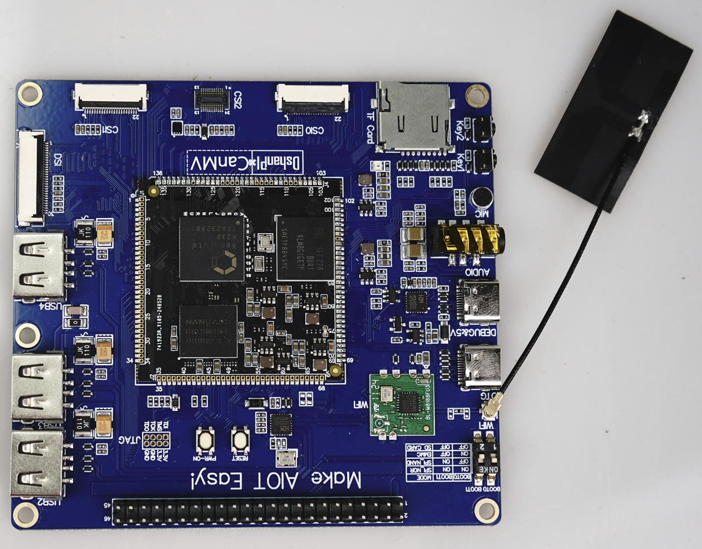
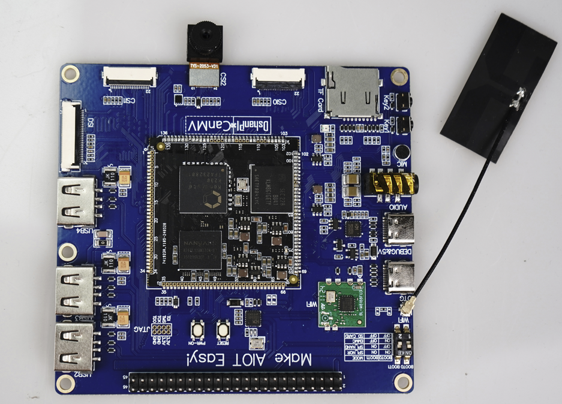
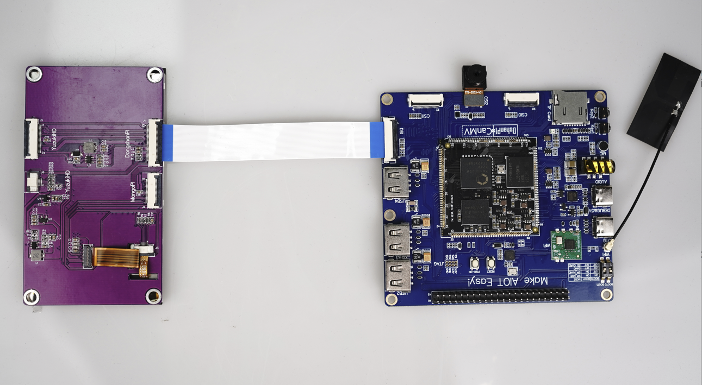
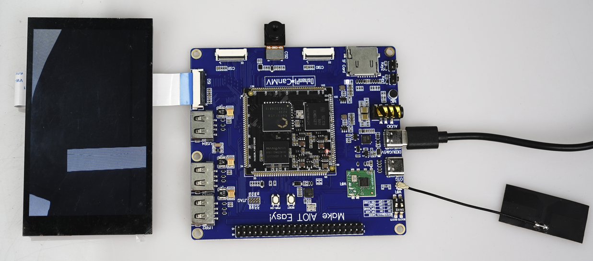
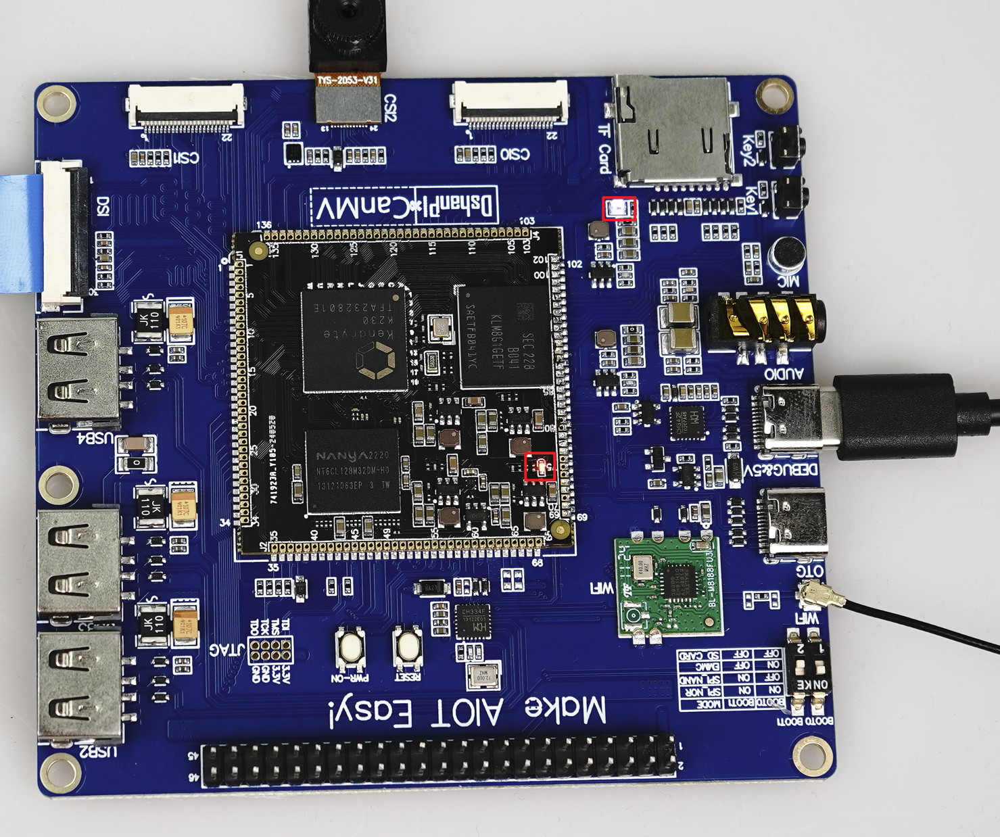
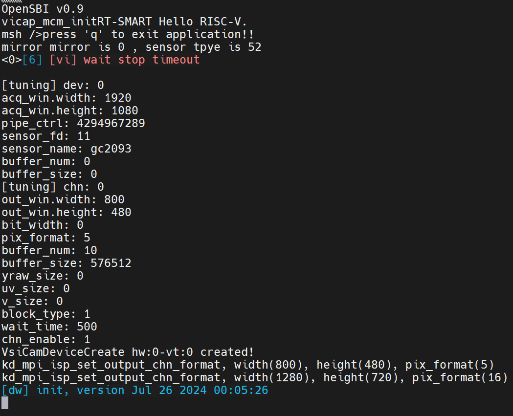

# DshanPI-CanMV_V1 快速启动

## 硬件要求

### 盒子里包括的内容

当您购买了一套全新的DshanPI-CanMV套件时，包装盒内会有：

1. DshanPI-CanMV开发板
2. 两根Type-C数据线
3. 一根2.4GHz天线
4. 一个摄像头

### 盒子中不包含的内容

您还需要额外的：

1. MIPI显示屏

> 注意：使用时还需要一台正常工作且能连接互联网的PC电脑。

## 连接天线

要使用WIFI，您需要连接DshanPI-CanMV盒子中提供的2.4GHz天线，下面是将天线连接到DshanPI-CanMV开发板的指南。

## 连接摄像头

要使用摄像头获取图像数据，如果您只单独购买了DshanPI-CanMV开发板，可能还需另外购买摄像头。下面图片是将摄像头连接到DshanPI-CanMV开发板的指南。

## 连接显示屏

要使用显示屏显示摄像头获取的图像，如果您只单独购买了DshanPI-CanMV开发板，可能还需另外购买MIPI显示屏。下面是将MIPI显示屏连接到DshanPI-CanMV开发板的指南。

## 开发板首次启动

 通过Type-C线将板连接到PC电脑，您可以使用DshanPI-CanMV盒子中的的Type-C线。连接指南如下所示：

> 注意：需要将拨码开关调整为Boot0为ON,Boot1为OFF。

### 第一次开机

一旦开发板套件通电后，核心板上会亮起红灯，红灯位置如下图中红色方框所示：

### 访问串口调试控制台

 通过上一步已经将串口连接到您的电脑中，要查看主板的启动日志并访问DongshanPI-Vision的控制台，您可以通过设备管理器确定串口端口号，并使用[MobaXterm](https://mobaxterm.mobatek.net/)串口应用程序访问该端口号。下面是使用串口访问开发板调试控制台的指南

1.打开**设备管理器**，并展开端口(COM和LPT)列表。

2.请注意USB串行端号的数字，如下图所示，其中小核的串口为串口A,大核的串口为串口B。

3.使用MobaXterm串口软件访问设备管理器中的端口号。

4.进入串口调试控制台后，如果开发板正在启动uboot或者kernel则会不断打印输出信息直到系统完全启动，如果开发板已经完全启动则不会打印信息，可直接按下回车键，进入开发板系统控制台

> 注意：Linux小核的用户名为root
>

### 开机自启应用程序

 当系统启动后，如果您正常连接摄像头和显示屏，系统会在小核Linux的uboot系统完成后，在大核RT-Smart中运行人脸识别程序，按下q+回车键可结束自启程序

