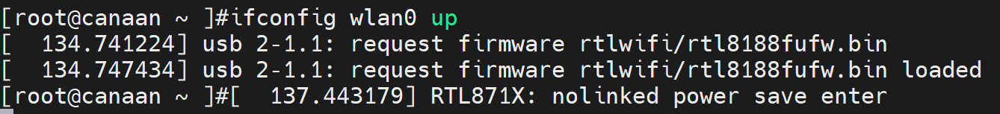
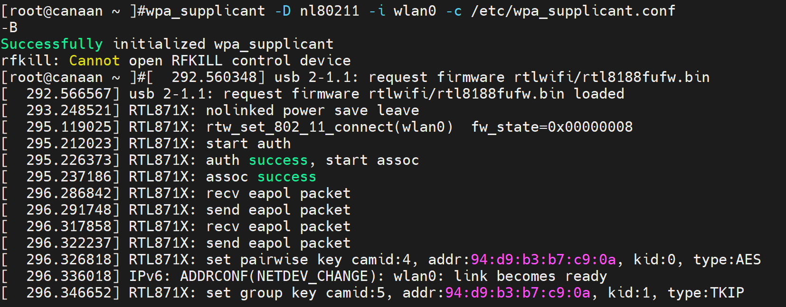
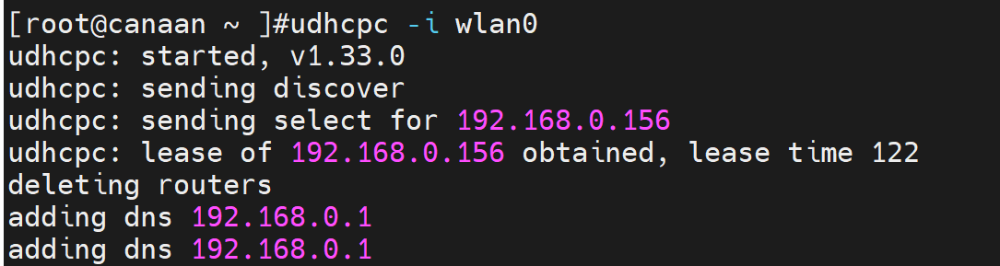
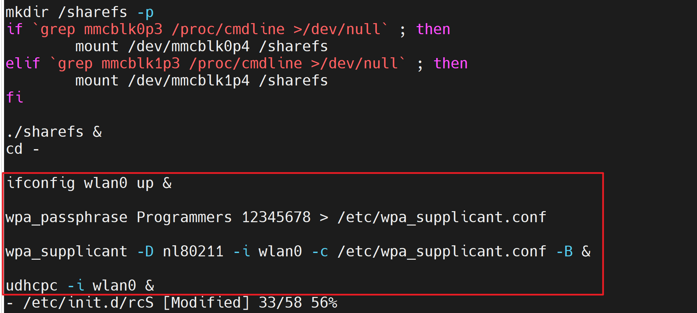
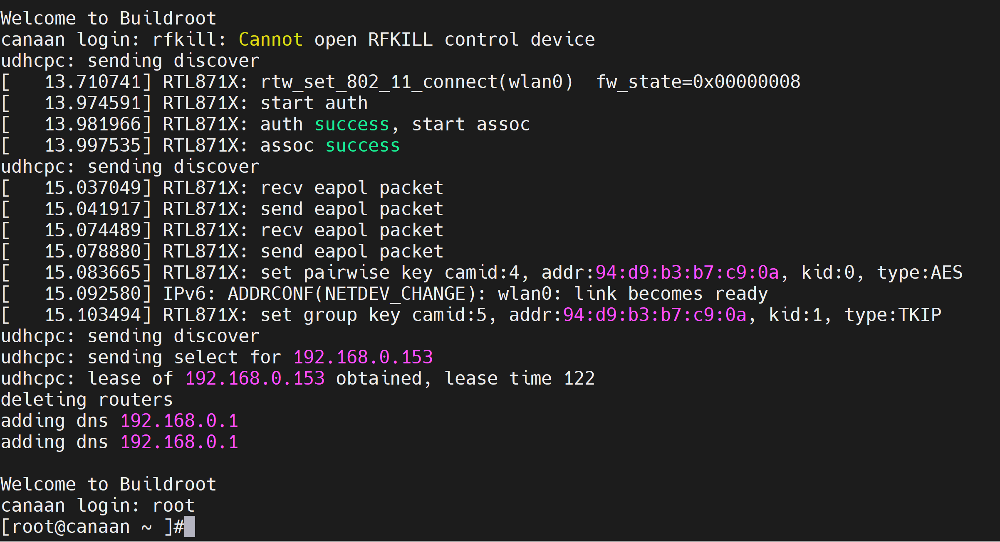

# 开发板配网(CanMV_V1)

硬件要求：

- DshanPI-CanMV开发板
- 天线 x1
- Type-C数据线 x2

## 1.联网

### 1.1 使能WIFI

在Linux终端输入

```
ifconfig wlan0 up
```




### 1.2 填写WIFI信息

需要根据自己实际的WiFi设备信息在Linux终端输入：

```
wpa_passphrase <wifi名称> <密码> > /etc/wpa_supplicant.conf
```

假设我的WIFI名为Programmers，密码为12345678，则实际执行的命令为：

```
wpa_passphrase Programmers 12345678 > /etc/wpa_supplicant.conf
```

### 1.3 连接WIFI

连接到 SSID，在Linux终端输入：

```
wpa_supplicant -D nl80211 -i wlan0 -c /etc/wpa_supplicant.conf -B
```

执行完成后如下所示：



### 1.4 获取IP地址

在Linux终端输入：

```
udhcpc -i wlan0
```

获取完成IP地址后如下所示：




## 2.测试网络

测试WiFi是否可以访问互联网，输入`ping www.baidu.com`，输入后如下所示：

```
[root@canaan ~ ]#ping www.baidu.com
PING www.baidu.com (183.2.172.42): 56 data bytes
64 bytes from 183.2.172.42: seq=0 ttl=52 time=14.734 ms
64 bytes from 183.2.172.42: seq=1 ttl=52 time=42.191 ms
^C
--- www.baidu.com ping statistics ---
2 packets transmitted, 2 packets received, 0% packet loss
round-trip min/avg/max = 14.734/28.462/42.191 ms
```


## 3.实现开机自启配网

如果您不想每次开机都重新配网，那么修改Linux小核的开机自启脚本，在脚本中加入我们前面配网的命令，步骤如下：

1.使用vi修改/etc/init.d/目录下的rcS文件

```
[root@canaan ~ ]# vi /etc/init.d/rcS
```


2.在文件末尾增加使能WiFi与配网的命令，如下所示：

```
ifconfig wlan0 up &

wpa_passphrase Programmers 12345678 > /etc/wpa_supplicant.conf

wpa_supplicant -D nl80211 -i wlan0 -c /etc/wpa_supplicant.conf -B &

udhcpc -i wlan0 &
```

修改结果如下所示：



> 注意：第二行的WiFi名称和密码需要修改为您自己的WIFI信息！！！

3.修改完成后，按下esc键，并输入`:wq`,保存并退出。

4.同步并重启开发板。

```
[root@canaan ~ ]#sync
[root@canaan ~ ]#reboot
```

5.启动后开发板会自动使能WiFi并实现配网。


