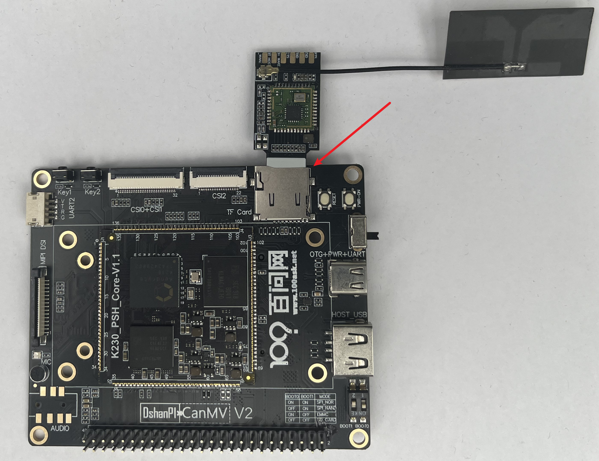
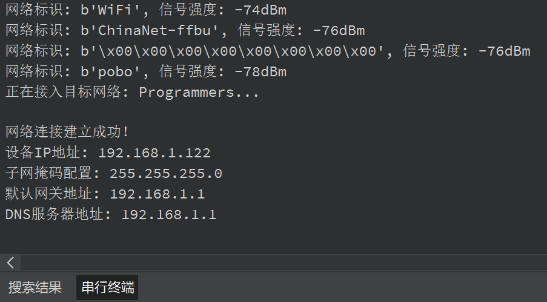
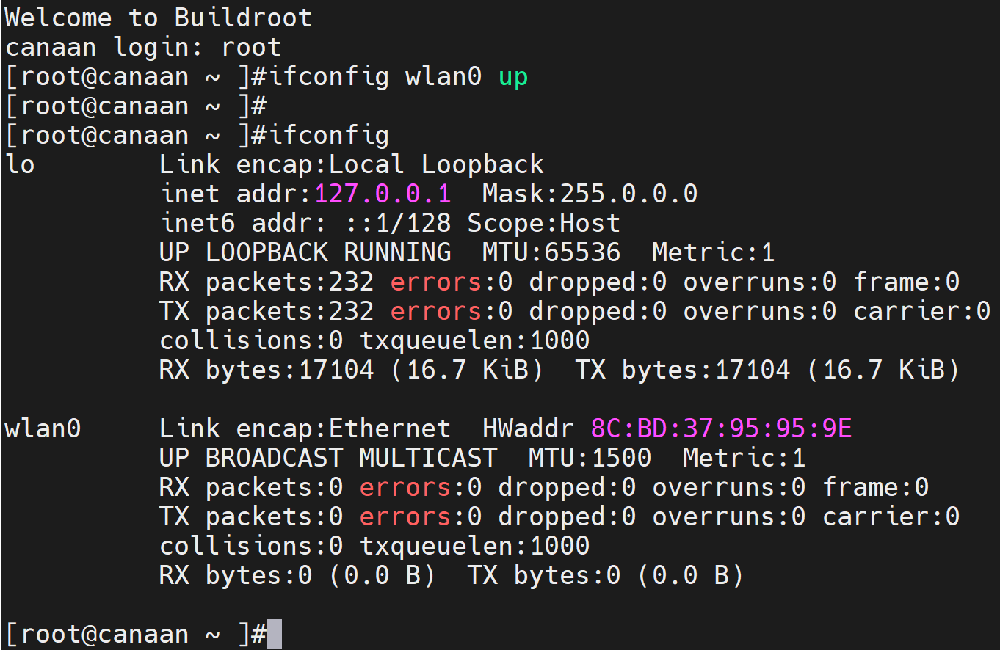
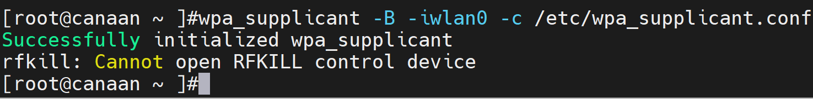
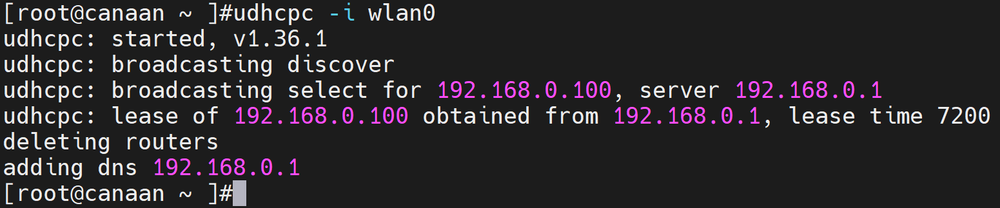

# 开发板配网

## 硬件要求：

- DshanPI-CanMV开发板
- TF-WIFI无线模块
- Type-C数据线 

您还需要额外的：

- USB转串口模块

> 在开始前请注意：
>
> - MicroPython系统：可以使用IDE进行编程配网
> - Linux单系统：需要登录UART0的串口终端，执行命令配网
> - Linux+Rt-smart双系统：需要登录UART0的串口终端，执行命令配网
>
> 请根据您实际运行的系统阅读对应的章节！

在上电前，将TF-WIFI无线模块提前安装在开发板的TF卡槽位置，如下图所示：



安装完成后，连接数据线上电即可。

> 注意：WiFi模块只能连接2.4GHz的WIFI !

## 1.MicroPython系统配网

修改下面的代码中的`TARGET_AP`和`CONNECT_KEY`。

> 假设我要连接的wifi名称为Programmers，密码为12345678
>
> - 将`TARGET_AP`的值修改为`Programmers`，`CONNECT_KEY`修改为`12345678`
>
> 假设我要连接的wifi名称为100ASK，密码为88888888
>
> - 将`TARGET_AP`的值修改为`100ASK`，`CONNECT_KEY`修改为`88888888`

```
import network
import time

TARGET_AP = "Programmers"       # WIFI名称
CONNECT_KEY = "12345678"      # WIFI密码

def wireless_link_setup():
    # 初始化无线客户端模式
    wlan = network.WLAN(network.STA_IF)

    # 激活无线通信硬件
    if not wlan.active():
        wlan.active(True)
    print("无线硬件状态:", wlan.active())  # 输出激活状态

    # 显示初始网络连接状态
    print("初始链路状态:", wlan.status())

    # 扫描周边无线信号
    available_networks = wlan.scan()
    print("扫描到可用网络:")
    for ap_info in available_networks:
        ap_name = ap_info.ssid         # 网络名称
        signal_quality = ap_info.rssi  # 信号质量值
        print(f"网络标识: {ap_name}, 信号强度: {signal_quality}dBm")

    # 尝试建立网络连接
    print(f"正在接入目标网络: {TARGET_AP}...")
    wlan.connect(TARGET_AP, CONNECT_KEY)

    # 连接重试机制（最多5次尝试）
    retry_counter = 5
    while retry_counter > 0:
        if wlan.isconnected():  # 检测连接状态
            break
        retry_counter -= 1
        time.sleep(1)           # 短暂等待后重试
        wlan.connect(TARGET_AP, CONNECT_KEY)
        print(f"剩余尝试次数: {retry_counter}")

    # 等待IP地址分配完成
    while wlan.ifconfig()[0] == '0.0.0.0':
        time.sleep(0.5)

    # 连接结果反馈
    if wlan.isconnected():
        print("\n网络连接建立成功！")
        net_params = wlan.ifconfig()
        print(f"设备IP地址: {net_params[0]}")
        print(f"子网掩码配置: {net_params[1]}")
        print(f"默认网关地址: {net_params[2]}")
        print(f"DNS服务器地址: {net_params[3]}")
    else:
        print("网络连接失败，请检查密码或信号覆盖情况")

# 执行网络连接流程
wireless_link_setup()

# 保持程序运行状态
while True:
    time.sleep(0.5)  # 维持基础运行时序

```

使用IDE运行上面的代码即可，运行成功后，可在IDE的串行终端看到获取到的IP地址。



## 2.Linux单系统配网

​	访问UART0串口终端，等待系统启动后，输入密码：root

进入串口终端后，使能WIFI，在Linux终端输入

```
ifconfig wlan0 up
```

使能完成后可以输入`ifconfig`查看启动的WiFi。



使能完成后，可填写WiFi信息，需要根据自己实际的WiFi设备信息在Linux终端输入：

```
wpa_passphrase <wifi名称> <密码> > /etc/wpa_supplicant.conf
```

假设我的WIFI名为Programmers，密码为12345678，则实际执行的命令为：

```
wpa_passphrase Programmers 12345678 > /etc/wpa_supplicant.conf
```


填写完成后，可以连接WiFi，在终端输入：

```
wpa_supplicant -B -iwlan0 -c /etc/wpa_supplicant.conf
```



连接成功后，可以执行如下命令获取IP地址。

```
udhcpc -i wlan0
```



## 3.Linux+Rt-smart双系统配网

访问UART0串口终端，等待系统启动后，输入密码：root

进入串口终端后，使能WIFI，在Linux终端输入

```
ifconfig wlan0 up
```

使能完成后可以输入`ifconfig`查看启动的WiFi。


使能完成后，可填写WiFi信息，需要根据自己实际的WiFi设备信息在Linux终端输入：

```
wpa_passphrase <wifi名称> <密码> > /etc/wpa_supplicant.conf
```

假设我的WIFI名为Programmers，密码为12345678，则实际执行的命令为：

```
wpa_passphrase Programmers 12345678 > /etc/wpa_supplicant.conf
```


填写完成后，可以连接WiFi，在终端输入：

```
wpa_supplicant -B -iwlan0 -c /etc/wpa_supplicant.conf
```


连接成功后，可以执行如下命令获取IP地址。

```
udhcpc -i wlan0
```


## 4.实现Linux系统开机自启配网

如果您不想每次开机都重新配网，那么修改Linux的开机自启脚本，在脚本中加入我们前面配网的命令，步骤如下：

1.使用vi修改/etc/init.d/目录下的rcS文件

```
[root@canaan ~ ]# vi /etc/init.d/rcS
```

2.在文件末尾增加使能WiFi与配网的命令，如下所示：

```
ifconfig wlan0 up &

wpa_passphrase Programmers 12345678 > /etc/wpa_supplicant.conf

wpa_supplicant -B -iwlan0 -c /etc/wpa_supplicant.conf &

udhcpc -i wlan0 &
```

> 注意：第二行的WiFi名称和密码需要修改为您自己的WIFI信息！！！

3.修改完成后，按下esc键，并输入`:wq`,保存并退出。

4.同步并重启开发板。

```
[root@canaan ~ ]#sync
[root@canaan ~ ]#reboot
```

5.启动后开发板会自动使能WiFi并实现配网。


