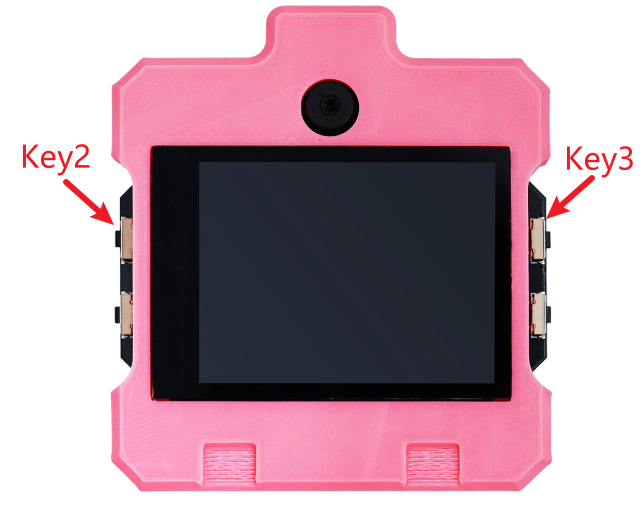
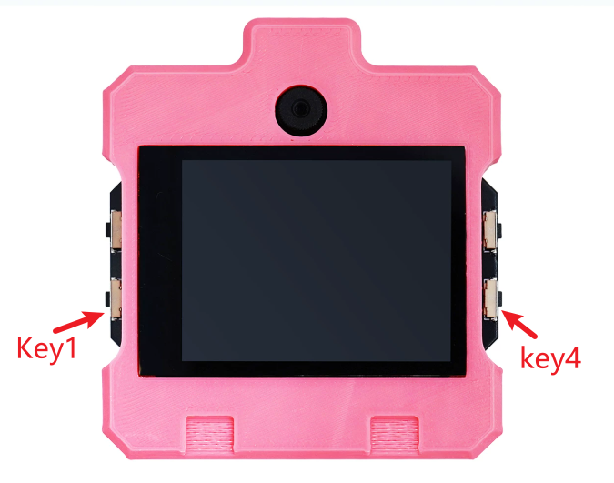

# EdgeOS Desktop 桌面系统使用指南

| 项目 | 说明 |
| --- | --- |
| 适用对象 | DshanPI-CanMV_V3 用户、演示人员和应用集成工程师 |
| 文档基线 | EdgeOS Desktop `v0.7.5` |
| 更新日期 | 2026-08-22 |
| 显示分辨率 | 640 × 480 |

:::info 固件准备

系统固件位于配套资料的 `03_开发系统固件/02_RT-Smart定制GUI固件` 目录。烧录方法请参阅[更新 EMMC 系统](./04-UpdateEMMCsystem.md)。

:::
桌面源码地址：[https://github.com/dshanpi/EdgeOS_Desktop.git](https://github.com/dshanpi/EdgeOS_Desktop.git)

视觉AI交换协议VAXP示例程序：[https://github.com/dshanpi/vaxp-host-sdk](https://github.com/dshanpi/vaxp-host-sdk)

## 1. 系统概览

DshanPI EdgeOS Desktop 是运行在 DshanPI-CanMV_V3 上的横屏触控桌面。它将相机、离线 AI 推理、云平台模型部署、网络摄像机、UART/VAXP 调试、相册、画板、系统设置和安全 OTA 集成到同一个入口中。

系统提供以下两种使用模式：

| 模式 | 使用方式 | 适用场景 |
| --- | --- | --- |
| AI 桌面模式 | 通过触摸屏直接运行相机和本地 AI 应用 | 产品演示、算法体验、外设联调和嵌入式部署 |
| MicroPython 开发模式 | 运行预加载的 MicroPython，配合 CanMV IDE 或串口进行 Python 开发 | 脚本调试、快速验证和二次开发 |

AI 桌面与 MicroPython 会使用相同的显示、摄像头、VB 内存和 OSD 资源，因此同一时间只能运行一种模式。

### 1.1 模式切换方式

当前固件支持在上电时通过按键选择运行模式。启动判断位于 RT-Smart BSP 层，不依赖桌面是否已经运行。

| 按键 | GPIO | 启动行为 | 是否修改默认模式 |
| --- | ---: | --- | --- |
| KEY2 | GPIO18 | 本次启动临时进入 MicroPython 开发模式 | 否 |
| KEY3 | GPIO29 | 上电时持续按住约 2 秒，在 AI 与 MicroPython 之间切换 | 是 |

按键位置以开发板 PCB 上的 `KEY2`、`KEY3` 丝印为准。不同硬件版本的布局可能不同，请勿仅依赖“左上角”等方位描述。



### 1.2 使用 KEY2 临时进入 MicroPython

1. 将开发板完全断电。
2. 按住 `KEY2`。
3. 保持按下并重新上电。
4. 等待系统进入 MicroPython/CanMV 开发环境后松开按键。

KEY2 只影响本次启动，不会改写 `/data/boot_mode.conf`：

- 如果保存的默认模式为 AI，不按 KEY2 再次启动时会自动恢复 AI 桌面。
- 如果默认模式已通过 KEY3 切换为 MicroPython，下次仍会进入 MicroPython。

KEY2 是临时救援入口，适合在 AI 桌面无法启动、需要连接 CanMV IDE，或只想临时运行 Python 脚本时使用。

### 1.3 使用 KEY3 永久切换默认模式

1. 将开发板完全断电。
2. 按住 `KEY3`。
3. 保持按下并重新上电，连续按住约 2 秒。
4. 系统会在 `AI` 与 `MicroPython Developer` 之间切换并保存默认模式。
5. 本次启动立即进入切换后的模式，后续正常上电也会保持该模式。
6. 如需切回，再次执行 KEY3 上电长按操作。

KEY3 在 2 秒前松开不会切换模式。默认模式保存在：

```text
/data/boot_mode.conf
```

配置文件不存在或内容无效时，系统默认进入 AI 桌面。如果 KEY2 与 KEY3 同时按下，KEY2 优先：本次进入 MicroPython，且不会切换已保存的默认模式。

### 1.4 进入 MicroPython 后

在电脑端打开 CanMV IDE，选择开发板对应的连接端口并连接 REPL，然后打开或新建 `.py` 文件运行。离开前请先停止正在运行的 Python 脚本。

- 通过 KEY2 临时进入且默认模式为 AI：正常重启且不按键即可返回桌面。
- 保存的默认模式为 MicroPython：按住 KEY3 上电约 2 秒，将默认模式切回 AI。

当前固件仅支持**上电期间的按键切换**。系统运行过程中通过长按 KEY3 自动重启并切换模式，仍属于后续扩展能力。

## 2. 首次使用

### 2.1 上电前检查

1. 确认显示屏、触摸屏和摄像头排线连接牢固。
2. 如需使用网络功能，请安装受支持的 Wi-Fi 模块并准备可用的无线网络。
3. 如需使用 UART 或 VAXP，请确认对端使用 3.3 V TTL 电平并连接公共地线。
4. 使用稳定电源供电。录像、OTA 或模型加载期间请勿突然断电。

### 2.2 桌面快速上手

1. 确认默认模式为 AI，正常上电且不按启动模式按键，等待桌面和状态栏出现。
2. 上下滑动应用区域，浏览全部应用。
3. 点按应用图标进入应用。
4. 应用左上角通常提供返回按钮；点按后会释放相机、显示或串口资源并返回桌面。
5. 首次使用建议依次完成 `设置 → 语言`、`设置 → 日期与时间`、`设置 → Wi-Fi` 和 `设置 → 默认摄像头`。

启动原生 AI 应用时，桌面会暂时停止并显示加载遮罩。模型加载完成后进入实时画面；退出应用时桌面重新启动，并恢复离开前的滚动位置。这是正常的资源交接过程。

## 3. 桌面与通用操作

### 3.1 状态栏

桌面顶部状态栏包含：

- 左侧：当前时间。
- 右侧：Wi-Fi、存储和摄像头状态图标。
- 获得 DHCP 地址后：Wi-Fi 图标左侧显示开发板 IP 地址。

网络摄像机、OTA 等功能需要有效 IP 地址。仅保存 Wi-Fi 名称但没有显示 IP，通常表示尚未成功连接或 DHCP 尚未完成。

### 3.2 应用列表

当前桌面按以下顺序提供应用：

| 类别 | 应用 |
| --- | --- |
| 系统与媒体 | 设置、相机、双摄相机、相册 |
| 人脸与人体 AI | 人脸工作室、人脸几何、手部工作室、人体工作室 |
| 行业 AI | 智能驾驶、OCR 文字检测、目标检测、YOLO 多版本 |
| 图像与网络工具 | 网络摄像机、画板、CV Lite、车牌 OCR、条码处理 |
| 扩展能力 | AI 自学习、云平台模型、USB 摄像头、UART 调试器 |

应用区每行显示三个图标，支持惯性滚动和边缘回弹。滑动时应从图标之间或卡片空白处开始；轻点图标会直接启动应用。

### 3.3 通用 AI 应用操作

多数实时 AI 应用使用一致的界面：

- 左上角 `<`：退出当前应用并返回桌面。
- 顶部中间：显示当前算法模式。
- 右上角 `Mode/模式`：展开模式菜单。
- 点按模式项：加载对应模型。加载过程中可能短暂显示加载动画。

已选择的模式通常会保存到 `/data`，下次打开同一应用时自动恢复。切换模型时请勿连续快速点按，应等待加载提示消失后再执行下一项操作。

## 4. AI 应用使用指南

### 4.1 人脸工作室

用于实时人脸检测和属性分析。进入后点按右上角“模式”，可选择：

- 人脸检测
- 表情识别
- 性别识别
- 眼镜识别
- 口罩识别
- 视线估计

使用时让人脸位于画面中央并保持光线均匀。属性模型依赖公共人脸检测结果，目标过小、背光或遮挡严重时可能没有结果。

### 4.2 人脸几何

提供以下四种几何分析：

- 人脸姿态
- 人脸网格
- 人脸解析
- 人脸对齐（PNCC 渲染）

切换模式时，公共人脸检测器和相机会保持工作，仅替换二级模型，因此无须退出应用。

### 4.3 手部工作室

提供以下功能：

- 手部检测
- 21 点关键点
- 静态手势
- AI 手势识别

建议让手掌完整出现在画面内，避免手指重叠和快速运动。关键点模式可用于后续手势交互或 VAXP 数据输出。

### 4.4 人体工作室

提供以下功能：

- 人体检测
- 17 点人体姿态
- 深蹲计数
- 跌倒安全检测

健身和安全模式需要尽量拍到完整人体。摄像头过近、人体被裁切或多人互相遮挡会降低识别稳定性。

### 4.5 智能驾驶

提供斑马线、交通灯、安全帽和烟雾检测，适合演示道路与安全场景。

> **安全提示：** 本功能不能替代经过认证的车辆控制或消防安全系统。

### 4.6 OCR 文字检测

实时检测文字区域并执行识别。使用时应让文字保持清晰、正向且具有足够对比度。应用启动时会加载检测模型、识别模型、字典和字体，首次进入的等待时间可能长于单模型应用。

### 4.7 目标检测

右上角模式菜单可在以下功能之间切换：

- 目标检测：输出边界框和类别。
- 实例分割：在检测结果中额外显示目标区域掩膜。

### 4.8 YOLO 多版本

用于比较不同 YOLO 模型的实时结果：

- YOLOv5
- YOLOv8
- YOLO11
- YOLO26

不同模型的加载时间和检测表现可能不同。对比时应保持摄像头、光线和目标距离一致。

### 4.9 CV Lite

CV Lite 提供不依赖神经网络的实时计算机视觉工具：

- 圆形检测
- 边缘检测
- 矩形检测
- 颜色色块检测
- 矩形角点
- 色块 PnP 测距
- 矩形 PnP 测距

点按 `Tune` 打开参数调节页，使用 `-`、`+` 实时调整当前算法参数；`Save` 保存全部参数，`Defaults` 恢复当前模式的默认值。

PnP 默认目标宽度为 60 mm、焦距为 520 px，正式测量前应使用实际镜头和标定板进行校准。

### 4.10 车牌 OCR

用于车牌检测与字符识别。使用时应让车牌完整、清晰并尽量正对摄像头。反光、运动模糊和过大的观察角度会影响识别结果。

### 4.11 条码处理

点按右上角“模式”，可选择：

- EAN-13 条形码
- QR Code
- AprilTag
- AprilTag 姿态

AprilTag 姿态默认按 50 mm 标记边长和 520 px 焦距计算。如果需要可靠的距离或姿态数据，必须根据实际打印尺寸和镜头完成标定。

### 4.12 AI 自学习

用于在板端完成简单的“绘制/采集—学习—分类”演示。请根据屏幕提示分别采集各类别样本，再进入分类阶段。每个类别应提供多个角度和轻微变化的样本，不同类别之间应具有明显的视觉差异。

### 4.13 AI 结果与 VAXP

支持 VAXP 的 AI 应用会通过 UART2 输出结构化推理数据。典型使用步骤如下：

1. 在 `设置 → VAXP UART` 中选择 115200、460800 或 921600 波特率。
2. 确认外部主机或 MCU 使用相同波特率和 8N1 帧格式。
3. 连接 K230 UART2 的 TX、RX 和 GND。
4. 打开支持 VAXP 的 AI 应用。
5. 在 Linux 或 MCU 端使用 VAXP Host SDK 解析能力、状态和推理结果帧。

UART 调试器和 AI 应用使用同一个 UART2，不能作为两个独立的串口服务并发运行。

## 5. 云平台模型

“云平台模型”用于部署 CanMV 云平台导出的模型，支持以下八种任务：

1. 图像分类
2. 目标检测
3. 语义分割
4. OCR 检测
5. OCR 识别
6. OCR 检测 + 识别
7. 度量学习
8. 多标签分类

### 5.1 准备模型文件

将对应文件复制到设备的 `/sdcard` 根目录：

| 任务类型 | 必需文件 |
| --- | --- |
| 单模型任务 | `deploy_config.json`、配置文件引用的 `.kmodel` 文件 |
| OCR 识别 | 单模型任务文件、`dict.txt` |
| OCR 检测 + 识别 | `ocrdet_deploy_config.json`、`ocrrec_deploy_config.json`、两个配置文件引用的 `.kmodel` 文件、`dict.txt` |
| 图片推理 | 对应任务文件、`test.jpg` |

配置中的模型路径即使保留了训练电脑上的旧目录，桌面也会尝试按文件名在 `/sdcard` 中查找模型。

### 5.2 运行模型

1. 打开“云平台模型”。
2. 在下拉框中选择任务。
3. 点按刷新按钮，重新检查文件。
4. 等待文件状态变为“就绪”。
5. 选择“图片推理”运行 `/sdcard/test.jpg`，或选择“实时相机”。

OCR 识别仅支持图片推理；其他标记为可用的任务可进入实时相机模式。实时推理由外部运行程序接管画面，当前需要在串口控制台中输入 `q` 返回。

如果按钮不可用，请根据状态提示检查配置、模型、字典、运行程序或 `test.jpg`。任务下拉框展开后直接返回桌面不会残留列表，当前程序会在返回前主动关闭 LVGL 下拉列表。

## 6. 相机、双摄相机与相册

### 6.1 相机

相机界面提供预览、拍照和 MP4 录像：

- 点按 `640P/720P/1080P` 按钮，循环切换采集分辨率。
- 点按照片/视频模式按钮，切换拍照与录像。
- 拍照模式下点按快门，保存 JPEG。
- 录像模式下点按快门开始录像，再次点按停止并保存 MP4。
- 点按最近媒体缩略图，进入相册。

相机切换分辨率时会重新初始化视频管线，短暂显示加载动画属于正常现象。请勿在录像期间切换分辨率或退出应用。

### 6.2 双摄相机

双摄相机同时显示前、后摄像头，并提供画中画预览、拍照和录像。画中画窗口可以拖动。拍摄的 JPEG、MP4 和视频封面与单摄相机保存在同一媒体目录。

双摄模式占用更多视频和编码资源。如果初始化失败，请先退出其他相机或推流应用，再重新打开。

### 6.3 相册

相册读取 `/data/dshanpi_photos` 中的 JPEG 和 MP4 文件，并按时间显示缩略图。

- 点按缩略图，查看照片或播放视频。
- 左右滑动或点按左右箭头，切换媒体。
- 视频支持播放/暂停、进度拖动，以及跳转到开头或结尾。
- 点按 `i`，查看分辨率、类型、大小和路径。
- 点按垃圾桶按钮，删除当前媒体。
- 点按“选择”，可以多选并批量删除。

> **注意：** 删除操作不可撤销。删除 MP4 时，对应的首帧封面也会同时删除。

### 6.4 媒体文件命名

系统默认使用以下目录和文件名格式：

```text
/data/dshanpi_photos/IMG_YYYYMMDD_HHMMSS_mmm.jpg
/data/dshanpi_photos/VID_YYYYMMDD_HHMMSS.mp4
/data/dshanpi_photos/DUAL_IMG_YYYYMMDD_HHMMSS_mmm.jpg
/data/dshanpi_photos/DUAL_YYYYMMDD_HHMMSS_mmm.mp4
/data/dshanpi_photos/SCREEN_YYYYMMDD_HHMMSS.jpg
```

## 7. 网络摄像机与 USB 摄像头

### 7.1 网络摄像机

进入应用前，请先在设置中连接 Wi-Fi。应用支持后摄、前摄和双摄左右拼接，并提供以下网络服务：

- RTSP 本地播放：`rtsp://<开发板IP>:8554/live`
- RTMP 本地播放：`rtmp://<开发板IP>:1935/live`
- 可选的远程 RTMP 主动推送，默认关闭

在“概览”页查看摄像头与地址，在“协议服务”页启停 RTSP/RTMP，在“设置”页选择视频源、分辨率和远程推送地址。退出网络摄像机应用时，所有服务会自动停止。

如果电脑无法播放，请确认电脑与开发板处于可互通的网络、桌面已显示 IP、端口未被网络隔离，并使用支持 RTSP/RTMP 的播放器。

### 7.2 USB 摄像头

USB 摄像头应用会检测兼容的 UVC YUY2 摄像头，并以 640 × 480 分辨率预览。请先连接 USB 摄像头，再打开应用。如果提示没有兼容设备，请检查供电、USB 枚举、像素格式和接口占用情况。

## 8. UART 调试器与 VAXP 1.0

UART 调试器使用 UART2：

| 信号 | K230 引脚 |
| --- | --- |
| TX | IO44 |
| RX | IO45 |
| GND | GND |

连接外部设备时应交叉连接 TX/RX：K230 TX → 对端 RX，K230 RX ← 对端 TX，并连接 GND。

> **注意：** 请勿将 RS-232 电平直接接入 3.3 V TTL UART。

### 8.1 RAW UART 模式

点按模式按钮切换到 `RAW UART` 后，可以设置：

- 波特率：9600、19200、38400、57600、115200、230400、460800、921600。
- 帧格式：8N1、8E1、8O1、8N2。
- 文本或 HEX 发送。
- CRLF 开关。
- 接收日志、收发字节计数和清空日志。

HEX 模式下应输入合法的十六进制字节；文本模式可通过屏幕键盘编辑负载。

### 8.2 回环测试

1. 断开外部 UART 对端。
2. 使用跳线连接 IO44 与 IO45。
3. 打开 UART 调试器，选择 RAW UART。
4. 点按“回环测试”。
5. 状态显示通过后，拆除跳线并连接实际设备。

### 8.3 VAXP 1.0 模式

点按模式按钮切换到 `VAXP 1.0`。该模式固定使用 8N1，并提供 115200、460800 和 921600 三种波特率。进入后会重置会话、发送启动事件和 HELLO 请求；监视区会显示帧、会话、序号、ACK、心跳和错误状态。

对端固件必须选择相同的波特率。如果看不到有效帧，请依次检查：

1. TX/RX 是否交叉连接。
2. 两端是否共地。
3. 两端波特率是否一致。
4. 对端是否实现 VAXP 1.0，而不是发送普通文本。
5. UART2 是否正被其他 AI 应用使用。

返回桌面时，UART 调试器会停止串口轮询，并主动关闭波特率、帧格式和 VAXP 命令下拉框，避免列表残留在桌面。

## 9. 画板

画板提供六种颜色、S/M/L 三档笔宽、橡皮擦和清空按钮。直接在白色画布上拖动即可绘制。

当前画板没有保存按钮，退出应用或清空后不能恢复内容。如需保留作品，请在退出前使用全局截图快捷键。

## 10. 系统设置

设置首页的项目顺序如下，“关于”位于最后：

1. Wi-Fi
2. 语言
3. 日期与时间
4. 启动应用
5. 默认摄像头
6. VAXP UART
7. 系统更新
8. 休眠与屏保
9. 电源
10. 关于

系统设置保存在 `/data/dshanpi_system.conf`，重新启动后继续生效。

### 10.1 Wi-Fi

进入 Wi-Fi 页面后，系统会自动扫描网络：

1. 点按目标 SSID。
2. 为加密网络输入密码；普通 WPA/WPA2 密码至少为 8 个字符。
3. 点按“连接”，等待获得 IP 地址。
4. 已保存的网络可自动连接，也可以使用“忘记网络”删除凭据。
5. 点按“刷新”，重新扫描。

连接期间请勿反复点按其他网络。连接失败后，请检查密码、信号强度、Wi-Fi 模块和 DHCP 服务。

### 10.2 语言

系统支持以下语言：

- 简体中文
- 繁體中文
- English
- 日本語

选择新语言并确认后，系统会提示立即重启或稍后重启。语言设置在重启后正式应用；支持本地化的桌面、设置、UART、云模型和原生 AI 应用会读取该配置。

### 10.3 日期与时间

可选时区包括：

- UTC-08:00 Pacific
- UTC-05:00 Eastern
- UTC+00:00 London
- UTC+01:00 Central Europe
- UTC+08:00 Beijing/Taipei
- UTC+09:00 Tokyo

时区选择会立即生效。正确的时间对截图命名、相册排序和 HTTPS 证书验证都很重要；使用 OTA 前，应确保系统时间正确并已联网同步。

### 10.4 启动应用

可以选择“桌面”或一个支持自动启动的桌面应用。该设置会在下一次设备启动时执行一次；应用退出后返回桌面，不会自动反复启动。

“启动应用”不包含云平台模型，也不负责进入 MicroPython。OTA 处于待确认状态时，系统会优先完成升级健康检查，不会自动进入其他应用。

### 10.5 默认摄像头

可以选择：

- 后摄：CSI0，GC2093，最高 1920 × 1080。
- 前摄：CSI2，GC2093，最高 1280 × 960。

该选项供相机和支持摄像头选择的 AI 应用使用，并在重启后完全生效。双摄应用和网络摄像机仍可在应用内选择自己的双摄布局。

### 10.6 VAXP UART

可以选择 115200、460800 或 921600 波特率。设置会被保存，并在下次打开支持 VAXP 的 AI 应用或 UART 调试器时应用。

兼容性优先时可选择 115200；需要更高吞吐量时可选择 460800 或 921600，但必须确保线缆、对端时钟和串口驱动稳定。

### 10.7 系统更新

系统更新使用 A/B 分区和签名清单。默认清单地址为：

```text
https://dl.100ask.net/Hardware/MPU/DshanPIxCanMV/V3/OTA/latest.json
```

操作步骤如下：

1. 连接稳定的 Wi-Fi，并确认系统时间正确。
2. 保持可靠供电，进入 `设置 → 系统更新`。
3. 点按“网络下载”。
4. 等待系统检查并验证 `latest.json` 与 `latest.json.sig`。
5. 检测到新版本后，系统会下载清单指定的未压缩 `.kdimg` 文件。
6. 系统会核对产品、板型、版本、文件大小、SHA-256、KDIMG 结构和发布者签名。
7. 校验通过后，系统将镜像写入非活动分区并自动重启。

更新过程中请勿退出、关机或进入烧录模式。设备端当前不能直接解压 `.gz`，清单中的 `compression` 必须为 `none`，下载地址必须指向原始 `.kdimg` 文件。

如果新系统未通过启动健康检查，A/B 机制可以回退到上一分区。看到失败提示时，请勿手动替换 `/data` 中的升级文件，应先检查网络、时间、清单签名、版本和服务器文件哈希。

### 10.8 休眠与屏保

自动屏保时间可以设置为：从不、30 秒、1 分钟、2 分钟、5 分钟、10 分钟或 30 分钟。

- 在桌面顶边向下滑动至少约 80 px，可以手动进入屏保。
- 在屏保页面向上滑动至少约 80 px，可以返回桌面。
- 自动屏保仅在桌面空闲时进入，不会覆盖相机录像、相册播放、UART 测试、OTA、设置对话框或其他正在运行的应用。

屏保会显示当前时间和日期。它仅是界面屏保，不等同于关闭系统电源。

### 10.9 电源

电源页面提供：

- 重启
- 进入烧录模式
- 关机

每项操作都需要确认。进入烧录模式用于 LYNX 或官方烧录工具；关机后如需重新启动，需要恢复或重新接通板卡电源。OTA 工作期间，电源操作会被阻止。

### 10.10 关于

用于查看系统版本、硬件型号、RT-Smart OS 和 nncase 等信息。报告问题时，请优先记录此页面中的完整版本号。

## 11. 全局截图

同时按下板载 `KEY1 + KEY4` 可以截取当前合成显示画面。按键对应 GPIO14 和 GPIO27，需要稳定同时按下约 80 ms。



截图保存到：

```text
/data/dshanpi_photos/SCREEN_YYYYMMDD_HHMMSS.jpg
```

成功后桌面会显示“截图已保存”，文件可在相册中查看。应用启动、退出或视频层切换的瞬间可能无法取得稳定帧，此时请等待画面稳定后重试。

## 12. 常见问题

### 12.1 点按应用后又回到桌面

通常表示可执行程序、模型或字体资源缺失，或者摄像头初始化失败。请检查 `/sdcard/app/<应用目录>/` 是否完整，并查看调试串口日志中的具体文件路径。

### 12.2 AI 应用画面正常但没有识别结果

确认目标大小、光照、焦距和摄像头方向，再确认是否选择了正确的模式。如果刚刚切换模型，请等待加载提示完全结束。

### 12.3 桌面没有显示 IP

进入 `设置 → Wi-Fi`，确认连接成功且已获得 DHCP 地址。保存 SSID 不代表当前已经联网。

### 12.4 网络摄像机无法播放

确认开发板与客户端处于同一可达网络，使用桌面当前显示的 IP，并检查地址和端口：RTSP 为 8554，RTMP 为 1935。退出应用后，服务会停止。

### 12.5 UART 收到乱码

检查两端的波特率、数据位、校验位和停止位是否一致。VAXP 模式必须使用支持的波特率和 8N1；普通文本测试应切换到 RAW UART。

### 12.6 VAXP 没有数据

检查 IO44/IO45 交叉接线、GND、波特率和对端协议实现。先用 IO44—IO45 回环测试排除 K230 串口本身的问题，再接入外部主机。

### 12.7 OTA 提示证书或时间错误

先连接 Wi-Fi，设置正确的时区并等待时间同步，再重新检查。请勿通过关闭证书验证来绕过错误。

### 12.8 OTA 提示哈希或签名错误

停止升级，确认服务器上的 `.kdimg` 与 `latest.json` 中的大小和 SHA-256 完全一致，并确认 `latest.json.sig` 是对服务器最终 JSON 原始字节的有效签名。请勿继续安装未经验证的软件包。

### 12.9 无法从桌面切换到 MicroPython

当前设置页面没有运行环境切换按钮。请将开发板断电，按住 KEY2 后重新上电，临时进入 MicroPython；如果需要修改后续每次启动的默认模式，请按住 KEY3 上电约 2 秒。系统运行过程中短按或长按按键，不会执行当前的上电切换流程。

## 13. 维护与安全建议

- 同一时间只运行一个占用摄像头、VO、VENC 或 UART2 的应用。
- OTA、录像和系统配置保存期间保持稳定供电。
- 请勿修改或删除 `/sdcard/app` 中的应用模型，除非已准备好重新部署完整资源。
- 定期备份 `/data/dshanpi_photos`，避免媒体文件长期占满数据分区。
- 外接 UART 必须使用 3.3 V TTL 电平并共地。
- 量产设备只能安装经过签名验证的 OTA；私钥不得存放在开发板、源码仓库或下载服务器中。
- AI 推理结果仅用于功能演示或上层业务输入。用于驾驶、安防、医疗等场景时，必须增加独立的安全策略和人工或传感器冗余验证。

## 14. 常用路径速查

| 内容 | 设备路径 |
| --- | --- |
| 桌面应用与资源 | `/sdcard/app/` |
| 相机照片、录像和截图 | `/data/dshanpi_photos/` |
| 系统设置 | `/data/dshanpi_system.conf` |
| 摄像头设置 | `/data/dshanpi_camera.conf` |
| 网络摄像机设置 | `/data/dshanpi_network_camera.conf` |
| CV Lite 参数 | `/data/dshanpi_cv_lite_params.conf` |
| 云模型配置、模型和测试图 | `/sdcard/` |

这些路径主要用于维护和故障排查。普通用户应优先通过触控界面修改设置，请勿在系统运行期间直接编辑配置文件。
