# DshanPI-AIMaix 快速启动

## 硬件要求

### 盒子里包括的内容

当您购买了一套全新的DshanPI-AIMaix套件时，包装盒内会有：

1. DshanPI-AIMaix开发板
2. 一根Type-C数据线

### 盒子中不包含的内容

您还需要额外的：

1. MIPI显示屏
2. 一个MIPI摄像头

> 注意：使用时还需要一台正常工作且能连接互联网的PC电脑。

## 连接摄像头

要使用摄像头获取图像数据，如果您只单独购买了DshanPI-AIMaix开发板，可能还需另外购买摄像头。下面图片是将摄像头连接到DshanPI-AIMaix开发板的指南。

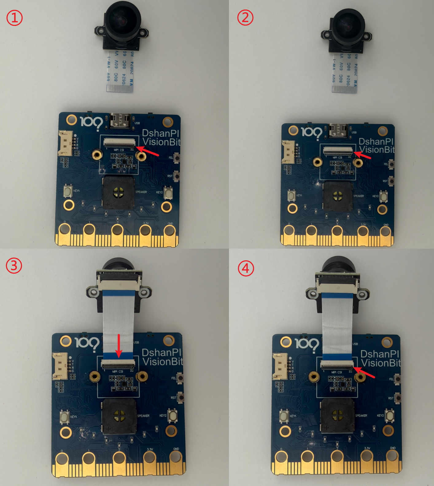

1. 将图1箭头处的FPC连接器的盖子轻轻向上拨，如图1所示。
2. FPC连接器的黑色盖板翘起后效果，如图2所示。
3. 按照图3所示，将摄像头的排线轻轻接入FPC连接器。注意：箭头处的排线连接，蓝色面朝上，金属面朝下。
4. 将图4箭头处的FPC连接器的盖子轻轻按下，按下后即可将摄像头与开发板连接。注意：后续请不要用力扯摄像头排线，排线易损坏，无法维修。

## 连接显示屏

要使用显示屏显示摄像头获取的图像，如果您只单独购买了DshanPI-AIMaix开发板，可能还需另外购买MIPI显示屏。下面是将MIPI显示屏连接到DshanPI-AIMaix开发板的指南。

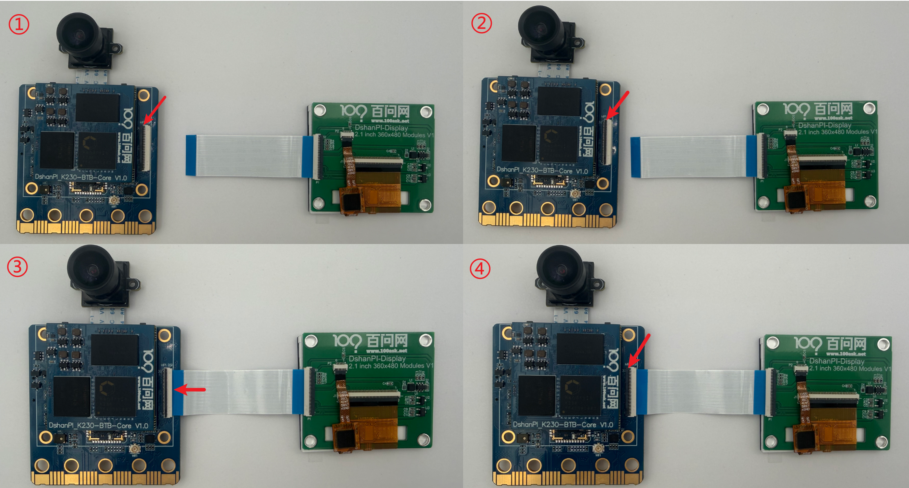

1. 将图1箭头处的FPC连接器的盖子轻轻向上拨，如图1所示。
2. FPC连接器的黑色盖板翘起后效果，如图2所示。
3. 按照图3所示，将显示屏的排线轻轻接入FPC连接器。注意：箭头处的排线连接，蓝色面朝上，金属面朝下。
4. 将图4箭头处的FPC连接器的盖子轻轻按下，按下后即可将显示屏与开发板连接。注意：后续请不要用力扯摄像头排线，排线易损坏，无法维修。

## 开发板首次启动

通过Type-C线将板连接到PC电脑，您可以使用DshanPI-AIMaix盒子中的的Type-C线。连接指南如下所示：

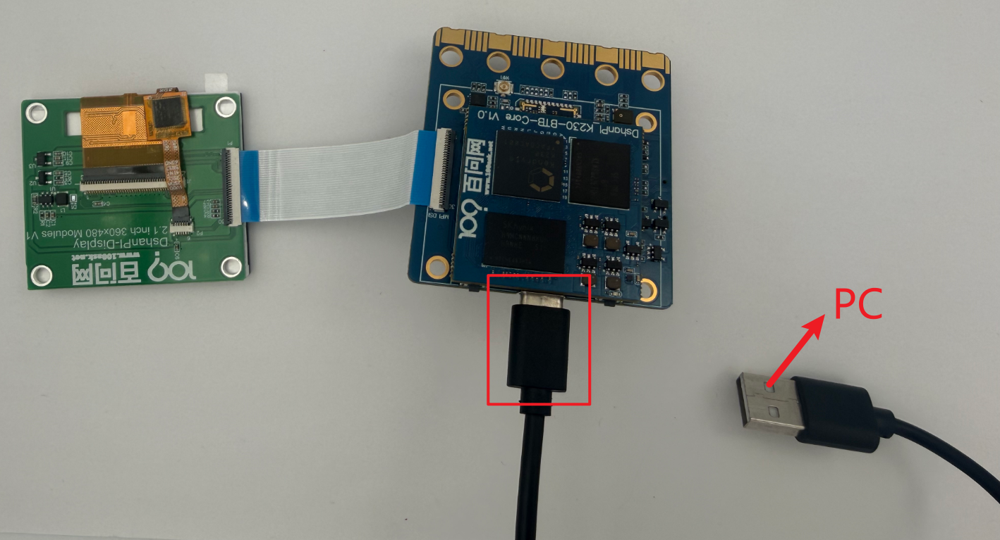

### 第一次启动

一旦开发板套件通电后，等待系统启动后可以在文件资源管理器中看到`CanMV`设备，在设备管理器看到USB串行设备。

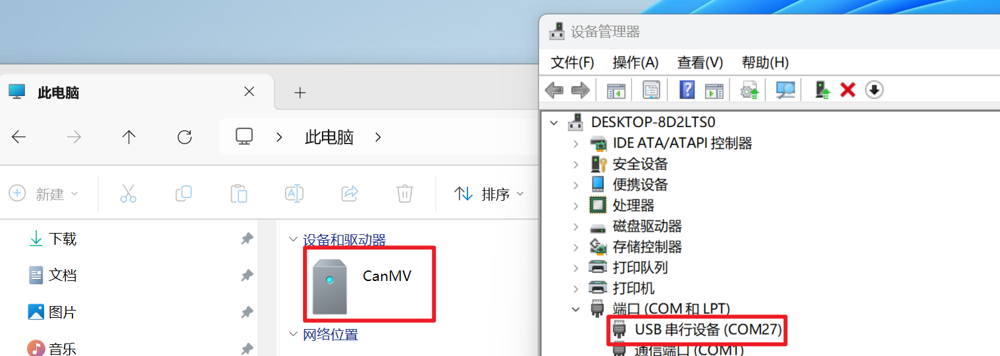

### 下载并安装IDE开发工具

 进入嘉楠开发者社区下载IDE开发工具：[嘉楠开发者社区下载中心](https://www.kendryte.com/zh/resource?selected=0-2-1)

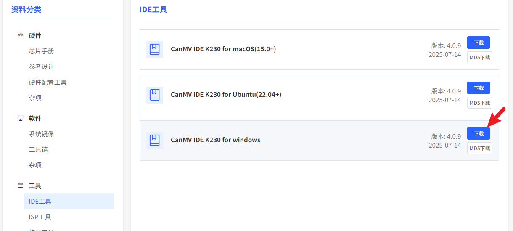

> 如果`CANMV IDE K230 for windows `工具更新了版本，请下载最新的版本！

 下载完成后会获得`exe`安装包，可双击安装包后，安装至电脑中。安装完成后可打开IDE工具`CanMV IDE K230`，打开IDE后会进入如下界面。

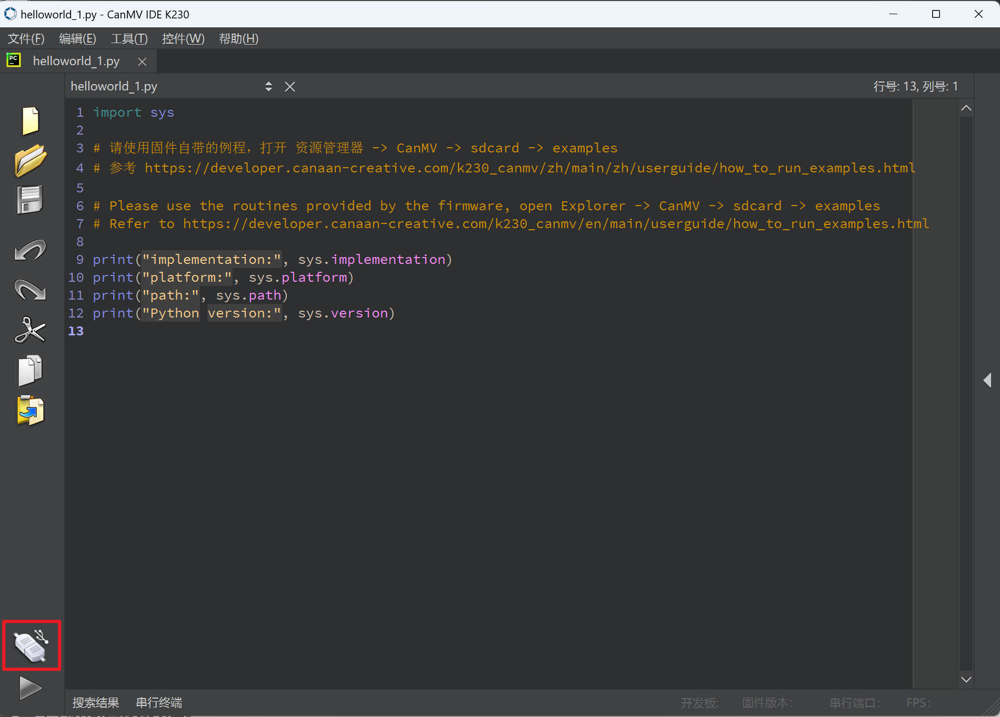

点击上图中红框位置的连接开发板按钮。连接完成后，可以看到运行程序按钮变成绿色。

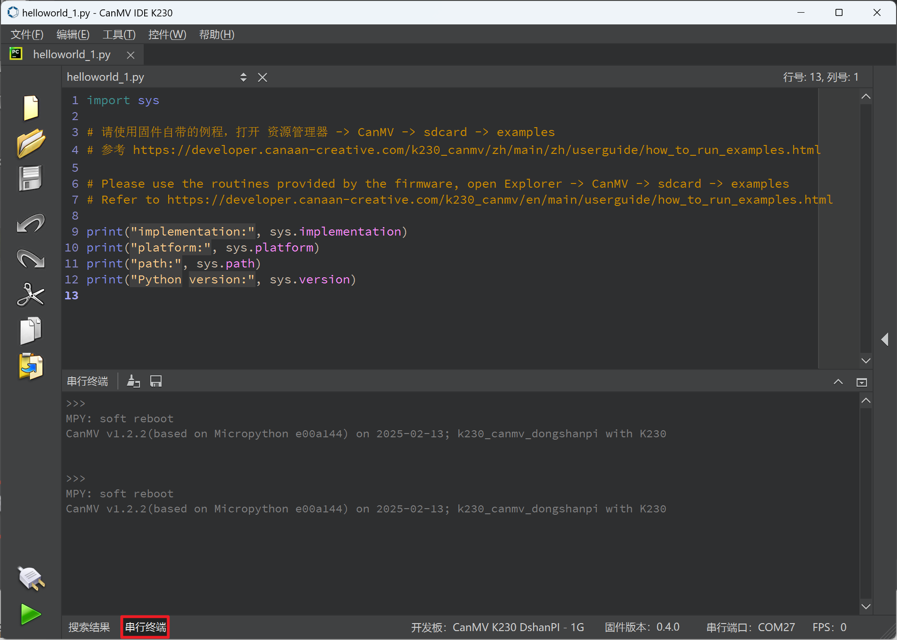

可点击串行终端看到设备管理器中USB串行设备的输出，可以点击上图中的绿色按钮，可运行默认的打印程序，如下所示：

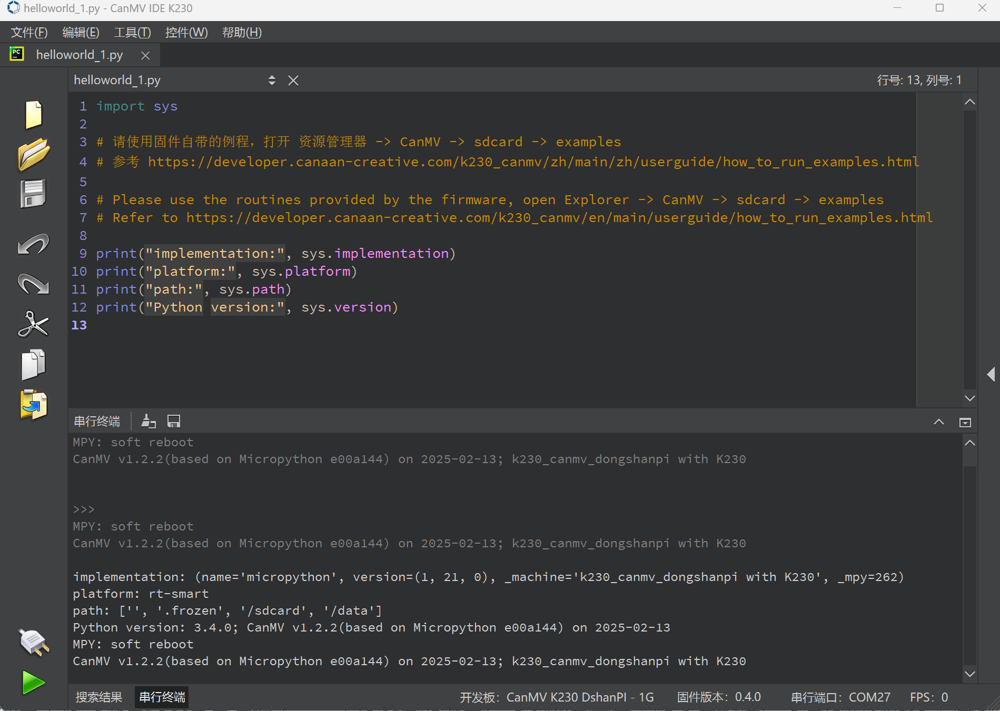

后续可在此IDE下进行MicroPython编程。

官方例程讲解教程：https://www.kendryte.com/k230_canmv/zh/main/zh/example/index.html

### 运行后续示例

在CANMV IDE K230中，选择`文件`下的`新建文件`。在新建文件中可填入后续任意的示例代码。

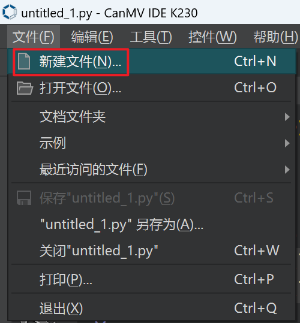

例如：将代码复制进`新建文件`后，点击下图的红框处绿色按钮即可运行。

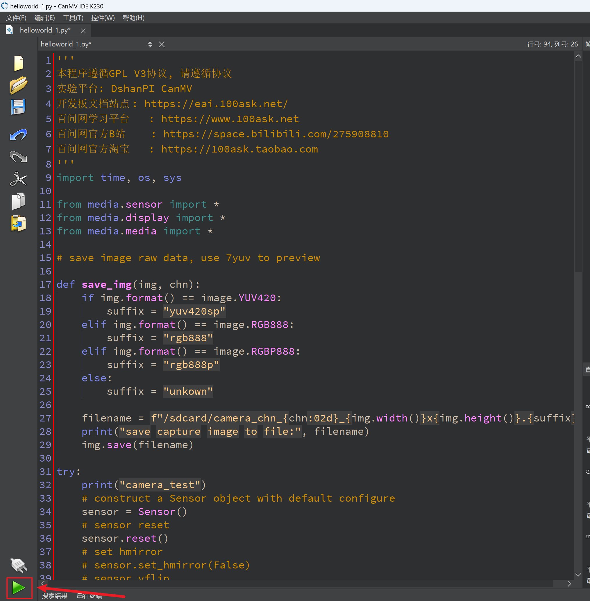

## [拓展]访问开发板的串口

硬件要求：

- USB转UART串口模块
- Type-C转双串口模块

软件注意事项：

- MicroPython系统（默认）：UART0
- RT-smart系统：UART0
- Linux系统：UART0
- Rt-smart+Linux双系统：UART0(Linux小核)，UART3(Rt-smart大核)

### 使用Type-C访问UART0串口

将Type-C数据线接入Type-C串口模块，杜邦线端接入USB转串口模块。连接成功后，USB转串口模块需要接入电脑，使用电脑访问串口模块，波特率为115200。

> 注意：
>
> - Type-C双串口模块的RX需要连接USB转串口模块的TX。
> - Type-C双串口模块的TX需要连接USB转串口模块的RX。
> - Type-C双串口模块的GND需要连接USB转串口模块的GND。

接线参考图如下所示：

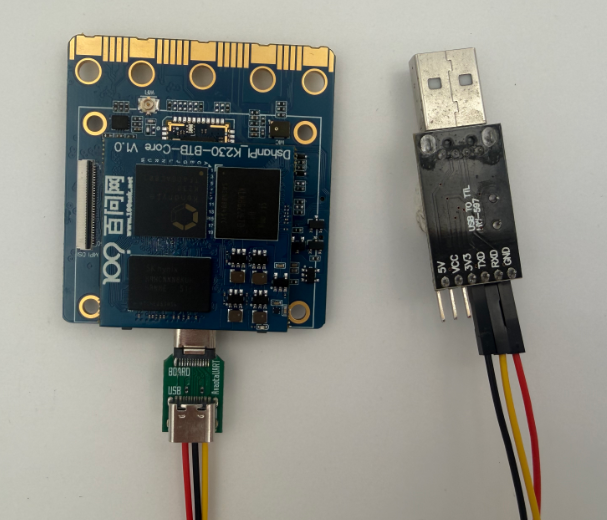

其中单串口默认访问的是UART0。对于DshanPI-AIMaix，只需要将Type-C双串口模块板载Type-C口即可。

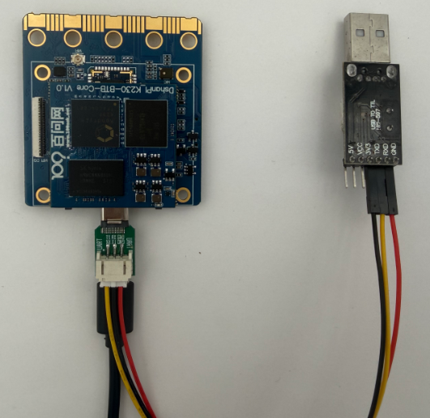

连接完成后，访问配套资料中`02_开发工具/【Windows】USB串口驱动`安装串口驱动。

### 使用拓展引脚访问UART0串口

在拓展排针上，硬件也将UART3引到了拓展引脚上，即您可以使用USB转UART串口连接拓展引脚上的串口进行访问，可以查看硬件原理图中拓展排针部分，可知UART3的位置：

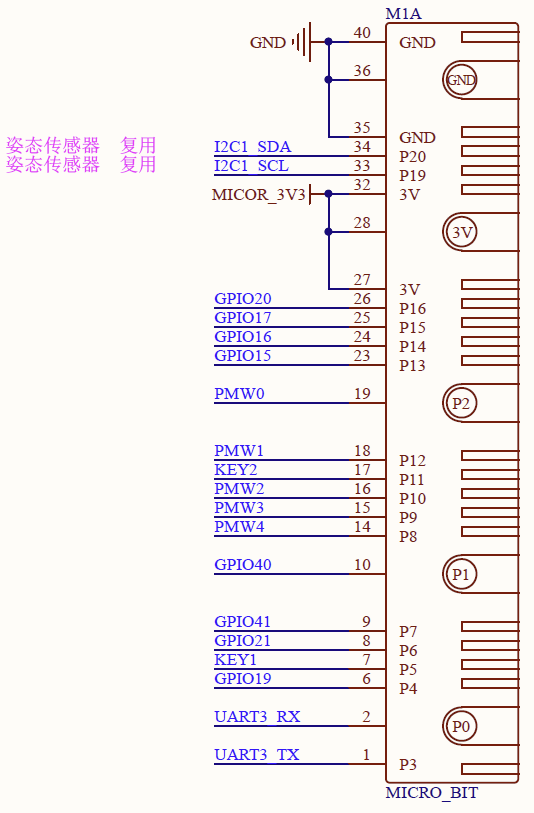
