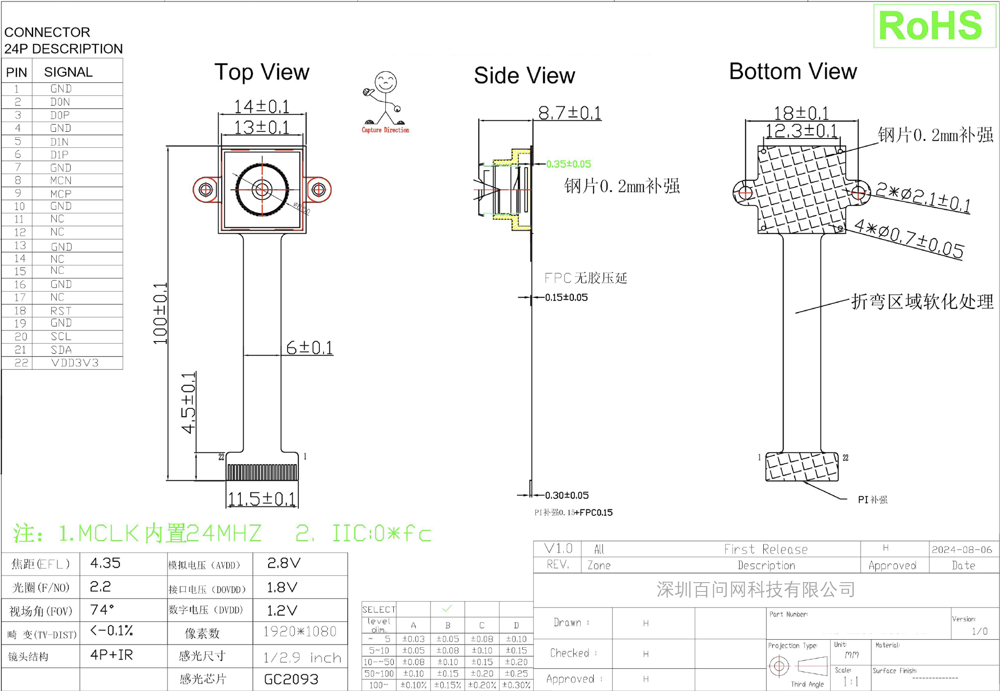
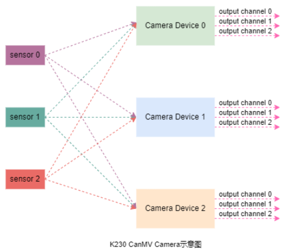
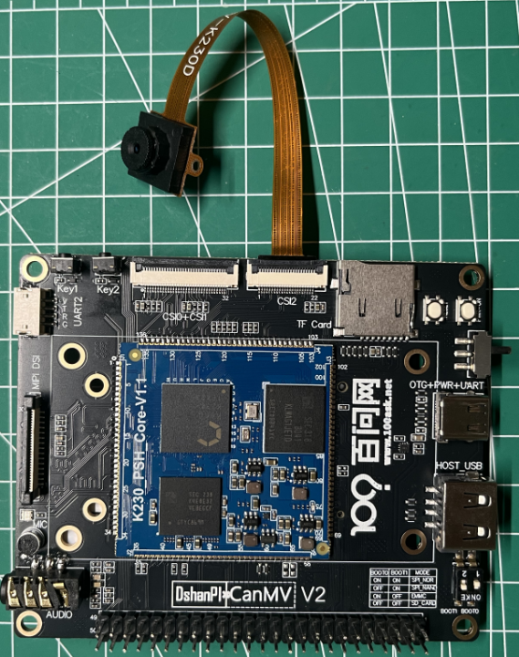
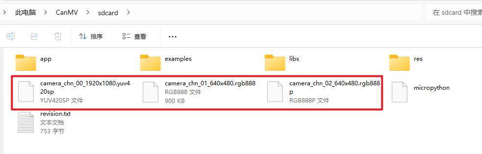

# Camera 摄像头

## 1.实验目的

学习K230上如何使用摄像头。

## 2.实验硬件

目前我们提供的摄像头为`GC2093`，镜头参数为：

- 感光元件：GC2093
- 最大分辨率：1920x1080
- 最大帧率：60fps
- 感光尺寸：1/2.9

机械尺寸及引脚定义：




## 3.实验原理

板子上提供了三路摄像头接口，其中CSI2为22p-0.5mm的FPC接口，CSI0和CSI1为二合一接口，这一小节我们先讲解CSI2的使用。

在DshanPI-K230-CanMV开发板中，Sensor模块的主要作用是负责获取图像数据。这个模块将光信号转化为数字信号，供后续图像处理算法使用。

K230的Sensor模块API提供了对这些硬件的底层控制，模块负责图像采集与数据处理。该模块提供了一套高级 API，开发者可以利用这些接口轻松获取不同格式与尺寸的图像，而无需了解底层硬件的具体实现。其架构如下图所示：



K230 平台支持最多 **三路图像传感器（Sensor 0/1/2）** 同时接入，每个传感器可独立完成图像采集与信号转换。这些传感器可安装于不同位置，用于捕捉不同视角或区域的图像，例如：

- 自动驾驶场景：车前、车后及车内的三路摄像头；
- 安防监控：覆盖多个区域；
- 工业检测：多面或多角度图像获取。

每个图像传感器可灵活映射到任一 **Camera Device（Camera Device 0/1/2）**。Camera Device 是图像数据处理的核心单元，负责完成图像采集、格式转换及预处理等操作。Sensor 与 Camera Device 之间支持多对多映射，提供更高的配置灵活性。

每个 Camera Device 提供 **三路输出通道（Output Channel 0/1/2）**，支持并行输出不同格式、分辨率的图像数据，可分别用于：

- 实时显示；
- AI 算法推理；
- 视频存储或回放。

K230 也支持通过 CSI0+CSI1 合并为一个 4-lane 接口，从而连接高分辨率摄像头，扩展单路带宽以满足更高质量图像需求。


## 4.代码解析

### 导入模块

```
import time, os, sys

from media.sensor import *
from media.display import *
from media.media import *
```

引入 `time`, `os`, `sys` 是为了时间控制、系统接口等通用功能；

`media.sensor`, `media.display`, `media.media` 是K230平台自带的摄像头、显示和媒体资源管理模块。


###  保存图像函数

```
def save_img(img, chn):
    if img.format() == image.YUV420:
        suffix = "yuv420sp"
    elif img.format() == image.RGB888:
        suffix = "rgb888"
    elif img.format() == image.RGBP888:
        suffix = "rgb888p"
    else:
        suffix = "unkown"
```

判断图像格式，选择合适的文件后缀名。

```
    filename = f"/sdcard/camera_chn_{chn:02d}_{img.width()}x{img.height()}.{suffix}"
    print("save capture image to file:", filename)
    img.save(filename)
```

构造图像文件保存路径，例如 `/sdcard/camera_chn_00_1920x1080.yuv420sp`

使用 `img.save()` 将图像原始数据保存到 SD 卡中。

### 摄像头初始化和配置

```
try:
    print("camera_test")
    sensor = Sensor()           # 创建 Sensor 对象，默认使用 sensor0
    sensor.reset()              # 重置sensor，加载默认配置
```

###  设置默认通道输出参数

```
    sensor.set_framesize(Sensor.FHD)        # 设置分辨率为 Full HD 1920x1080
    sensor.set_pixformat(Sensor.YUV420SP)   # 设置输出图像格式为 YUV420SP
```

### 摄像头通道绑定到显示层

```
    bind_info = sensor.bind_info()
    Display.bind_layer(**bind_info, layer = Display.LAYER_VIDEO1)
```

`bind_info()` 获取绑定信息（比如buffer、宽高等）

`Display.bind_layer()` 将通道0图像显示到视频层 VIDEO1（通常用于 HDMI 显示）

### 设置通道的输出格式

```
    sensor.set_framesize(width = 640, height = 480, chn = CAM_CHN_ID_1)
    sensor.set_pixformat(Sensor.RGB888, chn = CAM_CHN_ID_1)

    sensor.set_framesize(width = 640, height = 480, chn = CAM_CHN_ID_2)
    sensor.set_pixformat(Sensor.RGBP888, chn = CAM_CHN_ID_2)
```

配置通道1和通道2为 VGA 分辨率 (640x480)，格式分别为 RGB888 和 RGB888P（Planar）。

### 初始化显示模块+媒体管理器

```
    Display.init(Display.VIRT, sensor.width(), sensor.height(), to_ide = True)
    MediaManager.init()
```

显示初始化，设置显示区域为虚拟显示（VIRT）并输出到 IDE（一般是 HDMI 屏幕）；

媒体管理器初始化，申请内部 buffer，做视频资源统一管理。

### 启动摄像头采集

```
    sensor.run()  # 开始运行摄像头
```

### 丢弃前100帧图像

```
    for i in range(100):
        sensor.snapshot()
```

用于预热、去抖。

### 抓拍图像并保存到SD卡

```
    img = sensor.snapshot(chn = CAM_CHN_ID_0)
    save_img(img, 0)

    img = sensor.snapshot(chn = CAM_CHN_ID_1)
    save_img(img, 1)

    img = sensor.snapshot(chn = CAM_CHN_ID_2)
    save_img(img, 2)
```

分别从三个通道抓拍图像并保存。

### 异常处理

```
except KeyboardInterrupt as e:
    print(f"user stop")
except BaseException as e:
    print(f"Exception '{e}'")
```

捕捉中断（Ctrl+C）和其他异常，避免程序崩溃。

###  资源清理

```
finally:
    if isinstance(sensor, Sensor):
        sensor.stop()               # 停止摄像头
    Display.deinit()                # 关闭显示
    os.exitpoint(os.EXITPOINT_ENABLE_SLEEP)  # 允许休眠
    time.sleep_ms(100)             # 延迟一会儿，等待硬件稳定
    MediaManager.deinit()          # 释放媒体资源
```

确保资源被正确释放，避免系统崩溃或下次初始化失败。

## 5.示例代码

下面的代码保存摄像头图像数据：

```
'''
本程序遵循GPL V3协议, 请遵循协议
实验平台: DshanPI CanMV
开发板文档站点	: https://eai.100ask.net/
百问网学习平台   : https://www.100ask.net
百问网官方B站    : https://space.bilibili.com/275908810
百问网官方淘宝   : https://100ask.taobao.com
'''
import time, os, sys

from media.sensor import *
from media.display import *
from media.media import *

# save image raw data, use 7yuv to preview

def save_img(img, chn):
    if img.format() == image.YUV420:
        suffix = "yuv420sp"
    elif img.format() == image.RGB888:
        suffix = "rgb888"
    elif img.format() == image.RGBP888:
        suffix = "rgb888p"
    else:
        suffix = "unkown"

    filename = f"/sdcard/camera_chn_{chn:02d}_{img.width()}x{img.height()}.{suffix}"
    print("save capture image to file:", filename)
    img.save(filename)

try:
    print("camera_test")
    # construct a Sensor object with default configure
    sensor = Sensor()
    # sensor reset
    sensor.reset()
    # set hmirror
    # sensor.set_hmirror(False)
    # sensor vflip
    # sensor.set_vflip(False)

    # set chn0 output size, 1920x1080
    sensor.set_framesize(Sensor.FHD)
    # set chn0 output format
    sensor.set_pixformat(Sensor.YUV420SP)
    # bind sensor chn0 to display layer video 1
    bind_info = sensor.bind_info()
    Display.bind_layer(**bind_info, layer = Display.LAYER_VIDEO1)

    # set chn1 output format
    sensor.set_framesize(width = 640, height = 480, chn = CAM_CHN_ID_1)
    sensor.set_pixformat(Sensor.RGB888, chn = CAM_CHN_ID_1)

    # set chn2 output format
    sensor.set_framesize(width = 640, height = 480, chn = CAM_CHN_ID_2)
    sensor.set_pixformat(Sensor.RGBP888, chn = CAM_CHN_ID_2)

    # use hdmi as display output
    Display.init(Display.VIRT, sensor.width(), sensor.height(), to_ide = True)
    # init media manager
    MediaManager.init()
    # sensor start run
    sensor.run()

    # drop 100 frames
    for i in range(100):
        sensor.snapshot()

    # snapshot and save
    img = sensor.snapshot(chn = CAM_CHN_ID_0)
    save_img(img, 0)

    img = sensor.snapshot(chn = CAM_CHN_ID_1)
    save_img(img, 1)

    img = sensor.snapshot(chn = CAM_CHN_ID_2)
    save_img(img, 2)

except KeyboardInterrupt as e:
    print(f"user stop")
except BaseException as e:
    print(f"Exception '{e}'")
finally:
    # sensor stop run
    if isinstance(sensor, Sensor):
        sensor.stop()
    # deinit display
    Display.deinit()

    os.exitpoint(os.EXITPOINT_ENABLE_SLEEP)
    time.sleep_ms(100)

    # release media buffer
    MediaManager.deinit()
```


## 6.实验结果

在开发板上电前，提前连接好摄像头：



连接后上电运行上述示例代码后，会调用摄像头，拍摄图片，拍摄完成后保存的sdcard目录下：

