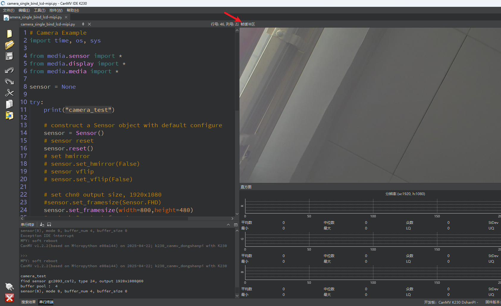
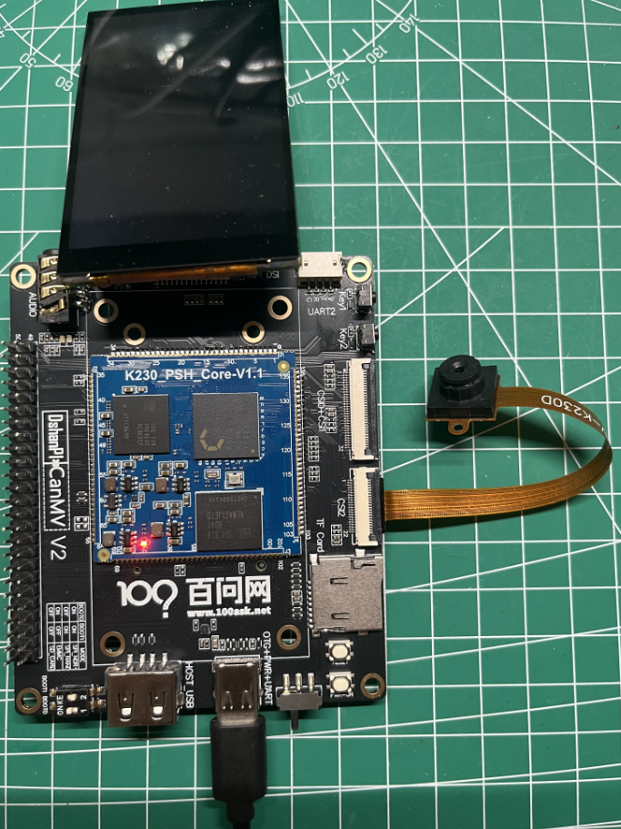
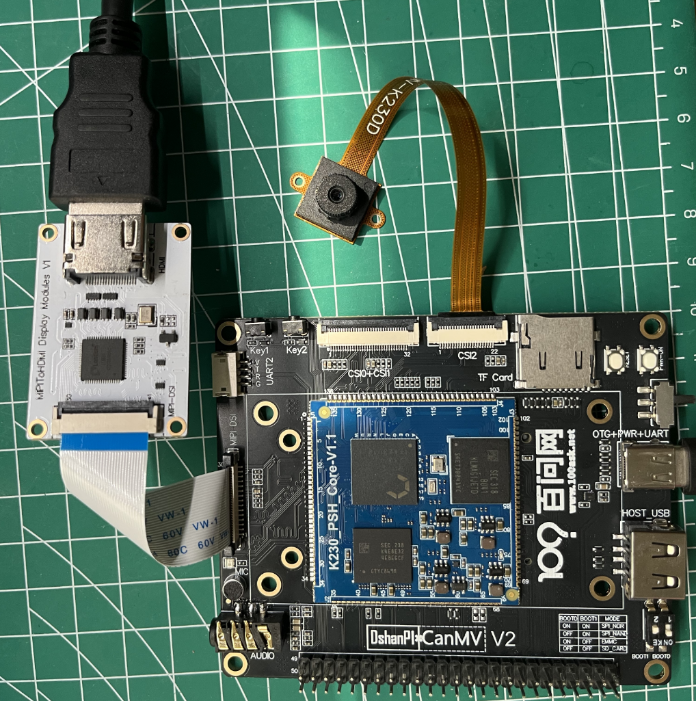

# 图像显示

## 1.学习目的

学习如何在显示屏上显示图像。

## 2.实验硬件

K230 平台集成了一路 MIPI-DSI 接口（4-lane），可用于驱动 MIPI 屏幕，或通过外接转换芯片连接 HDMI 显示器。此外，平台还提供虚拟显示（`VIRT`）输出选项，便于用户在无实体屏幕的情况下，通过 CanMV-IDE 进行图像预览和调试操作。

在多种显示方式中，使用 IDE 的帧缓冲区进行虚拟显示是一种成本最低、配置简便的方案。该模式通过 USB 与 PC 传输图像数据，适用于调试和开发阶段的可视化需求。需要注意的是，由于受限于 USB 带宽，其帧率和图像质量难以同时兼顾，但在基本使用场景中依然足够稳定和实用。

对于实际部署或便携式项目开发，推荐使用 MIPI 接口外接 3.1 英寸 MIPI 屏幕（分辨率 800×480）。该方案不仅安装简便（可直接通过铜柱与开发板固定连接），且支持将脚本保存在 TF 卡中，实现离线运行。该显示模式支持实时画面预览和交互，适合移动端或嵌入式项目中独立运行。

另外，MIPI 接口还可搭配 MIPI 转 HDMI 扩展板，连接常见的 HDMI 显示器。该方案支持最高 1080p 分辨率，显示效果优异，是家庭或实验室场景下的理想选择。相较于虚拟显示与小尺寸屏幕，该方案在成本与体验之间实现良好平衡。


## 3.实验原理

K230 平台支持多种显示输出方案，便于用户在不同应用场景下灵活选用。其 MicroPython 框架通过 `Display` 模块进行统一抽象，底层由驱动程序调用系统 framebuffer 或控制器寄存器进行图像输出。主要支持以下三种方式：VIRT、LT9611、ST7701。

`VIRT` 虚拟显示器：

- 使用 `Display.init(Display.VIRT, ...)` 初始化虚拟显示。
- 图像输出不经过真实物理屏幕，而是通过 USB 数据传输至 PC。
- CanMV-IDE 接收到帧缓冲区数据后，在界面中实时渲染显示。
- 实际上使用了一个位于系统内存中的**虚拟帧缓冲区**，类似 `/dev/fb0`。

`ST7701` 控制器（MIPI 显示屏）

- `ST7701` 是常用的小尺寸 TFT-LCD 显示屏控制器，通常用于驱动 3.1 寸 MIPI 显示屏（如 800×480）。
- K230 的 MIPI-DSI 接口直接输出图像数据至 ST7701 屏幕，无需中间转换。
- 使用 `Display.init(Display.ST7701, ...)` 进行初始化配置。

`LT9611` 接口芯片（HDMI 显示）

- `LT9611` 是一款 MIPI-DSI 转 HDMI 芯片，支持将内部 MIPI 显示信号转换为 HDMI 标准输出。
- K230 通过内部 MIPI-DSI 接口连接 LT9611，然后通过 HDMI 接口输出至显示器。
- 使用 `Display.init(Display.LT9611, ...)` 初始化。

## 4.代码解析

### 导入模块

```
import time, os, sys
from media.sensor import *
from media.display import *
from media.media import *
```

 **导入系统模块**，用于延时 (`time`)、退出点管理 (`os.exitpoint()`)、标准输入输出处理等。

**导入 K230 MicroPython 的三个核心模块**：

- `sensor`: 摄像头传感器接口（如图像采集、通道设置等）
- `display`: 显示模块接口（支持 VIRT、HDMI、MIPI 等输出）
- `media`: 媒体管理器（用于内存池、缓冲区管理）

### 创建摄像头对象

```
sensor = None
try:
    print("camera_test")
    sensor = Sensor()
```

定义一个全局变量 `sensor`，用于后续保存传感器对象，方便在 `finally` 语句中进行释放。

开始 `try...except` 异常捕获结构，防止运行中断导致资源未释放；同时输出测试开始标志。

创建一个摄像头 `Sensor` 对象，默认使用CSI2。

### 重置摄像头配置

```
	sensor.reset()
```

**初始化并重置摄像头配置**（类似软复位），恢复为默认状态。

### 设置摄像头属性

```
	sensor.set_framesize(width=800,height=480)
```

 设置摄像头输出图像的分辨率为 `800x480`。也可用 `Sensor.FHD` 表示 1920x1080。

- 默认是设置在通道 0（`CAM_CHN_ID_0`）。

```
    sensor.set_pixformat(Sensor.YUV420SP)
```

设置图像的像素格式为 YUV420SP（半平面格式，适合视频渲染）。

### 绑定输入输出

```
    bind_info = sensor.bind_info()
    Display.bind_layer(**bind_info, layer = Display.LAYER_VIDEO1)
```

 获取摄像头图像通道的绑定信息，并将其绑定到 **显示器的视频图层1** 上。

意味着摄像头采集的图像会自动显示在这个图层上，无需手动调用 `Display.show_image()`。

###  初始化显示器

```
	Display.init(Display.ST7701, width = 800, height = 480, to_ide=True)
```

- 当前启用了 **ST7701 MIPI 显示屏（3.1寸 800x480）**。
- 参数 `to_ide=True` 表示图像也会同步发送到 IDE 虚拟显示（方便调试）。
- 若使用虚拟显示，可启用上面的注释行 `Display.VIRT`。

### 启动摄像头

```
    sensor.run()
```

 启动摄像头传感器的工作，正式开始图像采集。

### 监听退出指令

```
    while True:
        os.exitpoint()
```

主循环中什么也没做，只保留了一个 `exitpoint()`。

- IDE会通过这个接口监听退出指令，从而实现安全停止。
- 图像的显示是自动进行的（通过前面绑定的图层），不需手动刷新。

```
except KeyboardInterrupt as e:
    print("user stop: ", e)
```

捕捉用户按下 Ctrl+C 或 IDE 中点击“停止”按钮的中断行为。

```
except BaseException as e:
    print(f"Exception {e}")
```

 捕捉所有其它类型的异常（如驱动错误、显示初始化失败等）。

### 停止摄像头采集

```
finally:
    if isinstance(sensor, Sensor):
        sensor.stop()
```

确保程序结束时 **停止摄像头采集**，释放硬件资源。

### 注销显示模块

```
    Display.deinit()
```

注销显示模块，关闭所有图层输出。

### 退出点通知 IDE

```
    os.exitpoint(os.EXITPOINT_ENABLE_SLEEP)
    time.sleep_ms(100)
```

 退出点通知 IDE，接下来可以进入休眠或退出。

- `time.sleep_ms(100)` 短暂延时，确保数据完全写出。

### 释放媒体资源

```
    MediaManager.deinit()
```

最后释放媒体资源（如图像缓冲区、DMA 通道等）。

## 5.示例代码

### 5.1 IDE帧缓冲区显示

```
'''
本程序遵循GPL V3协议, 请遵循协议
实验平台: DshanPI CanMV
开发板文档站点	: https://eai.100ask.net/
百问网学习平台   : https://www.100ask.net
百问网官方B站    : https://space.bilibili.com/275908810
百问网官方淘宝   : https://100ask.taobao.com
'''
import time, os, sys

from media.sensor import *
from media.display import *
from media.media import *

sensor = None

try:
    print("camera_test")

    # construct a Sensor object with default configure
    sensor = Sensor()
    # sensor reset
    sensor.reset()
    # set hmirror
    # sensor.set_hmirror(False)
    # sensor vflip
    # sensor.set_vflip(False)

    # set chn0 output size, 1920x1080
    sensor.set_framesize(Sensor.FHD)
    #sensor.set_framesize(width=800,height=480)
    # set chn0 output format
    sensor.set_pixformat(Sensor.YUV420SP)
    # bind sensor chn0 to display layer video 1
    bind_info = sensor.bind_info()
    Display.bind_layer(**bind_info, layer = Display.LAYER_VIDEO1)

    # use lcd as display output
    Display.init(Display.VIRT, sensor.width(), sensor.height())
    #Display.init(Display.ST7701, width = 800, height = 480, to_ide=True)
    # init media manager
    MediaManager.init()
    # sensor start run
    sensor.run()

    while True:
        os.exitpoint()
except KeyboardInterrupt as e:
    print("user stop: ", e)
except BaseException as e:
    print(f"Exception {e}")
finally:
    # sensor stop run
    if isinstance(sensor, Sensor):
        sensor.stop()
    # deinit display
    Display.deinit()
    os.exitpoint(os.EXITPOINT_ENABLE_SLEEP)
    time.sleep_ms(100)
    # release media buffer
    MediaManager.deinit()

```


### 5.2 MIPI屏显示

```
'''
本程序遵循GPL V3协议, 请遵循协议
实验平台: DshanPI CanMV
开发板文档站点	: https://eai.100ask.net/
百问网学习平台   : https://www.100ask.net
百问网官方B站    : https://space.bilibili.com/275908810
百问网官方淘宝   : https://100ask.taobao.com
'''
import time, os, sys

from media.sensor import *
from media.display import *
from media.media import *

sensor = None

try:
    print("camera_test")

    # construct a Sensor object with default configure
    sensor = Sensor()
    # sensor reset
    sensor.reset()
    # set hmirror
    # sensor.set_hmirror(False)
    # sensor vflip
    # sensor.set_vflip(False)

    # set chn0 output size, 1920x1080
    #sensor.set_framesize(Sensor.FHD)
    sensor.set_framesize(width=800,height=480)
    # set chn0 output format
    sensor.set_pixformat(Sensor.YUV420SP)
    # bind sensor chn0 to display layer video 1
    bind_info = sensor.bind_info()
    Display.bind_layer(**bind_info, layer = Display.LAYER_VIDEO1)

    # use lcd as display output
    #Display.init(Display.VIRT, sensor.width(), sensor.height())
    Display.init(Display.ST7701, width = 800, height = 480, to_ide=True)
    # init media manager
    MediaManager.init()
    # sensor start run
    sensor.run()

    while True:
        os.exitpoint()
except KeyboardInterrupt as e:
    print("user stop: ", e)
except BaseException as e:
    print(f"Exception {e}")
finally:
    # sensor stop run
    if isinstance(sensor, Sensor):
        sensor.stop()
    # deinit display
    Display.deinit()
    os.exitpoint(os.EXITPOINT_ENABLE_SLEEP)
    time.sleep_ms(100)
    # release media buffer
    MediaManager.deinit()
```


### 5.3 HDMI显示器显示

```
'''
本程序遵循GPL V3协议, 请遵循协议
实验平台: DshanPI CanMV
开发板文档站点	: https://eai.100ask.net/
百问网学习平台   : https://www.100ask.net
百问网官方B站    : https://space.bilibili.com/275908810
百问网官方淘宝   : https://100ask.taobao.com
'''
import time, os, sys

from media.sensor import *
from media.display import *
from media.media import *

sensor = None

try:
    print("camera_test")

    # construct a Sensor object with default configure
    sensor = Sensor()
    # sensor reset
    sensor.reset()
    # set hmirror
    # sensor.set_hmirror(False)
    # sensor vflip
    # sensor.set_vflip(False)

    # set chn0 output size, 1920x1080
    sensor.set_framesize(Sensor.FHD)
    #sensor.set_framesize(width=800,height=480)
    # set chn0 output format
    sensor.set_pixformat(Sensor.YUV420SP)
    # bind sensor chn0 to display layer video 1
    bind_info = sensor.bind_info()
    Display.bind_layer(**bind_info, layer = Display.LAYER_VIDEO1)

    # use lcd as display output
    Display.init(Display.LT9611, sensor.width(), sensor.height())
    #Display.init(Display.ST7701, width = 800, height = 480, to_ide=True)
    # init media manager
    MediaManager.init()
    # sensor start run
    sensor.run()

    while True:
        os.exitpoint()
except KeyboardInterrupt as e:
    print("user stop: ", e)
except BaseException as e:
    print(f"Exception {e}")
finally:
    # sensor stop run
    if isinstance(sensor, Sensor):
        sensor.stop()
    # deinit display
    Display.deinit()
    os.exitpoint(os.EXITPOINT_ENABLE_SLEEP)
    time.sleep_ms(100)
    # release media buffer
    MediaManager.deinit()
```


## 6.实验结果

### 6.1 IDE帧缓冲区显示

​	点击运行代码后，在IDE的帧缓冲区处可以实时预览摄像头的画面。



### 6.2 MIPI屏显示

​	上电前在请提前使用排线连接MIPI屏至开发板。



​	上电点击运行代码后，在MIPI屏处可以实时预览摄像头的画面。

### 6.3 HDMI显示器显示

​	在上电前，按照下图使用排线连接开发板的DSI接口至HDMI转接板的接口。



​	上电点击运行代码后，在HDMI显示器处可以实时预览摄像头的画面。

