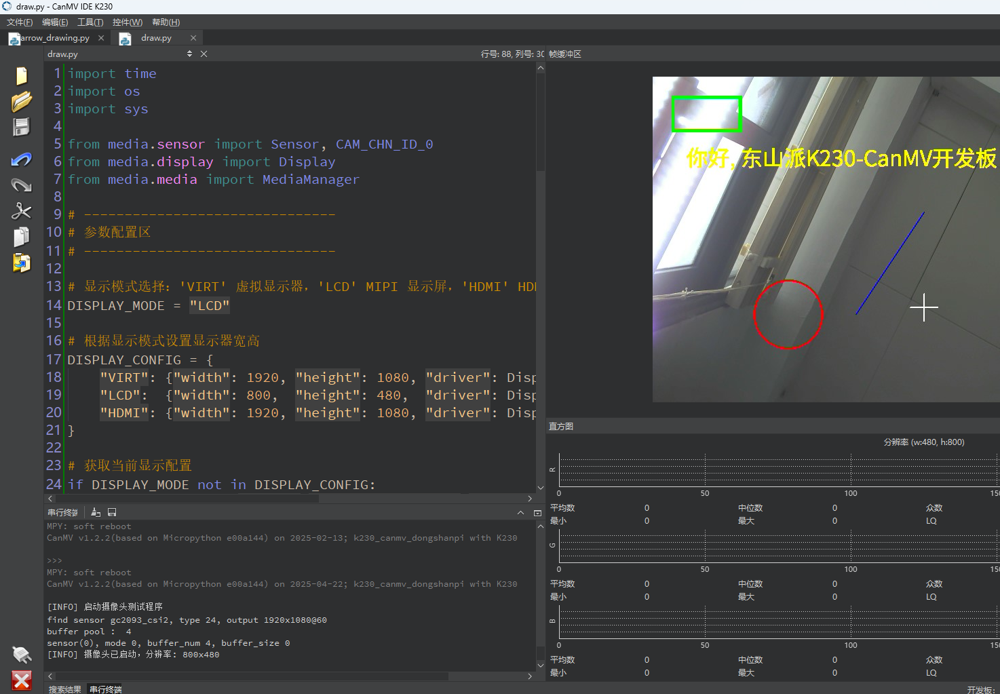

# 绘制实验

## 1.实验目的

学习在图像中添加图形或文字。

## 2.实验原理

### 2.1 概述

OpenMV 是一个小型嵌入式机器视觉模块，广泛用于快速开发计算机视觉应用。OpenMV 的图像绘制方法可以用于在图像上绘制各种形状和文字，以便进行视觉反馈和调试。

### 2.2 常用函数

### 2.1 draw_string_advanced

`draw_string_advanced` 函数使用freetype渲染文字，支持中文，用户也可指定字体

- 语法

```
image.draw_string_advanced(x,y,char_size,str,[color, font])
```


- 参数解释
  - `x, y`起点坐标。
  - `char_size`:字符大小
  - `str`:需要绘制的中文字符
  - `color`：字的颜色。
  - `font`： 字体文件路径
- 示例

```
img.draw_string_advanced(10, 10, 32, "你好世界", color=(255, 0, 0))  # 绘制红色线
```


### 2.2 draw_line

`draw_line` 函数可实现在图像上绘制一条线。

- 语法

```
image.draw_line(x0, y0, x1, y1, color)
```


- 参数解释
  - `x0, y0`：起点坐标。
  - `x1, y1`：终点坐标。
  - `color`：线的颜色。
- 示例

```
img.draw_line(10, 10, 100, 100, color=(255, 0, 0))  # 绘制红色线
```


### 2.3 draw_rectangle

`draw_rectangle` 函数可实现在图像上绘制一个矩形。

- 语法

```
image.draw_rectangle(x, y, w, h, color, thickness=1)
```


- 参数解释
  - `x, y`：矩形的左上角坐标。
  - `w, h`：矩形的宽度和高度。
  - `color`：矩形的颜色。
  - `thickness`：矩形边框的厚度（默认为1）。
- 示例

```
img.draw_rectangle(20, 20, 50, 30, color=(0, 255, 0), thickness=2)  # 绘制绿色矩形
```


### 2.4 draw_circle

`draw_circle`函数可实现在图像上绘制一个圆。

- 语法

```
image.draw_circle(x, y, r, color, thickness=1)
```


- 参数解释
  - `x, y`：圆心坐标。
  - `r`：圆的半径。
  - `color`：圆的颜色。
  - `thickness`：圆边框的厚度（默认为1）。
- 示例

```
    img.draw_circle(60, 60, 30, color=(0, 0, 255), thickness=3)  # 绘制蓝色圆
```


### 2.5 draw_cross

`draw_cross`函数可实现在图像上绘制一个十字交叉。

- 语法

```
image.draw_cross(x, y, color, size=5, thickness=1)
```


- 参数解释
  - `x, y`：交叉点坐标。
  - `color`：交叉的颜色。
  - `size`：交叉的大小（默认为5）。
  - `thickness`：交叉线条的厚度（默认为1）。
- 示例

```
    img.draw_cross(40, 40, color=(255, 255, 0), size=10, thickness=2)  # 绘制黄色交叉
```


### 2.6 draw_arrow

`draw_arrow`函数可实现在图像上绘制一条箭头线。

- 语法

```
image.draw_arrow(x0, y0, x1, y1, color, thickness=1)
```


- 参数解释
  - `x0, y0`：起点坐标。
  - `x1, y1`：终点坐标。
  - `color`：箭头的颜色。
  - `thickness`：箭头线条的厚度（默认为1）。
- 示例

```
img.draw_arrow(10, 10, 100, 100, color=(255, 0, 0), thickness=2)  # 绘制红色箭头
```


### 2.7 draw_ellipse

`draw_ellipse`函数可实现在图像上绘制一个椭圆。

- 语法

```
image.draw_ellipse(cx, cy, rx, ry, color, thickness=1)
```


- 参数解释
  - `cx, cy`：椭圆中心的坐标。
  - `rx, ry`：椭圆的半径（x轴和y轴方向）。
  - `color`：椭圆的颜色。
  - `thickness`：椭圆边框的厚度（默认为1）。
- 示例

```
img.draw_ellipse(60, 60, 30, 20, color=(0, 0, 255), thickness=3)  # 绘制蓝色椭圆
```


### 2.8 draw_image

`draw_image`函数可实现在当前图像上绘制另一个图像。

- 语法

```
image.draw_image(img, x, y, alpha=128, scale=1.0)
```


- 参数解释
  - `img`：要绘制的图像对象。
  - `x, y`：绘制位置的左上角坐标。
  - `alpha`：透明度（0-256）。
  - `scale`：缩放比例（默认为1.0）。
- 示例

```
  overlay = image.Image("overlay.bmp")
  img.draw_image(overlay, 10, 10, alpha=128, scale=1.0)  # 在(10, 10)位置绘制 overlay.bmp
```


### 2.9 draw_keypoints

`draw_keypoints`函数可实现在图像上绘制关键点。

- 语法

```
image.draw_keypoints(keypoints, size=10, color, thickness=1)
```


- 参数解释
  - `keypoints`：关键点列表，每个关键点是一个(x, y)元组。
  - `size`：关键点的大小（默认为10）。
  - `color`：关键点的颜色。
  - `thickness`：关键点边框的厚度（默认为1）。
- 示例

```
keypoints = [(30, 30), (50, 50), (70, 70)]
img.draw_keypoints(keypoints, size=10, color=(255, 255, 0), thickness=2)  # 绘制黄色关键点
```


### 2.10 flood_fill

`flood_fill`函数可实现在图像上执行洪水填充算法，从指定的起点开始填充指定的颜色。

- 语法

```
image.flood_fill(x, y, color, threshold, invert=False, clear_background=False)
```


- 参数解释
  - `x, y`：起点坐标。
  - `color`：填充的颜色。
  - `threshold`：填充阈值，表示起点像素与相邻像素颜色的允许差异范围。
  - `invert`：布尔值，如果为 True，则反转填充条件。
  - `clear_background`：布尔值，如果为 True，则清除填充区域以外的背景。
- 示例

```
img.flood_fill(30, 30, color=(255, 0, 0), threshold=30, invert=False, clear_background=False)  # 从(30, 30)开始填充红色
```


### 2.11 draw_string

`draw_string`函数可实现在图像上绘制字符串。

- 语法

```
image.draw_string(x, y, text, color, scale=1)
```


- 参数解释
  - `x, y`：字符串的起始坐标。
  - `text`：要绘制的字符串内容。
  - `color`：字符串的颜色。
  - `scale`：字符串的缩放比例（默认为1）。
- 示例

```
img.draw_string(10, 10, "Hello OpenMV", color=(255, 255, 255), scale=2)  # 绘制白色字符串
```

## 3.代码解析

###  导入模块

```
import time
import os
import sys

from media.sensor import Sensor, CAM_CHN_ID_0
from media.display import Display
from media.media import MediaManager
```

`time`：提供延时、时间函数（如 `sleep_ms()`）。

`os`：系统函数，比如 `exitpoint()`，用于 IDE 停止按钮检测。

`sys`：暂未使用，可用于路径修改、异常等。

`media.sensor`：摄像头 Sensor 接口，`CAM_CHN_ID_0` 表示通道 0。

`media.display`：负责图像在 LCD/HDMI/VIRT 显示输出。

`media.media`：媒体缓冲区管理器，控制图像帧的缓存生命周期。

### 显示模式配置

```
DISPLAY_MODE = "LCD"
```

三种模式：`VIRT`（虚拟USB显示）、`LCD`（3.1寸MIPI屏）、`HDMI`（转接板输出）。

```
DISPLAY_CONFIG = {
    "VIRT": {"width": 1920, "height": 1080, "driver": Display.VIRT},
    "LCD":  {"width": 800,  "height": 480,  "driver": Display.ST7701},
    "HDMI": {"width": 1920, "height": 1080, "driver": Display.LT9611}
}
```

用字典统一定义三种模式下的分辨率和驱动器类型，便于扩展和切换。

```
if DISPLAY_MODE not in DISPLAY_CONFIG:
    raise ValueError("不支持的 DISPLAY_MODE，请使用 'VIRT'、'LCD' 或 'HDMI'")
```

防止输入非法模式。

```
config = DISPLAY_CONFIG[DISPLAY_MODE]
DISPLAY_WIDTH = config["width"]
DISPLAY_HEIGHT = config["height"]
DISPLAY_DRIVER = config["driver"]
```

解包字典配置，得到当前显示宽高及驱动器。

### 初始化与运行

```
sensor = None
```

预定义 sensor 变量，便于在 finally 中释放资源。

###  摄像头初始化

```
sensor = Sensor(id=2)
sensor.reset()
```

- 初始化传感器 ID 为 2 的摄像头对象。
- `reset()` 会重置寄存器到默认状态。

```
sensor.set_framesize(width=DISPLAY_WIDTH, height=DISPLAY_HEIGHT, chn=CAM_CHN_ID_0)
sensor.set_pixformat(Sensor.RGB888, chn=CAM_CHN_ID_0)
```

设置输出分辨率和颜色格式（RGB888，24位真彩）。

指定的是摄像头 **通道0**。

### 初始化显示模块

```
Display.init(
    DISPLAY_DRIVER,
    width=DISPLAY_WIDTH,
    height=DISPLAY_HEIGHT,
    fps=60,
    to_ide=True
)
```

初始化显示设备（MIPI/HDMI/VIRT）。

`to_ide=True` 表示即使是物理屏幕也允许在 IDE 端看到图像（用于开发时预览）。

### 启动媒体缓冲系统

```
MediaManager.init()
```

内部初始化 DMA、BufferPool 等，用于管理图像帧传输和释放。

### 启动图像采集

```
sensor.run()
print("[INFO] 摄像头已启动，分辨率: {}x{}".format(DISPLAY_WIDTH, DISPLAY_HEIGHT))
```

启动采集线程，开始实时捕捉图像。

### 图像采集与绘图

```
while True:
    os.exitpoint()  # IDE 停止按钮监听
```

K230 IDE 提供 `exitpoint()` 来检测是否被点击“停止”。

```
    img = sensor.snapshot(chn=CAM_CHN_ID_0)
```

捕获通道0一帧图像（数据结构为图像对象，内部包含 buffer）。

### 图像绘制

```
    img.draw_rectangle(30, 30, 100, 50, color=(0, 255, 0), thickness=5)
```

绘制绿色矩形（起点 30,30，宽 100，高 50，线宽 5）。

```
    img.draw_circle(200, 350, 50, color=(255, 0, 0), thickness=3)
```

绘制红色圆形，圆心(200,350)，半径50。

```
    img.draw_line(300, 350, 400, 200, color=(0, 0, 255), thickness=2)
```

绘制直线，起点（300，350），终点（400, 200），颜色为蓝色，线宽2。

```
img.draw_string_advanced(50, 100, 32, "你好, 东山派K230-CanMV开发板!",
                         color=(255, 255, 0), scale=2)
```

绘制文本，位置（50，100），字体大小32，颜色为黄色，放大两倍。

```
img.draw_cross(400, 340, color=(255, 255, 255), size=20, thickness=2)
```

绘制十字准星，位置（400，340），颜色为白色，十字线的长度20，（中心向两边延伸的半长），所以总长是 40 像素，像素宽度为2。

### 图像显示

```
Display.show_image(img)
```

将修改后的图像 `img` 送往显示模块，显示在屏幕或 IDE 视图中。

### 程序结束与清理

```
except KeyboardInterrupt:
    print("[INFO] 用户中断退出")
except Exception as e:
    print("[ERROR] 运行异常：", e)
```

捕获中断信号（例如 Ctrl+C）或其他异常并处理。

### 清理资源

```
if isinstance(sensor, Sensor):
    sensor.stop()
```

关闭摄像头采集线程，释放其 DMA 或缓存资源。

```
Display.deinit()
os.exitpoint(os.EXITPOINT_ENABLE_SLEEP)
time.sleep_ms(100)
```

- 停止显示器
- 通知 IDE 进入休眠状态（安全退出）
- 稍作延时

```
MediaManager.deinit()
```

释放媒体缓冲区

最后打印退出信息

## 4.示例代码

```
'''
本程序遵循GPL V3协议, 请遵循协议
实验平台: DshanPI CanMV
开发板文档站点	: https://eai.100ask.net/
百问网学习平台   : https://www.100ask.net
百问网官方B站    : https://space.bilibili.com/275908810
百问网官方淘宝   : https://100ask.taobao.com
'''
import time
import os
import sys

from media.sensor import Sensor, CAM_CHN_ID_0
from media.display import Display
from media.media import MediaManager

# -------------------------------
# 参数配置区
# -------------------------------

# 显示模式选择：'VIRT' 虚拟显示器，'LCD' MIPI 显示屏，'HDMI' HDMI 转接板
DISPLAY_MODE = "LCD"

# 根据显示模式设置显示器宽高
DISPLAY_CONFIG = {
    "VIRT": {"width": 1920, "height": 1080, "driver": Display.VIRT},
    "LCD":  {"width": 800,  "height": 480,  "driver": Display.ST7701},
    "HDMI": {"width": 1920, "height": 1080, "driver": Display.LT9611}
}

# 获取当前显示配置
if DISPLAY_MODE not in DISPLAY_CONFIG:
    raise ValueError("不支持的 DISPLAY_MODE，请使用 'VIRT'、'LCD' 或 'HDMI'")

config = DISPLAY_CONFIG[DISPLAY_MODE]
DISPLAY_WIDTH = config["width"]
DISPLAY_HEIGHT = config["height"]
DISPLAY_DRIVER = config["driver"]

# -------------------------------
# 主程序
# -------------------------------

sensor = None

try:
    print("[INFO] 启动摄像头测试程序")

    # 初始化摄像头
    sensor = Sensor(id=2)
    sensor.reset()

    # 设置图像输出格式与分辨率
    sensor.set_framesize(width=DISPLAY_WIDTH, height=DISPLAY_HEIGHT, chn=CAM_CHN_ID_0)
    sensor.set_pixformat(Sensor.RGB888, chn=CAM_CHN_ID_0)

    # 初始化显示器
    Display.init(
        DISPLAY_DRIVER,
        width=DISPLAY_WIDTH,
        height=DISPLAY_HEIGHT,
        fps=60,
        to_ide=True  # 即使是物理屏幕，仍可在IDE中同步预览
    )

    # 启动媒体缓冲管理器
    MediaManager.init()

    # 启动摄像头采集
    sensor.run()
    print("[INFO] 摄像头已启动，分辨率: {}x{}".format(DISPLAY_WIDTH, DISPLAY_HEIGHT))

    # 主循环：采集图像并绘制图形
    while True:
        os.exitpoint()  # 监听 IDE 停止命令

        # 捕获一帧图像
        img = sensor.snapshot(chn=CAM_CHN_ID_0)

        # 图像绘制内容
        img.draw_rectangle(30, 30, 100, 50, color=(0, 255, 0), thickness=5)                 # 绿色矩形
        img.draw_circle(200, 350, 50, color=(255, 0, 0), thickness=3)                      # 红色圆形
        img.draw_line(300, 350, 400, 200, color=(0, 0, 255), thickness=2)                  # 蓝色线
        img.draw_string_advanced(50, 100, 32, "你好, 东山派K230-CanMV开发板!",
                                 color=(255, 255, 0), scale=2)                              # 黄色字符串
        img.draw_cross(400, 340, color=(255, 255, 255), size=20, thickness=2)              # 白色十字

        # 显示图像
        Display.show_image(img)

except KeyboardInterrupt:
    print("[INFO] 用户中断退出")
except Exception as e:
    print("[ERROR] 运行异常：", e)
finally:
    print("[INFO] 正在清理资源...")
    if isinstance(sensor, Sensor):
        sensor.stop()
    Display.deinit()
    os.exitpoint(os.EXITPOINT_ENABLE_SLEEP)
    time.sleep_ms(100)
    MediaManager.deinit()
    print("[INFO] 清理完成，程序退出")

```

## 5.实验结果

​	点击运行代码后可以在显示屏看到，绘制的形状和文字等，如下图所示。


