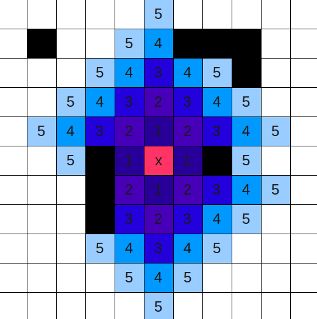
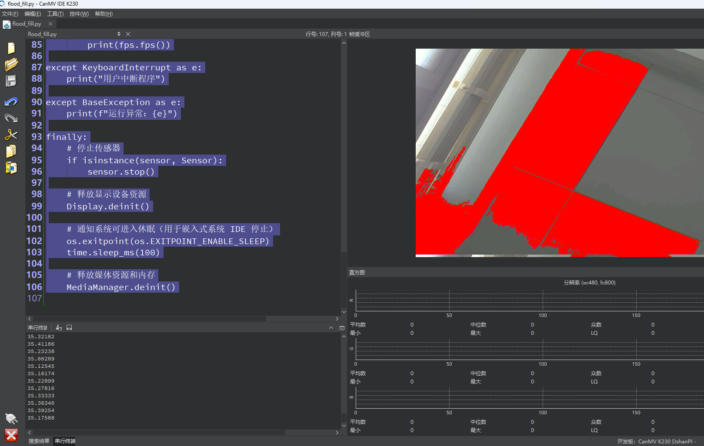

# 洪水填充区域

## 1.实验目的

学习图像的洪水填充区域。

## 2.实验原理

**洪水填充（Flood Fill）** 是图像处理中的一种区域生长算法，用来从一个“种子像素”开始，逐步扩展选中与其颜色相似的相邻像素，从而形成一个“颜色一致的区域”。这个操作非常像你在画图工具中用“油漆桶”点击某个区域时看到的效果。

### 2.1 填充目标

从一个种子点 `(x, y)` 开始：

- 判断该点的颜色与周围像素的颜色是否在允许的“相似度”范围内；
- 若满足相似性条件，则将该像素填充为目标颜色；
- 并继续检查该像素的邻居（上下左右或8个方向）；
- 递归或迭代地完成整个区域填充。



### 2.2 核心原理

**1.起始条件**

- 给定一张图像 `img`
- 给定起始种子点 `(x, y)`
- 提供颜色相似性的阈值（如 `seed_threshold` 和 `floating_threshold`）

**2.颜色相似性判断**

判断某个像素 `P` 是否应该被填充，需满足以下两个条件：

- 与 **种子点** 的颜色差异 < `seed_threshold`
- 与 **已填充区域中相邻像素** 的颜色差异 < `floating_threshold`

颜色差异常用欧氏距离公式计算：

```
diff = sqrt((R1-R2)^2 + (G1-G2)^2 + (B1-B2)^2) / 255.0
```

**3.区域扩展方式**

使用 **递归** 或 **队列（广度优先）** 方式，向上下左右（或8邻域）方向扩展：

```
   ↑
← (x, y) →
   ↓
```

只要新像素满足颜色相似性，就继续往外扩展。


## 3.代码解析

### 导入模块

```
import time, os, gc, sys
from media.sensor import *
from media.display import *
from media.media import *
```

导入系统相关模块：

- `time`：用于计时（如帧率统计）。
- `os`：包含控制IDE退出点的接口。
- `gc`：垃圾回收模块，手动释放内存。
- `sys`：与系统交互，但在此代码中暂未使用。

导入 CanMV 平台的三个核心模块：

- `sensor`：图像采集传感器接口。
- `display`：图像显示接口。
- `media`：媒体管理器，处理缓冲区分配与释放。

### 初始化传感器对象

```
DETECT_WIDTH = 800
DETECT_HEIGHT = 480
sensor = None
```

定义图像分辨率常量（采集图像和显示图像使用同一尺寸）。

初始化传感器对象为 `None`，以便后续统一管理其资源释放。

### 创建传感器对象

```
    sensor = Sensor(width=DETECT_WIDTH, height=DETECT_HEIGHT)
```

创建传感器对象，指定图像宽度与高度。实际会打开 `/dev/video0` 设备并尝试匹配输入源。

```
    sensor.reset()
```

硬件级重置传感器（软复位），以确保进入已知状态。

```
    sensor.set_framesize(width=DETECT_WIDTH, height=DETECT_HEIGHT)
```

设置传感器图像输出的大小（这里与显示分辨率一致）。

```
    sensor.set_pixformat(Sensor.RGB565)
```

设置图像格式为 RGB565（每像素16位，比RGB888更省内存）。

### 初始化显示屏对象

```
    Display.init(Display.ST7701, to_ide=True)
```

初始化 MIPI 显示屏（ST7701 驱动）。`to_ide=True` 表示图像也会同步显示到 IDE（方便调试）。

### 初始化媒体管理

```
    MediaManager.init()
```

管理图像缓冲区与内部共享内存。

### 启动摄像头

```
    sensor.run()
```

启动摄像头进行图像采集。

```
    fps = time.clock()
```

创建 FPS（帧率）统计对象，用于计算图像处理速度。

### 捕获一帧图像

```
        img = sensor.snapshot()
```

从摄像头捕获一帧图像（返回一个图像对象）。

```
        x = img.width() // 2
        y = img.height() // 2
```

计算图像中心点 `(x, y)`，用于作为泛洪填充的起始种子点。

### 进行泛洪填充

```
        img.flood_fill(
            x, y,
            seed_threshold=0.05,
            floating_thresholds=0.05,
            color=(255, 0, 0),
            invert=False,
            clear_background=False
        )
```

对图像中心区域进行泛洪填充：

- `seed_threshold=0.05`：判断种子点与像素是否相似的阈值（越小越严格）。
- `floating_thresholds=0.05`：判断相邻像素是否属于同一填充区域。
- `color=(255, 0, 0)`：填充颜色（红色）。
- `invert=False`：正常填充；若为True则填充颜色不相似区域。
- `clear_background=False`：保留背景像素不变。

### 显示到屏幕

```
        Display.show_image(img)
```

将当前帧图像显示到屏幕。

### 垃圾回收

```
        gc.collect()
```

执行垃圾回收，避免嵌入式设备出现内存泄露或碎片。

### 异常捕获

```
except KeyboardInterrupt as e:
    print("用户中断程序")
```

按 Ctrl+C 退出程序时捕获。

```
except BaseException as e:
    print(f"运行异常：{e}")
```

捕获所有其他异常，打印错误信息。

### 停止采集

```
    if isinstance(sensor, Sensor):
        sensor.stop()
```

如果传感器对象存在，则停止采集。

```
    Display.deinit()
```

### 资源释放

关闭显示设备，释放资源。

```
    os.exitpoint(os.EXITPOINT_ENABLE_SLEEP)
    time.sleep_ms(100)
```

通知 IDE 程序已完成，系统可进入休眠状态。

```
    MediaManager.deinit()
```

关闭媒体缓冲区系统，释放图像内存。

## 4.示例代码

```
'''
本程序遵循GPL V3协议, 请遵循协议
实验平台: DshanPI CanMV
开发板文档站点	: https://eai.100ask.net/
百问网学习平台   : https://www.100ask.net
百问网官方B站    : https://space.bilibili.com/275908810
百问网官方淘宝   : https://100ask.taobao.com
'''
import time, os, gc, sys

from media.sensor import *
from media.display import *
from media.media import *

# 设置摄像头和图像处理的分辨率
DETECT_WIDTH = 800
DETECT_HEIGHT = 480

sensor = None

try:
    # 创建一个 Sensor 对象，使用默认配置，分辨率为 800x480
    sensor = Sensor(width=DETECT_WIDTH, height=DETECT_HEIGHT)

    # 重置传感器硬件（重新初始化）
    sensor.reset()

    # 如有需要可以打开水平翻转或垂直翻转（默认注释掉）
    # sensor.set_hmirror(False)
    # sensor.set_vflip(False)

    # 设置通道0输出图像的分辨率
    sensor.set_framesize(width=DETECT_WIDTH, height=DETECT_HEIGHT)

    # 设置图像格式为 RGB565（比 RGB888 更节省内存和带宽）
    sensor.set_pixformat(Sensor.RGB565)

    # 使用 LCD 屏作为图像输出（ST7701 是常见的 MIPI 屏控制器）
    Display.init(Display.ST7701, to_ide=True)

    # 也可以选择其他显示方式（例如 HDMI 或 虚拟显示），示例中注释掉了：
    # 使用 HDMI 显示，分辨率为 640x480 VGA：
    # Display.init(Display.LT9611, width=640, height=480, to_ide=True)
    # 使用 HDMI 显示，分辨率为 1920x1080 1080P：
    # Display.init(Display.LT9611, width=1920, height=1080, to_ide=True)
    # 使用 IDE 虚拟显示器：
    # Display.init(Display.VIRT, width=DETECT_WIDTH, height=DETECT_HEIGHT, fps=100)

    # 初始化媒体缓冲管理器（内部用于图像传输和管理内存池）
    MediaManager.init()

    # 启动摄像头图像采集
    sensor.run()

    # 创建 FPS 统计对象
    fps = time.clock()

    while True:
        fps.tick()

        # 检查 IDE 是否发送退出命令
        os.exitpoint()

        # 捕获当前帧图像
        img = sensor.snapshot()

        # 设置泛洪填充的种子点坐标（图像中心）
        x = img.width() // 2
        y = img.height() // 2

        # 对种子点周围颜色相近区域进行填充：
        # - seed_threshold: 控制种子点颜色与周围像素的容差（0~1之间，越小越严格）
        # - floating_thresholds: 控制连通区域像素之间的容差
        # - color: 填充的颜色 (红色)
        # - invert: 是否对颜色条件取反（False 表示正常填充）
        # - clear_background: 是否将背景区域清除为黑色（False 表示保留）
        img.flood_fill(
            x, y,
            seed_threshold=0.05,
            floating_thresholds=0.05,
            color=(255, 0, 0),
            invert=False,
            clear_background=False
        )

        # 显示填充后的图像
        Display.show_image(img)

        # 主动释放垃圾回收资源（防止内存碎片或溢出）
        gc.collect()

        # 打印当前帧率（FPS）
        print(fps.fps())

except KeyboardInterrupt as e:
    print("用户中断程序")

except BaseException as e:
    print(f"运行异常：{e}")

finally:
    # 停止传感器
    if isinstance(sensor, Sensor):
        sensor.stop()

    # 释放显示设备资源
    Display.deinit()

    # 通知系统可进入休眠（用于嵌入式系统 IDE 停止）
    os.exitpoint(os.EXITPOINT_ENABLE_SLEEP)
    time.sleep_ms(100)

    # 释放媒体资源和内存
    MediaManager.deinit()
```


## 5.实验结果

​	点击运行后，可以在显示屏上看到红色的洪水填充。

