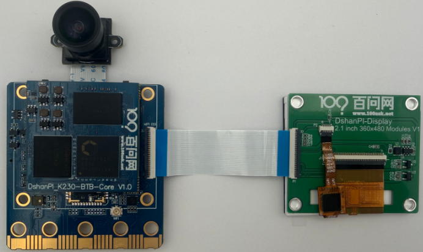

# 图像显示

## 1.学习目的

学习如何在显示屏上显示图像。

## 2.实验硬件

K230 平台集成了一路 MIPI-DSI 接口（4-lane），可用于驱动 MIPI 屏幕，或通过外接转换芯片连接 HDMI 显示器。此外，平台还提供虚拟显示（`VIRT`）输出选项，便于用户在无实体屏幕的情况下，通过 CanMV-IDE 进行图像预览和调试操作。

在多种显示方式中，使用 IDE 的帧缓冲区进行虚拟显示是一种成本最低、配置简便的方案。该模式通过 USB 与 PC 传输图像数据，适用于调试和开发阶段的可视化需求。需要注意的是，由于受限于 USB 带宽，其帧率和图像质量难以同时兼顾，但在基本使用场景中依然足够稳定和实用。

对于实际部署或便携式项目开发，推荐使用 MIPI 接口外接 3.1 英寸 MIPI 屏幕（分辨率 800×480）。该方案不仅安装简便（可直接通过铜柱与开发板固定连接），且支持将脚本保存在 TF 卡中，实现离线运行。该显示模式支持实时画面预览和交互，适合移动端或嵌入式项目中独立运行。

另外，MIPI 接口还可搭配 MIPI 转 HDMI 扩展板，连接常见的 HDMI 显示器。该方案支持最高 1080p 分辨率，显示效果优异，是家庭或实验室场景下的理想选择。相较于虚拟显示与小尺寸屏幕，该方案在成本与体验之间实现良好平衡。


## 3.实验原理

K230 平台支持多种显示输出方案，便于用户在不同应用场景下灵活选用。其 MicroPython 框架通过 `Display` 模块进行统一抽象，底层由驱动程序调用系统 framebuffer 或控制器寄存器进行图像输出。主要支持以下三种方式：VIRT、LT9611、ST7701、AML020T。

`VIRT` 虚拟显示器：

- 使用 `Display.init(Display.VIRT, ...)` 初始化虚拟显示。
- 图像输出不经过真实物理屏幕，而是通过 USB 数据传输至 PC。
- CanMV-IDE 接收到帧缓冲区数据后，在界面中实时渲染显示。
- 实际上使用了一个位于系统内存中的**虚拟帧缓冲区**，类似 `/dev/fb0`。

`AML020T` 控制器（MIPI 显示屏）

- `AML020T` 是常用的小尺寸 TFT-LCD 显示屏控制器，通常用于驱动 2.4 寸 MIPI 显示屏（如 480×360）。
- K230 的 MIPI-DSI 接口直接输出图像数据至 AML020T 屏幕，无需中间转换。
- 使用 `Display.init(Display.AML020T, ...)` 进行初始化配置。

## 4.显示文本代码解析

### 导入模块

```python
import time, os, urandom, sys
from media.display import *
from media.media import *
```

- **`time`**：提供延时函数（如 `sleep`、`sleep_ms`）。
- **`os`**：用于退出点管理（`exitpoint()`），支持安全中断程序。
- **`urandom`**：生成随机数，用于随机位置、颜色、字体大小。
- **`sys`**：用于打印异常信息。
- **`media.display`**：显示模块，提供 LCD、HDMI、虚拟显示等输出接口。
- **`media.media`**：媒体管理器，负责内存池和缓冲区管理。

---

### 常量定义

```python
DISPLAY_WIDTH = 480    # 显示屏宽度（像素）
DISPLAY_HEIGHT = 360   # 显示屏高度（像素）
```

- 定义显示分辨率宽 `480` 像素、高 `360` 像素，与使用的 LCD 屏幕参数匹配。

---

### 显示测试函数

```python
def display_test():
    """显示测试主函数：在屏幕上随机位置绘制彩色文本"""
```

- 封装测试逻辑，便于主程序调用。

#### 打印启动信息

```python
print("显示测试开始")
```

- 在串口终端输出提示，标识程序已启动。

#### 创建图像对象

```python
img = image.Image(DISPLAY_WIDTH, DISPLAY_HEIGHT, image.ARGB8888)
```

- 创建一个空图像，尺寸为 `480x360`，色彩格式为 `ARGB8888`（32位真彩色，支持透明通道）。
- 此图像将作为画布，后续在其上绘制文字。

#### 初始化显示输出

```python
Display.init(Display.AML020T, width=DISPLAY_WIDTH, height=DISPLAY_HEIGHT, to_ide=True)
```

- 初始化 LCD 显示屏，指定驱动型号为 `AML020T`。
- 设置显示分辨率为 `480x360`。
- `to_ide=True`：将图像同时输出到 IDE 的预览窗口（若使用 CanMV IDE）。

#### 初始化媒体管理器

```python
MediaManager.init()
```

- 初始化多媒体底层资源（如 DMA 缓冲区、显示内存池），必须在使用显示功能前调用。

---

### 主循环：随机绘制彩色文字

```python
try:
    while True:
        img.clear()
        for i in range(10):
            x = (urandom.getrandbits(11) % img.width())
            y = (urandom.getrandbits(11) % img.height())
            r = (urandom.getrandbits(8))
            g = (urandom.getrandbits(8))
            b = (urandom.getrandbits(8))
            size = (urandom.getrandbits(30) % 64) + 32
            img.draw_string_advanced(x, y, size, "Hello World!，你好世界！！！", color=(r, g, b))
        Display.show_image(img)
        time.sleep(1)
        os.exitpoint()
```

- **清空图像**：`img.clear()` 将画布填充为黑色，避免上一帧残留。
- **随机绘制 10 行文字**：
  - `x, y`：随机坐标（使用 11 位随机数取模宽/高，范围 0~宽-1/高-1）。
  - `r, g, b`：随机颜色分量（0~255），实现彩色文字。
  - `size`：随机字体大小（32~95 像素）。
  - `draw_string_advanced`：绘制字符串，支持中英文混合和旋转，此处不旋转。
- **显示图像**：`Display.show_image(img)` 将画布内容刷新到 LCD 屏幕。
- **延时 1 秒**：控制刷新频率，避免画面闪烁过快。
- **检查退出点**：`os.exitpoint()` 允许通过 Ctrl+C 或其他方式安全退出循环。

---

### 异常捕获与资源释放

```python
except KeyboardInterrupt as e:
    print("用户中断: ", e)
except BaseException as e:
    import sys
    sys.print_exception(e)
```

- **`KeyboardInterrupt`**：捕获用户按 Ctrl+C 产生的退出信号，打印友好信息。
- **`BaseException`**：捕获其他所有异常（包括系统异常），打印完整错误栈，便于调试。

```python
Display.deinit()
os.exitpoint(os.EXITPOINT_ENABLE_SLEEP)
time.sleep_ms(100)
MediaManager.deinit()
```

- **释放显示资源**：`Display.deinit()` 关闭显示设备，释放相关引脚和内存。
- **重新使能退出点睡眠模式**：允许系统在空闲时进入低功耗。
- **短暂延时**：确保资源释放操作完成。
- **释放媒体管理器**：`MediaManager.deinit()` 清理媒体缓冲区，恢复系统状态。

---

### 程序入口

```python
if __name__ == "__main__":
    os.exitpoint(os.EXITPOINT_ENABLE)   # 使能退出点检查
    display_test()
```

- **使能退出点检查**：允许在循环中使用 `os.exitpoint()` 安全退出。
- **调用测试函数**：执行显示测试主逻辑。

## 5.显示文本示例代码

```
'''
  Copyright (C) 2008-2023 深圳百问网科技有限公司
  All rights reserved

 免责声明: 百问网编写的程序, 用于商业用途请遵循GPL许可, 百问网不承担任何后果！

 本程序遵循GPL V3协议, 请遵循协议
 百问网学习平台   : https://www.100ask.net
 百问网交流社区   : https://forums.100ask.net
 百问网官方B站    : https://space.bilibili.com/275908810
 本程序所用开发板 : DshanPI-CanMV开发板
 开发板文档站点	 ： https://eai.100ask.net/
 百问网官方淘宝   : https://100ask.taobao.com
 联系我们(E-mail) : weidongshan@100ask.net
'''
import time, os, urandom, sys

from media.display import *
from media.media import *

DISPLAY_WIDTH = 480    # 显示屏宽度（像素）
DISPLAY_HEIGHT = 360   # 显示屏高度（像素）

def display_test():
    """显示测试主函数：在屏幕上随机位置绘制彩色文本"""
    print("显示测试开始")

    # 创建一张用于绘图的图像，格式为 ARGB8888
    img = image.Image(DISPLAY_WIDTH, DISPLAY_HEIGHT, image.ARGB8888)

    # 初始化 LCD 显示屏作为输出设备，并允许同时将图像输出到 IDE
    Display.init(Display.AML020T, width=DISPLAY_WIDTH, height=DISPLAY_HEIGHT, to_ide=True)
    # 初始化多媒体管理器
    MediaManager.init()

    try:
        while True:
            # 清空图像（填充黑色）
            img.clear()
            # 随机绘制 10 行文字
            for i in range(10):
                x = (urandom.getrandbits(11) % img.width())      # 随机 X 坐标
                y = (urandom.getrandbits(11) % img.height())     # 随机 Y 坐标
                r = (urandom.getrandbits(8))                     # 红色分量 (0-255)
                g = (urandom.getrandbits(8))                     # 绿色分量
                b = (urandom.getrandbits(8))                     # 蓝色分量
                size = (urandom.getrandbits(30) % 64) + 32       # 字体大小 (32~95)

                # 在随机位置绘制指定文本，支持中英文混合，颜色随机
                img.draw_string_advanced(x, y, size, "Hello World!，你好世界！！！", color=(r, g, b))

            # 将绘制好的图像显示到屏幕上
            Display.show_image(img)

            time.sleep(1)          # 每秒更新一次画面
            os.exitpoint()         # 检查退出标志（支持 Ctrl+C 或程序退出）
    except KeyboardInterrupt as e:
        print("用户中断: ", e)
    except BaseException as e:
        import sys
        sys.print_exception(e)

    # 释放显示资源
    Display.deinit()
    os.exitpoint(os.EXITPOINT_ENABLE_SLEEP)
    time.sleep_ms(100)
    # 释放多媒体缓冲区
    MediaManager.deinit()

if __name__ == "__main__":
    os.exitpoint(os.EXITPOINT_ENABLE)   # 使能退出点检查
    display_test()
```

实验效果：

在显示屏上会显示如下画面：


## 6.显示摄像头画面代码解析

### 导入模块

```
import time, os, sys
from media.sensor import *
from media.display import *
from media.media import *
```

 **导入系统模块**，用于延时 (`time`)、退出点管理 (`os.exitpoint()`)、标准输入输出处理等。

**导入 K230 MicroPython 的三个核心模块**：

- `sensor`: 摄像头传感器接口（如图像采集、通道设置等）
- `display`: 显示模块接口（支持 VIRT、HDMI、MIPI 等输出）
- `media`: 媒体管理器（用于内存池、缓冲区管理）

### 创建摄像头对象

```
sensor = None
try:
    print("camera_test")
    sensor = Sensor()
```

定义一个全局变量 `sensor`，用于后续保存传感器对象，方便在 `finally` 语句中进行释放。

开始 `try...except` 异常捕获结构，防止运行中断导致资源未释放；同时输出测试开始标志。

创建一个摄像头 `Sensor` 对象，默认使用CSI2。

### 重置摄像头配置

```
	sensor.reset()
```

**初始化并重置摄像头配置**（类似软复位），恢复为默认状态。

### 设置摄像头属性

```
	sensor.set_framesize(width=800,height=480)
```

 设置摄像头输出图像的分辨率为 `800x480`。也可用 `Sensor.FHD` 表示 1920x1080。

- 默认是设置在通道 0（`CAM_CHN_ID_0`）。

```
    sensor.set_pixformat(Sensor.YUV420SP)
```

设置图像的像素格式为 YUV420SP（半平面格式，适合视频渲染）。

### 绑定输入输出

```
    bind_info = sensor.bind_info()
    Display.bind_layer(**bind_info, layer = Display.LAYER_VIDEO1)
```

 获取摄像头图像通道的绑定信息，并将其绑定到 **显示器的视频图层1** 上。

意味着摄像头采集的图像会自动显示在这个图层上，无需手动调用 `Display.show_image()`。

###  初始化显示器

```
	Display.init(Display.AML020T, width = 480, height = 360, to_ide=True)
```

- 当前启用了 **AML020TMIPI 显示屏（2寸 480x360）**。
- 参数 `to_ide=True` 表示图像也会同步发送到 IDE 虚拟显示（方便调试）。
- 若使用虚拟显示，可启用上面的注释行 `Display.VIRT`。

### 启动摄像头

```
    sensor.run()
```

 启动摄像头传感器的工作，正式开始图像采集。

### 监听退出指令

```
    while True:
        os.exitpoint()
```

主循环中什么也没做，只保留了一个 `exitpoint()`。

- IDE会通过这个接口监听退出指令，从而实现安全停止。
- 图像的显示是自动进行的（通过前面绑定的图层），不需手动刷新。

```
except KeyboardInterrupt as e:
    print("user stop: ", e)
```

捕捉用户按下 Ctrl+C 或 IDE 中点击“停止”按钮的中断行为。

```
except BaseException as e:
    print(f"Exception {e}")
```

 捕捉所有其它类型的异常（如驱动错误、显示初始化失败等）。

### 停止摄像头采集

```
finally:
    if isinstance(sensor, Sensor):
        sensor.stop()
```

确保程序结束时 **停止摄像头采集**，释放硬件资源。

### 注销显示模块

```
    Display.deinit()
```

注销显示模块，关闭所有图层输出。

### 退出点通知 IDE

```
    os.exitpoint(os.EXITPOINT_ENABLE_SLEEP)
    time.sleep_ms(100)
```

 退出点通知 IDE，接下来可以进入休眠或退出。

- `time.sleep_ms(100)` 短暂延时，确保数据完全写出。

### 释放媒体资源

```
    MediaManager.deinit()
```

最后释放媒体资源（如图像缓冲区、DMA 通道等）。

## 6.显示摄像头画面示例代码

MIPI屏显示：

```
'''
本程序遵循GPL V3协议, 请遵循协议
实验平台: DshanPI CanMV
开发板文档站点	: https://eai.100ask.net/
百问网学习平台   : https://www.100ask.net
百问网官方B站    : https://space.bilibili.com/275908810
百问网官方淘宝   : https://100ask.taobao.com
'''
import time, os, sys

from media.sensor import *
from media.display import *
from media.media import *

sensor = None

try:
    print("camera_test")

    # construct a Sensor object with default configure
    sensor = Sensor()
    # sensor reset
    sensor.reset()
    # set hmirror
    # sensor.set_hmirror(False)
    # sensor vflip
    # sensor.set_vflip(False)

    # set chn0 output size, 480x360
    sensor.set_framesize(width=480,height=352)
    # set chn0 output format
    sensor.set_pixformat(Sensor.YUV420SP)
    # bind sensor chn0 to display layer video 1
    bind_info = sensor.bind_info()
    Display.bind_layer(**bind_info, layer = Display.LAYER_VIDEO1)

    # use lcd as display output
    Display.init(Display.AML020T, width = 480, height = 360, to_ide=True)
    # init media manager
    MediaManager.init()
    # sensor start run
    sensor.run()

    while True:
        os.exitpoint()
except KeyboardInterrupt as e:
    print("user stop: ", e)
except BaseException as e:
    print(f"Exception {e}")
finally:
    # sensor stop run
    if isinstance(sensor, Sensor):
        sensor.stop()
    # deinit display
    Display.deinit()
    os.exitpoint(os.EXITPOINT_ENABLE_SLEEP)
    time.sleep_ms(100)
    # release media buffer
    MediaManager.deinit()
```


## 6.实验结果

### 6.1 MIPI屏显示

​	上电前在请提前使用排线连接MIPI屏至开发板。



​	上电点击运行代码后，在MIPI屏处可以实时预览摄像头的画面。


