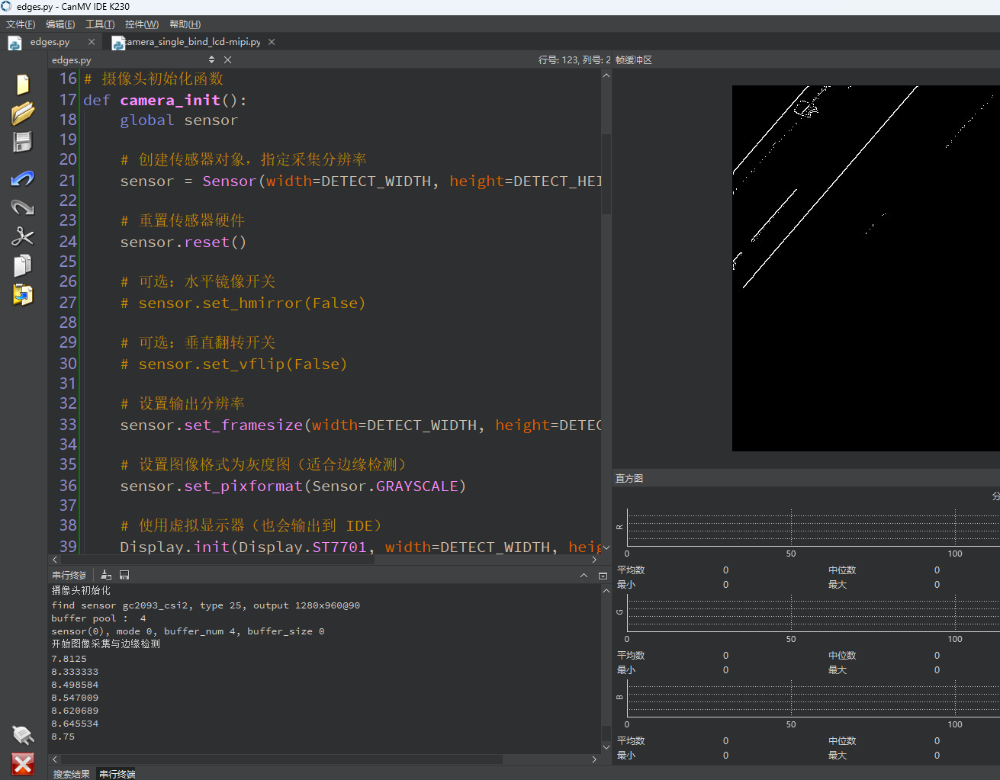

# 边缘检测

## 1.实验目的

实现K230对图像进行Canny边缘检测。

## 2.实验原理

### 2.1 原理解析

​	Canny 边缘检测是一种经典的图像处理算法，用于检测图像中的“边缘”，即像素值变化明显的区域。它是由 **John F. Canny** 在 1986 年提出的，至今仍是最广泛使用的边缘检测算法之一。

**Canny 边缘检测的五个步骤**

1. 高斯滤波（Gaussian Filter）——平滑图像去噪

- **目的**：去除图像中的噪声，以避免检测出伪边缘。
- **方法**：使用高斯核对图像进行卷积（模糊处理），相当于对图像“柔化”。
- **示意图**：原图像 → 平滑模糊图像。

> 噪声越小，边缘检测越准确；否则噪声也会被误认为是边缘。

------

2. 计算图像梯度（Sobel 算子）——提取边缘强度和方向

- **目的**：检测图像中像素值的急剧变化区域（即边缘）。

- **方法**：

  - 使用 Sobel 算子分别计算 **水平方向 Gx** 和 **垂直方向 Gy** 的灰度变化。

  - 计算每个像素的梯度幅度（强度）：
    $$
    G = \sqrt{G_x^2 + G_y^2}
    $$
    
  - 计算梯度方向（边缘的方向）：
    $$
    \theta = \arctan\left(\frac{G_y}{G_x}\right)
    $$
    

------

3. 非极大值抑制（NMS）——细化边缘

- **目的**：保留边缘的中心像素，去除边缘上的非最大值，使边缘线更细、更准确。
- **方法**：
  - 沿着梯度方向检查像素是否为局部最大值。
  - 如果不是局部最大值，则将该像素设为 0。

> 举例：一个边缘是粗的白线，非极大值抑制后只保留中间那一列像素点，形成清晰细线。

------

4. 双阈值检测（Hysteresis Thresholding）——筛选强边缘和弱边缘

- **目的**：区分“真正的边缘”、“可能的边缘”和“非边缘”。
- **方法**：
  - 设置两个阈值：高阈值 `T_high` 和低阈值 `T_low`。
  - **强边缘**：梯度值 > 高阈值 → 保留；
  - **弱边缘**：梯度值在 `T_low ~ T_high` 之间 → 保留，但只有当它与强边缘相连时；
  - **非边缘**：梯度值 < 低阈值 → 丢弃。

------

5. 边缘连接（Edge Tracking by Hysteresis）——保持边缘连续性

- **目的**：连接弱边缘与强边缘，使边缘线不间断。
- **方法**：
  - 追踪所有强边缘；
  - 如果一个弱边缘像素与强边缘连接，则认为它也是有效边缘；
  - 否则将其丢弃。

### 2.2 API

```
image.find_edges(edge_type[, threshold])
```

将图像变为黑白，仅将边缘保留为白色像素。

image.EDGE_SIMPLE - 简单的阈值高通滤波算法 image.EDGE_CANNY - Canny边缘检测算法 threshold 是一个包含一个低阈值和一个高阈值的二值元组。您可以通过调整该值来控制边缘质量。

默认为 (100, 200)。

仅支持灰度图像。

## 3.代码解析

### 摄像头初始化函数

```
def camera_init():
```

定义摄像头初始化函数。

```
    global sensor
```

声明使用全局变量 `sensor`。

```
    sensor = Sensor(width=DETECT_WIDTH, height=DETECT_HEIGHT)
```

创建一个 `Sensor` 对象，分辨率为 `800x480`，开始进行视频采集准备。

```
    sensor.reset()
```

重置传感器硬件（相当于重启摄像头，清空内部状态）。

```
    sensor.set_framesize(width=DETECT_WIDTH, height=DETECT_HEIGHT)
```

设置通道 0 的图像尺寸。

```
    sensor.set_pixformat(Sensor.GRAYSCALE)
```

设置图像格式为灰度图（Canny 算子适用于单通道图像）。

### 初始化虚拟显示器

```
Display.init(Display.ST7701, width=DETECT_WIDTH, height=DETECT_HEIGHT, fps=60, to_ide=True)
```

初始化虚拟显示器（ST7701 模式），支持在 IDE 显示图像；

设置分辨率、帧率（60 FPS）；

`to_ide=True` 表示同时输出到 IDE 中。

### 初始化媒体资源管理器

```
    MediaManager.init()
```

初始化媒体资源管理器（底层分配缓存区，支持 DMA 等）。

### 启动摄像头

```
    sensor.run()
```

- 启动摄像头采集。

### 摄像头资源释放函数

```
def camera_deinit():
	global sensor
	sensor.stop()
```

停止摄像头采集。

```
    Display.deinit()
```

关闭显示输出设备。

```
    os.exitpoint(os.EXITPOINT_ENABLE_SLEEP)
```

通知 IDE 当前模块可以进入休眠状态。

```
    MediaManager.deinit()
```

释放媒体资源池（避免内存泄漏或冲突）。

### 图像采集与处理主循环

```
        dect_img = sensor.snapshot()
```

- 采集一帧灰度图像，保存在 `dect_img` 中。

```
        dect_img.find_edges(image.EDGE_CANNY, threshold=(50, 80))
```

使用 Canny 算法对图像进行边缘检测。

- `50` 是低阈值，`80` 是高阈值；
- 输出的图像中仅保留边缘线条。

```
        Display.show_image(dect_img)
```

将处理后的图像发送到 IDE 或虚拟屏幕显示。

```
        del dect_img
        gc.collect()
```

删除图像对象，手动触发垃圾回收，释放内存。


## 4.示例代码

```
'''
本程序遵循GPL V3协议, 请遵循协议
实验平台: DshanPI CanMV
开发板文档站点	: https://eai.100ask.net/
百问网学习平台   : https://www.100ask.net
百问网官方B站    : https://space.bilibili.com/275908810
百问网官方淘宝   : https://100ask.taobao.com
'''
import time, os, gc, sys

from media.sensor import *
from media.display import *
from media.media import *

# 设置图像采集和处理的分辨率（宽度按16对齐）
DETECT_WIDTH = ALIGN_UP(800, 16)
DETECT_HEIGHT = 480

sensor = None

# 摄像头初始化函数
def camera_init():
    global sensor

    # 创建传感器对象，指定采集分辨率
    sensor = Sensor(width=DETECT_WIDTH, height=DETECT_HEIGHT)

    # 重置传感器硬件
    sensor.reset()

    # 可选：水平镜像开关
    # sensor.set_hmirror(False)

    # 可选：垂直翻转开关
    # sensor.set_vflip(False)

    # 设置输出分辨率
    sensor.set_framesize(width=DETECT_WIDTH, height=DETECT_HEIGHT)

    # 设置图像格式为灰度图（适合边缘检测）
    sensor.set_pixformat(Sensor.GRAYSCALE)

    # 使用虚拟显示器（也会输出到 IDE）
    Display.init(Display.ST7701, width=DETECT_WIDTH, height=DETECT_HEIGHT, fps=60, to_ide=True)

    # 初始化媒体缓冲池管理器
    MediaManager.init()

    # 启动图像采集
    sensor.run()

# 摄像头释放函数
def camera_deinit():
    global sensor

    # 停止图像采集
    sensor.stop()

    # 释放显示设备
    Display.deinit()

    # 通知 IDE 可以进入休眠状态
    os.exitpoint(os.EXITPOINT_ENABLE_SLEEP)
    time.sleep_ms(100)

    # 释放媒体缓冲区资源
    MediaManager.deinit()

# 图像采集和处理主循环
def capture_picture():
    # 创建 FPS 计时器对象
    fps = time.clock()

    while True:
        fps.tick()

        try:
            # IDE 控制点检查，支持在 IDE 中点击停止运行
            os.exitpoint()

            global sensor

            # 获取一帧图像（灰度图）
            dect_img = sensor.snapshot()

            # 使用 Canny 算法进行边缘检测
            dect_img.find_edges(image.EDGE_CANNY, threshold=(50, 80))

            # 可选：使用简单边缘检测算法（效率更高，效果略差）
            # dect_img.find_edges(image.EDGE_SIMPLE, threshold=(100, 255))

            # 将结果图像显示到 IDE 或屏幕上
            Display.show_image(dect_img)

            # 释放图像对象，便于垃圾回收
            del dect_img
            gc.collect()

            # 打印当前帧率
            print(fps.fps())

        except KeyboardInterrupt as e:
            print("用户中断运行：", e)
            break
        except BaseException as e:
            print(f"运行异常：{e}")
            break

# 主程序入口
def main():
    # 启用 IDE 控制点（允许 IDE 退出控制）
    os.exitpoint(os.EXITPOINT_ENABLE)

    camera_is_init = False

    try:
        print("摄像头初始化")
        camera_init()
        camera_is_init = True

        print("开始图像采集与边缘检测")
        capture_picture()

    except Exception as e:
        print(f"主程序异常：{e}")

    finally:
        # 程序退出前释放资源
        if camera_is_init:
            print("摄像头资源释放")
            camera_deinit()

# 如果是主模块运行，则调用 main()
if __name__ == "__main__":
    main()
```


## 5.实验结果

​	点击运行代码后，可以在显示屏上看到边缘检测的结果。

