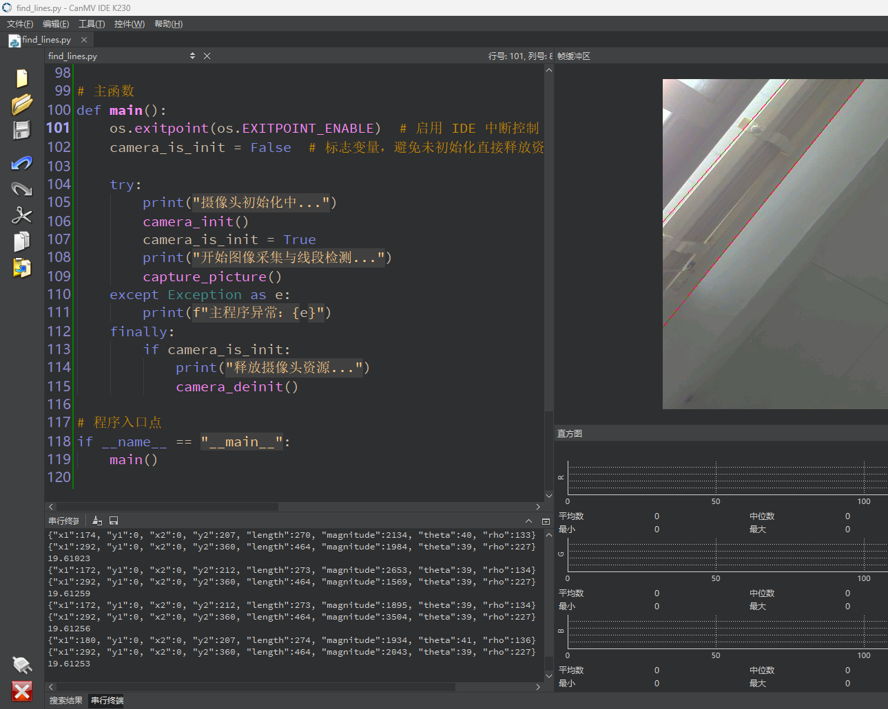

# 线段检测

## 1.实验目的

实现K230对图像中的线段进行检测。

## 2.实验原理

### 2.1 原理解析

线段检测的核心原理是 **Hough变换（Hough Transform）**。它是一种经典的图像处理算法，广泛用于检测图像中的几何形状（如直线、圆、椭圆等）。

一般我们使用斜截式 `y = kx + b` 表示直线，但当直线是垂直时 `k=∞`，不便处理。

因此在 Hough 变换中，我们改用 **极坐标表示法**：

```
cpp


复制编辑
ρ = x * cos(θ) + y * sin(θ)
```

其中：

- `ρ`：直线到图像原点的距离（距离）
- `θ`：直线与水平线的夹角（角度）

**Hough 变换核心思想**

可以理解为一个投票机制：

1. **边缘检测**
    首先用边缘检测算法（如 Sobel、Canny）提取图像中的边缘点。

2. **每个边缘点投票所有可能的直线**
    对于图像中的每个边缘点 `(x, y)`，我们可以计算它对应于一系列直线（每个不同的 `θ`），然后用公式求出对应的 `ρ`。

   每对 `(θ, ρ)` 表示一条直线。

3. **累加器统计**
    在二维空间（θ-ρ）中，每个边缘点都对它可能属于的直线投票（即在累加器中 `acc[θ][ρ] += 1`）。

4. **找峰值**
    累加器中投票数较高的点（局部极大值）表示图像中存在对应 `θ` 和 `ρ` 的直线。

------

**合并与滤除**

Hough 检测可能会检测出多个很相似的直线，因此：

- `theta_margin` 和 `rho_margin` 控制**相似直线的合并**
- `threshold` 是投票数阈值，用于滤除弱边缘产生的“伪线条”

### 2.2 API

`find_lines` 函数用于在图像中检测直线。该函数适用于寻找图像中的长直线。

- 语法

```
lines = img.find_lines(threshold=1000, theta_margin=20, rho_margin=20)
```


- 参数解释

  - threshold: 直线的最小长度。检测到的直线必须超过这个长度。默认值是 `1000`。
  - theta_margin: 角度的容忍度。单位是度。默认值是 `20`。
  - rho_margin: 距离的容忍度。单位是像素。默认值是 `20`。

- 返回值

  返回一个包含直线信息的列表。每条直线是一个 `Line` 对象，包含了直线的起点、终点、长度和角度。


## 3.代码解析

### 采集一张图片

```
img = sensor.snapshot()
```

 从摄像头采集一帧图像，格式为 RGB565（即每个像素占用16位数据，包含红绿蓝三色通道）。`img` 对象包含了采集的图像数据。

###  直线检测

```
for l in img.find_lines(threshold=1000, theta_margin=25, rho_margin=25):
```

`img.find_lines(...)` 使用 Hough 变换进行直线检测，返回一个包含所有检测到的直线的对象列表。

- `threshold=1000`：控制检测的灵敏度，较小的值会检测更多细小线条，而较大的值会排除弱边缘线。
- `theta_margin=25, rho_margin=25`：用于合并相似直线。如果两条直线的 `theta` 和 `rho` 值之间的差异小于设定的容差（`theta_margin` 和 `rho_margin`），那么这两条线会被合并为一条。

### 角度过滤与绘制线段

```
if (min_degree <= l.theta()) and (l.theta() <= max_degree):  # 角度过滤
    img.draw_line([v for v in l.line()], color=(255, 0, 0))  # 绘制红色直线
    print(l)  # 打印直线参数信息（theta、rho、坐标等）
```

`l.theta()` 返回直线相对于水平线的角度（单位为度）。`min_degree` 和 `max_degree` 定义了有效直线的角度范围。只有在角度范围内的直线才会被绘制。

`img.draw_line(...)` 在图像上绘制直线。直线的坐标通过 `l.line()` 获得，该方法返回直线的两个端点的坐标。

- `color=(255, 0, 0)`：绘制红色的直线。

`print(l)` 打印当前直线的参数（例如：角度、距离和端点坐标等），用于调试和查看检测到的直线信息。

### 显示图像

```
Display.show_image(img)  # 将结果图像显示在 IDE 中
img = None  # 释放图像引用
```

`Display.show_image(img)` 将处理后的图像显示在 IDE 中，便于用户查看检测结果。

`img = None` 释放图像引用，帮助避免内存泄漏或不必要的内存占用。


## 4.示例代码

```
'''
本程序遵循GPL V3协议, 请遵循协议
实验平台: DshanPI CanMV
开发板文档站点	: https://eai.100ask.net/
百问网学习平台   : https://www.100ask.net
百问网官方B站    : https://space.bilibili.com/275908810
百问网官方淘宝   : https://100ask.taobao.com
'''

import time, os, gc, sys

from media.sensor import *
from media.display import *
from media.media import *

# 设置图像采集的分辨率（宽度向上对齐到16的倍数，兼容底层硬件）
DETECT_WIDTH = ALIGN_UP(800, 16)
DETECT_HEIGHT = 480

# 设置角度过滤范围（只检测角度在该范围内的直线）
min_degree = 0
max_degree = 179

# 所有 line 对象都提供以下方法：
# - `theta()`：获取该直线相对于水平线的角度（单位：度）
# - `x1(), y1(), x2(), y2()`：获取直线的两个端点坐标
# - `line()`：返回 [x1, y1, x2, y2] 形式的元组，用于绘图

# 关于负 rho 值的说明：
# 如果一条线的表示是 [theta+0, -rho]，等价于 [theta+180, +rho]

sensor = None  # 全局摄像头对象

# 摄像头初始化函数
def camera_init():
    global sensor

    # 创建 Sensor 对象，设置图像分辨率
    sensor = Sensor(width=DETECT_WIDTH, height=DETECT_HEIGHT)
    sensor.reset()  # 复位传感器

    # 如有需要可以开启水平/垂直镜像
    # sensor.set_hmirror(False)
    # sensor.set_vflip(False)

    sensor.set_framesize(width=DETECT_WIDTH, height=DETECT_HEIGHT)  # 设置输出分辨率
    sensor.set_pixformat(Sensor.RGB565)  # 设置图像格式为 RGB565 彩图
    Display.init(Display.ST7701, width=DETECT_WIDTH, height=DETECT_HEIGHT, fps=60, to_ide=True)  # 初始化虚拟显示（IDE 输出）
    MediaManager.init()  # 初始化媒体资源管理器
    sensor.run()  # 启动摄像头采集

# 摄像头资源释放函数
def camera_deinit():
    global sensor
    sensor.stop()  # 停止采集
    Display.deinit()  # 释放显示设备
    os.exitpoint(os.EXITPOINT_ENABLE_SLEEP)  # IDE 模式休眠标记
    time.sleep_ms(100)  # 延时确保退出稳定
    MediaManager.deinit()  # 释放媒体资源（缓存池）

# 图像采集与线段检测主循环
def capture_picture():
    fps = time.clock()  # 用于帧率统计

    while True:
        fps.tick()  # 本帧开始计时

        try:
            os.exitpoint()  # IDE 中断控制支持
            global sensor
            img = sensor.snapshot()  # 采集一帧图像（RGB565 彩图）

            # 开始进行直线检测，返回 line 对象列表
            # 参数说明：
            # - threshold：阈值，决定哪些直线被认为是“有效直线”
            #   较小的阈值将检测更多细小线条，较大的值可排除弱边缘线
            # - theta_margin/rho_margin：控制相似直线合并容差，单位分别为角度/像素

            for l in img.find_lines(threshold=1000, theta_margin=25, rho_margin=25):
                if (min_degree <= l.theta()) and (l.theta() <= max_degree):  # 角度过滤
                    img.draw_line([v for v in l.line()], color=(255, 0, 0))  # 绘制红色直线
                    print(l)  # 打印直线参数信息（theta、rho、坐标等）

            Display.show_image(img)  # 将结果图像显示在 IDE 中
            img = None  # 释放图像引用

            gc.collect()  # 执行垃圾回收，避免内存堆积
            print(fps.fps())  # 输出当前帧率
        except KeyboardInterrupt as e:
            print("用户中断运行：", e)
            break
        except BaseException as e:
            print(f"运行异常：{e}")
            break

# 主函数
def main():
    os.exitpoint(os.EXITPOINT_ENABLE)  # 启用 IDE 中断控制
    camera_is_init = False  # 标志变量，避免未初始化直接释放资源

    try:
        print("摄像头初始化中...")
        camera_init()
        camera_is_init = True
        print("开始图像采集与线段检测...")
        capture_picture()
    except Exception as e:
        print(f"主程序异常：{e}")
    finally:
        if camera_is_init:
            print("释放摄像头资源...")
            camera_deinit()

# 程序入口点
if __name__ == "__main__":
    main()
```


## 5.实验结果

​	点击运行代码后，可以在显示屏上看到直线检测的结果。

