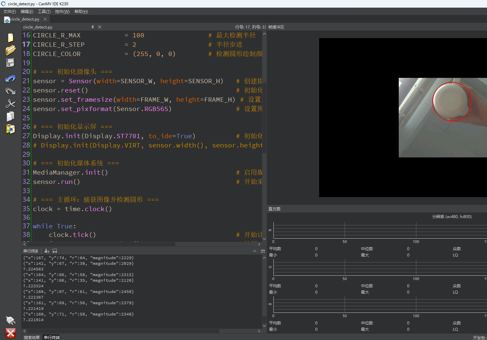

# 圆形检测

## 1.实验目的

实现K230对图像中的圆形进行检测。

## 2.实验原理

### 2.1 原理解析

圆形检测通常是通过 **霍夫圆变换（Hough Circle Transform）** 来实现的，它是经典霍夫变换（用于直线检测）的扩展，适用于检测图像中的圆形。

霍夫圆变换的目标是：
 从图像中**找出边缘像素点**，然后**反推出可能的圆心和半径**，将它们投票累加，找到得票最多的那组 (a,b,r)即为检测到的圆。

**步骤如下：**

1. **边缘检测**（如使用 Canny 算子）
    提取出图像中潜在的边缘像素（这些点可能在圆的边缘上）。

2. **投票累加（Hough 累加器）**
    对于每一个边缘点 (x,y)，枚举可能的半径 r，并根据圆方程计算可能的圆心 (a,b)：
   $$
   a = x - r \cdot \cos(\theta), \quad b = y - r \cdot \sin(\theta)
   $$
   所有可能的 (a,b,r) 在三维空间中投票。

3. **寻找局部最大值**
    累加器中投票值最高的点，就是图像中存在圆形的概率最大的地方。

### 2.2 API

```
image.find_circles([roi[, x_stride=2[, y_stride=1[, threshold=2000[, x_margin=10[, y_margin=10[, r_margin=10]]]]]]])
```

使用霍夫变换在图像中查找圆。返回一个 image.circle 对象列表（见上）。

roi 是一个用以复制的矩形的感兴趣区域(x, y, w, h)。如果未指定， ROI 即图像矩形。操作范围仅限于roi区域内的像素。

x_stride 是霍夫变换时需要跳过的x像素的数量。若已知圆较大，可增加 x_stride 。

y_stride 是霍夫变换时需要跳过的y像素的数量。若已知圆较大，可增加 y_stride 。

threshold 控制从霍夫变换中监测到的圆。只返回大于或等于 threshold 的圆。 应用程序的正确的 threshold 值取决于图像。注意：一个圆的大小(magnitude)是组成圆所有索贝尔滤波像素大小的总和。

x_margin 控制所检测的圆的合并。 圆像素为 x_margin 、 y_margin 和 r_margin 的部分合并。

y_margin 控制所检测的圆的合并。 圆像素为 x_margin 、 y_margin 和 r_margin 的部分合并。

r_margin 控制所检测的圆的合并。 圆像素为 x_margin 、 y_margin 和 r_margin 的部分合并。

不支持压缩图像和bayer图像。


## 3.代码解析

### 创建摄像头对象

```
sensor = Sensor(width=1280, height=960) #构建摄像头对象，将摄像头长宽设置为4:3
```

创建一个摄像头对象，设置最大采集分辨率为 1280x960（内部图像缓存大小）。

### 复位摄像头

```
sensor.reset() #复位和初始化摄像头
```

 对摄像头进行复位操作（清除上一次配置，确保状态干净）。

### 设置摄像头属性

```
sensor.set_framesize(width=320, height=240) #设置帧大小，默认通道0
```

设置摄像头实际输出图像的大小（为节省资源，缩小分辨率）。

```
sensor.set_pixformat(Sensor.RGB565)
```

设置图像像素格式为 RGB565（每个像素占 2 字节），适合嵌入式处理和显示。

### 初始化显示屏

```
Display.init(Display.ST7701, to_ide=True) #同时使用3.5寸mipi屏和IDE缓冲区显示图像，800x480分辨率
```

初始化 ST7701 LCD 显示屏，分辨率为 800x480，支持在 IDE 中查看图像（调试方便）。

### 初始化媒体系统

```
MediaManager.init() #初始化media资源管理器
```

初始化媒体系统（分配摄像头等硬件资源），必须调用一次。

### 启动摄像头

```
sensor.run() #启动sensor
```

启动摄像头，开始捕捉图像帧。

### 获取一帧图像

```
    img = sensor.snapshot() #拍摄一张图片
```

从摄像头拍一帧图像，得到图像对象 `img`，用于后续处理。

### 获取圆形对象

```
    for c in img.find_circles(threshold = 2000, x_margin = 10, y_margin= 10,
                              r_margin = 10,r_min = 2, r_max = 100, r_step = 2):
```

在图像中寻找圆形对象，满足：

- 亮度对比度达到 `threshold`；
- 合并相似圆（xy、半径差值小于 margin）；
- 只检测半径为 2~100 的圆，每 2 像素步进检测一次。

### 绘制圆形

```
        img.draw_circle(c.x(), c.y(), c.r(), color = (255, 0, 0),thickness=2)
```

在图像上绘制检测到的圆，颜色为红色，线宽 2 像素。

### 图像显示

```
    #显示图片，仅用于LCD居中方式显示
    Display.show_image(img, x=round((800-sensor.width())/2),y=round((480-sensor.height())/2))
```

把图像显示到 LCD 屏幕上，并居中显示。LCD 分辨率为 800x480，图像大小为 320x240。

## 4.示例代码

```
'''
本程序遵循GPL V3协议, 请遵循协议
实验平台: DshanPI CanMV
开发板文档站点	: https://eai.100ask.net/
百问网学习平台   : https://www.100ask.net
百问网官方B站    : https://space.bilibili.com/275908810
百问网官方淘宝   : https://100ask.taobao.com
'''
import time, os, sys

from media.sensor import *    # 摄像头相关接口
from media.display import *   # 显示屏相关接口
from media.media import *     # 多媒体资源管理接口

# === 配置参数 ===
SENSOR_W, SENSOR_H     = 1280, 960          # 摄像头采集分辨率（原始）
FRAME_W, FRAME_H       = 320, 240           # 实际输出帧大小
LCD_W, LCD_H           = 800, 480           # LCD 屏幕分辨率
CIRCLE_THRESHOLD       = 2000               # 圆检测强度阈值，越高圆越少但更准确
CIRCLE_X_MARGIN        = 10                 # 圆心 X 坐标合并容差
CIRCLE_Y_MARGIN        = 10                 # 圆心 Y 坐标合并容差
CIRCLE_R_MARGIN        = 10                 # 半径合并容差
CIRCLE_R_MIN           = 2                  # 最小检测半径
CIRCLE_R_MAX           = 100                # 最大检测半径
CIRCLE_R_STEP          = 2                  # 半径步进
CIRCLE_COLOR           = (255, 0, 0)        # 检测圆形绘制颜色（红色）

# === 初始化摄像头 ===
sensor = Sensor(width=SENSOR_W, height=SENSOR_H)   # 创建摄像头对象
sensor.reset()                                     # 初始化摄像头
sensor.set_framesize(width=FRAME_W, height=FRAME_H) # 设置图像帧尺寸
sensor.set_pixformat(Sensor.RGB565)                # 设置图像格式为 RGB565

# === 初始化显示屏 ===
Display.init(Display.ST7701, to_ide=True)          # 初始化 MIPI LCD 和 IDE 显示输出
# Display.init(Display.VIRT, sensor.width(), sensor.height()) # 仅使用 IDE 显示输出（调试用）

# === 初始化媒体系统 ===
MediaManager.init()                                # 启用媒体管理器
sensor.run()                                       # 开始采集图像

# === 主循环：捕获图像并检测圆形 ===
clock = time.clock()

while True:
    clock.tick()                                   # 开始计时（用于FPS计算）
    img = sensor.snapshot()                        # 拍摄一帧图像

    # 在图像中检测圆形
    circles = img.find_circles(
        threshold=CIRCLE_THRESHOLD,
        x_margin=CIRCLE_X_MARGIN,
        y_margin=CIRCLE_Y_MARGIN,
        r_margin=CIRCLE_R_MARGIN,
        r_min=CIRCLE_R_MIN,
        r_max=CIRCLE_R_MAX,
        r_step=CIRCLE_R_STEP
    )

    # 遍历检测到的所有圆
    for c in circles:
        img.draw_circle(c.x(), c.y(), c.r(), color=CIRCLE_COLOR, thickness=2)  # 绘制圆
        print(c)  # 输出圆的参数（圆心坐标、半径、强度）

    # 居中显示图像
    Display.show_image(
        img,
        x=round((LCD_W - sensor.width()) / 2),
        y=round((LCD_H - sensor.height()) / 2)
    )

    print(clock.fps())  # 打印每秒帧率
```


## 5.实验结果

 	点击运行代码后可以在显示屏上实时显示检测到的圆形。

