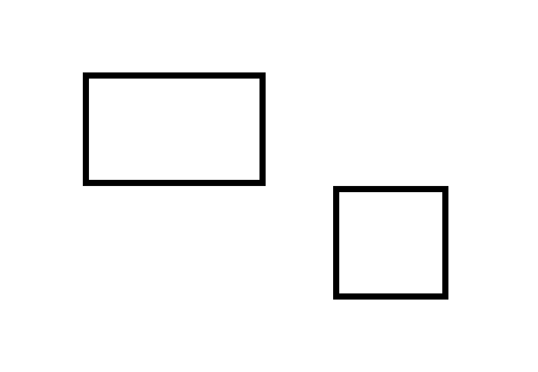
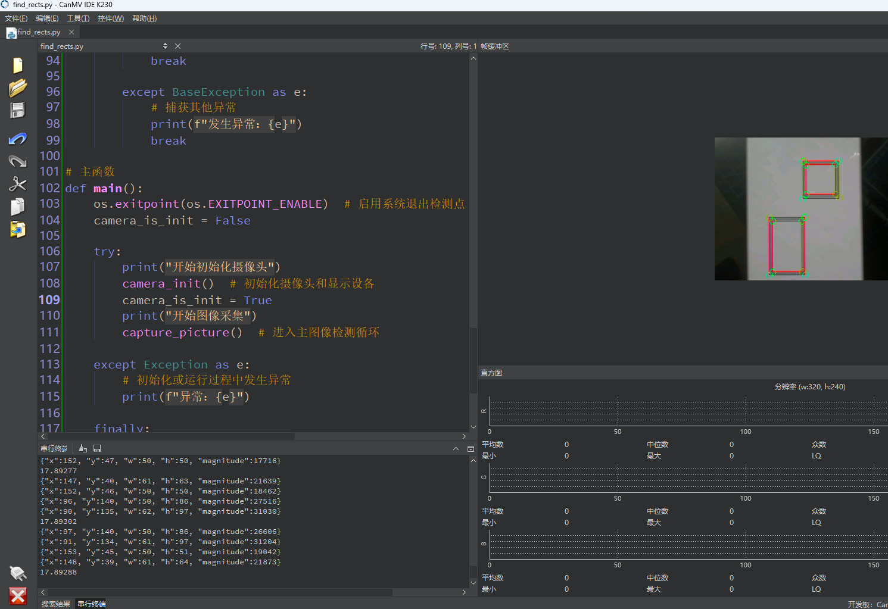

# 矩形检测

## 1.实验目的

实现K230对图像中的矩形进行检测。

## 2.实验原理

### 2.1 原理解析

矩形检测在图像处理任务中具有重要作用，常用于条码或二维码的预定位步骤。通过先快速检测图像中的矩形区域，可以缩小后续解码的搜索范围，从而显著提升整体处理速度。

此外，矩形检测也是 OCR（光学字符识别）流程中的关键预处理手段之一，可用于定位文档中的文字块或段落区域，辅助后续文字识别。

CanMV 固件中的 `find_rects()` 函数基于类似于 AprilTag 四边形检测算法的实现，具备较强的鲁棒性。它不仅能够应对常规矩形，还能适应一定程度的平移、旋转甚至仿射变形（例如图像扭曲或倾斜），在实际应用中具有较高的准确性与稳定性。

### 2.2 API

`find_rects` 函数用于检测图像中的矩形区域。这个函数可以用于找到图像中的方形或矩形物体。

- 语法

```
rects = img.find_rects(threshold=2000, margin=10)
```

- 参数解释

  - threshold: 矩形的最小面积。默认值是 `2000`。
  - margin: 矩形检测的边距容忍度。默认值是 `10`。

- 返回值

  返回一个包含矩形信息的列表。每个矩形是一个 `Rect` 对象，包含矩形的坐标和大小。

## 3.代码解析

###  捕获一帧图像

```
            img = sensor.snapshot()
```

### 查找矩形

```
            for r in img.find_rects(threshold=10000):
```

查找图像中的矩形区域：

- `threshold=10000` 用于过滤掉弱边缘、小矩形；
- 较高的阈值意味着只保留对比度高、面积大的矩形。

### 绘制矩形

```
                img.draw_rectangle([v for v in r.rect()], color=(255, 0, 0))
```

绘制红色矩形边框（外接矩形）。

### 绘制圆点

```
                for p in r.corners():
                    img.draw_circle(p[0], p[1], 5, color=(0, 255, 0))
```

绘制绿色圆点，表示矩形的四个角点。

### 图像显示屏幕

```
            Display.show_image(img, x=round((800-sensor.width())/2), y=round((480-sensor.height())/2))
```


## 4.示例代码

```
'''
本程序遵循GPL V3协议, 请遵循协议
实验平台: DshanPI CanMV
开发板文档站点	: https://eai.100ask.net/
百问网学习平台   : https://www.100ask.net
百问网官方B站    : https://space.bilibili.com/275908810
百问网官方淘宝   : https://100ask.taobao.com
'''
import time, os, gc, sys

from media.sensor import *  # 导入摄像头相关接口
from media.display import * # 导入图像显示相关接口
from media.media import *   # 导入媒体资源管理相关接口

# 设置检测图像的宽度（16字节对齐）和高度
DETECT_WIDTH = ALIGN_UP(320, 16)
DETECT_HEIGHT = 240

sensor = None  # 定义全局摄像头对象变量

# 摄像头初始化函数
def camera_init():
    global sensor

    # 创建摄像头对象，设置图像采集尺寸
    sensor = Sensor(width=DETECT_WIDTH, height=DETECT_HEIGHT)

    # 复位摄像头（清空旧配置）
    sensor.reset()

    # 可以设置图像镜像或翻转，默认注释掉（根据需要打开）
    # sensor.set_hmirror(False)
    # sensor.set_vflip(False)

    # 设置摄像头输出图像尺寸和格式（RGB565）
    sensor.set_framesize(width=DETECT_WIDTH, height=DETECT_HEIGHT)
    sensor.set_pixformat(Sensor.RGB565)

    # 初始化虚拟显示器（IDE窗口可视），设置分辨率和帧率
    Display.init(Display.ST7701, fps=100, to_ide=True)

    # 初始化媒体管理器，分配 sensor 资源
    MediaManager.init()

    # 启动摄像头采集图像
    sensor.run()

# 摄像头资源释放函数
def camera_deinit():
    global sensor

    # 停止摄像头
    sensor.stop()

    # 释放显示设备资源
    Display.deinit()

    # 允许系统进入休眠点
    os.exitpoint(os.EXITPOINT_ENABLE_SLEEP)

    # 等待硬件处理完成
    time.sleep_ms(100)

    # 释放媒体资源
    MediaManager.deinit()

# 图像采集并进行矩形检测
def capture_picture():
    fps = time.clock()  # 创建帧率计时器
    while True:
        fps.tick()  # 开始新一帧的计时
        try:
            os.exitpoint()  # 检查是否收到中断或系统退出请求

            global sensor
            img = sensor.snapshot()  # 拍摄一张图像帧

            # threshold 值用于过滤边缘模糊、对比度低的小矩形；
            # 阈值越大，只会保留边缘对比更强、面积更大的矩形
            for r in img.find_rects(threshold=10000):
                # 绘制红色矩形框（四个顶点的外接矩形）
                img.draw_rectangle([v for v in r.rect()], color=(255, 0, 0))

                # 绘制绿色圆圈标出四个角点位置
                for p in r.corners():
                    img.draw_circle(p[0], p[1], 5, color=(0, 255, 0))

                # 打印矩形的参数信息（中心点、大小、角度等）
                print(r)

            # 在显示屏或 IDE 中显示图像
            Display.show_image(img, x=round((800-sensor.width())/2),y=round((480-sensor.height())/2))

            img = None  # 释放图像内存

            gc.collect()  # 手动触发垃圾回收，释放内存
            print(fps.fps())  # 打印当前帧率

        except KeyboardInterrupt as e:
            # 用户主动终止程序
            print("用户中止程序：", e)
            break

        except BaseException as e:
            # 捕获其他异常
            print(f"发生异常：{e}")
            break

# 主函数
def main():
    os.exitpoint(os.EXITPOINT_ENABLE)  # 启用系统退出检测点
    camera_is_init = False

    try:
        print("开始初始化摄像头")
        camera_init()  # 初始化摄像头和显示设备
        camera_is_init = True
        print("开始图像采集")
        capture_picture()  # 进入主图像检测循环

    except Exception as e:
        # 初始化或运行过程中发生异常
        print(f"异常：{e}")

    finally:
        # 程序退出前释放资源
        if camera_is_init:
            print("释放摄像头资源")
            camera_deinit()

# 如果当前文件作为主程序运行，执行 main 函数
if __name__ == "__main__":
    main()
```


## 5.实验结果



​	点击运行后可以在显示屏显示检测到的矩形

