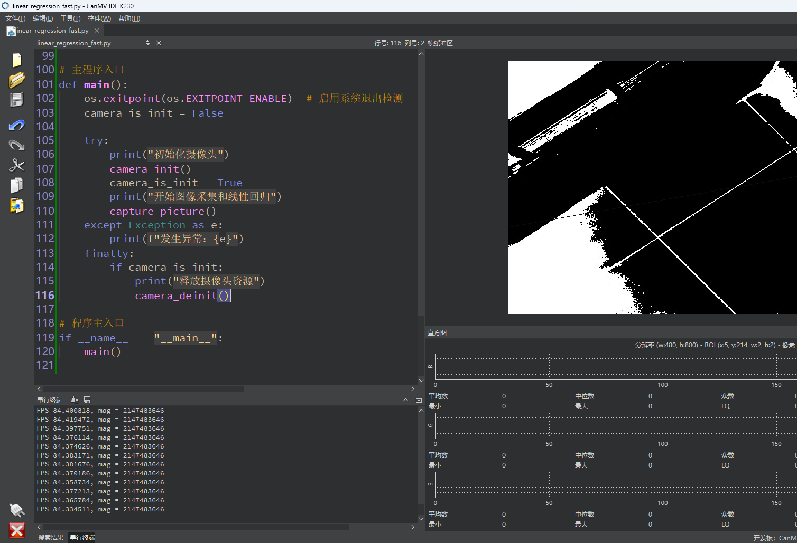

# 快速线性回归

## 1.实验目的

实现K230对图像中的直线进行线性回归。


## 2.实验原理

### 2.1 原理解析

快速线性回归的原理是基于**最小二乘法（Least Squares Method）**，其核心思想是：

> 在一组二维平面点中，寻找一条**直线** y=ax+by = ax + by=ax+b，使所有点到该直线的“垂直距离的平方和”最小。

这种方法在图像处理中也很常用，比如在 CanMV 中的 `get_regression()`，它会在图像上的**非零像素点**集合中，寻找一条最优拟合直线。

在图像上，我们对**所有非零像素**（或满足阈值的像素）的位置 (x,y)(x, y)(x,y) 执行最小二乘法，即：

- 把每个符合条件的像素看作一个点；
- 然后对这些点拟合出一条最佳线性模型；
- 结果中返回的是线段坐标、斜率角度 θ、极坐标形式 rho、以及**拟合质量指标** `magnitude`。


### 2.2 API

`get_regression` 函数用于从图像中检测回归线，即拟合数据点的直线。通常用于标记数据的趋势或方向。

- 语法

```
line = img.get_regression(threshold=1000, min_length=10, max_distance=5)
```

- 参数解释

  - threshold:直线的最小长度。默认值是 `1000`。
  - min_length: 拟合线的最小长度。默认值是 `10`。
  - max_distance: 允许的数据点到回归线的最大距离。默认值是 `5`。

- 返回值

  返回一个包含回归线信息的 `Line` 对象，表示拟合的直线。


## 3.代码解析

### 获取当前图像帧

```
            img = sensor.snapshot()
```

### 进行二值化

```
            if BINARY_VISIBLE:
                img = img.binary([THRESHOLD])
```

### 线性回归检测

```
            line = img.get_regression([(255, 255)] if BINARY_VISIBLE else [THRESHOLD])
```

### 绘制灰色直线

```
            if line:
                img.draw_line(line.line(), color=127)
```

### 显示图像结果

```
          Display.show_image(img)
```


## 4.示例代码

```
'''
本程序遵循GPL V3协议, 请遵循协议
实验平台: DshanPI CanMV
开发板文档站点	: https://eai.100ask.net/
百问网学习平台   : https://www.100ask.net
百问网官方B站    : https://space.bilibili.com/275908810
百问网官方淘宝   : https://100ask.taobao.com
'''
import time, os, gc, sys

from media.sensor import *   # 摄像头接口
from media.display import *  # 图像显示接口
from media.media import *    # 媒体资源管理接口

# 设置检测图像尺寸（必须16字节对齐）
DETECT_WIDTH = ALIGN_UP(800, 16)
DETECT_HEIGHT = 480

# 设置灰度图像二值化的阈值范围（识别暗色区域）
THRESHOLD = (0, 100)

# 是否显示二值图像（便于观察回归线检测依据）
BINARY_VISIBLE = True

sensor = None  # 摄像头对象（全局变量）

# 摄像头初始化函数
def camera_init():
    global sensor

    # 创建摄像头对象，并设置图像尺寸
    sensor = Sensor(width=DETECT_WIDTH, height=DETECT_HEIGHT)
    sensor.reset()  # 复位摄像头配置

    # 可选配置：图像镜像和翻转（根据实际安装方向）
    # sensor.set_hmirror(False)
    # sensor.set_vflip(False)

    # 设置摄像头输出图像格式和尺寸
    sensor.set_framesize(width=DETECT_WIDTH, height=DETECT_HEIGHT)
    sensor.set_pixformat(Sensor.GRAYSCALE)  # 设置图像格式为灰度图

    # 使用虚拟显示器（例如IDE窗口）进行图像显示
    Display.init(Display.ST7701, width=DETECT_WIDTH, height=DETECT_HEIGHT, fps=100, to_ide=True)

    # 初始化媒体管理器，处理图像资源
    MediaManager.init()

    # 启动摄像头
    sensor.run()

# 摄像头资源释放函数
def camera_deinit():
    global sensor

    sensor.stop()  # 停止摄像头图像采集
    Display.deinit()  # 关闭显示器
    os.exitpoint(os.EXITPOINT_ENABLE_SLEEP)  # 允许系统进入休眠点
    time.sleep_ms(100)  # 等待硬件处理完成
    MediaManager.deinit()  # 释放媒体资源

# 图像采集与线性回归检测
def capture_picture():
    fps = time.clock()  # 初始化帧率计时器

    while True:
        fps.tick()  # 每帧开始计时

        try:
            os.exitpoint()  # 检查系统是否请求退出

            global sensor
            img = sensor.snapshot()  # 获取当前图像帧

            # 根据阈值进行二值化（便于线性回归识别）
            if BINARY_VISIBLE:
                img = img.binary([THRESHOLD])

            # 执行线性回归检测（返回一条最佳拟合的线段）
            # 返回对象具有 x1/y1, x2/y2（线段两端点坐标），theta/rho（极坐标形式），length(), magnitude() 等方法
            # magnitude() 表示回归线拟合的好坏，值越大越准确
            line = img.get_regression([(255, 255)] if BINARY_VISIBLE else [THRESHOLD])

            # 若存在有效线段，则绘制在图像上
            if line:
                img.draw_line(line.line(), color=127)  # 绘制灰色直线

            # 打印帧率和线性拟合质量（magnitude）
            print("FPS %f, mag = %s" % (fps.fps(), str(line.magnitude()) if line else "N/A"))

            # 在 IDE 或屏幕上显示图像结果
            Display.show_image(img)

            # 删除图像，手动回收内存
            del img
            gc.collect()

        except KeyboardInterrupt as e:
            # 用户主动中断程序
            print("用户中止程序：", e)
            break

        except BaseException as e:
            # 捕获其他异常
            print(f"发生异常：{e}")
            break

# 主程序入口
def main():
    os.exitpoint(os.EXITPOINT_ENABLE)  # 启用系统退出检测
    camera_is_init = False

    try:
        print("初始化摄像头")
        camera_init()
        camera_is_init = True
        print("开始图像采集和线性回归")
        capture_picture()
    except Exception as e:
        print(f"发生异常：{e}")
    finally:
        if camera_is_init:
            print("释放摄像头资源")
            camera_deinit()

# 程序主入口
if __name__ == "__main__":
    main()
```


## 5.实验结果

​	点击运行代码后，可以在显示屏上看到快速线性回归的结果。



