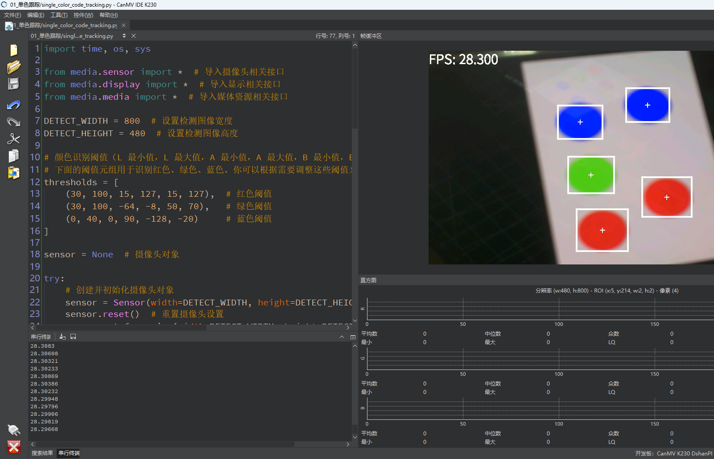

# 单一颜色识别

## 1.实验目的

学习K230识别图片中指定的颜色。

## 2.实验原理

对图像的每个像素进行判断：是否满足某个颜色范围（阈值）——满足的就认为是目标颜色。

```
blobs = img.find_blobs([thresholds], area_threshold=area_threshold, pixels_threshold=pixels_threshold, merge=True, margin=0)
```

**参数解释**

- thresholds: 这是一个包含颜色范围的列表，用于定义要查找的斑点的颜色范围。通常是一个包含两个或三个元素的元组。例如，`(100, 200, -64, 127, -128, 127)` 表示 HSV 颜色空间中的范围，其中第一个和第二个值是 Hue，第三和第四值是 Saturation，最后两个值是 Value。
- area_threshold: 斑点的面积阈值。只有面积大于这个值的斑点才会被返回。默认值是 0。
- pixels_threshold: 斑点的像素数阈值。只有包含的像素数大于这个值的斑点才会被返回。默认值是 0。
- merge: 是否合并相邻的斑点。设为 `True` 时，相邻的斑点会被合并成一个大斑点；设为 `False` 时，斑点不会合并。默认值是 `True`。
- margin: 用于合并斑点时的边距。设置为一个正整数，表示合并斑点时的最大距离。默认值是 0。

**返回值**

`find_blobs` 函数返回一个包含斑点信息的列表。每个斑点都是一个 `Blob` 对象，通常包含以下属性：

- `cx` 和 `cy`：斑点的中心坐标。
- `x` 和 `y`：斑点的左上角坐标。
- `w` 和 `h`：斑点的宽度和高度。
- `area`：斑点的面积（像素数）。

## 3.代码解析

### 颜色阈值定义

```
thresholds = [
    (30, 100, 15, 127, 15, 127),  # 红色
    (30, 100, -64, -8, 50, 70),   # 绿色
    (0, 40, 0, 90, -128, -20)     # 蓝色
]
```

定义颜色识别的阈值，格式是 Lab 颜色空间下的 `(L_min, L_max, A_min, A_max, B_min, B_max)`。

每个元组代表一个颜色范围，`find_blobs()` 会用来提取图像中满足这个范围的区域（blob）。

### 摄像头初始化

```
sensor = Sensor(width=DETECT_WIDTH, height=DETECT_HEIGHT)
sensor.reset()
sensor.set_framesize(width=DETECT_WIDTH, height=DETECT_HEIGHT)
sensor.set_pixformat(Sensor.RGB565)
```

- 实例化摄像头对象，指定输出分辨率；
- `reset()`：重置摄像头，加载默认配置；
- `set_framesize()`：设置输出图像分辨率；
- `set_pixformat()`：设置输出格式为 RGB565（适合显示和处理）。

### 显示设备初始化

```
Display.init(Display.ST7701, to_ide=True)
```

初始化 LCD 显示屏（使用 ST7701 驱动），同时也输出到 IDE 缓冲区，方便调试。

```
MediaManager.init()
```

初始化媒体资源管理器，处理图像缓存、内存池等底层资源。

### 启动图像采集

```
sensor.run()
```

### 获取当前图像帧

```
    img = sensor.snapshot()
```

### 查找颜色

```
    blobs = img.find_blobs([thresholds[0], thresholds[1], thresholds[2]])
    #blobs = img.find_blobs([thresholds[0]]) #检测红色
    #blobs = img.find_blobs([thresholds[1]]) #检测绿色
    #blobs = img.find_blobs([thresholds[2]]) #检测蓝色
```

查找图像中**红绿蓝**三种颜色的 blob（色块区域）；

你也可以通过注释/取消注释只识别一种颜色。

```
    if blobs:
        for b in blobs:
            img.draw_rectangle(b[0:4], thickness=4)
            img.draw_cross(b[5], b[6], thickness=2)
```

如果找到了 blob，就绘制矩形框和中心十字标记；

`b[0:4]` 是矩形的 `x, y, w, h`；

`b[5], b[6]` 是 blob 的中心坐标 `cx, cy`。

### 显示结果

```
 Display.show_image(img)
```

将图像绘制到 LCD 屏幕上。

## 4.示例代码

```
'''
本程序遵循GPL V3协议, 请遵循协议
实验平台: DshanPI CanMV
开发板文档站点	: https://eai.100ask.net/
百问网学习平台   : https://www.100ask.net
百问网官方B站    : https://space.bilibili.com/275908810
百问网官方淘宝   : https://100ask.taobao.com
'''
import time, os, sys

from media.sensor import *  # 导入摄像头相关接口
from media.display import *  # 导入显示相关接口
from media.media import *  # 导入媒体资源相关接口

DETECT_WIDTH = 800  # 设置检测图像宽度
DETECT_HEIGHT = 480  # 设置检测图像高度

# 颜色识别阈值（L 最小值，L 最大值，A 最小值，A 最大值，B 最小值，B 最大值）
# 下面的阈值元组用于识别红色、绿色、蓝色。你可以根据需要调整这些阈值来改善识别效果。
thresholds = [
    (30, 100, 15, 127, 15, 127),  # 红色阈值
    (30, 100, -64, -8, 50, 70),   # 绿色阈值
    (0, 40, 0, 90, -128, -20)     # 蓝色阈值
]

sensor = None  # 摄像头对象

try:
    # 创建并初始化摄像头对象
    sensor = Sensor(width=DETECT_WIDTH, height=DETECT_HEIGHT)
    sensor.reset()  # 重置摄像头设置
    sensor.set_framesize(width=DETECT_WIDTH, height=DETECT_HEIGHT)  # 设置帧大小
    sensor.set_pixformat(Sensor.RGB565)  # 设置图像格式为 RGB565

    # 初始化显示设备，使用 LCD 显示器
    Display.init(Display.ST7701, to_ide=True)

    # 初始化媒体资源管理器
    MediaManager.init()

    # 启动摄像头采集
    sensor.run()

    # 初始化帧率计时器
    clock = time.clock()

    while True:
        clock.tick()  # 每帧开始时计时

        # 获取当前图像帧
        img = sensor.snapshot()

        # 查找符合颜色阈值的 blobs，分别检测红色、绿色和蓝色
        blobs = img.find_blobs([thresholds[0], thresholds[1], thresholds[2]])
		#blobs = img.find_blobs([thresholds[0]]) #检测红色
		#blobs = img.find_blobs([thresholds[1]]) #检测绿色
		#blobs = img.find_blobs([thresholds[2]]) #检测蓝色
		
        # 如果检测到 blobs，绘制矩形和交叉线标记
        if blobs:
            for b in blobs:
                img.draw_rectangle(b[0:4], thickness=4)  # 绘制矩形框
                img.draw_cross(b[5], b[6], thickness=2)  # 绘制交叉线标记

        # 在图像左上角显示 FPS
        img.draw_string_advanced(0, 0, 30, 'FPS: ' + str("%.3f" % (clock.fps())), color=(255, 255, 255))

        # 显示图像到屏幕
        Display.show_image(img)

        # 打印当前 FPS
        print(clock.fps())

except KeyboardInterrupt as e:
    print(f"用户停止")
except BaseException as e:
    print(f"异常发生：'{e}'")
finally:
    # 停止摄像头采集
    if isinstance(sensor, Sensor):
        sensor.stop()

    # 关闭显示
    Display.deinit()

    # 释放媒体资源
    MediaManager.deinit()

```


## 5.实验结果

​	点击运行代码后，可以在显示屏上看到检测到的色块。

