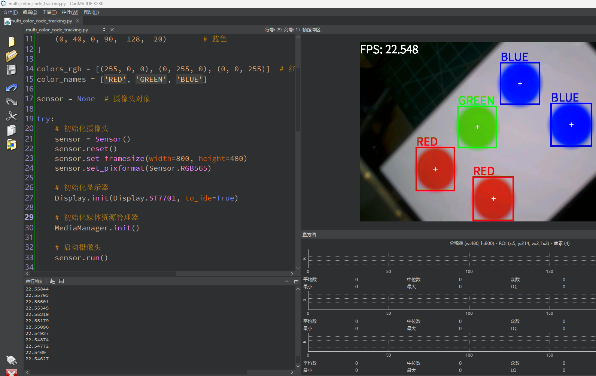

# 多颜色识别

## 1.实验目的

学习多个颜色的识别。本小节的代码和上一小节的代码类似，仅在结构做区别。

## 2.示例代码

```
'''
本程序遵循GPL V3协议, 请遵循协议
实验平台: DshanPI CanMV
开发板文档站点	: https://eai.100ask.net/
百问网学习平台   : https://www.100ask.net
百问网官方B站    : https://space.bilibili.com/275908810
百问网官方淘宝   : https://100ask.taobao.com
'''
import time, os, sys, gc

from media.sensor import *  # 导入 sensor 模块，使用摄像头相关接口
from media.display import *  # 导入 display 模块，使用显示相关接口
from media.media import *  # 导入 media 模块，使用媒体资源相关接口

# 颜色识别阈值 (L Min, L Max, A Min, A Max, B Min, B Max) —— LAB 颜色空间
thresholds = [
    (30, 100, 15, 127, 15, 127),     # 红色
    (30, 100, -64, -8, 50, 70),      # 绿色
    (0, 40, 0, 90, -128, -20)        # 蓝色
]

colors_rgb = [(255, 0, 0), (0, 255, 0), (0, 0, 255)]  # 红、绿、蓝色绘制颜色
color_names = ['RED', 'GREEN', 'BLUE']

sensor = None  # 摄像头对象

try:
    # 初始化摄像头
    sensor = Sensor()
    sensor.reset()
    sensor.set_framesize(width=800, height=480)
    sensor.set_pixformat(Sensor.RGB565)

    # 初始化显示器
    Display.init(Display.ST7701, to_ide=True)

    # 初始化媒体资源管理器
    MediaManager.init()

    # 启动摄像头
    sensor.run()

    # 帧率计时器
    clock = time.clock()

    while True:
        clock.tick()
        os.exitpoint()  # 检查退出

        # 拍摄图像
        img = sensor.snapshot()

        # 遍历所有颜色阈值进行识别
        for i in range(len(thresholds)):
            blobs = img.find_blobs([thresholds[i]])

            if blobs:
                for b in blobs:
                    img.draw_rectangle(b[0:4], thickness=4, color=colors_rgb[i])
                    img.draw_cross(b[5], b[6], thickness=2)
                    img.draw_string_advanced(b[0], b[1] - 35, 30, color_names[i], color=colors_rgb[i])

        # 显示 FPS
        img.draw_string_advanced(0, 0, 30, 'FPS: ' + str("%.3f" % clock.fps()), color=(255, 255, 255))

        # 显示图像
        Display.show_image(img)

        # 垃圾回收
        gc.collect()

        # 打印 FPS
        print(clock.fps())

except KeyboardInterrupt:
    print("用户停止")
except BaseException as e:
    print(f"异常发生：'{e}'")
finally:
    if isinstance(sensor, Sensor):
        sensor.stop()

    Display.deinit()

    os.exitpoint(os.EXITPOINT_ENABLE_SLEEP)
    time.sleep_ms(100)

    MediaManager.deinit()
```

## 3.实验结果

​	点击运行代码后，可以在显示屏上看到检测的结果。

