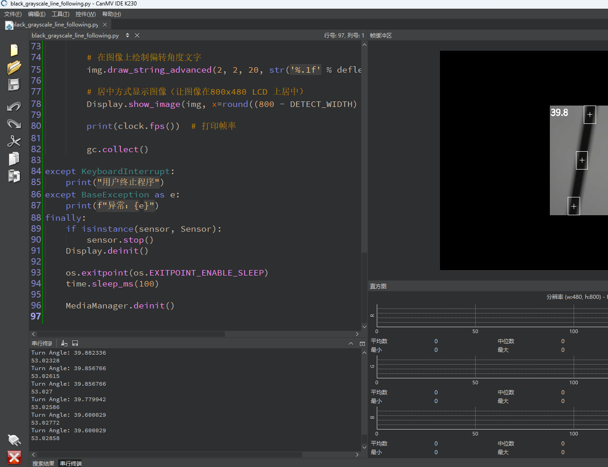

# 机器人巡线

## 1.实验目的

基于 CanMV 开发平台，构建一个使用摄像头识别“黑色轨迹线”的基础图像识别系统。通过灰度图像分割、图像区域加权、多 ROI 追踪策略，我们可以实时计算图像中黑线的位置，并输出角度信息，便于用于智能小车路径控制等应用。

## 2.实验原理


## 3.代码解析

### 定义感兴趣区域

```
ROIS = [
    (0, 200, 320, 40, 0.7),  # 这部分是图像中的区域（ROI）
    (0, 100, 320, 40, 0.3),
    (0,   0, 320, 40, 0.1)
]
```

**`ROIS`**：定义了三个感兴趣区域（ROI）。每个区域由五个元素表示 `(x, y, w, h, weight)`，分别为：

- `(x, y)`：ROI 区域的左上角坐标。
- `(w, h)`：ROI 区域的宽度和高度。
- `weight`：每个区域的权重值，越靠近底部的区域给的权重越大，这意味着底部的图像对最终计算影响更大。

### 摄像头初始化

```
sensor = Sensor(width=1280, height=960)
sensor.set_framesize(width=DETECT_WIDTH, height=DETECT_HEIGHT)
sensor.set_pixformat(Sensor.GRAYSCALE)  # 设置为灰度图模式
```

**`sensor = Sensor(width=1280, height=960)`**：创建一个摄像头对象，并设置其分辨率为 1280x960 像素。

**`sensor.reset()`**：初始化摄像头。

**`sensor.set_framesize(width=DETECT_WIDTH, height=DETECT_HEIGHT)`**：设置摄像头输出的图像分辨率为 320x240。

**`sensor.set_pixformat(Sensor.GRAYSCALE)`**：设置图像的像素格式为灰度图。

### 初始化显示屏

```
Display.init(Display.ST7701, to_ide=True) # 初始化 LCD 显示屏，并设置为 800x480
```

**`Display.init(Display.ST7701, to_ide=True)`**：初始化显示屏，并将其设置为 `ST7701` 类型显示屏，分辨率为 800x480。

### 初始化媒体资源管理器

```
MediaManager.init() # 初始化媒体管理器，管理资源
sensor.run() # 启动摄像头，开始采集图像
```

**`MediaManager.init()`**：初始化媒体资源管理器，准备好管理图像等资源。

**`sensor.run()`**：启动摄像头采集图像，开始实时捕获。

### 检测连同区域

```
for r in ROIS:
    blobs = img.find_blobs(GRAYSCALE_THRESHOLD, roi=r[0:4], merge=True) # r[0:4] 是上面定义的roi元组.
```

**`for r in ROIS:`**：遍历所有 ROI 区域。

**`blobs = img.find_blobs(GRAYSCALE_THRESHOLD, roi=r[0:4], merge=True)`**：在每个 ROI 区域内，检测符合灰度阈值的 blob（连通区域）。如果找到了符合条件的区域，它们会被存储在 `blobs` 列表中。

```
if blobs:
    largest_blob = max(blobs, key=lambda b: b.pixels()) # 找到面积最大的 blob
    img.draw_rectangle(largest_blob.rect()) # 在图像上绘制矩形框
    img.draw_cross(largest_blob.cx(), largest_blob.cy()) # 在图像上绘制十字线（中心点）
    centroid_sum += largest_blob.cx() * r[4] # 累加加权中心位置
```

**`if blobs:`**：如果找到了符合条件的 blob。

**`largest_blob = max(blobs, key=lambda b: b.pixels())`**：找到最大面积的 blob。

**`img.draw_rectangle(largest_blob.rect())`**：绘制出最大 blob 的矩形框。

**`img.draw_cross(largest_blob.cx(), largest_blob.cy())`**：绘制出最大 blob 的中心点。

**`centroid_sum += largest_blob.cx() \* r[4]`**：将最大的 blob 的 X 坐标乘以该 ROI 区域的权重并累加，用于后续计算。

### 计算线条中心位置

```
center_pos = (centroid_sum / weight_sum) # 计算加权中心位置
```

计算所有 ROI 区域加权后的线条中心位置。

### 计算线条的偏转角度

```
deflection_angle = -math.atan((center_pos - 160) / 120)
```

**`deflection_angle = -math.atan((center_pos - 160) / 120)`**：计算线条中心的偏离角度。通过反正切函数计算偏差，并通过 `(center_pos - 160)` 计算与中心位置的偏离。

- `160` 是图像的中点。
- `120` 是半个图像高度，用于计算角度。

### 弧度转度数

```
deflection_angle = math.degrees(deflection_angle) # 转换成角度
```

将偏转角度从弧度转换为度数。

### 绘制角度信息

```
img.draw_string_advanced(2, 2, 20, str('%.1f' % deflection_angle), color=(255, 255, 255)) # 绘制偏转角度文字
```

在图像的左上角绘制偏转角度信息，白色字体。

### 图像显示

```
Display.show_image(img, x=round((800 - DETECT_WIDTH) / 2), y=round((480 - DETECT_HEIGHT) / 2)) # 居中显示图像
```

将图像显示在 LCD 屏幕上，并将其居中显示。

## 4.示例代码

```
'''
本程序遵循GPL V3协议, 请遵循协议
实验平台: DshanPI CanMV
开发板文档站点	: https://eai.100ask.net/
百问网学习平台   : https://www.100ask.net
百问网官方B站    : https://space.bilibili.com/275908810
百问网官方淘宝   : https://100ask.taobao.com
'''
import time, os, gc, sys, math

from media.sensor import *
from media.display import *
from media.media import *

# 图像分辨率为 QVGA 320x240
DETECT_WIDTH = 320
DETECT_HEIGHT = 240

# 追踪黑线 (灰度阈值为0~64)，追踪白线时改为 [(128, 255)]
GRAYSCALE_THRESHOLD = [(0, 64)]

# 设置 ROI 区域，从图像底部到顶部分成3块区域，每块区域有对应权重
ROIS = [
    (0, 200, 320, 40, 0.7),  # 底部 ROI，靠近机器人，权重最大
    (0, 100, 320, 40, 0.3),  # 中间 ROI，次之
    (0,   0, 320, 40, 0.1)   # 顶部 ROI，权重最小
]

# 计算所有 ROI 的总权重
weight_sum = sum(r[4] for r in ROIS)

sensor = None

try:
    # 初始化摄像头
    sensor = Sensor(width=1280, height=960)
    sensor.reset()
    sensor.set_framesize(width=DETECT_WIDTH, height=DETECT_HEIGHT)
    sensor.set_pixformat(Sensor.GRAYSCALE)

    # 初始化显示屏 (使用 3.5 寸 LCD 并启用 IDE 缓冲)
    Display.init(Display.ST7701, to_ide=True)

    # 初始化媒体管理器
    MediaManager.init()
    sensor.run()

    clock = time.clock()

    while True:
        clock.tick()

        os.exitpoint()  # 检查是否应退出程序
        img = sensor.snapshot()

        centroid_sum = 0

        for r in ROIS:
            blobs = img.find_blobs(GRAYSCALE_THRESHOLD, roi=r[0:4], merge=True)
            if blobs:
                largest_blob = max(blobs, key=lambda b: b.pixels())

                # 绘制 ROI 边框和十字中心
                img.draw_rectangle(largest_blob.rect())
                img.draw_cross(largest_blob.cx(), largest_blob.cy())

                # 按权重累加中心点 X 坐标
                centroid_sum += largest_blob.cx() * r[4]

        # 计算加权平均的中心位置
        center_pos = centroid_sum / weight_sum

        # 偏移角度计算（图像宽度 320，中心在160，采用三角函数偏移量）
        deflection_angle = -math.atan((center_pos - 160) / 120)
        deflection_angle = math.degrees(deflection_angle)

        # 打印偏移角度
        print("Turn Angle: %f" % deflection_angle)

        # 在图像上绘制偏转角度文字
        img.draw_string_advanced(2, 2, 20, str('%.1f' % deflection_angle), color=(255, 255, 255))

        # 居中方式显示图像（让图像在800x480 LCD 上居中）
        Display.show_image(img, x=round((800 - DETECT_WIDTH) / 2), y=round((480 - DETECT_HEIGHT) / 2))

        print(clock.fps())  # 打印帧率

        gc.collect()

except KeyboardInterrupt:
    print("用户终止程序")
except BaseException as e:
    print(f"异常：{e}")
finally:
    if isinstance(sensor, Sensor):
        sensor.stop()
    Display.deinit()

    os.exitpoint(os.EXITPOINT_ENABLE_SLEEP)
    time.sleep_ms(100)

    MediaManager.deinit()
```


## 5.实现结果

​	点击运行后，可以屏幕上看到检测直线的角度。



