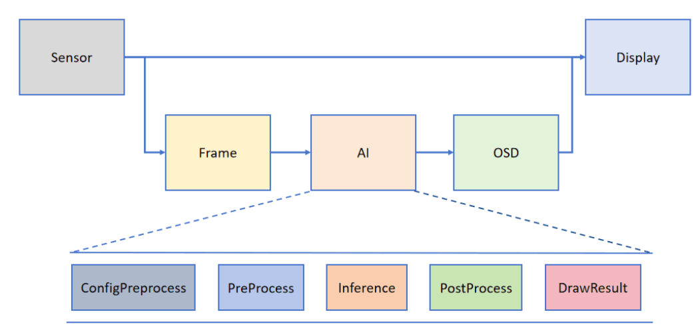
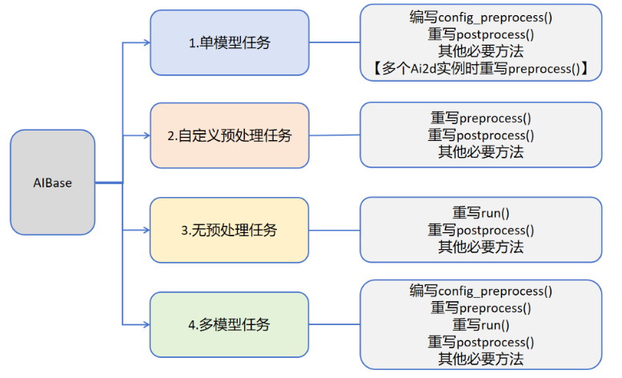

# AI Demo 开发框架介绍

为了帮助用户简化AI部分的开发, CanMV官方基于K230专门搭建了配套的AI视觉开发框架。框架结构如下图所示：

Camera 默认输出两路图像：一路格式为 YUV420SP (Sensor.YUV420SP)，直接提供给 Display 显示；另一路格式为 RGBP888 (Sensor.RGBP888)，则用于 AI 部分进行处理。AI 主要负责任务的前处理、推理和后处理流程。处理完成后，结果将绘制在 OSD 图像实例上，并发送给 Display 进行叠加显示。

用户可根据具体的AI场景自写任务类继承AIBase，可以将任务分为如下四类：单模型任务、多模型任务，自定义预处理任务、无预处理任务。不同任务需要编写不同的代码实现，具体如下图所示：

关于不同任务的介绍：

| 任务类型         | 任务描述                                                     | 代码说明                                                     |
| ---------------- | ------------------------------------------------------------ | ------------------------------------------------------------ |
| 单模型任务       | 该任务只有一个模型，只需要关注该模型的前处理、推理、后处理过程，此类任务的前处理使用Ai2d实现，可能使用一个Ai2d实例，也可能使用多个Ai2d实例，后处理基于场景自定义。 | 编写自定义任务类，主要关注任务类的config_preprocess、postprocess、以及该任务需要的其他方法如：draw_result等。 如果该任务包含多个Ai2d实例，则需要重写preprocess，按照预处理的顺序设置预处理阶段的计算过程。 |
| 自定义预处理任务 | 该任务只有一个模型，只需要关注该模型的前处理、推理、后处理过程，此类任务的前处理不使用Ai2d实现，可以使用ulab.numpy自定义，后处理基于场景自定义。 | 编写自定义任务类，主要关注任务类的preprocess、postprocess、以及该任务需要的其他方法如：draw_result等 |
| 无预处理任务     | 该任务只有一个模型且不需要预处理，只需要关注该模型的推理和后处理过程，此类任务一般作为多模型任务的一部分，直接对前一个模型的输出做为输入推理，后处理基于需求自定义。 | 编写自定义任务类，主要关注任务类的run(模型推理的整个过程，包括preprocess、inference、postprocess中的全部或某一些步骤)、postprocess、以及该任务需要的其他方法如：draw_results等 |
| 多模型任务       | 该任务包含多个模型，可能是串联，也可能是其他组合方式。对于每个模型基本上属于前三种模型中的一种，最后通过一个完整的任务类将上述模型子任务统一起来。 | 编写多个子模型任务类，不同子模型任务参照前三种任务定义。不同任务关注不同的方法。 编写多模型任务类，将子模型任务类统一起来实现整个场景。 |

