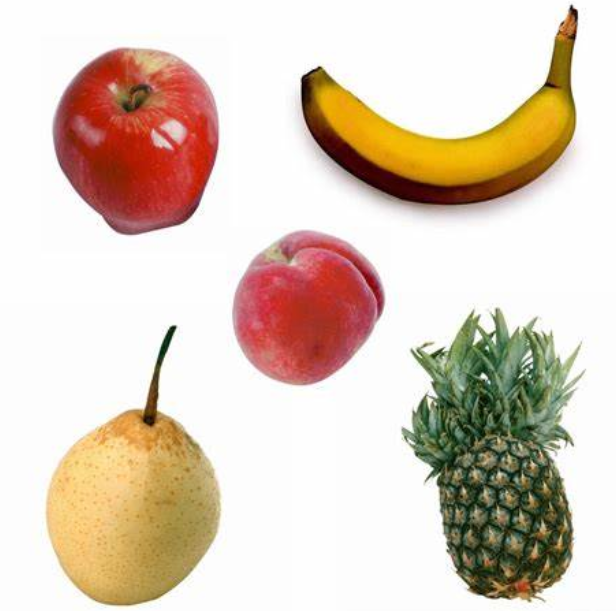
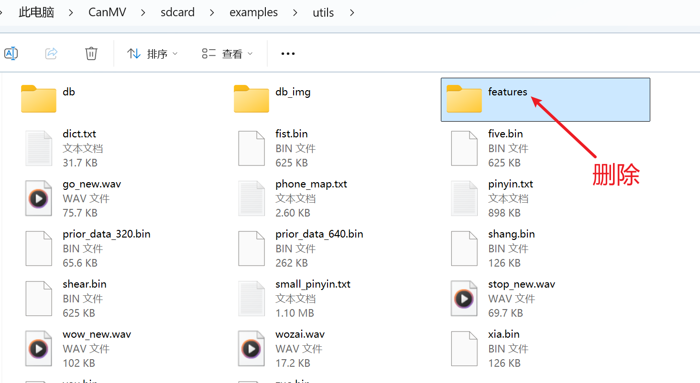
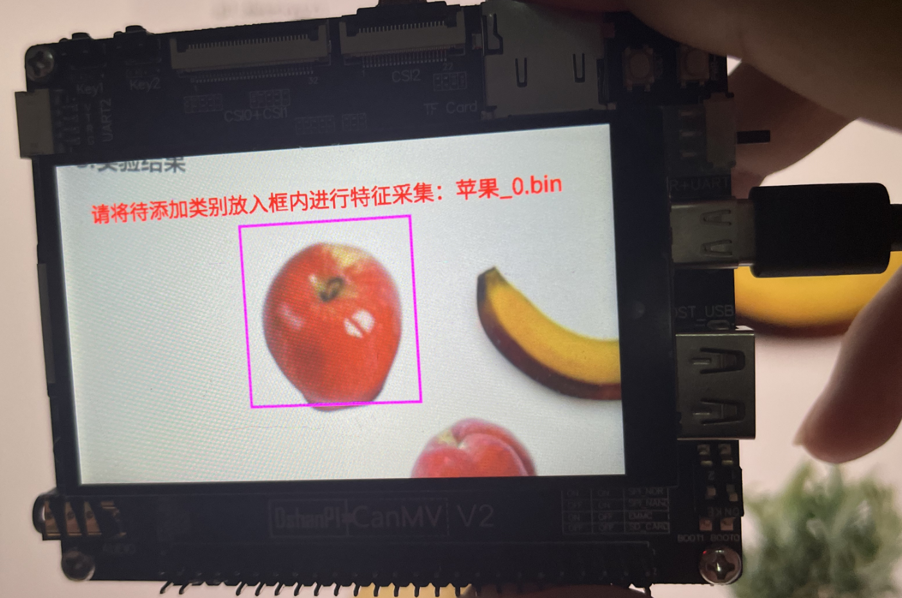
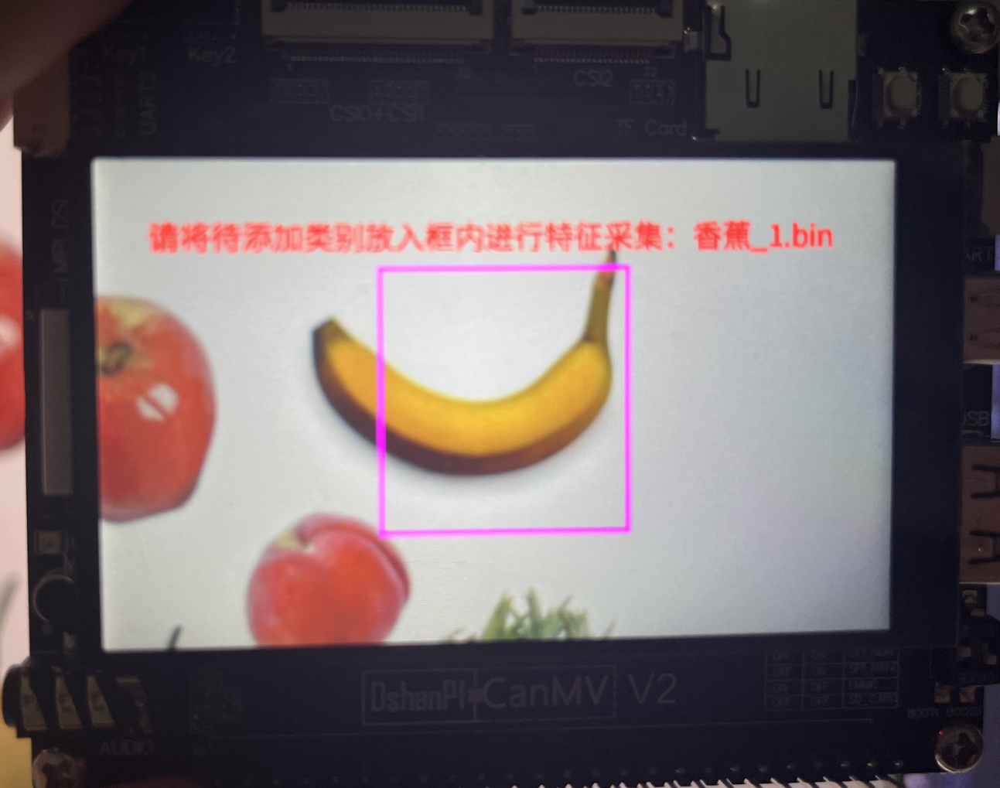
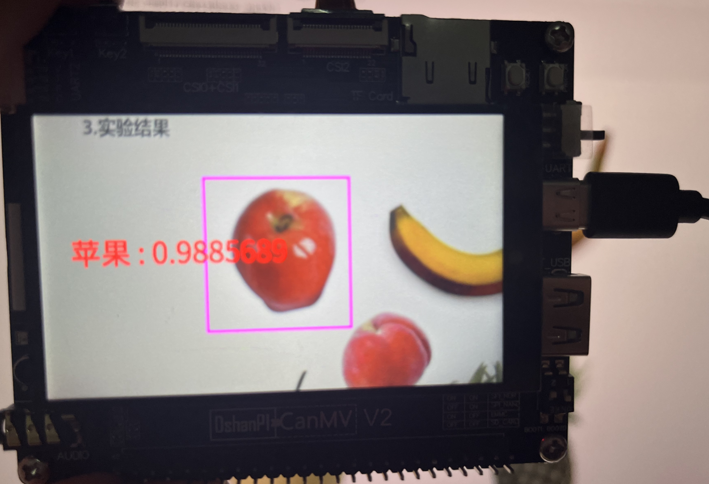
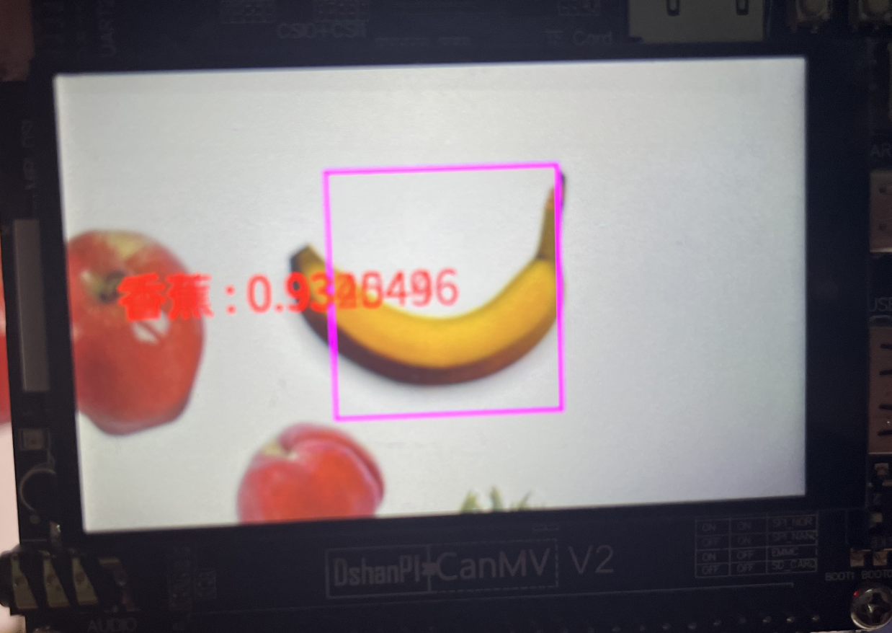

# 自分类学习

## 1.实验目的

学习摄像头进行自学习识别。

## 2.示例代码

```
'''
本程序遵循GPL V3协议, 请遵循协议
实验平台： DshanPI CanMV
开发板文档站点	: https://eai.100ask.net/
百问网学习平台   : https://www.100ask.net
百问网官方B站    : https://space.bilibili.com/275908810
百问网官方淘宝   : https://100ask.taobao.com
'''
from libs.PipeLine import PipeLine, ScopedTiming
from libs.AIBase import AIBase
from libs.AI2D import Ai2d
import os
import ujson
from media.media import *
from time import *
import nncase_runtime as nn
import ulab.numpy as np
import time
import utime
import image
import random
import gc
import sys
import aicube

# 自定义自学习类
class SelfLearningApp(AIBase):
    def __init__(self,kmodel_path,model_input_size,labels,top_k,threshold,database_path,rgb888p_size=[224,224],display_size=[1920,1080],debug_mode=0):
        super().__init__(kmodel_path,model_input_size,rgb888p_size,debug_mode)
        self.kmodel_path=kmodel_path
        # 模型输入分辨率
        self.model_input_size=model_input_size
        self.labels=labels
        self.database_path=database_path
        # sensor给到AI的图像分辨率
        self.rgb888p_size=[ALIGN_UP(rgb888p_size[0],16),rgb888p_size[1]]
        # 显示分辨率
        self.display_size=[ALIGN_UP(display_size[0],16),display_size[1]]
        self.debug_mode=debug_mode
        # 识别阈值
        self.threshold = threshold
        # 选择top_k个相似度大于阈值的结果类别
        self.top_k = top_k
        #对应类别注册特征数量
        self.features=[2,2]
        #注册单个特征中途间隔帧数
        self.time_one=60
        self.time_all = 0
        self.time_now = 0
        # 类别索引
        self.category_index = 0
        # 特征化部分剪切宽高
        self.crop_w = 400
        self.crop_h = 400
        # crop的位置
        self.crop_x = self.rgb888p_size[0] / 2.0 - self.crop_w / 2.0
        self.crop_y = self.rgb888p_size[1] / 2.0 - self.crop_h / 2.0
        self.crop_x_osd=0
        self.crop_y_osd=0
        self.crop_w_osd=0
        self.crop_h_osd=0
        # Ai2d实例，用于实现模型预处理
        self.ai2d=Ai2d(debug_mode)
        # 设置Ai2d的输入输出格式和类型
        self.ai2d.set_ai2d_dtype(nn.ai2d_format.NCHW_FMT,nn.ai2d_format.NCHW_FMT,np.uint8, np.uint8)
        self.data_init()

    # 配置预处理操作，这里使用了crop和resize，Ai2d支持crop/shift/pad/resize/affine，具体代码请打开/sdcard/app/libs/AI2D.py查看
    def config_preprocess(self,input_image_size=None):
        with ScopedTiming("set preprocess config",self.debug_mode > 0):
            # 初始化ai2d预处理配置，默认为sensor给到AI的尺寸，您可以通过设置input_image_size自行修改输入尺寸
            ai2d_input_size=input_image_size if input_image_size else self.rgb888p_size
            self.ai2d.crop(int(self.crop_x),int(self.crop_y),int(self.crop_w),int(self.crop_h))
            self.ai2d.resize(nn.interp_method.tf_bilinear, nn.interp_mode.half_pixel)
            self.ai2d.build([1,3,ai2d_input_size[1],ai2d_input_size[0]],[1,3,self.model_input_size[1],self.model_input_size[0]])

    # 自定义当前任务的后处理
    def postprocess(self,results):
        with ScopedTiming("postprocess",self.debug_mode > 0):
            return results[0][0]

    # 绘制结果，绘制特征采集框和特征分类框
    def draw_result(self,pl,feature):
        pl.osd_img.clear()
        with ScopedTiming("display_draw",self.debug_mode >0):
            pl.osd_img.draw_rectangle(self.crop_x_osd,self.crop_y_osd, self.crop_w_osd, self.crop_h_osd, color=(255, 255, 0, 255), thickness = 4)
            if (self.category_index < len(self.labels)):
                self.time_now += 1
                pl.osd_img.draw_string_advanced(50, self.crop_y_osd-50, 30,"请将待添加类别放入框内进行特征采集："+self.labels[self.category_index] + "_" + str(int(self.time_now-1) // self.time_one) + ".bin", color=(255,255,0,0))
                with open(self.database_path + self.labels[self.category_index] + "_" + str(int(self.time_now-1) // self.time_one) + ".bin", 'wb') as f:
                    f.write(feature.tobytes())
                if (self.time_now // self.time_one == self.features[self.category_index]):
                    self.category_index += 1
                    self.time_all -= self.time_now
                    self.time_now = 0
            else:
                results_learn = []
                list_features = os.listdir(self.database_path)
                for feature_name in list_features:
                    with open(self.database_path + feature_name, 'rb') as f:
                        data = f.read()
                    save_vec = np.frombuffer(data, dtype=np.float)
                    score = self.getSimilarity(feature, save_vec)
                    if (score > self.threshold):
                        res = feature_name.split("_")
                        is_same = False
                        for r in results_learn:
                            if (r["category"] ==  res[0]):
                                if (r["score"] < score):
                                    r["bin_file"] = feature_name
                                    r["score"] = score
                                is_same = True
                        if (not is_same):
                            if(len(results_learn) < self.top_k):
                                evec = {}
                                evec["category"] = res[0]
                                evec["score"] = score
                                evec["bin_file"] = feature_name
                                results_learn.append( evec )
                                results_learn = sorted(results_learn, key=lambda x: -x["score"])
                            else:
                                if( score <= results_learn[self.top_k-1]["score"] ):
                                    continue
                                else:
                                    evec = {}
                                    evec["category"] = res[0]
                                    evec["score"] = score
                                    evec["bin_file"] = feature_name
                                    results_learn.append( evec )
                                    results_learn = sorted(results_learn, key=lambda x: -x["score"])
                                    results_learn.pop()
                draw_y = 200
                for r in results_learn:
                    pl.osd_img.draw_string_advanced( 50 , draw_y,50,r["category"] + " : " + str(r["score"]), color=(255,255,0,0))
                    draw_y += 50

    #数据初始化
    def data_init(self):
        os.mkdir(self.database_path)
        self.crop_x_osd = int(self.crop_x / self.rgb888p_size[0] * self.display_size[0])
        self.crop_y_osd = int(self.crop_y / self.rgb888p_size[1] * self.display_size[1])
        self.crop_w_osd = int(self.crop_w / self.rgb888p_size[0] * self.display_size[0])
        self.crop_h_osd = int(self.crop_h / self.rgb888p_size[1] * self.display_size[1])
        for i in range(len(self.labels)):
            for j in range(self.features[i]):
                self.time_all += self.time_one

    # 获取两个特征向量的相似度
    def getSimilarity(self,output_vec,save_vec):
        tmp = sum(output_vec * save_vec)
        mold_out = np.sqrt(sum(output_vec * output_vec))
        mold_save = np.sqrt(sum(save_vec * save_vec))
        return tmp / (mold_out * mold_save)


if __name__=="__main__":
    # 显示模式，默认"hdmi",可以选择"hdmi"和"lcd"
    display_mode="lcd"
    # k230保持不变，k230d可调整为[1280,720]
    rgb888p_size=[1920,1080]

    if display_mode=="hdmi":
        display_size=[1920,1080]
    else:
        display_size=[800,480]
    # 模型路径
    kmodel_path="/sdcard/examples/kmodel/recognition.kmodel"
    database_path="/sdcard/examples/utils/features/"
    # 其它参数设置
    model_input_size=[224,224]
    labels=["苹果","香蕉"]
    top_k=3
    threshold=0.5

    # 初始化PipeLine
    pl=PipeLine(rgb888p_size=rgb888p_size,display_size=display_size,display_mode=display_mode)
    pl.create()
    # 初始化自学习实例
    sl=SelfLearningApp(kmodel_path,model_input_size=model_input_size,labels=labels,top_k=top_k,threshold=threshold,database_path=database_path,rgb888p_size=rgb888p_size,display_size=display_size,debug_mode=0)
    sl.config_preprocess()
    try:
        while True:
            os.exitpoint()
            with ScopedTiming("total",1):
                # 获取当前帧数据
                img=pl.get_frame()
                # 推理当前帧
                res=sl.run(img)
                # 绘制结果到PipeLine的osd图像
                sl.draw_result(pl,res)
                # 显示当前的绘制结果
                pl.show_image()
                gc.collect()
    except Exception as e:
        sys.print_exception(e)
    finally:
        # 删除features文件夹
        stat_info = os.stat(database_path)
        if (stat_info[0] & 0x4000):
            list_files = os.listdir(database_path)
            for l in list_files:
                os.remove(database_path + l)
        os.rmdir(database_path)
        sl.deinit()
        pl.destroy()
```

## 3.实验结果



> 注意：每次运行代码后会在下面路径文件夹生成特征数据**/sdcard/examples/utils/features/**，如遇到意外报错情况可以删除整个`features`文件夹重新运行代码即可。




运行代码后，可以根据屏幕提示苹果和香蕉的信息：

采集苹果特征：



采集香蕉特征：



识别苹果：



识别香蕉：


