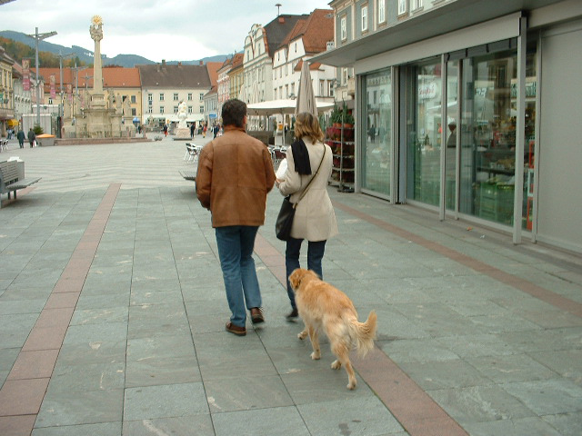
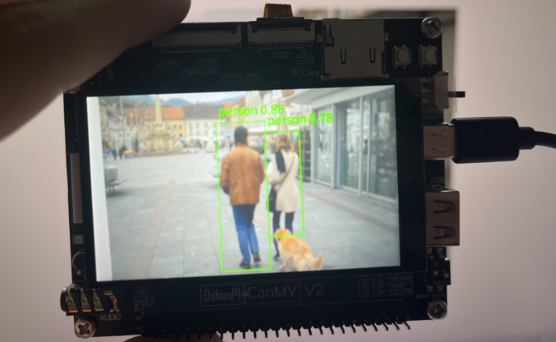

# 人形检测

## 1.实验目的

基于YOLOv5n 模型，实现对人体的实时检测，图像获取、AI 预处理、推理、后处理和显示完整串联。


## 2.代码解析

### 核心类解析

`PersonDetectionApp`：自定义人体检测类

继承自 `AIBase`，封装了以下功能：

- 模型初始化、加载
- Ai2d 图像预处理配置（pad + resize）
- YOLO 输出的后处理（调用 `aicube.anchorbasedet_post_process`）
- 绘制检测框及标签到显示屏

```
person_det = PersonDetectionApp(
    kmodel_path="/sdcard/examples/kmodel/person_detect_yolov5n.kmodel",
    model_input_size=[640,640],
    labels=["person"],
    anchors=[...],
    ...
)
```

### 图像采集与显示

```
pl = PipeLine(rgb888p_size=[1920, 1080], display_size=[800, 480], display_mode="lcd")
```

封装了图像传感器的初始化、帧获取、OSD 图层绘制、图像显示等功能。

### 图像处理流程

1.预处理：`config_preprocess()`

通过 `Ai2d` 统一设置输入图像格式、类型和尺寸，常见操作包括：

- **Pad**：填充边缘，防止图像失真
- **Resize**：缩放到模型输入尺寸（如 640x640）

```
self.ai2d.pad([...])
self.ai2d.resize(...)
self.ai2d.build(...)
```

2.推理：`run()`（继承自 AIBase）

```
res = person_det.run(img)
```

会内部调用：

- `self.preprocess(img)`
- `self.interpreter.run(...)`
- `self.postprocess(results)`

3.后处理：`postprocess()`

使用 `aicube.anchorbasedet_post_process()` 实现 anchor-based 检测结果转换，返回检测框信息 `[cls_id, score, x1, y1, x2, y2]`。

### 绘制结果

将检测框按比例缩放绘制到 OSD 层：

```
pl.osd_img.draw_rectangle(...)
pl.osd_img.draw_string_advanced(...)
```

排除了太小、靠边的干扰框，提升检测体验。

### 主循环

```
while True:
    img = pl.get_frame()
    res = person_det.run(img)
    person_det.draw_result(pl, res)
    pl.show_image()
    gc.collect()
```

每帧执行完整流程：

1. 获取帧
2. 图像预处理 + 推理
3. 后处理解析
4. 绘制结果
5. 显示到屏幕

## 3.示例代码

```
'''
本程序遵循GPL V3协议, 请遵循协议
实验平台： DshanPI CanMV
开发板文档站点	: https://eai.100ask.net/
百问网学习平台   : https://www.100ask.net
百问网官方B站    : https://space.bilibili.com/275908810
百问网官方淘宝   : https://100ask.taobao.com
'''
from libs.PipeLine import PipeLine, ScopedTiming  # 导入图像处理管线类和计时器类
from libs.AIBase import AIBase                    # 导入AI推理基础类
from libs.AI2D import Ai2d                        # 导入图像预处理类
import os
import ujson
from media.media import *                         # 导入媒体库（图像采集、显示等）
from time import *
import nncase_runtime as nn                       # 导入NNCase推理引擎库
import ulab.numpy as np                           # 使用轻量化numpy库ulab，适配MCU
import time
import utime
import image
import random
import gc
import sys
import aicube                                     # 导入aicube库（包含后处理函数）

# 自定义人体检测类，继承自AIBase
class PersonDetectionApp(AIBase):
    def __init__(self,kmodel_path,model_input_size,labels,anchors,
                 confidence_threshold=0.2,nms_threshold=0.5,nms_option=False,
                 strides=[8,16,32],rgb888p_size=[224,224],display_size=[1920,1080],debug_mode=0):
        super().__init__(kmodel_path,model_input_size,rgb888p_size,debug_mode)
        self.kmodel_path = kmodel_path
        self.model_input_size = model_input_size         # 模型输入尺寸
        self.labels = labels                             # 类别标签列表
        self.anchors = anchors                           # 锚框配置
        self.strides = strides                           # 各层输出特征图对应的stride
        self.confidence_threshold = confidence_threshold # 置信度阈值
        self.nms_threshold = nms_threshold               # NMS抑制阈值
        self.nms_option = nms_option                     # 是否开启NMS优化
        # 设置图像采集尺寸（对齐到16）
        self.rgb888p_size = [ALIGN_UP(rgb888p_size[0], 16), rgb888p_size[1]]
        self.display_size = [ALIGN_UP(display_size[0], 16), display_size[1]]
        self.debug_mode = debug_mode

        # 创建Ai2D实例用于图像预处理（如pad、resize等）
        self.ai2d = Ai2d(debug_mode)
        self.ai2d.set_ai2d_dtype(nn.ai2d_format.NCHW_FMT, nn.ai2d_format.NCHW_FMT, np.uint8, np.uint8)

    # 配置预处理流程，包括padding和resize
    def config_preprocess(self, input_image_size=None):
        with ScopedTiming("set preprocess config", self.debug_mode > 0):
            # 使用默认输入图像尺寸或传入的自定义尺寸
            ai2d_input_size = input_image_size if input_image_size else self.rgb888p_size
            # 获取padding参数：top, bottom, left, right
            top, bottom, left, right = self.get_padding_param()
            self.ai2d.pad([0, 0, 0, 0, top, bottom, left, right], 0, [0, 0, 0])
            self.ai2d.resize(nn.interp_method.tf_bilinear, nn.interp_mode.half_pixel)
            # 构建预处理算子图
            self.ai2d.build([1, 3, ai2d_input_size[1], ai2d_input_size[0]],
                            [1, 3, self.model_input_size[1], self.model_input_size[0]])

    # 模型推理结果的后处理
    def postprocess(self, results):
        with ScopedTiming("postprocess", self.debug_mode > 0):
            # 使用aicube提供的anchor-based检测后处理函数
            dets = aicube.anchorbasedet_post_process(
                results[0], results[1], results[2],
                self.model_input_size, self.rgb888p_size,
                self.strides, len(self.labels),
                self.confidence_threshold, self.nms_threshold,
                self.anchors, self.nms_option
            )
            return dets

    # 绘制推理结果（绘制矩形框与类别文字）
    def draw_result(self, pl, dets):
        with ScopedTiming("display_draw", self.debug_mode > 0):
            if dets:
                pl.osd_img.clear()
                for det_box in dets:
                    x1, y1, x2, y2 = det_box[2], det_box[3], det_box[4], det_box[5]
                    w = float(x2 - x1) * self.display_size[0] // self.rgb888p_size[0]
                    h = float(y2 - y1) * self.display_size[1] // self.rgb888p_size[1]
                    x1 = int(x1 * self.display_size[0] // self.rgb888p_size[0])
                    y1 = int(y1 * self.display_size[1] // self.rgb888p_size[1])
                    x2 = int(x2 * self.display_size[0] // self.rgb888p_size[0])
                    y2 = int(y2 * self.display_size[1] // self.rgb888p_size[1])

                    # 过滤掉边缘小目标或异常框
                    if (h < 0.1 * self.display_size[0]):
                        continue
                    if (w < 0.25 * self.display_size[0] and (x1 < 0.03 * self.display_size[0] or x2 > 0.97 * self.display_size[0])):
                        continue
                    if (w < 0.15 * self.display_size[0] and (x1 < 0.01 * self.display_size[0] or x2 > 0.99 * self.display_size[0])):
                        continue

                    # 绘制矩形框与检测标签
                    pl.osd_img.draw_rectangle(x1, y1, int(w), int(h), color=(255, 0, 255, 0), thickness=2)
                    pl.osd_img.draw_string_advanced(x1, y1 - 50, 32, " " + self.labels[det_box[0]] + " " + str(round(det_box[1], 2)), color=(255, 0, 255, 0))
            else:
                pl.osd_img.clear()

    # 计算图像预处理时的padding填充值
    def get_padding_param(self):
        dst_w, dst_h = self.model_input_size
        input_width, input_high = self.rgb888p_size
        ratio_w = dst_w / input_width
        ratio_h = dst_h / input_high
        ratio = min(ratio_w, ratio_h)
        new_w = int(ratio * input_width)
        new_h = int(ratio * input_high)
        dw = (dst_w - new_w) / 2
        dh = (dst_h - new_h) / 2
        top = int(round(dh - 0.1))
        bottom = int(round(dh + 0.1))
        left = int(round(dw - 0.1))
        right = int(round(dw - 0.1))
        return top, bottom, left, right

# 主程序入口
if __name__ == "__main__":
    display_mode = "lcd"  # 显示模式，可选"hdmi"或"lcd"
    rgb888p_size = [1920, 1080]  # 采集图像分辨率

    # 根据显示模式设置显示分辨率
    display_size = [1920, 1080] if display_mode == "hdmi" else [800, 480]

    # 模型路径
    kmodel_path = "/sdcard/examples/kmodel/person_detect_yolov5n.kmodel"

    # 检测参数配置
    confidence_threshold = 0.2
    nms_threshold = 0.6
    labels = ["person"]
    anchors = [10, 13, 16, 30, 33, 23, 30, 61, 62, 45, 59, 119, 116, 90, 156, 198, 373, 326]

    # 初始化图像处理管线
    pl = PipeLine(rgb888p_size=rgb888p_size, display_size=display_size, display_mode=display_mode)
    pl.create()

    # 创建人体检测应用类实例并初始化
    person_det = PersonDetectionApp(
        kmodel_path,
        model_input_size=[640, 640],
        labels=labels,
        anchors=anchors,
        confidence_threshold=confidence_threshold,
        nms_threshold=nms_threshold,
        nms_option=False,
        strides=[8, 16, 32],
        rgb888p_size=rgb888p_size,
        display_size=display_size,
        debug_mode=0
    )
    person_det.config_preprocess()

    try:
        while True:
            os.exitpoint()  # 检查退出点
            with ScopedTiming("total", 1):
                img = pl.get_frame()              # 采集当前图像帧
                res = person_det.run(img)         # 执行模型推理
                person_det.draw_result(pl, res)   # 绘制结果
                pl.show_image()                   # 显示图像
                gc.collect()                      # 回收内存
    except Exception as e:
        sys.print_exception(e)                   # 异常打印
    finally:
        person_det.deinit()                      # 模型反初始化
        pl.destroy()                             # 销毁图像管线
```


## 4.实验结果



​	点击运行代码后，可以在显示屏上看到人形检测的结果。如下所示：

