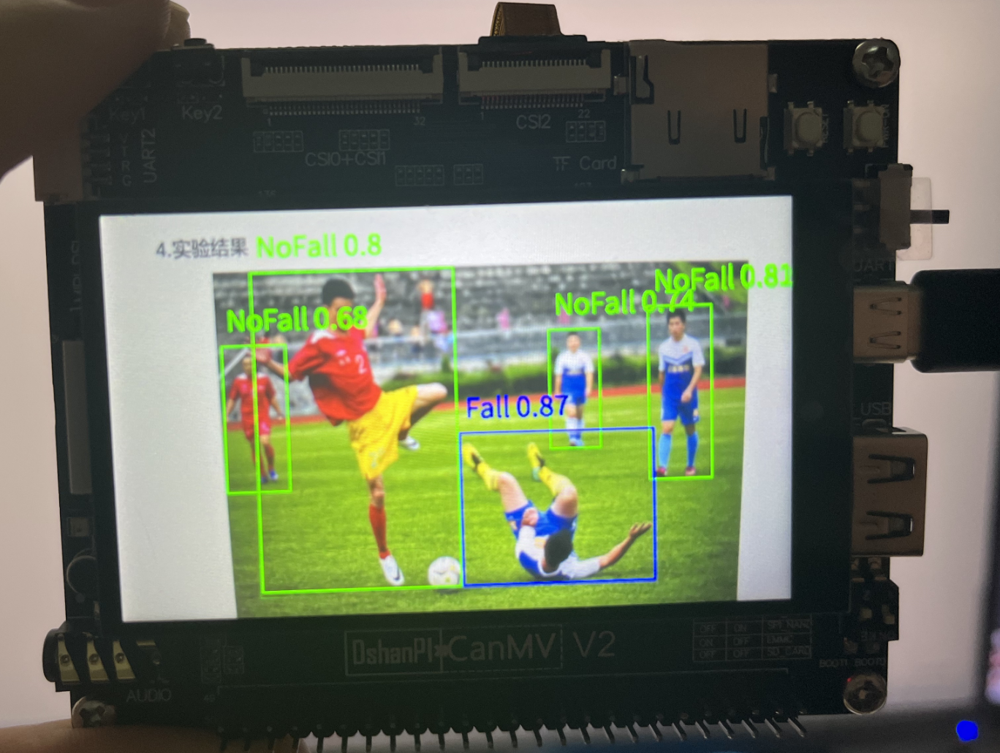

# 跌倒检测

## 1.实验目的

使用 YOLOv5n 模型检测“Fall”与“NoFall”目标，并在屏幕（LCD 或 HDMI）上进行可视化


## 2.核心代码讲解

### 预处理

```
            top, bottom, left, right = self.get_padding_param()                             # 获取padding参数
            self.ai2d.pad([0, 0, 0, 0, top, bottom, left, right], 0, [0,0,0])               # 填充边缘
            self.ai2d.resize(nn.interp_method.tf_bilinear, nn.interp_mode.half_pixel)       # 缩放图像
            self.ai2d.build([1,3,ai2d_input_size[1],ai2d_input_size[0]],[1,3,self.model_input_size[1],self.model_input_size[0]])  # 构建预处理流程
```

计算如何将摄像头图像等比例缩放到模型输入尺寸 `[640, 640]`，并自动添加 padding。

### 模型推理

```
                res = fall_det.run(img)  
```

### 后处理

```
            dets = aicube.anchorbasedet_post_process(results[0], results[1], results[2], self.model_input_size, self.rgb888p_size, self.strides, len(self.labels), self.confidence_threshold, self.nms_threshold, self.anchors, self.nms_option)
```

此函数用的是 `aicube` 提供的 anchor-based YOLO 后处理函数，主要功能有：

- 将模型 raw 输出（通常是 feature map）还原为 bounding box 坐标和类别
- 应用置信度筛选、NMS（非极大值抑制）
- 返回格式为 `[cls_id, score, x1, y1, x2, y2]`


## 3.示例代码

```
'''
本程序遵循GPL V3协议, 请遵循协议
实验平台： DshanPI CanMV
开发板文档站点	: https://eai.100ask.net/
百问网学习平台   : https://www.100ask.net
百问网官方B站    : https://space.bilibili.com/275908810
百问网官方淘宝   : https://100ask.taobao.com
'''
from libs.PipeLine import PipeLine, ScopedTiming
from libs.AIBase import AIBase
from libs.AI2D import Ai2d
import os
import ujson
from media.media import *
from time import *
import nncase_runtime as nn
import ulab.numpy as np
import time
import utime
import image
import random
import gc
import sys
import aicube

# 自定义跌倒检测类，继承自AIBase基类
class FallDetectionApp(AIBase):
    def __init__(self, kmodel_path, model_input_size, labels, anchors, confidence_threshold=0.2, nms_threshold=0.5, nms_option=False, strides=[8,16,32], rgb888p_size=[224,224], display_size=[1920,1080], debug_mode=0):
        super().__init__(kmodel_path, model_input_size, rgb888p_size, debug_mode)  # 调用基类的构造函数
        self.kmodel_path = kmodel_path                      # 模型文件路径
        self.model_input_size = model_input_size            # 模型输入分辨率
        self.labels = labels                                # 分类标签
        self.anchors = anchors                              # 锚点数据，用于跌倒检测
        self.strides = strides                              # 步长设置
        self.confidence_threshold = confidence_threshold    # 置信度阈值
        self.nms_threshold = nms_threshold                  # NMS（非极大值抑制）阈值
        self.nms_option = nms_option                        # NMS选项
        self.rgb888p_size = [ALIGN_UP(rgb888p_size[0], 16), rgb888p_size[1]]  # sensor给到AI的图像分辨率，并对宽度进行16的对齐
        self.display_size = [ALIGN_UP(display_size[0], 16), display_size[1]]  # 显示分辨率，并对宽度进行16的对齐
        self.debug_mode = debug_mode                                          # 是否开启调试模式
        self.color = [(255,0, 0, 255), (255,0, 255, 0), (255,255,0, 0), (255,255,0, 255)]  # 用于绘制不同类别的颜色
        # Ai2d实例，用于实现模型预处理
        self.ai2d = Ai2d(debug_mode)
        # 设置Ai2d的输入输出格式和类型
        self.ai2d.set_ai2d_dtype(nn.ai2d_format.NCHW_FMT, nn.ai2d_format.NCHW_FMT, np.uint8, np.uint8)

    # 配置预处理操作，这里使用了pad和resize，Ai2d支持crop/shift/pad/resize/affine，具体代码请打开/sdcard/app/libs/AI2D.py查看
    def config_preprocess(self, input_image_size=None):
        with ScopedTiming("set preprocess config", self.debug_mode > 0):                    # 计时器，如果debug_mode大于0则开启
            ai2d_input_size = input_image_size if input_image_size else self.rgb888p_size   # 初始化ai2d预处理配置，默认为sensor给到AI的尺寸，可以通过设置input_image_size自行修改输入尺寸
            top, bottom, left, right = self.get_padding_param()                             # 获取padding参数
            self.ai2d.pad([0, 0, 0, 0, top, bottom, left, right], 0, [0,0,0])               # 填充边缘
            self.ai2d.resize(nn.interp_method.tf_bilinear, nn.interp_mode.half_pixel)       # 缩放图像
            self.ai2d.build([1,3,ai2d_input_size[1],ai2d_input_size[0]],[1,3,self.model_input_size[1],self.model_input_size[0]])  # 构建预处理流程

    # 自定义当前任务的后处理，results是模型输出array的列表，这里使用了aicube库的anchorbasedet_post_process接口
    def postprocess(self, results):
        with ScopedTiming("postprocess", self.debug_mode > 0):
            dets = aicube.anchorbasedet_post_process(results[0], results[1], results[2], self.model_input_size, self.rgb888p_size, self.strides, len(self.labels), self.confidence_threshold, self.nms_threshold, self.anchors, self.nms_option)
            return dets

    # 绘制检测结果到画面上
    def draw_result(self, pl, dets):
        with ScopedTiming("display_draw", self.debug_mode > 0):
            if dets:
                pl.osd_img.clear()  # 清除OSD图像
                for det_box in dets:
                    # 计算显示分辨率下的坐标
                    x1, y1, x2, y2 = det_box[2], det_box[3], det_box[4], det_box[5]
                    w = (x2 - x1) * self.display_size[0] // self.rgb888p_size[0]
                    h = (y2 - y1) * self.display_size[1] // self.rgb888p_size[1]
                    x1 = int(x1 * self.display_size[0] // self.rgb888p_size[0])
                    y1 = int(y1 * self.display_size[1] // self.rgb888p_size[1])
                    x2 = int(x2 * self.display_size[0] // self.rgb888p_size[0])
                    y2 = int(y2 * self.display_size[1] // self.rgb888p_size[1])
                    # 绘制矩形框和类别标签
                    pl.osd_img.draw_rectangle(x1, y1, int(w), int(h), color=self.color[det_box[0]], thickness=2)
                    pl.osd_img.draw_string_advanced(x1, y1-50, 32," " + self.labels[det_box[0]] + " " + str(round(det_box[1],2)), color=self.color[det_box[0]])
            else:
                pl.osd_img.clear()

    # 获取padding参数
    def get_padding_param(self):
        dst_w = self.model_input_size[0]
        dst_h = self.model_input_size[1]
        input_width = self.rgb888p_size[0]
        input_high = self.rgb888p_size[1]
        ratio_w = dst_w / input_width
        ratio_h = dst_h / input_high
        if ratio_w < ratio_h:
            ratio = ratio_w
        else:
            ratio = ratio_h
        new_w = int(ratio * input_width)
        new_h = int(ratio * input_high)
        dw = (dst_w - new_w) / 2
        dh = (dst_h - new_h) / 2
        top = int(round(dh - 0.1))
        bottom = int(round(dh + 0.1))
        left = int(round(dw - 0.1))
        right = int(round(dw - 0.1))
        return top, bottom, left, right

if __name__ == "__main__":
    # 显示模式，默认"hdmi",可以选择"hdmi"和"lcd"
    display_mode="lcd"
    # k230保持不变，k230d可调整为[640,360]
    rgb888p_size = [1920, 1080]

    if display_mode=="hdmi":
        display_size=[1920,1080]
    else:
        display_size=[800,480]
    # 设置模型路径和其他参数
    kmodel_path = "/sdcard/examples/kmodel/yolov5n-falldown.kmodel"
    confidence_threshold = 0.3
    nms_threshold = 0.45
    labels = ["Fall","NoFall"]  # 模型输出类别名称
    anchors = [10, 13, 16, 30, 33, 23, 30, 61, 62, 45, 59, 119, 116, 90, 156, 198, 373, 326]  # anchor设置

    # 初始化PipeLine，用于图像处理流程
    pl = PipeLine(rgb888p_size=rgb888p_size, display_size=display_size, display_mode=display_mode)
    pl.create()
    # 初始化自定义跌倒检测实例
    fall_det = FallDetectionApp(kmodel_path, model_input_size=[640, 640], labels=labels, anchors=anchors, confidence_threshold=confidence_threshold, nms_threshold=nms_threshold, nms_option=False, strides=[8,16,32], rgb888p_size=rgb888p_size, display_size=display_size, debug_mode=0)
    fall_det.config_preprocess()
    try:
        while True:
            os.exitpoint()                                  # 检查是否有退出信号
            with ScopedTiming("total",1):
                img = pl.get_frame()                        # 获取当前帧数据
                res = fall_det.run(img)                     # 推理当前帧
                fall_det.draw_result(pl, res)               # 绘制结果到PipeLine的osd图像
                pl.show_image()                             # 显示当前的绘制结果
                gc.collect()                                # 垃圾回收
    except Exception as e:
        sys.print_exception(e)                              # 打印异常信息
    finally:
        fall_det.deinit()                                   # 反初始化
        pl.destroy()                                        # 销毁PipeLine实例
```


## 4.实验结果

.jpg)

​		点击运行代码后，可以在显示屏上看到跌倒检测的结果。如下所示：


