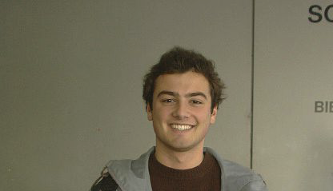
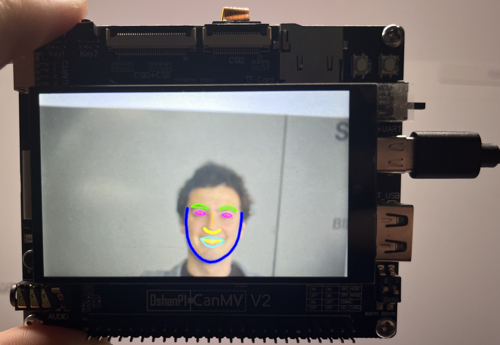

# 人脸关键部位

## 1.实验目的

学习摄像头获取的图像中人脸关键部位的获取。

## 2.核心代码

本代码实现了一个**双模型协同工作的人脸关键点检测系统**，包含人脸检测（FaceDetApp）和关键点定位（FaceLandMarkApp）两个阶段，通过FaceLandMark类整合流程。系统架构图如下：

```
图像输入 → Pipeline获取帧 → 人脸检测 → 关键点检测 → 结果绘制 → HDMI/LCD显示
```

**1. FaceDetApp（人脸检测）**

- **预处理**：

  - **等比例填充**：通过`get_pad_param()`计算填充参数，保持宽高比（避免变形）
  - **缩放至320x320**：使用双线性插值缩放至模型输入尺寸

  ```
  # 计算填充参数示例
  ratio = min(320/原图宽, 320/原图高)
  new_w = 原图宽*ratio → 填充左右使总宽=320
  ```

- **后处理**：

  - 调用`aidemo.face_det_post_process`进行置信度过滤和NMS
  - 返回格式：`[x1,y1,w,h,conf]`的检测框列表

**2. FaceLandMarkApp（关键点检测）**

- **仿射变换预处理**：

  - 根据人脸框计算**仿射矩阵**，将人脸区域对齐到192x192输入

  ```
  matrix_dst = [
    [scale, 0, 平移X],
    [0, scale, 平移Y]
  ]
  ```

  - 通过`affine()`实现旋转+缩放+平移的复合变换

- **关键点后处理**：

  - **坐标反变换**：使用逆矩阵将关键点映射回原图坐标

  ```
  new_x = old_x * inv[0] + old_y * inv[1] + inv[2]
  new_y = old_x * inv[3] + old_y * inv[4] + inv[5]
  ```

**3. FaceLandMark（整合类）**

- **多部位关键点绘制**：
  - 划分10个面部区域（眉毛/眼睛/嘴唇等）
  - 使用不同绘图方式：
    - **轮廓线**：`aidemo.contours()`画眉毛/嘴唇
    - **折线**：`aidemo.polylines()`画鼻梁
    - **圆点**：`draw_circle()`画瞳孔

**仿射矩阵计算**

```
def get_affine_matrix(bbox):
    scale = 192 / (max(w,h)*1.5)  # 保留1.5倍边缘上下文
    cx = (x1 + w/2) * scale       # 原图中心点映射
    cy = (y1 + h/2) * scale
    matrix_dst[0,2] = 96 - cx     # 平移到模型中心(96=192/2)
```

**关键点逆变换**

```
# 逆变换流程
1. 关键点输出值域[-1,1] → 转换到[0,192]
   pred[i] = (pred[i]+1)*96
2. 通过逆矩阵映射回原图坐标
```

 **多线程优化**

- **ScopedTiming**：代码中多处使用性能计时器，便于优化瓶颈
- **内存管理**：显式调用`gc.collect()`应对嵌入式内存限制

假设检测到一个人脸框`(x=100,y=200,w=300,h=300)`：

1. **关键点预处理**：

   - 计算scale=192/(300*1.5)=0.426

   - 生成仿射矩阵：

     ```
     [[0.426, 0, 96-127.5],
      [0, 0.426, 96-212.5]] 
     ```

2. **关键点输出**：

   - 模型输出归一化坐标 → 反归一化到192x192空间
   - 通过逆矩阵映射回1080P原图坐标

## 3.示例代码

```
'''
本程序遵循GPL V3协议, 请遵循协议
实验平台： DshanPI CanMV
开发板文档站点	: https://eai.100ask.net/
百问网学习平台   : https://www.100ask.net
百问网官方B站    : https://space.bilibili.com/275908810
百问网官方淘宝   : https://100ask.taobao.com
'''
from libs.PipeLine import PipeLine, ScopedTiming
from libs.AIBase import AIBase
from libs.AI2D import Ai2d
import os
import ujson
from media.media import *
from time import *
import nncase_runtime as nn
import ulab.numpy as np
import time
import image
import aidemo
import random
import gc
import sys

# 自定义人脸检测任务类
class FaceDetApp(AIBase):
    def __init__(self,kmodel_path,model_input_size,anchors,confidence_threshold=0.25,nms_threshold=0.3,rgb888p_size=[1280,720],display_size=[1920,1080],debug_mode=0):
        super().__init__(kmodel_path,model_input_size,rgb888p_size,debug_mode)
        # kmodel路径
        self.kmodel_path=kmodel_path
        # 检测模型输入分辨率
        self.model_input_size=model_input_size
        # 置信度阈值
        self.confidence_threshold=confidence_threshold
        # nms阈值
        self.nms_threshold=nms_threshold
        # 检测任务锚框
        self.anchors=anchors
        # sensor给到AI的图像分辨率，宽16字节对齐
        self.rgb888p_size=[ALIGN_UP(rgb888p_size[0],16),rgb888p_size[1]]
        # 视频输出VO分辨率，宽16字节对齐
        self.display_size=[ALIGN_UP(display_size[0],16),display_size[1]]
        # debug模式
        self.debug_mode=debug_mode
        # 实例化Ai2d，用于实现模型预处理
        self.ai2d=Ai2d(debug_mode)
        # 设置Ai2d的输入输出格式和类型
        self.ai2d.set_ai2d_dtype(nn.ai2d_format.NCHW_FMT,nn.ai2d_format.NCHW_FMT,np.uint8, np.uint8)

    # 配置预处理操作，这里使用了pad和resize，Ai2d支持crop/shift/pad/resize/affine，具体代码请打开/sdcard/app/libs/AI2D.py查看
    def config_preprocess(self,input_image_size=None):
        with ScopedTiming("set preprocess config",self.debug_mode > 0):
            # 初始化ai2d预处理配置，默认为sensor给到AI的尺寸，可以通过设置input_image_size自行修改输入尺寸
            ai2d_input_size=input_image_size if input_image_size else self.rgb888p_size
            # 设置padding预处理
            self.ai2d.pad(self.get_pad_param(), 0, [104,117,123])
            # 设置resize预处理
            self.ai2d.resize(nn.interp_method.tf_bilinear, nn.interp_mode.half_pixel)
            # 构建预处理流程,参数为预处理输入tensor的shape和预处理输出的tensor的shape
            self.ai2d.build([1,3,ai2d_input_size[1],ai2d_input_size[0]],[1,3,self.model_input_size[1],self.model_input_size[0]])

    # 自定义后处理，results是模型输出的array列表，这里使用了aidemo的face_det_post_process列表
    def postprocess(self,results):
        with ScopedTiming("postprocess",self.debug_mode > 0):
            res = aidemo.face_det_post_process(self.confidence_threshold,self.nms_threshold,self.model_input_size[0],self.anchors,self.rgb888p_size,results)
            if len(res)==0:
                return res
            else:
                return res[0]

    # 计算padding参数
    def get_pad_param(self):
        dst_w = self.model_input_size[0]
        dst_h = self.model_input_size[1]
        # 计算最小的缩放比例，等比例缩放
        ratio_w = dst_w / self.rgb888p_size[0]
        ratio_h = dst_h / self.rgb888p_size[1]
        if ratio_w < ratio_h:
            ratio = ratio_w
        else:
            ratio = ratio_h
        new_w = (int)(ratio * self.rgb888p_size[0])
        new_h = (int)(ratio * self.rgb888p_size[1])
        dw = (dst_w - new_w) / 2
        dh = (dst_h - new_h) / 2
        top = (int)(round(0))
        bottom = (int)(round(dh * 2 + 0.1))
        left = (int)(round(0))
        right = (int)(round(dw * 2 - 0.1))
        return [0,0,0,0,top, bottom, left, right]

# 自定义人脸关键点任务类
class FaceLandMarkApp(AIBase):
    def __init__(self,kmodel_path,model_input_size,rgb888p_size=[1920,1080],display_size=[1920,1080],debug_mode=0):
        super().__init__(kmodel_path,model_input_size,rgb888p_size,debug_mode)
        # kmodel路径
        self.kmodel_path=kmodel_path
        # 关键点模型输入分辨率
        self.model_input_size=model_input_size
        # sensor给到AI的图像分辨率，宽16字节对齐
        self.rgb888p_size=[ALIGN_UP(rgb888p_size[0],16),rgb888p_size[1]]
        # 视频输出VO分辨率，宽16字节对齐
        self.display_size=[ALIGN_UP(display_size[0],16),display_size[1]]
        # debug模式
        self.debug_mode=debug_mode
        # 目标矩阵
        self.matrix_dst=None
        self.ai2d=Ai2d(debug_mode)
        self.ai2d.set_ai2d_dtype(nn.ai2d_format.NCHW_FMT,nn.ai2d_format.NCHW_FMT,np.uint8, np.uint8)

    # 配置预处理操作，这里使用了affine，Ai2d支持crop/shift/pad/resize/affine，具体代码请打开/sdcard/app/libs/AI2D.py查看
    def config_preprocess(self,det,input_image_size=None):
        with ScopedTiming("set preprocess config",self.debug_mode > 0):
            # 初始化ai2d预处理配置，默认为sensor给到AI的尺寸，可以通过设置input_image_size自行修改输入尺寸
            ai2d_input_size=input_image_size if input_image_size else self.rgb888p_size
            # 计算目标矩阵，并获取仿射变换矩阵
            self.matrix_dst = self.get_affine_matrix(det)
            affine_matrix = [self.matrix_dst[0][0],self.matrix_dst[0][1],self.matrix_dst[0][2],
                             self.matrix_dst[1][0],self.matrix_dst[1][1],self.matrix_dst[1][2]]
            # 设置仿射变换预处理
            self.ai2d.affine(nn.interp_method.cv2_bilinear,0, 0, 127, 1,affine_matrix)
            # 构建预处理流程,参数为预处理输入tensor的shape和预处理输出的tensor的shape
            self.ai2d.build([1,3,ai2d_input_size[1],ai2d_input_size[0]],[1,3,self.model_input_size[1],self.model_input_size[0]])

    # 自定义后处理，results是模型输出的array列表，这里使用了aidemo库的invert_affine_transform接口
    def postprocess(self,results):
        with ScopedTiming("postprocess",self.debug_mode > 0):
            pred=results[0]
            # （1）将人脸关键点输出变换模型输入
            half_input_len = self.model_input_size[0] // 2
            pred = pred.flatten()
            for i in range(len(pred)):
                pred[i] += (pred[i] + 1) * half_input_len
            # （2）获取仿射矩阵的逆矩阵
            matrix_dst_inv = aidemo.invert_affine_transform(self.matrix_dst)
            matrix_dst_inv = matrix_dst_inv.flatten()
            # （3）对每个关键点进行逆变换
            half_out_len = len(pred) // 2
            for kp_id in range(half_out_len):
                old_x = pred[kp_id * 2]
                old_y = pred[kp_id * 2 + 1]
                # 逆变换公式
                new_x = old_x * matrix_dst_inv[0] + old_y * matrix_dst_inv[1] + matrix_dst_inv[2]
                new_y = old_x * matrix_dst_inv[3] + old_y * matrix_dst_inv[4] + matrix_dst_inv[5]
                pred[kp_id * 2] = new_x
                pred[kp_id * 2 + 1] = new_y
            return pred

    def get_affine_matrix(self,bbox):
        # 获取仿射矩阵，用于将边界框映射到模型输入空间
        with ScopedTiming("get_affine_matrix", self.debug_mode > 1):
            # 从边界框提取坐标和尺寸
            x1, y1, w, h = map(lambda x: int(round(x, 0)), bbox[:4])
            # 计算缩放比例，使得边界框映射到模型输入空间的一部分
            scale_ratio = (self.model_input_size[0]) / (max(w, h) * 1.5)
            # 计算边界框中心点在模型输入空间的坐标
            cx = (x1 + w / 2) * scale_ratio
            cy = (y1 + h / 2) * scale_ratio
            # 计算模型输入空间的一半长度
            half_input_len = self.model_input_size[0] / 2
            # 创建仿射矩阵并进行设置
            matrix_dst = np.zeros((2, 3), dtype=np.float)
            matrix_dst[0, 0] = scale_ratio
            matrix_dst[0, 1] = 0
            matrix_dst[0, 2] = half_input_len - cx
            matrix_dst[1, 0] = 0
            matrix_dst[1, 1] = scale_ratio
            matrix_dst[1, 2] = half_input_len - cy
            return matrix_dst

# 人脸标志解析
class FaceLandMark:
    def __init__(self,face_det_kmodel,face_landmark_kmodel,det_input_size,landmark_input_size,anchors,confidence_threshold=0.25,nms_threshold=0.3,rgb888p_size=[1920,1080],display_size=[1920,1080],debug_mode=0):
        # 人脸检测模型路径
        self.face_det_kmodel=face_det_kmodel
        # 人脸标志解析模型路径
        self.face_landmark_kmodel=face_landmark_kmodel
        # 人脸检测模型输入分辨率
        self.det_input_size=det_input_size
        # 人脸标志解析模型输入分辨率
        self.landmark_input_size=landmark_input_size
        # anchors
        self.anchors=anchors
        # 置信度阈值
        self.confidence_threshold=confidence_threshold
        # nms阈值
        self.nms_threshold=nms_threshold
        # sensor给到AI的图像分辨率，宽16字节对齐
        self.rgb888p_size=[ALIGN_UP(rgb888p_size[0],16),rgb888p_size[1]]
        # 视频输出VO分辨率，宽16字节对齐
        self.display_size=[ALIGN_UP(display_size[0],16),display_size[1]]
        # debug_mode模式
        self.debug_mode=debug_mode

        # 人脸关键点不同部位关键点列表
        self.dict_kp_seq = [
            [43, 44, 45, 47, 46, 50, 51, 49, 48],              # left_eyebrow
            [97, 98, 99, 100, 101, 105, 104, 103, 102],        # right_eyebrow
            [35, 36, 33, 37, 39, 42, 40, 41],                  # left_eye
            [89, 90, 87, 91, 93, 96, 94, 95],                  # right_eye
            [34, 88],                                          # pupil
            [72, 73, 74, 86],                                  # bridge_nose
            [77, 78, 79, 80, 85, 84, 83],                      # wing_nose
            [52, 55, 56, 53, 59, 58, 61, 68, 67, 71, 63, 64],  # out_lip
            [65, 54, 60, 57, 69, 70, 62, 66],                  # in_lip
            [1, 9, 10, 11, 12, 13, 14, 15, 16, 2, 3, 4, 5, 6, 7, 8, 0, 24, 23, 22, 21, 20, 19, 18, 32, 31, 30, 29, 28, 27, 26, 25, 17]  # basin
        ]

        # 人脸关键点不同部位（顺序同dict_kp_seq）颜色配置，argb
        self.color_list_for_osd_kp = [
            (255, 0, 255, 0),
            (255, 0, 255, 0),
            (255, 255, 0, 255),
            (255, 255, 0, 255),
            (255, 255, 0, 0),
            (255, 255, 170, 0),
            (255, 255, 255, 0),
            (255, 0, 255, 255),
            (255, 255, 220, 50),
            (255, 30, 30, 255)
        ]
        # 人脸检测实例
        self.face_det=FaceDetApp(self.face_det_kmodel,model_input_size=self.det_input_size,anchors=self.anchors,confidence_threshold=self.confidence_threshold,nms_threshold=self.nms_threshold,rgb888p_size=self.rgb888p_size,display_size=self.display_size,debug_mode=0)
        # 人脸标志解析实例
        self.face_landmark=FaceLandMarkApp(self.face_landmark_kmodel,model_input_size=self.landmark_input_size,rgb888p_size=self.rgb888p_size,display_size=self.display_size)
        # 配置人脸检测的预处理
        self.face_det.config_preprocess()

    # run函数
    def run(self,input_np):
        # 执行人脸检测
        det_boxes=self.face_det.run(input_np)
        landmark_res=[]
        for det_box in det_boxes:
            # 对每一个检测到的人脸解析关键部位
            self.face_landmark.config_preprocess(det_box)
            res=self.face_landmark.run(input_np)
            landmark_res.append(res)
        return det_boxes,landmark_res


    # 绘制人脸解析效果
    def draw_result(self,pl,dets,landmark_res):
        pl.osd_img.clear()
        if dets:
            draw_img_np = np.zeros((self.display_size[1],self.display_size[0],4),dtype=np.uint8)
            draw_img = image.Image(self.display_size[0], self.display_size[1], image.ARGB8888, alloc=image.ALLOC_REF,data = draw_img_np)
            for pred in landmark_res:
                # （1）获取单个人脸框对应的人脸关键点
                for sub_part_index in range(len(self.dict_kp_seq)):
                    # （2）构建人脸某个区域关键点集
                    sub_part = self.dict_kp_seq[sub_part_index]
                    face_sub_part_point_set = []
                    for kp_index in range(len(sub_part)):
                        real_kp_index = sub_part[kp_index]
                        x, y = pred[real_kp_index * 2], pred[real_kp_index * 2 + 1]
                        x = int(x * self.display_size[0] // self.rgb888p_size[0])
                        y = int(y * self.display_size[1] // self.rgb888p_size[1])
                        face_sub_part_point_set.append((x, y))
                    # （3）画人脸不同区域的轮廓
                    if sub_part_index in (9, 6):
                        color = np.array(self.color_list_for_osd_kp[sub_part_index],dtype = np.uint8)
                        face_sub_part_point_set = np.array(face_sub_part_point_set)
                        aidemo.polylines(draw_img_np, face_sub_part_point_set,False,color,5,8,0)
                    elif sub_part_index == 4:
                        color = self.color_list_for_osd_kp[sub_part_index]
                        for kp in face_sub_part_point_set:
                            x,y = kp[0],kp[1]
                            draw_img.draw_circle(x,y ,2, color, 1)
                    else:
                        color = np.array(self.color_list_for_osd_kp[sub_part_index],dtype = np.uint8)
                        face_sub_part_point_set = np.array(face_sub_part_point_set)
                        aidemo.contours(draw_img_np, face_sub_part_point_set,-1,color,2,8)
            pl.osd_img.copy_from(draw_img)


if __name__=="__main__":
    # 显示模式，默认"hdmi",可以选择"hdmi"和"lcd"
    display_mode="lcd"
    # k230保持不变，k230d可调整为[640,360]
    rgb888p_size = [1920, 1080]

    if display_mode=="hdmi":
        display_size=[1920,1080]
    else:
        display_size=[800,480]
    # 人脸检测模型路径
    face_det_kmodel_path="/sdcard/examples/kmodel/face_detection_320.kmodel"
    # 人脸关键标志模型路径
    face_landmark_kmodel_path="/sdcard/examples/kmodel/face_landmark.kmodel"
    # 其它参数
    anchors_path="/sdcard/examples/utils/prior_data_320.bin"
    face_det_input_size=[320,320]
    face_landmark_input_size=[192,192]
    confidence_threshold=0.5
    nms_threshold=0.2
    anchor_len=4200
    det_dim=4
    anchors = np.fromfile(anchors_path, dtype=np.float)
    anchors = anchors.reshape((anchor_len,det_dim))

    # 初始化PipeLine，只关注传给AI的图像分辨率，显示的分辨率
    pl=PipeLine(rgb888p_size=rgb888p_size,display_size=display_size,display_mode=display_mode)
    pl.create()
    flm=FaceLandMark(face_det_kmodel_path,face_landmark_kmodel_path,det_input_size=face_det_input_size,landmark_input_size=face_landmark_input_size,anchors=anchors,confidence_threshold=confidence_threshold,nms_threshold=nms_threshold,rgb888p_size=rgb888p_size,display_size=display_size)
    try:
        while True:
            os.exitpoint()
            with ScopedTiming("total",1):
                img=pl.get_frame()                          # 获取当前帧
                det_boxes,landmark_res=flm.run(img)         # 推理当前帧
                flm.draw_result(pl,det_boxes,landmark_res)  # 绘制推理结果
                pl.show_image()                             # 展示推理效果
                gc.collect()
    except Exception as e:
        sys.print_exception(e)
    finally:
        flm.face_det.deinit()
        flm.face_landmark.deinit()
        pl.destroy()
```

## 4.实验结果



​	点击运行代码后，可以在显示屏上看到人脸关键部位的结果。如下所示：


