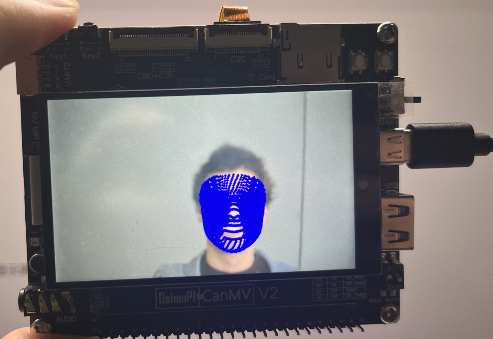

# 3D人脸网格

## 1.实验目的

进行3D人脸网格的估计。

## 2.核心代码

###  人脸检测任务类

类初始化 `__init__`

```
def __init__(self, kmodel_path, model_input_size, anchors, confidence_threshold=0.25, nms_threshold=0.3, rgb888p_size=[1280,720], display_size=[1920,1080], debug_mode=0):
```

主要参数解释：

- `kmodel_path`：模型路径
- `model_input_size`：模型输入尺寸（如 `[320, 240]`）
- `anchors`：YOLO 类型模型使用的锚框
- `confidence_threshold` 和 `nms_threshold`：置信度和非极大值抑制阈值
- `rgb888p_size`：Sensor 采集图像的分辨率
- `display_size`：最终显示分辨率
- `debug_mode`：是否开启调试

### 初始化成员变量

包括对 `Ai2d` 实例化和设置格式类型：

```
self.ai2d = Ai2d(debug_mode)
self.ai2d.set_ai2d_dtype(nn.ai2d_format.NCHW_FMT, nn.ai2d_format.NCHW_FMT, np.uint8, np.uint8)
```

表示图像预处理输入输出为 `NCHW` 格式，数据类型为 `uint8`。

### 预处理

```
self.ai2d.pad(self.get_pad_param(), 0, [104,117,123])
self.ai2d.resize(nn.interp_method.tf_bilinear, nn.interp_mode.half_pixel)
self.ai2d.build([1,3,ai2d_input_size[1],ai2d_input_size[0]],[1,3,self.model_input_size[1],self.model_input_size[0]])
```

- 使用 `pad()` 增加边缘空白以保持图像宽高比，pad 值由 `get_pad_param()` 自动计算
- 使用 `resize()` 将图像缩放到模型输入大小
- 使用 `build()` 构建整个预处理流程图

Padding参数计算 `get_pad_param()`

```
ratio = min(dst_w / src_w, dst_h / src_h)
new_w = ratio * src_w
new_h = ratio * src_h
dw = dst_w - new_w
dh = dst_h - new_h
```

此函数按比例缩放图像，再对边缘加 padding 保持居中，避免图像变形。

### 后处理

```
            res = aidemo.face_det_post_process(self.confidence_threshold,self.nms_threshold,self.model_input_size[0],self.anchors,self.rgb888p_size,results)
```

- `aidemo.face_det_post_process()` 是 CanMV 提供的 C 库函数，处理 YOLO 检测框输出，包括解码、过滤低分数框、NMS 等。
- 输出结果是多个检测框，若有多个结果返回 `res[0]` 作为主结果。

### 人脸网格检测任务类

这个类的任务是在人脸框中提取关键点参数（一般是 3D 姿态或 3D 网格）。

初始化时加载均值/方差参数

```
self.param_mean = np.array([...])
self.param_std = np.array([...])
```

这些是用于模型输出反归一化的参数，YOLOv8-face-mesh 或类似模型的输出一般是一个归一化的人脸参数向量。

### 预处理

```
roi = self.parse_roi_box_from_bbox(det)
self.ai2d.crop(int(roi[0]),int(roi[1]),int(roi[2]),int(roi[3]))
self.ai2d.resize(nn.interp_method.tf_bilinear, nn.interp_mode.half_pixel)
self.ai2d.build([1,3,ai2d_input_size[1],ai2d_input_size[0]],[1,3,self.model_input_size[1],self.model_input_size[0]])
```

- 根据人脸框 `det` 提取 `roi` 区域
- 使用 `crop()` 截取该区域并做 `resize`，构建模型输入数据流

### ROI计算

```
old_size = (w + h) / 2
center_x = x + w/2
center_y = y + h/2 + old_size * 0.14
size = old_size * 1.58
```

该方法是 FaceMesh 论文中标准的人脸裁剪方式，中心稍微偏下，区域稍微放大。

### 后处理

```
param = results[0] * self.param_std + self.param_mean
```

模型输出是一个归一化向量，对它进行反归一化以获得真实的人脸姿态参数。

### 完整流程

1. 使用 `FaceDetApp` 处理图像得到人脸框：

   ```
   face_bbox = face_det_app.postprocess(results_from_model)
   ```

2. 使用 `FaceMeshApp` 读取该人脸框，预处理并进行推理：

   ```
   roi = face_mesh_app.config_preprocess(face_bbox)
   face_param = face_mesh_app.postprocess(results_from_mesh_model)
   ```

## 3.示例代码

```
'''
本程序遵循GPL V3协议, 请遵循协议
实验平台： DshanPI CanMV
开发板文档站点	: https://eai.100ask.net/
百问网学习平台   : https://www.100ask.net
百问网官方B站    : https://space.bilibili.com/275908810
百问网官方淘宝   : https://100ask.taobao.com
'''
from libs.PipeLine import PipeLine, ScopedTiming
from libs.AIBase import AIBase
from libs.AI2D import Ai2d
import os
import ujson
from media.media import *
from time import *
import nncase_runtime as nn
import ulab.numpy as np
import time
import image
import aidemo
import random
import gc
import sys

# 自定义人脸检测任务类
class FaceDetApp(AIBase):
    def __init__(self,kmodel_path,model_input_size,anchors,confidence_threshold=0.25,nms_threshold=0.3,rgb888p_size=[1280,720],display_size=[1920,1080],debug_mode=0):
        super().__init__(kmodel_path,model_input_size,rgb888p_size,debug_mode)
        # kmodel路径
        self.kmodel_path=kmodel_path
        # 检测模型输入分辨率
        self.model_input_size=model_input_size
        # 置信度阈值
        self.confidence_threshold=confidence_threshold
        # nms阈值
        self.nms_threshold=nms_threshold
        # 检测任务锚框
        self.anchors=anchors
        # sensor给到AI的图像分辨率，宽16字节对齐
        self.rgb888p_size=[ALIGN_UP(rgb888p_size[0],16),rgb888p_size[1]]
        # 视频输出VO分辨率，宽16字节对齐
        self.display_size=[ALIGN_UP(display_size[0],16),display_size[1]]
        # debug模式
        self.debug_mode=debug_mode
        # 实例化Ai2d，用于实现模型预处理
        self.ai2d=Ai2d(debug_mode)
        # 设置Ai2d的输入输出格式和类型
        self.ai2d.set_ai2d_dtype(nn.ai2d_format.NCHW_FMT,nn.ai2d_format.NCHW_FMT,np.uint8, np.uint8)

    # 配置预处理操作，这里使用了pad和resize，Ai2d支持crop/shift/pad/resize/affine，具体代码请打开/sdcard/app/libs/AI2D.py查看
    def config_preprocess(self,input_image_size=None):
        with ScopedTiming("set preprocess config",self.debug_mode > 0):
            # 初始化ai2d预处理配置，默认为sensor给到AI的尺寸，可以通过设置input_image_size自行修改输入尺寸
            ai2d_input_size=input_image_size if input_image_size else self.rgb888p_size
            # 设置padding预处理
            self.ai2d.pad(self.get_pad_param(), 0, [104,117,123])
            # 设置resize预处理
            self.ai2d.resize(nn.interp_method.tf_bilinear, nn.interp_mode.half_pixel)
            # 构建预处理流程,参数为预处理输入tensor的shape和预处理输出的tensor的shape
            self.ai2d.build([1,3,ai2d_input_size[1],ai2d_input_size[0]],[1,3,self.model_input_size[1],self.model_input_size[0]])

    # 自定义后处理，results是模型推理输出的array列表，这里使用了aidemo库的face_det_post_process接口
    def postprocess(self,results):
        with ScopedTiming("postprocess",self.debug_mode > 0):
            res = aidemo.face_det_post_process(self.confidence_threshold,self.nms_threshold,self.model_input_size[0],self.anchors,self.rgb888p_size,results)
            if len(res)==0:
                return res
            else:
                return res[0]

    # padding参数计算
    def get_pad_param(self):
        dst_w = self.model_input_size[0]
        dst_h = self.model_input_size[1]
        # 计算最小的缩放比例，等比例缩放
        ratio_w = dst_w / self.rgb888p_size[0]
        ratio_h = dst_h / self.rgb888p_size[1]
        if ratio_w < ratio_h:
            ratio = ratio_w
        else:
            ratio = ratio_h
        new_w = (int)(ratio * self.rgb888p_size[0])
        new_h = (int)(ratio * self.rgb888p_size[1])
        dw = (dst_w - new_w) / 2
        dh = (dst_h - new_h) / 2
        top = (int)(round(0))
        bottom = (int)(round(dh * 2 + 0.1))
        left = (int)(round(0))
        right = (int)(round(dw * 2 - 0.1))
        return [0,0,0,0,top, bottom, left, right]

# 自定义人脸网格任务类
class FaceMeshApp(AIBase):
    def __init__(self,kmodel_path,model_input_size,rgb888p_size=[1920,1080],display_size=[1920,1080],debug_mode=0):
        super().__init__(kmodel_path,model_input_size,rgb888p_size,debug_mode)
        # kmodel路径
        self.kmodel_path=kmodel_path
        # 人脸网格模型输入分辨率
        self.model_input_size=model_input_size
        # sensor给到AI的图像分辨率，宽16字节对齐
        self.rgb888p_size=[ALIGN_UP(rgb888p_size[0],16),rgb888p_size[1]]
        # 视频输出VO分辨率，宽16字节对齐
        self.display_size=[ALIGN_UP(display_size[0],16),display_size[1]]
        # debug模式
        self.debug_mode=debug_mode
        # 人脸mesh参数均值
        self.param_mean = np.array([0.0003492636315058917,2.52790130161884e-07,-6.875197868794203e-07,60.1679573059082,-6.295513230725192e-07,0.0005757200415246189,-5.085391239845194e-05,74.2781982421875,5.400917189035681e-07,6.574138387804851e-05,0.0003442012530285865,-66.67157745361328,-346603.6875,-67468.234375,46822.265625,-15262.046875,4350.5888671875,-54261.453125,-18328.033203125,-1584.328857421875,-84566.34375,3835.960693359375,-20811.361328125,38094.9296875,-19967.85546875,-9241.3701171875,-19600.71484375,13168.08984375,-5259.14404296875,1848.6478271484375,-13030.662109375,-2435.55615234375,-2254.20654296875,-14396.5615234375,-6176.3291015625,-25621.919921875,226.39447021484375,-6326.12353515625,-10867.2509765625,868.465087890625,-5831.14794921875,2705.123779296875,-3629.417724609375,2043.9901123046875,-2446.6162109375,3658.697021484375,-7645.98974609375,-6674.45263671875,116.38838958740234,7185.59716796875,-1429.48681640625,2617.366455078125,-1.2070955038070679,0.6690792441368103,-0.17760828137397766,0.056725528091192245,0.03967815637588501,-0.13586315512657166,-0.09223993122577667,-0.1726071834564209,-0.015804484486579895,-0.1416848599910736],dtype=np.float)
        # 人脸mesh参数方差
        self.param_std = np.array([0.00017632152594160289,6.737943476764485e-05,0.00044708489440381527,26.55023193359375,0.0001231376954820007,4.493021697271615e-05,7.923670636955649e-05,6.982563018798828,0.0004350444069132209,0.00012314890045672655,0.00017400001524947584,20.80303955078125,575421.125,277649.0625,258336.84375,255163.125,150994.375,160086.109375,111277.3046875,97311.78125,117198.453125,89317.3671875,88493.5546875,72229.9296875,71080.2109375,50013.953125,55968.58203125,47525.50390625,49515.06640625,38161.48046875,44872.05859375,46273.23828125,38116.76953125,28191.162109375,32191.4375,36006.171875,32559.892578125,25551.1171875,24267.509765625,27521.3984375,23166.53125,21101.576171875,19412.32421875,19452.203125,17454.984375,22537.623046875,16174.28125,14671.640625,15115.6884765625,13870.0732421875,13746.3125,12663.1337890625,1.5870834589004517,1.5077009201049805,0.5881357789039612,0.5889744758605957,0.21327851712703705,0.2630201280117035,0.2796429395675659,0.38030216097831726,0.16162841022014618,0.2559692859649658],dtype=np.float)
        # 实例化Ai2d，用于实现模型预处理
        self.ai2d=Ai2d(debug_mode)
        # 设置Ai2d的输入输出格式和类型
        self.ai2d.set_ai2d_dtype(nn.ai2d_format.NCHW_FMT,nn.ai2d_format.NCHW_FMT,np.uint8, np.uint8)

    # 配置预处理操作，这里使用了crop和resize，Ai2d支持crop/shift/pad/resize/affine，具体代码请打开/sdcard/app/libs/AI2D.py查看
    def config_preprocess(self,det,input_image_size=None):
        with ScopedTiming("set preprocess config",self.debug_mode > 0):
            # 初始化ai2d预处理配置，默认为sensor给到AI的尺寸，可以通过设置input_image_size自行修改输入尺寸
            ai2d_input_size=input_image_size if input_image_size else self.rgb888p_size
            # 计算crop参数，并设置crop预处理
            roi = self.parse_roi_box_from_bbox(det)
            self.ai2d.crop(int(roi[0]),int(roi[1]),int(roi[2]),int(roi[3]))
            # 设置resize预处理
            self.ai2d.resize(nn.interp_method.tf_bilinear, nn.interp_mode.half_pixel)
            # 构建预处理流程,参数为预处理输入tensor的shape和预处理输出的tensor的shape
            self.ai2d.build([1,3,ai2d_input_size[1],ai2d_input_size[0]],[1,3,self.model_input_size[1],self.model_input_size[0]])
            return roi

    # 自定义后处理，results是模型输出的array列表
    def postprocess(self,results):
        with ScopedTiming("postprocess",self.debug_mode > 0):
            param = results[0] * self.param_std + self.param_mean
            return param

    def parse_roi_box_from_bbox(self,bbox):
        # 获取人脸roi
        x1, y1, w, h = map(lambda x: int(round(x, 0)), bbox[:4])
        old_size = (w + h) / 2
        center_x = x1 + w / 2
        center_y = y1 + h / 2 + old_size * 0.14
        size = int(old_size * 1.58)
        x0 = center_x - float(size) / 2
        y0 = center_y - float(size) / 2
        x1 = x0 + size
        y1 = y0 + size
        x0 = max(0, min(x0, self.rgb888p_size[0]))
        y0 = max(0, min(y0, self.rgb888p_size[1]))
        x1 = max(0, min(x1, self.rgb888p_size[0]))
        y1 = max(0, min(y1, self.rgb888p_size[1]))
        roi = (x0, y0, x1 - x0, y1 - y0)
        return roi

# 自定义人脸网格后处理任务类
class FaceMeshPostApp(AIBase):
    def __init__(self,kmodel_path,model_input_size,rgb888p_size=[1920,1080],display_size=[1920,1080],debug_mode=0):
        super().__init__(kmodel_path,model_input_size,rgb888p_size,debug_mode)
        # kmodel路径
        self.kmodel_path=kmodel_path
        # 人脸网格模型输入分辨率
        self.model_input_size=model_input_size
        # sensor给到AI的图像分辨率，宽16字节对齐
        self.rgb888p_size=[ALIGN_UP(rgb888p_size[0],16),rgb888p_size[1]]
        # 视频输出VO分辨率，宽16字节对齐
        self.display_size=[ALIGN_UP(display_size[0],16),display_size[1]]
        # debug模式
        self.debug_mode=debug_mode
        # 实例化Ai2d，用于实现模型预处理
        self.ai2d=Ai2d(debug_mode)
        # 设置Ai2d的输入输出格式和类型
        self.ai2d.set_ai2d_dtype(nn.ai2d_format.NCHW_FMT,nn.ai2d_format.NCHW_FMT,np.uint8, np.uint8)

    # 重写预处理函数preprocess，因为该模型的预处理不是单纯调用一个ai2d能实现的，返回模型输入的tensor列表
    def preprocess(self,param):
        with ScopedTiming("set preprocess config",self.debug_mode > 0):
            # face mesh post模型预处理，param解析
            param = param[0]
            trans_dim, shape_dim, exp_dim = 12, 40, 10
            R_ = param[:trans_dim].copy().reshape((3, -1))
            R = R_[:, :3].copy()
            offset = R_[:, 3].copy()
            offset = offset.reshape((3, 1))
            alpha_shp = param[trans_dim:trans_dim + shape_dim].copy().reshape((-1, 1))
            alpha_exp = param[trans_dim + shape_dim:].copy().reshape((-1, 1))
            R_tensor = nn.from_numpy(R)
            offset_tensor = nn.from_numpy(offset)
            alpha_shp_tensor = nn.from_numpy(alpha_shp)
            alpha_exp_tensor = nn.from_numpy(alpha_exp)
            return [R_tensor,offset_tensor,alpha_shp_tensor,alpha_exp_tensor]

    # 自定义模型后处理，这里调用了aidemo的face_mesh_post_process接口
    def postprocess(self,results,roi):
        with ScopedTiming("postprocess",self.debug_mode > 0):
            x, y, w, h = map(lambda x: int(round(x, 0)), roi[:4])
            x = x * self.display_size[0] // self.rgb888p_size[0]
            y = y * self.display_size[1] // self.rgb888p_size[1]
            w = w * self.display_size[0] // self.rgb888p_size[0]
            h = h * self.display_size[1] // self.rgb888p_size[1]
            roi_array = np.array([x,y,w,h],dtype=np.float)
            aidemo.face_mesh_post_process(roi_array,results[0])
            return results[0]

# 3D人脸网格
class FaceMesh:
    def __init__(self,face_det_kmodel,face_mesh_kmodel,mesh_post_kmodel,det_input_size,mesh_input_size,anchors,confidence_threshold=0.25,nms_threshold=0.3,rgb888p_size=[1920,1080],display_size=[1920,1080],debug_mode=0):
        # 人脸检测模型路径
        self.face_det_kmodel=face_det_kmodel
        # 人脸3D网格模型路径
        self.face_mesh_kmodel=face_mesh_kmodel
        # 人脸3D网格后处理模型路径
        self.mesh_post_kmodel=mesh_post_kmodel
        # 人脸检测模型输入分辨率
        self.det_input_size=det_input_size
        # 人脸3D网格模型输入分辨率
        self.mesh_input_size=mesh_input_size
        # anchors
        self.anchors=anchors
        # 置信度阈值
        self.confidence_threshold=confidence_threshold
        # nms阈值
        self.nms_threshold=nms_threshold
        # sensor给到AI的图像分辨率，宽16字节对齐
        self.rgb888p_size=[ALIGN_UP(rgb888p_size[0],16),rgb888p_size[1]]
        # 视频输出VO分辨率，宽16字节对齐
        self.display_size=[ALIGN_UP(display_size[0],16),display_size[1]]
        # debug_mode模式
        self.debug_mode=debug_mode
        # 人脸检测实例
        self.face_det=FaceDetApp(self.face_det_kmodel,model_input_size=self.det_input_size,anchors=self.anchors,confidence_threshold=self.confidence_threshold,nms_threshold=self.nms_threshold,rgb888p_size=self.rgb888p_size,display_size=self.display_size,debug_mode=0)
        # 人脸网格实例
        self.face_mesh=FaceMeshApp(self.face_mesh_kmodel,model_input_size=self.mesh_input_size,rgb888p_size=self.rgb888p_size,display_size=self.display_size)
        # 人脸网格后处理实例
        self.face_mesh_post=FaceMeshPostApp(self.mesh_post_kmodel,model_input_size=self.mesh_input_size,rgb888p_size=self.rgb888p_size,display_size=self.display_size)
        # 人脸检测预处理配置
        self.face_det.config_preprocess()

    # run函数
    def run(self,input_np):
        # 执行人脸检测
        det_boxes=self.face_det.run(input_np)
        mesh_res=[]
        for det_box in det_boxes:
            # 对检测到的每一个人脸配置预处理，执行人脸网格和人脸网格后处理
            roi=self.face_mesh.config_preprocess(det_box)
            param=self.face_mesh.run(input_np)
            tensors=self.face_mesh_post.preprocess(param)
            results=self.face_mesh_post.inference(tensors)
            res=self.face_mesh_post.postprocess(results,roi)
            mesh_res.append(res)
        return det_boxes,mesh_res


    # 绘制人脸解析效果
    def draw_result(self,pl,dets,mesh_res):
        pl.osd_img.clear()
        if dets:
            draw_img_np = np.zeros((self.display_size[1],self.display_size[0],4),dtype=np.uint8)
            draw_img = image.Image(self.display_size[0], self.display_size[1], image.ARGB8888, alloc=image.ALLOC_REF,data = draw_img_np)
            for vertices in mesh_res:
                aidemo.face_draw_mesh(draw_img_np, vertices)
            pl.osd_img.copy_from(draw_img)


if __name__=="__main__":
    # 显示模式，默认"hdmi",可以选择"hdmi"和"lcd"，k230d受限于内存不支持
    display_mode="lcd"
    if display_mode=="hdmi":
        display_size=[1920,1080]
    else:
        display_size=[800,480]
    # 人脸检测模型路径
    face_det_kmodel_path="/sdcard/examples/kmodel/face_detection_320.kmodel"
    # 人脸网格模型路径
    face_mesh_kmodel_path="/sdcard/examples/kmodel/face_alignment.kmodel"
    # 人脸网格后处理模型路径
    face_mesh_post_kmodel_path="/sdcard/examples/kmodel/face_alignment_post.kmodel"
    # 其他参数
    anchors_path="/sdcard/examples/utils/prior_data_320.bin"
    rgb888p_size=[1920,1080]
    face_det_input_size=[320,320]
    face_mesh_input_size=[120,120]
    confidence_threshold=0.5
    nms_threshold=0.2
    anchor_len=4200
    det_dim=4
    anchors = np.fromfile(anchors_path, dtype=np.float)
    anchors = anchors.reshape((anchor_len,det_dim))

    # 初始化PipeLine，只关注传给AI的图像分辨率，显示的分辨率
    pl=PipeLine(rgb888p_size=rgb888p_size,display_size=display_size,display_mode=display_mode)
    pl.create()
    fm=FaceMesh(face_det_kmodel_path,face_mesh_kmodel_path,face_mesh_post_kmodel_path,det_input_size=face_det_input_size,mesh_input_size=face_mesh_input_size,anchors=anchors,confidence_threshold=confidence_threshold,nms_threshold=nms_threshold,rgb888p_size=rgb888p_size,display_size=display_size)
    try:
        while True:
            os.exitpoint()
            with ScopedTiming("total",1):
                img=pl.get_frame()                      # 获取当前帧
                det_boxes,mesh_res=fm.run(img)          # 推理当前帧
                fm.draw_result(pl,det_boxes,mesh_res)   # 绘制推理结果
                pl.show_image()                         # 显示推理效果
                gc.collect()
    except Exception as e:
        sys.print_exception(e)
    finally:
        fm.face_det.deinit()
        fm.face_mesh.deinit()
        fm.face_mesh_post.deinit()
        pl.destroy()


```

## 4.实验结果


​	点击运行代码后，可以在显示屏上看到3D人脸网格的结果。如下所示：


