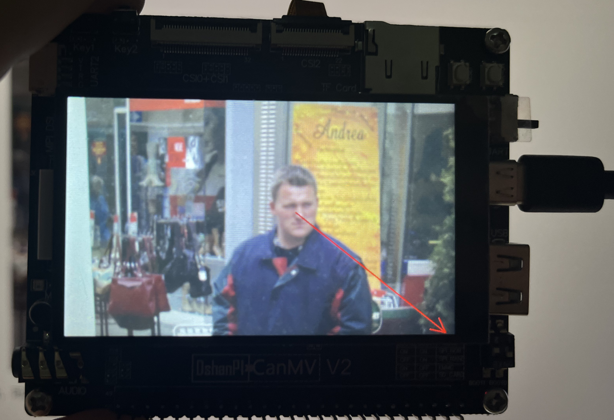

# 人脸注视方向检测

## 1.实验目的

通过人脸和眼睛的特征来确定人的注视方向。

## 2.核心代码

```
          +-----------------+
          |    PipeLine     |  ← 图像采集、显示、OSD图像管理
          +-----------------+
                   |
                   v
       +------------------------+
       |      face_app.run()    |  ← 人脸检测 (YOLOv8 模型)
       +------------------------+
                   |
        人脸框 dets: [x, y, w, h]
                   |
                   v
       +------------------------+
       |     eye_app.run()      |  ← 注视方向估计 (gaze 模型)
       +------------------------+
                   |
        注视角度 gaze_res: [yaw, pitch]
                   |
                   v
       +------------------------+
       | eye_app.draw_result() |  ← OSD 图像上绘制方向箭头
       +------------------------+
```


## 3.示例代码

```
'''
本程序遵循GPL V3协议, 请遵循协议
实验平台： DshanPI CanMV
开发板文档站点	: https://eai.100ask.net/
百问网学习平台   : https://www.100ask.net
百问网官方B站    : https://space.bilibili.com/275908810
百问网官方淘宝   : https://100ask.taobao.com
'''
from libs.PipeLine import PipeLine, ScopedTiming
from libs.AIBase import AIBase
from libs.AI2D import Ai2d
import os
import ujson
from media.media import *
from time import *
import nncase_runtime as nn
import ulab.numpy as np
import time
import image
import aidemo
import random
import gc
import sys
import math

# 自定义人脸检测任务类
class FaceDetApp(AIBase):
    def __init__(self,kmodel_path,model_input_size,anchors,confidence_threshold=0.25,nms_threshold=0.3,rgb888p_size=[1280,720],display_size=[1920,1080],debug_mode=0):
        super().__init__(kmodel_path,model_input_size,rgb888p_size,debug_mode)
        # kmodel路径
        self.kmodel_path=kmodel_path
        # 检测模型输入分辨率
        self.model_input_size=model_input_size
        # 置信度阈值
        self.confidence_threshold=confidence_threshold
        # nms阈值
        self.nms_threshold=nms_threshold
        self.anchors=anchors
        # sensor给到AI的图像分辨率，宽16字节对齐
        self.rgb888p_size=[ALIGN_UP(rgb888p_size[0],16),rgb888p_size[1]]
        # 视频输出VO分辨率，宽16字节对齐
        self.display_size=[ALIGN_UP(display_size[0],16),display_size[1]]
        # debug模式
        self.debug_mode=debug_mode
        # Ai2d实例，用于实现模型预处理
        self.ai2d=Ai2d(debug_mode)
        # 设置Ai2d的输入输出格式和类型
        self.ai2d.set_ai2d_dtype(nn.ai2d_format.NCHW_FMT,nn.ai2d_format.NCHW_FMT,np.uint8, np.uint8)

    # 配置预处理操作，这里使用了padding和resize，Ai2d支持crop/shift/pad/resize/affine，具体代码请打开/sdcard/app/libs/AI2D.py查看
    def config_preprocess(self,input_image_size=None):
        with ScopedTiming("set preprocess config",self.debug_mode > 0):
            # 初始化ai2d预处理配置，默认为sensor给到AI的尺寸，可以通过设置input_image_size自行修改输入尺寸
            ai2d_input_size=input_image_size if input_image_size else self.rgb888p_size
            # 设置padding预处理
            self.ai2d.pad(self.get_pad_param(), 0, [104,117,123])
            # 设置resize预处理
            self.ai2d.resize(nn.interp_method.tf_bilinear, nn.interp_mode.half_pixel)
            # 构建预处理流程,参数为预处理输入tensor的shape和预处理输出的tensor的shape
            self.ai2d.build([1,3,ai2d_input_size[1],ai2d_input_size[0]],[1,3,self.model_input_size[1],self.model_input_size[0]])

    # 自定义任务后处理,这里使用了aidemo库的face_det_post_process接口
    def postprocess(self,results):
        with ScopedTiming("postprocess",self.debug_mode > 0):
            res = aidemo.face_det_post_process(self.confidence_threshold,self.nms_threshold,self.model_input_size[0],self.anchors,self.rgb888p_size,results)
            if len(res)==0:
                return res
            else:
                return res[0]

    # 计算padding参数
    def get_pad_param(self):
        dst_w = self.model_input_size[0]
        dst_h = self.model_input_size[1]
        # 计算最小的缩放比例，等比例缩放
        ratio_w = dst_w / self.rgb888p_size[0]
        ratio_h = dst_h / self.rgb888p_size[1]
        if ratio_w < ratio_h:
            ratio = ratio_w
        else:
            ratio = ratio_h
        new_w = (int)(ratio * self.rgb888p_size[0])
        new_h = (int)(ratio * self.rgb888p_size[1])
        dw = (dst_w - new_w) / 2
        dh = (dst_h - new_h) / 2
        top = (int)(round(0))
        bottom = (int)(round(dh * 2 + 0.1))
        left = (int)(round(0))
        right = (int)(round(dw * 2 - 0.1))
        return [0,0,0,0,top, bottom, left, right]

# 自定义注视估计任务类
class EyeGazeApp(AIBase):
    def __init__(self,kmodel_path,model_input_size,rgb888p_size=[1920,1080],display_size=[1920,1080],debug_mode=0):
        super().__init__(kmodel_path,model_input_size,rgb888p_size,debug_mode)
        # kmodel路径
        self.kmodel_path=kmodel_path
        # 注视估计模型输入分辨率
        self.model_input_size=model_input_size
        # sensor给到AI的图像分辨率，宽16字节对齐
        self.rgb888p_size=[ALIGN_UP(rgb888p_size[0],16),rgb888p_size[1]]
        # 视频输出VO分辨率，宽16字节对齐
        self.display_size=[ALIGN_UP(display_size[0],16),display_size[1]]
        # debug模式
        self.debug_mode=debug_mode
        # Ai2d实例，用于实现模型预处理
        self.ai2d=Ai2d(debug_mode)
        # 设置Ai2d的输入输出格式和类型
        self.ai2d.set_ai2d_dtype(nn.ai2d_format.NCHW_FMT,nn.ai2d_format.NCHW_FMT,np.uint8, np.uint8)

    # 配置预处理操作，这里使用了crop和resize，Ai2d支持crop/shift/pad/resize/affine，具体代码请打开/sdcard/app/libs/AI2D.py查看
    def config_preprocess(self,det,input_image_size=None):
        with ScopedTiming("set preprocess config",self.debug_mode > 0):
            # 初始化ai2d预处理配置
            ai2d_input_size=input_image_size if input_image_size else self.rgb888p_size
            # 计算crop预处理参数
            x, y, w, h = map(lambda x: int(round(x, 0)), det[:4])
            # 设置crop预处理
            self.ai2d.crop(x,y,w,h)
            # 设置resize预处理
            self.ai2d.resize(nn.interp_method.tf_bilinear, nn.interp_mode.half_pixel)
            # 构建预处理流程,参数为预处理输入tensor的shape和预处理输出的tensor的shape
            self.ai2d.build([1,3,ai2d_input_size[1],ai2d_input_size[0]],[1,3,self.model_input_size[1],self.model_input_size[0]])

    # 自定义后处理，results是模型输出的array列表，这里调用了aidemo库的eye_gaze_post_process接口
    def postprocess(self,results):
        with ScopedTiming("postprocess",self.debug_mode > 0):
            post_ret = aidemo.eye_gaze_post_process(results)
            return post_ret[0],post_ret[1]

# 自定义注视估计类
class EyeGaze:
    def __init__(self,face_det_kmodel,eye_gaze_kmodel,det_input_size,eye_gaze_input_size,anchors,confidence_threshold=0.25,nms_threshold=0.3,rgb888p_size=[1920,1080],display_size=[1920,1080],debug_mode=0):
        # 人脸检测模型路径
        self.face_det_kmodel=face_det_kmodel
        # 人脸注视估计模型路径
        self.eye_gaze_kmodel=eye_gaze_kmodel
        # 人脸检测模型输入分辨率
        self.det_input_size=det_input_size
        # 人脸注视估计模型输入分辨率
        self.eye_gaze_input_size=eye_gaze_input_size
        # anchors
        self.anchors=anchors
        # 置信度阈值
        self.confidence_threshold=confidence_threshold
        # nms阈值
        self.nms_threshold=nms_threshold
        # sensor给到AI的图像分辨率，宽16字节对齐
        self.rgb888p_size=[ALIGN_UP(rgb888p_size[0],16),rgb888p_size[1]]
        # 视频输出VO分辨率，宽16字节对齐
        self.display_size=[ALIGN_UP(display_size[0],16),display_size[1]]
        # debug_mode模式
        self.debug_mode=debug_mode
        # 人脸检测实例
        self.face_det=FaceDetApp(self.face_det_kmodel,model_input_size=self.det_input_size,anchors=self.anchors,confidence_threshold=self.confidence_threshold,nms_threshold=self.nms_threshold,rgb888p_size=self.rgb888p_size,display_size=self.display_size,debug_mode=0)
        # 注视估计实例
        self.eye_gaze=EyeGazeApp(self.eye_gaze_kmodel,model_input_size=self.eye_gaze_input_size,rgb888p_size=self.rgb888p_size,display_size=self.display_size)
        # 人脸检测配置预处理
        self.face_det.config_preprocess()

    #run方法
    def run(self,input_np):
        # 先进行人脸检测
        det_boxes=self.face_det.run(input_np)
        eye_gaze_res=[]
        for det_box in det_boxes:
            # 对每一个检测到的人脸做注视估计
            self.eye_gaze.config_preprocess(det_box)
            pitch,yaw=self.eye_gaze.run(input_np)
            eye_gaze_res.append((pitch,yaw))
        return det_boxes,eye_gaze_res

    # 绘制注视估计效果
    def draw_result(self,pl,dets,eye_gaze_res):
        pl.osd_img.clear()
        if dets:
            for det,gaze_ret in zip(dets,eye_gaze_res):
                pitch , yaw = gaze_ret
                length = self.display_size[0]/ 2
                x, y, w, h = map(lambda x: int(round(x, 0)), det[:4])
                x = x * self.display_size[0] // self.rgb888p_size[0]
                y = y * self.display_size[1] // self.rgb888p_size[1]
                w = w * self.display_size[0] // self.rgb888p_size[0]
                h = h * self.display_size[1] // self.rgb888p_size[1]
                center_x = (x + w / 2.0)
                center_y = (y + h / 2.0)
                dx = -length * math.sin(pitch) * math.cos(yaw)
                target_x = int(center_x + dx)
                dy = -length * math.sin(yaw)
                target_y = int(center_y + dy)
                pl.osd_img.draw_arrow(int(center_x), int(center_y), target_x, target_y, color = (255,255,0,0), size = 30, thickness = 2)


if __name__=="__main__":
    # 显示模式，默认"hdmi",可以选择"hdmi"和"lcd"，k230d受限于内存不支持
    display_mode="lcd"
    if display_mode=="hdmi":
        display_size=[1920,1080]
    else:
        display_size=[800,480]
    # 人脸检测模型路径
    face_det_kmodel_path="/sdcard/examples/kmodel/face_detection_320.kmodel"
    # 人脸注视估计模型路径
    eye_gaze_kmodel_path="/sdcard/examples/kmodel/eye_gaze.kmodel"
    # 其他参数
    anchors_path="/sdcard/examples/utils/prior_data_320.bin"
    rgb888p_size=[1920,1080]
    face_det_input_size=[320,320]
    eye_gaze_input_size=[448,448]
    confidence_threshold=0.5
    nms_threshold=0.2
    anchor_len=4200
    det_dim=4
    anchors = np.fromfile(anchors_path, dtype=np.float)
    anchors = anchors.reshape((anchor_len,det_dim))

    # 初始化PipeLine，只关注传给AI的图像分辨率，显示的分辨率
    pl=PipeLine(rgb888p_size=rgb888p_size,display_size=display_size,display_mode=display_mode)
    pl.create()
    eg=EyeGaze(face_det_kmodel_path,eye_gaze_kmodel_path,det_input_size=face_det_input_size,eye_gaze_input_size=eye_gaze_input_size,anchors=anchors,confidence_threshold=confidence_threshold,nms_threshold=nms_threshold,rgb888p_size=rgb888p_size,display_size=display_size)
    try:
        while True:
            os.exitpoint()
            with ScopedTiming("total",1):
                img=pl.get_frame()                          # 获取当前帧
                det_boxes,eye_gaze_res=eg.run(img)          # 推理当前帧
                eg.draw_result(pl,det_boxes,eye_gaze_res)   # 绘制推理效果
                pl.show_image()                             # 展示推理效果
                gc.collect()
    except Exception as e:
        sys.print_exception(e)
    finally:
        eg.face_det.deinit()
        eg.eye_gaze.deinit()
        pl.destroy()
```

## 4.实验结果


​	点击运行代码后，可以在显示屏上看到人脸注视方向检测的结果。如下所示：


