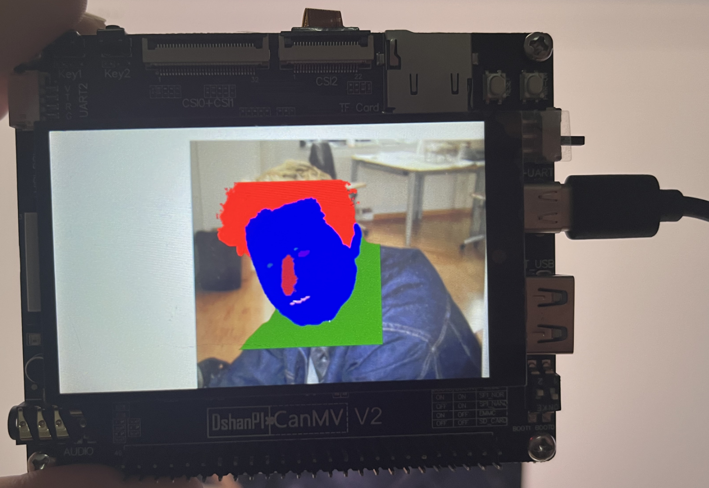

# 人脸解析（分割）

## 1.学习目的

**人脸分割**是指对人脸图像进行像素级别的精细划分，将图像中的不同区域（如眼睛、鼻子、嘴巴、头发及背景等）区分开来并赋予明确的类别标签。
 相比于人脸检测或关键点定位，人脸分割不仅关注人脸的位置，还关注面部内部结构的具体区域划分，提供更丰富、更精确的语义信息。


## 2.示例代码

```
'''
本程序遵循GPL V3协议, 请遵循协议
实验平台： DshanPI CanMV
开发板文档站点	: https://eai.100ask.net/
百问网学习平台   : https://www.100ask.net
百问网官方B站    : https://space.bilibili.com/275908810
百问网官方淘宝   : https://100ask.taobao.com
'''
from libs.PipeLine import PipeLine, ScopedTiming
from libs.AIBase import AIBase
from libs.AI2D import Ai2d
import os
import ujson
from media.media import *
from time import *
import nncase_runtime as nn
import ulab.numpy as np
import time
import image
import aidemo
import random
import gc
import sys

# 自定义人脸检测任务类
class FaceDetApp(AIBase):
    def __init__(self,kmodel_path,model_input_size,anchors,confidence_threshold=0.25,nms_threshold=0.3,rgb888p_size=[1280,720],display_size=[1920,1080],debug_mode=0):
        super().__init__(kmodel_path,model_input_size,rgb888p_size,debug_mode)
        # kmodel路径
        self.kmodel_path=kmodel_path
        # 检测模型输入分辨率
        self.model_input_size=model_input_size
        # 置信度阈值
        self.confidence_threshold=confidence_threshold
        # nms阈值
        self.nms_threshold=nms_threshold
        self.anchors=anchors
        # sensor给到AI的图像分辨率，宽16字节对齐
        self.rgb888p_size=[ALIGN_UP(rgb888p_size[0],16),rgb888p_size[1]]
        # 视频输出VO分辨率，宽16字节对齐
        self.display_size=[ALIGN_UP(display_size[0],16),display_size[1]]
        # debug模式
        self.debug_mode=debug_mode
        # 实例化Ai2d，用于实现模型预处理
        self.ai2d=Ai2d(debug_mode)
        # 设置Ai2d的输入输出格式和类型
        self.ai2d.set_ai2d_dtype(nn.ai2d_format.NCHW_FMT,nn.ai2d_format.NCHW_FMT,np.uint8, np.uint8)

    # 配置预处理操作，这里使用了pad和resize，Ai2d支持crop/shift/pad/resize/affine，具体代码请打开/sdcard/app/libs/AI2D.py查看
    def config_preprocess(self,input_image_size=None):
        with ScopedTiming("set preprocess config",self.debug_mode > 0):
            # 初始化ai2d预处理配置，默认为sensor给到AI的尺寸，可以通过设置input_image_size自行修改输入尺寸
            ai2d_input_size=input_image_size if input_image_size else self.rgb888p_size
            # 计算padding参数，并设置padding预处理
            self.ai2d.pad(self.get_pad_param(), 0, [104,117,123])
            # 设置resize预处理
            self.ai2d.resize(nn.interp_method.tf_bilinear, nn.interp_mode.half_pixel)
            # 构建预处理流程,参数为预处理输入tensor的shape和预处理输出的tensor的shape
            self.ai2d.build([1,3,ai2d_input_size[1],ai2d_input_size[0]],[1,3,self.model_input_size[1],self.model_input_size[0]])

    # 自定义后处理，results是模型输出的array列表，这里调用了aidemo库的face_det_post_process接口
    def postprocess(self,results):
        with ScopedTiming("postprocess",self.debug_mode > 0):
            res = aidemo.face_det_post_process(self.confidence_threshold,self.nms_threshold,self.model_input_size[0],self.anchors,self.rgb888p_size,results)
            if len(res)==0:
                return res
            else:
                return res[0]

    # 计算padding参数
    def get_pad_param(self):
        dst_w = self.model_input_size[0]
        dst_h = self.model_input_size[1]
        # 计算最小的缩放比例，等比例缩放
        ratio_w = dst_w / self.rgb888p_size[0]
        ratio_h = dst_h / self.rgb888p_size[1]
        if ratio_w < ratio_h:
            ratio = ratio_w
        else:
            ratio = ratio_h
        new_w = (int)(ratio * self.rgb888p_size[0])
        new_h = (int)(ratio * self.rgb888p_size[1])
        dw = (dst_w - new_w) / 2
        dh = (dst_h - new_h) / 2
        top = (int)(round(0))
        bottom = (int)(round(dh * 2 + 0.1))
        left = (int)(round(0))
        right = (int)(round(dw * 2 - 0.1))
        return [0,0,0,0,top, bottom, left, right]

# 自定义人脸解析任务类
class FaceParseApp(AIBase):
    def __init__(self,kmodel_path,model_input_size,rgb888p_size=[1920,1080],display_size=[1920,1080],debug_mode=0):
        super().__init__(kmodel_path,model_input_size,rgb888p_size,debug_mode)
        # kmodel路径
        self.kmodel_path=kmodel_path
        # 检测模型输入分辨率
        self.model_input_size=model_input_size
        # sensor给到AI的图像分辨率，宽16字节对齐
        self.rgb888p_size=[ALIGN_UP(rgb888p_size[0],16),rgb888p_size[1]]
        # 视频输出VO分辨率，宽16字节对齐
        self.display_size=[ALIGN_UP(display_size[0],16),display_size[1]]
        # debug模式
        self.debug_mode=debug_mode
        # 实例化Ai2d，用于实现模型预处理
        self.ai2d=Ai2d(debug_mode)
        # 设置Ai2d的输入输出格式和类型
        self.ai2d.set_ai2d_dtype(nn.ai2d_format.NCHW_FMT,nn.ai2d_format.NCHW_FMT,np.uint8, np.uint8)

    # 配置预处理操作，这里使用了affine，Ai2d支持crop/shift/pad/resize/affine，具体代码请打开/sdcard/app/libs/AI2D.py查看
    def config_preprocess(self,det,input_image_size=None):
        with ScopedTiming("set preprocess config",self.debug_mode > 0):
            # 初始化ai2d预处理配置，默认为sensor给到AI的尺寸，可以通过设置input_image_size自行修改输入尺寸
            ai2d_input_size=input_image_size if input_image_size else self.rgb888p_size
            # 计算仿射变换矩阵并设置affine预处理
            matrix_dst = self.get_affine_matrix(det)
            self.ai2d.affine(nn.interp_method.cv2_bilinear,0, 0, 127, 1,matrix_dst)
            # 构建预处理流程,参数为预处理输入tensor的shape和预处理输出的tensor的shape
            self.ai2d.build([1,3,ai2d_input_size[1],ai2d_input_size[0]],[1,3,self.model_input_size[1],self.model_input_size[0]])

    # 自定义后处理，results是模型输出的array列表，这里将第一个输出返回
    def postprocess(self,results):
        with ScopedTiming("postprocess",self.debug_mode > 0):
            return results[0]

    def get_affine_matrix(self,bbox):
        # 获取仿射矩阵，用于将边界框映射到模型输入空间
        with ScopedTiming("get_affine_matrix", self.debug_mode > 1):
            # 设置缩放因子
            factor = 2.7
            # 从边界框提取坐标和尺寸
            x1, y1, w, h = map(lambda x: int(round(x, 0)), bbox[:4])
            # 模型输入大小
            edge_size = self.model_input_size[1]
            # 平移距离，使得模型输入空间的中心对准原点
            trans_distance = edge_size / 2.0
            # 计算边界框中心点的坐标
            center_x = x1 + w / 2.0
            center_y = y1 + h / 2.0
            # 计算最大边长
            maximum_edge = factor * (h if h > w else w)
            # 计算缩放比例
            scale = edge_size * 2.0 / maximum_edge
            # 计算平移参数
            cx = trans_distance - scale * center_x
            cy = trans_distance - scale * center_y
            # 创建仿射矩阵
            affine_matrix = [scale, 0, cx, 0, scale, cy]
            return affine_matrix

# 人脸解析任务
class FaceParse:
    def __init__(self,face_det_kmodel,face_parse_kmodel,det_input_size,parse_input_size,anchors,confidence_threshold=0.25,nms_threshold=0.3,rgb888p_size=[1920,1080],display_size=[1920,1080],debug_mode=0):
        # 人脸检测模型路径
        self.face_det_kmodel=face_det_kmodel
        # 人脸解析模型路径
        self.face_pose_kmodel=face_parse_kmodel
        # 人脸检测模型输入分辨率
        self.det_input_size=det_input_size
        # 人脸解析模型输入分辨率
        self.parse_input_size=parse_input_size
        # anchors
        self.anchors=anchors
        # 置信度阈值
        self.confidence_threshold=confidence_threshold
        # nms阈值
        self.nms_threshold=nms_threshold
        # sensor给到AI的图像分辨率，宽16字节对齐
        self.rgb888p_size=[ALIGN_UP(rgb888p_size[0],16),rgb888p_size[1]]
        # 视频输出VO分辨率，宽16字节对齐
        self.display_size=[ALIGN_UP(display_size[0],16),display_size[1]]
        # debug_mode模式
        self.debug_mode=debug_mode
        # 人脸检测任务类实例
        self.face_det=FaceDetApp(self.face_det_kmodel,model_input_size=self.det_input_size,anchors=self.anchors,confidence_threshold=self.confidence_threshold,nms_threshold=self.nms_threshold,rgb888p_size=self.rgb888p_size,display_size=self.display_size,debug_mode=0)
        # 人脸解析实例
        self.face_parse=FaceParseApp(self.face_pose_kmodel,model_input_size=self.parse_input_size,rgb888p_size=self.rgb888p_size,display_size=self.display_size)
        # 人脸检测预处理配置
        self.face_det.config_preprocess()

    # run函数
    def run(self,input_np):
        # 执行人脸检测
        det_boxes=self.face_det.run(input_np)
        parse_res=[]
        for det_box in det_boxes:
            # 对检测到每一个人脸进行人脸解析
            self.face_parse.config_preprocess(det_box)
            res=self.face_parse.run(input_np)
            parse_res.append(res)
        return det_boxes,parse_res


    # 绘制人脸解析效果
    def draw_result(self,pl,dets,parse_res):
        pl.osd_img.clear()
        if dets:
            draw_img_np = np.zeros((self.display_size[1],self.display_size[0],4),dtype=np.uint8)
            draw_img=image.Image(self.display_size[0], self.display_size[1], image.ARGB8888,alloc=image.ALLOC_REF,data=draw_img_np)
            for i,det in enumerate(dets):
                # （1）将人脸检测框画到draw_img
                x, y, w, h = map(lambda x: int(round(x, 0)), det[:4])
                x = x * self.display_size[0] // self.rgb888p_size[0]
                y = y * self.display_size[1] // self.rgb888p_size[1]
                w = w * self.display_size[0] // self.rgb888p_size[0]
                h = h * self.display_size[1] // self.rgb888p_size[1]
                aidemo.face_parse_post_process(draw_img_np,self.rgb888p_size,self.display_size,self.parse_input_size[0],det.tolist(),parse_res[i])
            pl.osd_img.copy_from(draw_img)


if __name__=="__main__":
    # 显示模式，默认"hdmi",可以选择"hdmi"和"lcd"，k230d受限于内存不支持
    display_mode="lcd"
    if display_mode=="hdmi":
        display_size=[1920,1080]
    else:
        display_size=[800,480]
    # 人脸检测模型路径
    face_det_kmodel_path="/sdcard/examples/kmodel/face_detection_320.kmodel"
    # 人脸解析模型路径
    face_parse_kmodel_path="/sdcard/examples/kmodel/face_parse.kmodel"
    # 其他参数
    anchors_path="/sdcard/examples/utils/prior_data_320.bin"
    rgb888p_size=[1920,1080]
    face_det_input_size=[320,320]
    face_parse_input_size=[320,320]
    confidence_threshold=0.5
    nms_threshold=0.2
    anchor_len=4200
    det_dim=4
    anchors = np.fromfile(anchors_path, dtype=np.float)
    anchors = anchors.reshape((anchor_len,det_dim))

    # 初始化PipeLine，只关注传给AI的图像分辨率，显示的分辨率
    pl=PipeLine(rgb888p_size=rgb888p_size,display_size=display_size,display_mode=display_mode)
    pl.create()
    fp=FaceParse(face_det_kmodel_path,face_parse_kmodel_path,det_input_size=face_det_input_size,parse_input_size=face_parse_input_size,anchors=anchors,confidence_threshold=confidence_threshold,nms_threshold=nms_threshold,rgb888p_size=rgb888p_size,display_size=display_size)
    try:
        while True:
            os.exitpoint()
            with ScopedTiming("total",1):
                img=pl.get_frame()                      # 获取当前帧
                det_boxes,parse_res=fp.run(img)         # 推理当前帧
                fp.draw_result(pl,det_boxes,parse_res)  # 绘制当前帧推理结果
                pl.show_image()                         # 展示推理效果
                gc.collect()
    except Exception as e:
        sys.print_exception(e)
    finally:
        fp.face_det.deinit()
        fp.face_parse.deinit()
        pl.destroy()

```

## 4.实验结果


​	点击运行代码后，可以在显示屏上看到人脸分割的结果。如下所示：


