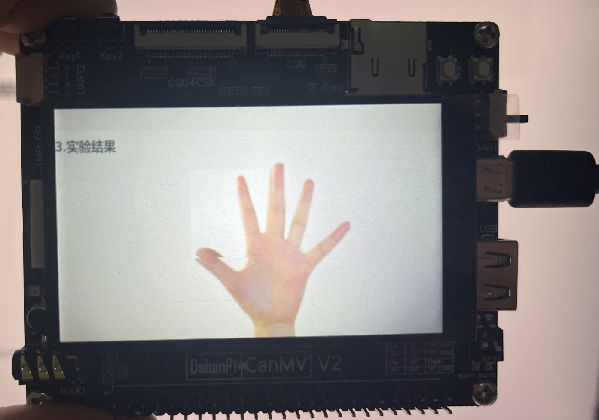

# 手势区域裁剪

## 1.学习目的

学习摄像头的画面进行手势区域裁剪。

## 2.示例代码

```
'''
本程序遵循GPL V3协议, 请遵循协议
实验平台: DshanPI CanMV
开发板文档站点	:: https://eai.100ask.net/
百问网学习平台   : https://www.100ask.net
百问网官方B站    : https://space.bilibili.com/275908810
百问网官方淘宝   : https://100ask.taobao.com
'''
from libs.PipeLine import PipeLine, ScopedTiming
from libs.AIBase import AIBase
from libs.AI2D import Ai2d
import os
import ujson
from media.media import *
from time import *
import nncase_runtime as nn
import ulab.numpy as np
import time
import image
import aicube
import random
import gc
import sys

# 自定义手掌检测任务类
class HandDetApp(AIBase):
    def __init__(self,kmodel_path,labels,model_input_size,anchors,confidence_threshold=0.2,nms_threshold=0.5,nms_option=False, strides=[8,16,32],rgb888p_size=[1920,1080],display_size=[1920,1080],debug_mode=0):
        super().__init__(kmodel_path,model_input_size,rgb888p_size,debug_mode)
        # kmodel路径
        self.kmodel_path=kmodel_path
        self.labels=labels
        # 检测模型输入分辨率
        self.model_input_size=model_input_size
        # 置信度阈值
        self.confidence_threshold=confidence_threshold
        # nms阈值
        self.nms_threshold=nms_threshold
        self.anchors=anchors
        self.strides = strides  # 特征下采样倍数
        self.nms_option = nms_option  # NMS选项，如果为True做类间NMS,如果为False做类内NMS
        # sensor给到AI的图像分辨率，宽16字节对齐
        self.rgb888p_size=[ALIGN_UP(rgb888p_size[0],16),rgb888p_size[1]]
        # 视频输出VO分辨率，宽16字节对齐
        self.display_size=[ALIGN_UP(display_size[0],16),display_size[1]]
        # debug模式
        self.debug_mode=debug_mode
        self.ai2d=Ai2d(debug_mode)
        self.ai2d.set_ai2d_dtype(nn.ai2d_format.NCHW_FMT,nn.ai2d_format.NCHW_FMT,np.uint8, np.uint8)

    def config_preprocess(self,input_image_size=None):
        with ScopedTiming("set preprocess config",self.debug_mode > 0):
            # 初始化ai2d预处理配置，默认为sensor给到AI的尺寸，可以通过设置input_image_size自行修改输入尺寸
            ai2d_input_size = input_image_size if input_image_size else self.rgb888p_size
            # 计算padding参数并应用pad操作，以确保输入图像尺寸与模型输入尺寸匹配
            top, bottom, left, right = self.get_padding_param()
            self.ai2d.pad([0, 0, 0, 0, top, bottom, left, right], 0, [114, 114, 114])
            # 使用双线性插值进行resize操作，调整图像尺寸以符合模型输入要求
            self.ai2d.resize(nn.interp_method.tf_bilinear, nn.interp_mode.half_pixel)
            # 构建预处理流程
            self.ai2d.build([1,3,ai2d_input_size[1],ai2d_input_size[0]],[1,3,self.model_input_size[1],self.model_input_size[0]])

    # 自定义后处理，results是模型输出的array列表，这里使用了aicube库的anchorbasedet_post_process接口
    def postprocess(self,results):
        with ScopedTiming("postprocess",self.debug_mode > 0):
            dets = aicube.anchorbasedet_post_process(results[0], results[1], results[2], self.model_input_size, self.rgb888p_size, self.strides, len(self.labels), self.confidence_threshold, self.nms_threshold, self.anchors, self.nms_option)
            # 返回手掌检测结果
            return dets

    # 计算padding参数，确保输入图像尺寸与模型输入尺寸匹配
    def get_padding_param(self):
        # 根据目标宽度和高度计算比例因子
        dst_w = self.model_input_size[0]
        dst_h = self.model_input_size[1]
        input_width = self.rgb888p_size[0]
        input_high = self.rgb888p_size[1]
        ratio_w = dst_w / input_width
        ratio_h = dst_h / input_high
        # 选择较小的比例因子，以确保图像内容完整
        if ratio_w < ratio_h:
            ratio = ratio_w
        else:
            ratio = ratio_h
        # 计算新的宽度和高度
        new_w = int(ratio * input_width)
        new_h = int(ratio * input_high)
        # 计算宽度和高度的差值，并确定padding的位置
        dw = (dst_w - new_w) / 2
        dh = (dst_h - new_h) / 2
        top = int(round(dh - 0.1))
        bottom = int(round(dh + 0.1))
        left = int(round(dw - 0.1))
        right = int(round(dw + 0.1))
        return top, bottom, left, right

# 自定义手势关键点分类任务类
class HandKPClassApp(AIBase):
    def __init__(self,kmodel_path,model_input_size,rgb888p_size=[1920,1080],display_size=[1920,1080],debug_mode=0):
        super().__init__(kmodel_path,model_input_size,rgb888p_size,debug_mode)
        # kmodel路径
        self.kmodel_path=kmodel_path
        # 检测模型输入分辨率
        self.model_input_size=model_input_size
        # sensor给到AI的图像分辨率，宽16字节对齐
        self.rgb888p_size=[ALIGN_UP(rgb888p_size[0],16),rgb888p_size[1]]
        # 视频输出VO分辨率，宽16字节对齐
        self.display_size=[ALIGN_UP(display_size[0],16),display_size[1]]
        self.crop_params=[]
        # debug模式
        self.debug_mode=debug_mode
        self.ai2d=Ai2d(debug_mode)
        self.ai2d.set_ai2d_dtype(nn.ai2d_format.NCHW_FMT,nn.ai2d_format.NCHW_FMT,np.uint8, np.uint8)

    # 配置预处理操作，这里使用了crop和resize，Ai2d支持crop/shift/pad/resize/affine
    def config_preprocess(self,det,input_image_size=None):
        with ScopedTiming("set preprocess config",self.debug_mode > 0):
            # 初始化ai2d预处理配置，默认为sensor给到AI的尺寸，可以通过设置input_image_size自行修改输入尺寸
            ai2d_input_size=input_image_size if input_image_size else self.rgb888p_size
            self.crop_params = self.get_crop_param(det)
            self.ai2d.crop(self.crop_params[0],self.crop_params[1],self.crop_params[2],self.crop_params[3])
            self.ai2d.resize(nn.interp_method.tf_bilinear, nn.interp_mode.half_pixel)
            self.ai2d.build([1,3,ai2d_input_size[1],ai2d_input_size[0]],[1,3,self.model_input_size[1],self.model_input_size[0]])

    # 自定义后处理，results是模型输出的array列表，返回手部关键点
    def postprocess(self,results):
        with ScopedTiming("postprocess",self.debug_mode > 0):
            results=results[0].reshape(results[0].shape[0]*results[0].shape[1])
            results_show = np.zeros(results.shape,dtype=np.int16)
            results_show[0::2] = (results[0::2] * self.crop_params[3] + self.crop_params[0])
            results_show[1::2] = (results[1::2] * self.crop_params[2] + self.crop_params[1])
            return results_show

    # 计算crop参数
    def get_crop_param(self,det_box):
        x1, y1, x2, y2 = det_box[2],det_box[3],det_box[4],det_box[5]
        w,h= int(x2 - x1),int(y2 - y1)
        w_det = int(float(x2 - x1) * self.display_size[0] // self.rgb888p_size[0])
        h_det = int(float(y2 - y1) * self.display_size[1] // self.rgb888p_size[1])
        x_det = int(x1*self.display_size[0] // self.rgb888p_size[0])
        y_det = int(y1*self.display_size[1] // self.rgb888p_size[1])
        length = max(w, h)/2
        cx = (x1+x2)/2
        cy = (y1+y2)/2
        ratio_num = 1.26*length
        x1_kp = int(max(0,cx-ratio_num))
        y1_kp = int(max(0,cy-ratio_num))
        x2_kp = int(min(self.rgb888p_size[0]-1, cx+ratio_num))
        y2_kp = int(min(self.rgb888p_size[1]-1, cy+ratio_num))
        w_kp = int(x2_kp - x1_kp + 1)
        h_kp = int(y2_kp - y1_kp + 1)
        return [x1_kp, y1_kp, w_kp, h_kp]

class SpaceResize:
    def __init__(self,hand_det_kmodel,hand_kp_kmodel,det_input_size,kp_input_size,labels,anchors,confidence_threshold=0.25,nms_threshold=0.3,nms_option=False,strides=[8,16,32],rgb888p_size=[1280,720],display_size=[1920,1080],debug_mode=0):
        # 手掌检测模型路径
        self.hand_det_kmodel=hand_det_kmodel
        # 手掌关键点模型路径
        self.hand_kp_kmodel=hand_kp_kmodel
        # 手掌检测模型输入分辨率
        self.det_input_size=det_input_size
        # 手掌关键点模型输入分辨率
        self.kp_input_size=kp_input_size
        self.labels=labels
        # anchors
        self.anchors=anchors
        # 置信度阈值
        self.confidence_threshold=confidence_threshold
        # nms阈值
        self.nms_threshold=nms_threshold
        self.nms_option=nms_option
        self.strides=strides
        # sensor给到AI的图像分辨率，宽16字节对齐
        self.rgb888p_size=[ALIGN_UP(rgb888p_size[0],16),rgb888p_size[1]]
        # 视频输出VO分辨率，宽16字节对齐
        self.display_size=[ALIGN_UP(display_size[0],16),display_size[1]]
        # debug_mode模式
        self.debug_mode=debug_mode

        self.first_start = True                                              # 首次手掌入镜参数
        self.two_point_left_x = 0                                            # 中指食指包括范围 x
        self.two_point_top_y = 0                                             # 中指食指包括范围 y
        self.two_point_mean_w = 0                                            # 中指食指首次入镜包括范围 w
        self.two_point_mean_h = 0                                            # 中指食指首次入镜包括范围 h
        self.two_point_crop_w = 0                                            # 中指食指包括范围 w
        self.two_point_crop_h = 0                                            # 中指食指包括范围 h
        self.osd_plot_x = 0                                                  # osd 画缩放图起始点 x
        self.osd_plot_y = 0                                                  # osd 画缩放图起始点 y
        self.ori_new_ratio = 0                                               # 缩放比例
        self.new_resize_w = 0                                                # 缩放后 w
        self.new_resize_h = 0                                                # 缩放后 h
        self.crop_area = 0                                                   # 剪切区域
        self.rect_frame_x = 0                                                # osd绘画起始点 x
        self.rect_frame_y = 0                                                # osd绘画起始点 y
        self.masks = np.zeros((self.display_size[1],self.display_size[0],4),dtype=np.uint8)
        self.mask_img=image.Image(self.display_size[0], self.display_size[1], image.ARGB8888,alloc=image.ALLOC_REF,data=self.masks)
        self.hand_det=HandDetApp(self.hand_det_kmodel,self.labels,model_input_size=self.det_input_size,anchors=self.anchors,confidence_threshold=self.confidence_threshold,nms_threshold=self.nms_threshold,nms_option=self.nms_option,strides=self.strides,rgb888p_size=self.rgb888p_size,display_size=self.display_size,debug_mode=0)
        self.hand_kp=HandKPClassApp(self.hand_kp_kmodel,model_input_size=self.kp_input_size,rgb888p_size=self.rgb888p_size,display_size=self.display_size)
        self.ai2d=Ai2d(debug_mode)
        self.ai2d.set_ai2d_dtype(nn.ai2d_format.NCHW_FMT,nn.ai2d_format.RGB_packed,np.uint8, np.uint8)
        self.hand_det.config_preprocess()

    # 对输入数据做预处理，对拇指和中指部分做裁剪并做resize
    def imgprocess(self,input_np,x,y,w,h,out_w,out_h):
        self.ai2d.crop(x, y, w, h)
        self.ai2d.resize(nn.interp_method.tf_bilinear, nn.interp_mode.half_pixel )
        self.ai2d.build([1,3,self.rgb888p_size[1],self.rgb888p_size[0]],[1,out_h, out_w,3])
        return self.ai2d.run(input_np).to_numpy()

    # run函数
    def run(self,input_np):
        # 先进行手掌检测
        det_boxes=self.hand_det.run(input_np)
        det_res=[]
        two_point = np.zeros((4),dtype=np.int16)
        for det_box in det_boxes:
            # 筛选符合要求的手掌
            x1, y1, x2, y2 = det_box[2],det_box[3],det_box[4],det_box[5]
            w,h= int(x2 - x1),int(y2 - y1)
            if (h<(0.1*self.rgb888p_size[1])):
                continue
            if (w<(0.25*self.rgb888p_size[0]) and ((x1<(0.03*self.rgb888p_size[0])) or (x2>(0.97*self.rgb888p_size[0])))):
                continue
            if (w<(0.15*self.rgb888p_size[0]) and ((x1<(0.01*self.rgb888p_size[0])) or (x2>(0.99*self.rgb888p_size[0])))):
                continue
            det_res.append(det_box)
        if len(det_res)!=0:
            # 选择第一个手掌做手掌关键点识别，然后裁剪拇指和中指区域做resize并替换原图中的部分
            det_box=det_res[0]
            self.hand_kp.config_preprocess(det_box)
            results_show=self.hand_kp.run(input_np)
            two_point[0],two_point[1],two_point[2],two_point[3] = results_show[8],results_show[9],results_show[16+8],results_show[16+9]
            if (self.first_start):
                if (two_point[0] > 0 and two_point[0] < self.rgb888p_size[0] and two_point[2] > 0 and two_point[2] < self.rgb888p_size[0] and two_point[1] > 0 and two_point[1] < self.rgb888p_size[1] and two_point[3] > 0 and two_point[3] < self.rgb888p_size[1]):
                    self.two_point_mean_w = np.sqrt(pow(two_point[0] - two_point[2],2) + pow(two_point[1] - two_point[3],2))*0.8
                    self.two_point_mean_h = np.sqrt(pow(two_point[0] - two_point[2],2) + pow(two_point[1] - two_point[3],2))*0.8
                    self.first_start = False
            else:
                self.mask_img.clear()
                self.two_point_left_x = int(max((two_point[0] + two_point[2]) / 2 - self.two_point_mean_w / 2, 0))
                self.two_point_top_y = int(max((two_point[1] + two_point[3]) / 2 - self.two_point_mean_h / 2, 0))
                self.two_point_crop_w = int(min(min((two_point[0] + two_point[2]) / 2 - self.two_point_mean_w / 2 + self.two_point_mean_w , self.two_point_mean_w), self.rgb888p_size[0] - ((two_point[0] + two_point[2]) / 2 - self.two_point_mean_w / 2)))
                self.two_point_crop_h = int(min(min((two_point[1] + two_point[3]) / 2 - self.two_point_mean_h / 2 + self.two_point_mean_h , self.two_point_mean_h), self.rgb888p_size[1] - ((two_point[1] + two_point[3]) / 2 - self.two_point_mean_h / 2)))
                self.ori_new_ratio = np.sqrt(pow((two_point[0] - two_point[2]),2) + pow((two_point[1] - two_point[3]),2))*0.8 / self.two_point_mean_w
                self.new_resize_w = min(int(self.two_point_crop_w * self.ori_new_ratio / self.rgb888p_size[0] * self.display_size[0]),600)
                self.new_resize_h = min(int(self.two_point_crop_h * self.ori_new_ratio / self.rgb888p_size[1] * self.display_size[1]),600)
                self.rect_frame_x = int(self.two_point_left_x * 1.0 / self.rgb888p_size[0] * self.display_size[0])
                self.rect_frame_y = int(self.two_point_top_y * 1.0 / self.rgb888p_size[1] * self.display_size[1])
                self.draw_w = min(self.new_resize_w,self.display_size[0]-self.rect_frame_x-1)
                self.draw_h = min(self.new_resize_h,self.display_size[1]-self.rect_frame_y-1)
                space_np_out = self.imgprocess(input_np, self.two_point_left_x, self.two_point_top_y, self.two_point_crop_w, self.two_point_crop_h, self.new_resize_w, self.new_resize_h)      # 运行 隔空缩放检测 ai2d
                self.masks[self.rect_frame_y:self.rect_frame_y + self.draw_h,self.rect_frame_x:self.rect_frame_x + self.draw_w,0] = 255
                self.masks[self.rect_frame_y:self.rect_frame_y + self.draw_h,self.rect_frame_x:self.rect_frame_x + self.draw_w,1:4] = space_np_out[0][0:self.draw_h,0:self.draw_w,:]
        return det_res

    # 绘制效果
    def draw_result(self,pl,det_res):
        pl.osd_img.clear()
        if len(det_res)==1:
            pl.osd_img.copy_from(self.mask_img)
        else:
            pl.osd_img.draw_string_advanced((self.display_size[0]//2),(self.display_size[1]//2),32,"请保证一只手入镜!",color=(255,0,0))


if __name__=="__main__":
    # 显示模式，默认"hdmi",可以选择"hdmi"和"lcd"
    display_mode="lcd"
    # k230保持不变，k230d可调整为[640,360]
    rgb888p_size = [1920, 1080]

    if display_mode=="hdmi":
        display_size=[1920,1080]
    else:
        display_size=[800,480]
    # 手掌检测模型路径
    hand_det_kmodel_path="/sdcard/examples/kmodel/hand_det.kmodel"
    # 手掌关键点模型路径
    hand_kp_kmodel_path="/sdcard/examples/kmodel/handkp_det.kmodel"
    anchors_path="/sdcard/examples/utils/prior_data_320.bin"
    hand_det_input_size=[512,512]
    hand_kp_input_size=[256,256]
    confidence_threshold=0.2
    nms_threshold=0.5
    labels=["hand"]
    anchors = [26,27, 53,52, 75,71, 80,99, 106,82, 99,134, 140,113, 161,172, 245,276]

    # 初始化PipeLine，只关注传给AI的图像分辨率，显示的分辨率
    pl=PipeLine(rgb888p_size=rgb888p_size,display_size=display_size,display_mode=display_mode)
    pl.create()
    sr=SpaceResize(hand_det_kmodel_path,hand_kp_kmodel_path,det_input_size=hand_det_input_size,kp_input_size=hand_kp_input_size,labels=labels,anchors=anchors,confidence_threshold=confidence_threshold,nms_threshold=nms_threshold,nms_option=False,strides=[8,16,32],rgb888p_size=rgb888p_size,display_size=display_size)
    try:
        while True:
            os.exitpoint()
            with ScopedTiming("total",1):
                img=pl.get_frame()          # 获取当前帧
                det_res=sr.run(img)         # 推理当前帧
                sr.draw_result(pl,det_res)  # 绘制当前帧推理结果
                pl.show_image()             # 展示当前帧
                gc.collect()
    except Exception as e:
        sys.print_exception(e)
    finally:
        sr.hand_det.deinit()
        sr.hand_kp.deinit()
        pl.destroy()


```

## 3.实验结果


​	点击运行代码后可以查看手势区域裁剪结果：


