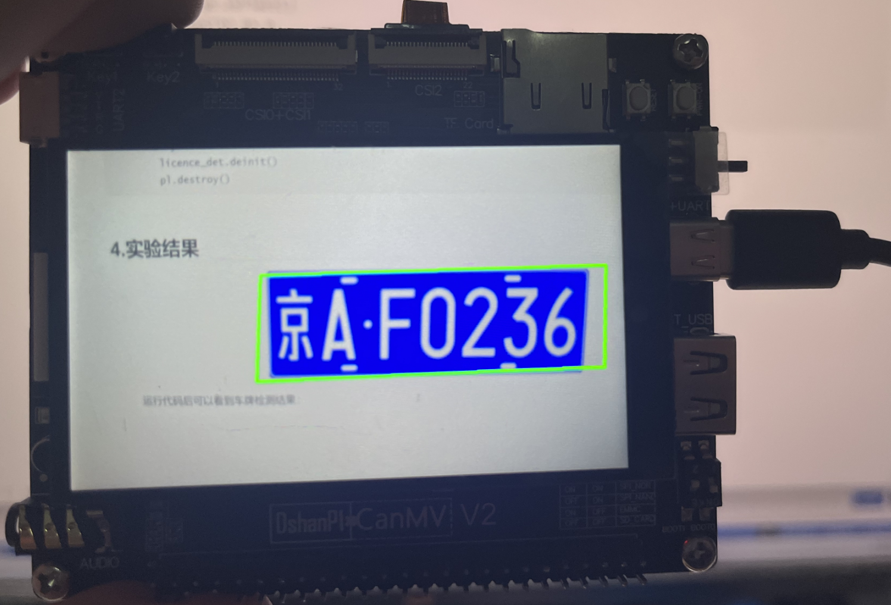

# 车牌检测

## 1.学习目的

学习摄像头画面进行车牌检测推理。

## 2.核心代码

### 车牌检测类

```
def __init__(self, kmodel_path, model_input_size, confidence_threshold=0.5, nms_threshold=0.2, rgb888p_size=[224,224], display_size=[1920,1080], debug_mode=0):
    super().__init__(kmodel_path, model_input_size, rgb888p_size, debug_mode)
    self.kmodel_path = kmodel_path
    self.model_input_size = model_input_size
    self.confidence_threshold = confidence_threshold
    self.nms_threshold = nms_threshold
    self.rgb888p_size = [ALIGN_UP(rgb888p_size[0], 16), rgb888p_size[1]]
    self.display_size = [ALIGN_UP(display_size[0], 16), display_size[1]]
    self.debug_mode = debug_mode
    self.ai2d = Ai2d(debug_mode)
    self.ai2d.set_ai2d_dtype(nn.ai2d_format.NCHW_FMT, nn.ai2d_format.NCHW_FMT, np.uint8, np.uint8)
```

**`__init__`**：初始化函数，用于设置车牌检测应用的参数。

- `kmodel_path`：车牌检测模型的路径。
- `model_input_size`：输入模型的尺寸（通常为640x640）。
- `confidence_threshold`：检测结果的置信度阈值，低于该值的检测框将被忽略。
- `nms_threshold`：非极大值抑制（NMS）的阈值，用于去除重复的检测框。
- `rgb888p_size`：传入的RGB图像尺寸。
- `display_size`：显示图像的尺寸。
- `debug_mode`：调试模式开关。
- 初始化了`Ai2d`实例，用于图像的预处理，设置了输入输出格式。

### 配置预处理

```
def config_preprocess(self, input_image_size=None):
    with ScopedTiming("set preprocess config", self.debug_mode > 0):
        ai2d_input_size = input_image_size if input_image_size else self.rgb888p_size
        self.ai2d.resize(nn.interp_method.tf_bilinear, nn.interp_mode.half_pixel)
        self.ai2d.build([1, 3, ai2d_input_size[1], ai2d_input_size[0]], [1, 3, self.model_input_size[1], self.model_input_size[0]])
```

**`config_preprocess`**：用于设置图像预处理的配置。图像需要经过resize、裁剪、缩放等操作来适配模型的输入尺寸。

- 通过`Ai2d`的`resize`方法，将输入图像调整为适合模型输入的尺寸。
- `build`方法建立预处理流程，以便将输入的图像数据格式从传感器尺寸（`rgb888p_size`）转换为模型的输入尺寸。

### 后处理

```
def postprocess(self, results):
    with ScopedTiming("postprocess", self.debug_mode > 0):
        det_res = aidemo.licence_det_postprocess(results, [self.rgb888p_size[1], self.rgb888p_size[0]], self.model_input_size, self.confidence_threshold, self.nms_threshold)
        return det_res
```

**`postprocess`**：对模型推理结果进行后处理，包括非极大值抑制（NMS）和阈值筛选。

- 使用`aidemo.licence_det_postprocess`方法处理推理结果，进行目标框的筛选和处理，只保留置信度高于`confidence_threshold`的检测框，并进行NMS以去除重叠框。

### 绘制结果

```
def draw_result(self, pl, dets):
    with ScopedTiming("display_draw", self.debug_mode > 0):
        if dets:
            pl.osd_img.clear()  # 清除屏幕
            point_8 = np.zeros((8), dtype=np.int16)
            for det in dets:
                for i in range(4):
                    x = det[i * 2 + 0] / self.rgb888p_size[0] * self.display_size[0]
                    y = det[i * 2 + 1] / self.rgb888p_size[1] * self.display_size[1]
                    point_8[i * 2 + 0] = int(x)
                    point_8[i * 2 + 1] = int(y)
                for i in range(4):
                    pl.osd_img.draw_line(point_8[i * 2 + 0], point_8[i * 2 + 1], point_8[(i + 1) % 4 * 2 + 0], point_8[(i + 1) % 4 * 2 + 1], color=(255, 0, 255, 0), thickness=4)
        else:
            pl.osd_img.clear()  # 清空屏幕
```

**`draw_result`**：用于将检测结果绘制到屏幕上。

- 将检测框的坐标从原图分辨率（`rgb888p_size`）映射到显示分辨率（`display_size`）。
- 使用`osd_img.draw_line`绘制检测框，将车牌的检测结果以矩形框的形式显示在屏幕上。


## 3.示例代码

```
'''
本程序遵循GPL V3协议, 请遵循协议
实验平台: DshanPI CanMV
开发板文档站点	: https://eai.100ask.net/
百问网学习平台   : https://www.100ask.net
百问网官方B站    : https://space.bilibili.com/275908810
百问网官方淘宝   : https://100ask.taobao.com
'''
from libs.PipeLine import PipeLine, ScopedTiming
from libs.AIBase import AIBase
from libs.AI2D import Ai2d
import os
import ujson
from media.media import *
from time import *
import nncase_runtime as nn
import ulab.numpy as np
import time
import utime
import image
import random
import gc
import sys
import aidemo

# 自定义车牌检测类
class LicenceDetectionApp(AIBase):
    # 初始化函数，设置车牌检测应用的参数
    def __init__(self, kmodel_path, model_input_size, confidence_threshold=0.5, nms_threshold=0.2, rgb888p_size=[224,224], display_size=[1920,1080], debug_mode=0):
        super().__init__(kmodel_path, model_input_size, rgb888p_size, debug_mode)  # 调用基类的初始化函数
        self.kmodel_path = kmodel_path  # 模型路径
        # 模型输入分辨率
        self.model_input_size = model_input_size
        # 分类阈值
        self.confidence_threshold = confidence_threshold
        self.nms_threshold = nms_threshold
        # sensor给到AI的图像分辨率
        self.rgb888p_size = [ALIGN_UP(rgb888p_size[0], 16), rgb888p_size[1]]
        # 显示分辨率
        self.display_size = [ALIGN_UP(display_size[0], 16), display_size[1]]
        self.debug_mode = debug_mode
        # Ai2d实例，用于实现模型预处理
        self.ai2d = Ai2d(debug_mode)
        # 设置Ai2d的输入输出格式和类型
        self.ai2d.set_ai2d_dtype(nn.ai2d_format.NCHW_FMT, nn.ai2d_format.NCHW_FMT, np.uint8, np.uint8)

    # 配置预处理操作，这里使用了pad和resize，Ai2d支持crop/shift/pad/resize/affine
    def config_preprocess(self, input_image_size=None):
        with ScopedTiming("set preprocess config", self.debug_mode > 0):
            # 初始化ai2d预处理配置，默认为sensor给到AI的尺寸，可以通过设置input_image_size自行修改输入尺寸
            ai2d_input_size = input_image_size if input_image_size else self.rgb888p_size
            self.ai2d.resize(nn.interp_method.tf_bilinear, nn.interp_mode.half_pixel)
            self.ai2d.build([1,3,ai2d_input_size[1],ai2d_input_size[0]],[1,3,self.model_input_size[1],self.model_input_size[0]])

    # 自定义当前任务的后处理
    def postprocess(self, results):
        with ScopedTiming("postprocess", self.debug_mode > 0):
            # 对检测结果进行后处理
            det_res = aidemo.licence_det_postprocess(results, [self.rgb888p_size[1], self.rgb888p_size[0]], self.model_input_size, self.confidence_threshold, self.nms_threshold)
            return det_res

    # 绘制检测结果到屏幕上
    def draw_result(self, pl, dets):
        with ScopedTiming("display_draw", self.debug_mode > 0):
            if dets:
                pl.osd_img.clear()  # 清除屏幕
                point_8 = np.zeros((8), dtype=np.int16)
                for det in dets:
                    # 将检测框坐标从sensor图像分辨率转换为显示分辨率
                    for i in range(4):
                        x = det[i * 2 + 0] / self.rgb888p_size[0] * self.display_size[0]
                        y = det[i * 2 + 1] / self.rgb888p_size[1] * self.display_size[1]
                        point_8[i * 2 + 0] = int(x)
                        point_8[i * 2 + 1] = int(y)
                    # 在屏幕上绘制检测框
                    for i in range(4):
                        pl.osd_img.draw_line(point_8[i * 2 + 0], point_8[i * 2 + 1], point_8[(i + 1) % 4 * 2 + 0], point_8[(i + 1) % 4 * 2 + 1], color=(255, 0, 255, 0), thickness=4)
            else:
                pl.osd_img.clear()  # 如果没有检测结果，则清空屏幕

if __name__=="__main__":
    # 显示模式，默认"hdmi",可以选择"hdmi"和"lcd"
    display_mode="lcd"
    # k230保持不变，k230d可调整为[640,360]
    rgb888p_size = [1920, 1080]

    if display_mode=="hdmi":
        display_size=[1920,1080]
    else:
        display_size=[800,480]
    # 模型路径
    kmodel_path="/sdcard/examples/kmodel/LPD_640.kmodel"
    # 其它参数设置
    confidence_threshold = 0.2
    nms_threshold = 0.2

    # 初始化PipeLine
    pl=PipeLine(rgb888p_size=rgb888p_size,display_size=display_size,display_mode=display_mode)
    pl.create()
    # 初始化自定义车牌检测实例
    licence_det=LicenceDetectionApp(kmodel_path,model_input_size=[640,640],confidence_threshold=confidence_threshold,nms_threshold=nms_threshold,rgb888p_size=rgb888p_size,display_size=display_size,debug_mode=0)
    licence_det.config_preprocess()
    try:
        while True:
            os.exitpoint()
            with ScopedTiming("total",1):
                # 获取当前帧数据
                img=pl.get_frame()
                # 推理当前帧
                res=licence_det.run(img)
                # 绘制结果到PipeLine的osd图像
                licence_det.draw_result(pl,res)
                # 显示当前的绘制结果
                pl.show_image()
                gc.collect()
    except Exception as e:
        sys.print_exception(e)
    finally:
        licence_det.deinit()
        pl.destroy()
```


## 4.实验结果


​	运行代码后可以看到车牌检测结果：


