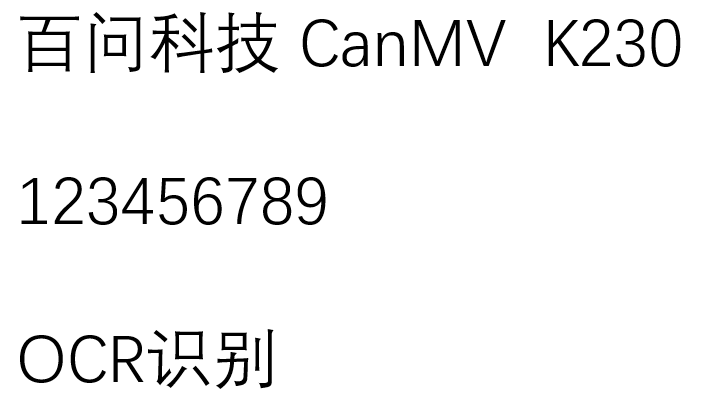
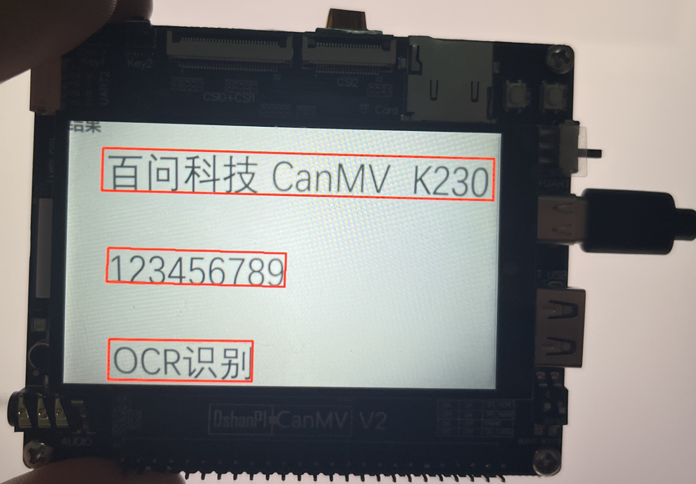

# OCR文字检测

## 1.实验目的

实现摄像头画面的字符检测。


## 2.核心流程

根据显示模式（`hdmi`或`lcd`）设置显示分辨率。

设置OCR模型路径、阈值和图像尺寸。

初始化`PipeLine`，并开始创建图像采集和显示管道。

实例化`OCRDetectionApp`对象，配置预处理方法。

进入循环，不断获取图像帧进行推理、后处理和绘制结果。

在循环内部，调用`pl.get_frame()`获取图像帧，使用`ocr_det.run()`执行推理，最后通过`ocr_det.draw_result()`绘制检测结果到显示设备。


## 3.示例代码

```
'''
本程序遵循GPL V3协议, 请遵循协议
实验平台: DshanPI CanMV
开发板文档站点	: https://eai.100ask.net/
百问网学习平台   : https://www.100ask.net
百问网官方B站    : https://space.bilibili.com/275908810
百问网官方淘宝   : https://100ask.taobao.com
'''
from libs.PipeLine import PipeLine, ScopedTiming
from libs.AIBase import AIBase
from libs.AI2D import Ai2d
import os
import ujson
from media.media import *
from time import *
import nncase_runtime as nn
import ulab.numpy as np
import time
import utime
import image
import random
import gc
import sys
import aicube

# 自定义OCR检测类
class OCRDetectionApp(AIBase):
    def __init__(self,kmodel_path,model_input_size,mask_threshold=0.5,box_threshold=0.2,rgb888p_size=[224,224],display_size=[1920,1080],debug_mode=0):
        super().__init__(kmodel_path,model_input_size,rgb888p_size,debug_mode)
        self.kmodel_path=kmodel_path
        # 模型输入分辨率
        self.model_input_size=model_input_size
        # 分类阈值
        self.mask_threshold=mask_threshold
        self.box_threshold=box_threshold
        # sensor给到AI的图像分辨率
        self.rgb888p_size=[ALIGN_UP(rgb888p_size[0],16),rgb888p_size[1]]
        # 显示分辨率
        self.display_size=[ALIGN_UP(display_size[0],16),display_size[1]]
        self.debug_mode=debug_mode
        # Ai2d实例，用于实现模型预处理
        self.ai2d=Ai2d(debug_mode)
        # 设置Ai2d的输入输出格式和类型
        self.ai2d.set_ai2d_dtype(nn.ai2d_format.NCHW_FMT,nn.ai2d_format.NCHW_FMT,np.uint8, np.uint8)

    # 配置预处理操作，这里使用了pad和resize，Ai2d支持crop/shift/pad/resize/affine，具体代码请打开/sdcard/app/libs/AI2D.py查看
    def config_preprocess(self,input_image_size=None):
        with ScopedTiming("set preprocess config",self.debug_mode > 0):
            # 初始化ai2d预处理配置，默认为sensor给到AI的尺寸，您可以通过设置input_image_size自行修改输入尺寸
            ai2d_input_size=input_image_size if input_image_size else self.rgb888p_size
            top,bottom,left,right=self.get_padding_param()
            self.ai2d.pad([0,0,0,0,top,bottom,left,right], 0, [0,0,0])
            self.ai2d.resize(nn.interp_method.tf_bilinear, nn.interp_mode.half_pixel)
            self.ai2d.build([1,3,ai2d_input_size[1],ai2d_input_size[0]],[1,3,self.model_input_size[1],self.model_input_size[0]])

    # 自定义当前任务的后处理
    def postprocess(self,results):
        with ScopedTiming("postprocess",self.debug_mode > 0):
            # chw2hwc
            hwc_array=self.chw2hwc(self.cur_img)
            # 这里使用了aicube封装的接口seg_post_process做后处理，返回一个和display_size相同分辨率的mask图
            # det_boxes结构为[[crop_array_nhwc,[p1_x,p1_y,p2_x,p2_y,p3_x,p3_y,p4_x,p4_y]],...]
            det_boxes = aicube.ocr_post_process(results[0][:,:,:,0].reshape(-1), hwc_array.reshape(-1),self.model_input_size,self.rgb888p_size, self.mask_threshold, self.box_threshold)
            all_boxes_pos=[]
            for det_box in det_boxes:
                all_boxes_pos.append(det_box[1])
            return all_boxes_pos

    # 绘制结果
    def draw_result(self,pl,all_boxes_pos):
        with ScopedTiming("display_draw",self.debug_mode >0):
            pl.osd_img.clear()
            # 一次绘制四条边，得到文本检测的四边形
            for i in range(len(all_boxes_pos)):
                for j in range(4):
                    x1=all_boxes_pos[i][2*j]*self.display_size[0]//self.rgb888p_size[0]
                    y1=all_boxes_pos[i][2*j+1]*self.display_size[1]//self.rgb888p_size[1]
                    x2=all_boxes_pos[i][(2*j+2)%8]*self.display_size[0]//self.rgb888p_size[0]
                    y2=all_boxes_pos[i][(2*j+3)%8]*self.display_size[1]//self.rgb888p_size[1]
                    pl.osd_img.draw_line(int(x1),int(y1),int(x2),int(y2),color=(255,255,0,0),thickness=4)

    # 计算padding参数
    def get_padding_param(self):
        # 右padding或下padding
        dst_w = self.model_input_size[0]
        dst_h = self.model_input_size[1]
        input_width = self.rgb888p_size[0]
        input_high = self.rgb888p_size[1]
        ratio_w = dst_w / input_width
        ratio_h = dst_h / input_high
        if ratio_w < ratio_h:
            ratio = ratio_w
        else:
            ratio = ratio_h
        new_w = (int)(ratio * input_width)
        new_h = (int)(ratio * input_high)
        dw = (dst_w - new_w) / 2
        dh = (dst_h - new_h) / 2
        top = (int)(round(0))
        bottom = (int)(round(dh * 2 + 0.1))
        left = (int)(round(0))
        right = (int)(round(dw * 2 - 0.1))
        return  top, bottom, left, right

    # chw2hwc
    def chw2hwc(self,features):
        ori_shape = (features.shape[0], features.shape[1], features.shape[2])
        c_hw_ = features.reshape((ori_shape[0], ori_shape[1] * ori_shape[2]))
        hw_c_ = c_hw_.transpose()
        new_array = hw_c_.copy()
        hwc_array = new_array.reshape((ori_shape[1], ori_shape[2], ori_shape[0]))
        del c_hw_
        del hw_c_
        del new_array
        return hwc_array

if __name__=="__main__":
    # 显示模式，默认"hdmi",可以选择"hdmi"和"lcd"，k230d受限内存不支持
    display_mode="lcd"
    if display_mode=="hdmi":
        display_size=[1920,1080]
    else:
        display_size=[800,480]
    # 模型路径
    kmodel_path="/sdcard/examples/kmodel/ocr_det_int16.kmodel"
    # kmodel其它参数设置
    mask_threshold = 0.25
    box_threshold = 0.3
    rgb888p_size=[640,360]

    # 初始化PipeLine
    pl=PipeLine(rgb888p_size=rgb888p_size,display_size=display_size,display_mode=display_mode)
    pl.create()
    # 初始化自定义OCR检测实例
    ocr_det=OCRDetectionApp(kmodel_path,model_input_size=[640,640],mask_threshold=mask_threshold,box_threshold=box_threshold,rgb888p_size=rgb888p_size,display_size=display_size,debug_mode=0)
    ocr_det.config_preprocess()
    try:
        while True:
            os.exitpoint()
            with ScopedTiming("total",1):
                # 获取当前帧数据
                img=pl.get_frame()
                # 推理当前帧
                res=ocr_det.run(img)
                # 绘制结果到PipeLine的osd图像
                ocr_det.draw_result(pl,res)
                # 显示当前的绘制结果
                pl.show_image()
                gc.collect()
    except Exception as e:
        sys.print_exception(e)
    finally:
        ocr_det.deinit()
        pl.destroy()
```

## 4.实验结果



​	运行代码后，可以在显示屏看到检测结果：


