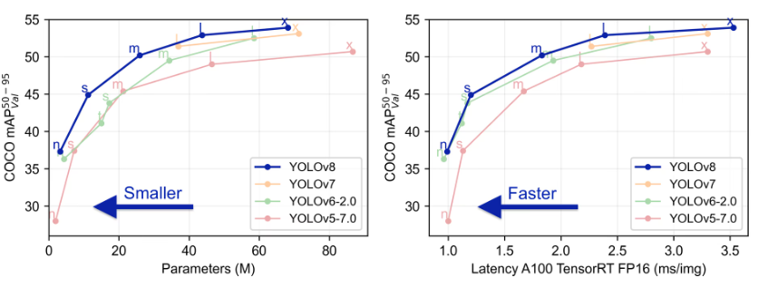
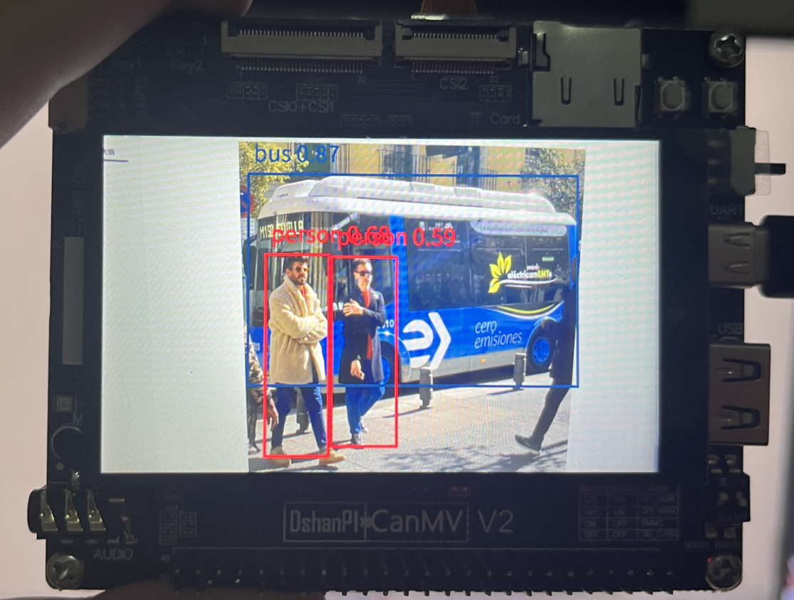

# YOLOV8目标检测

## 1.实验目的

学习摄像头画面进行yolov8目标检测。

## 2.实验原理

​	YOLOv8（You Only Look Once version 8）是YOLO系列目标检测模型的最新版本，YOLO系列模型是由Joseph Redmon等人提出的一类基于深度学习的实时物体检测算法。YOLOv8继承了YOLO的高效和快速特点，并在精度和速度上进行了优化。YOLOv8是YOLO架构的进一步发展，它通过一系列新的改进和优化，使得模型能够在更少的计算资源下仍然保持高精度的目标检测。

​	YOLO的核心思想是将目标检测任务转换为回归问题，而不是传统的通过滑动窗口和分类器来检测物体。这使得YOLO能够在一张图片中一次性完成目标检测（包括边框回归和类别预测）。YOLO模型将图像分割成多个网格，每个网格负责预测某些目标。每个网格输出一个固定数量的边界框（bounding box）及其对应的类别和置信度评分。



## 3.核心代码

### 配置图像预处理

```
self.ai2d.resize(nn.interp_method.tf_bilinear, nn.interp_mode.half_pixel)
self.ai2d.build([1, 3, H_in, W_in], [1, 3, H_model, W_model])
```

使用 bilinear resize 方法，将传感器图像大小转换为模型所需输入。

支持使用 `crop/resize/affine` 等操作。

### 后处理

```
result = results[0].reshape((num_boxes, 6)) → 解出 [x, y, w, h, class_scores...]
```

**置信度筛选**：只保留最大 class score > `confidence_threshold` 的结果。

**框坐标解码**：YOLOv8 输出为 [cx, cy, w, h]，需转换为 [x1, y1, x2, y2]，并乘以缩放因子恢复原图尺度。

**NMS 去重**：调用 `self.nms()` 方法执行 Non-Maximum Suppression，去除重复框。


### 非极大值抑制

```
ovr = inter / (areas[i] + areas[j] - inter)
if ovr < thresh → 保留
```

对 `scores` 排序，选择最高得分框 `i`。

与其他框计算 IoU（交并比），如果重叠比率大于阈值，则抑制该框。

返回被保留框的索引 `keep`。

### 绘制结果

```
pl.osd_img.draw_rectangle(x, y, w, h, color=...)
pl.osd_img.draw_string_advanced(x, y-50, "label conf", ...)
```

根据模型输出坐标换算到显示尺寸上。

每个目标画一个框，并显示类别标签与置信度。

### 主循环流程

```
while True:
    img = pl.get_frame()
    res = ob_det.run(img)
    ob_det.draw_result(pl, res)
    pl.show_image()
```

**图像采集**：`pl.get_frame()` 从摄像头获取一帧 RGB 图像。

**推理执行**：`ob_det.run()` 是 `AIBase` 提供的统一接口（包括预处理+模型推理+后处理）。

**结果绘图**：`draw_result()` 将检测框画到 `osd_img` 上。

**图像显示**：调用 `pl.show_image()` 显示结果图像。

```
 ┌──────────┐        ┌────────────┐        ┌────────────┐        ┌───────────┐
 │ PipeLine │ ─────> │ Ai2d预处理 │ ─────> │ YOLOv8推理  │ ─────> │ 后处理+NMS │
 └──────────┘        └────────────┘        └────────────┘        └─────┬─────┘
                                                                       │
                                                                       ▼
                                                                ┌────────────┐
                                                                │ 图像绘制+显示 │
                                                                └────────────┘

```

## 4.示例代码

```
'''
本程序遵循GPL V3协议, 请遵循协议
实验平台: DshanPI CanMV
开发板文档站点	: https://eai.100ask.net/
百问网学习平台   : https://www.100ask.net
百问网官方B站    : https://space.bilibili.com/275908810
百问网官方淘宝   : https://100ask.taobao.com
'''
from libs.PipeLine import PipeLine, ScopedTiming
from libs.AIBase import AIBase
from libs.AI2D import Ai2d
import os
import ujson
from media.media import *
from time import *
import nncase_runtime as nn
import ulab.numpy as np
import time
import utime
import image
import random
import gc
import sys
import aidemo

# 自定义YOLOv8检测类
class ObjectDetectionApp(AIBase):
    def __init__(self,kmodel_path,labels,model_input_size,max_boxes_num,confidence_threshold=0.5,nms_threshold=0.2,rgb888p_size=[224,224],display_size=[1920,1080],debug_mode=0):
        super().__init__(kmodel_path,model_input_size,rgb888p_size,debug_mode)
        self.kmodel_path=kmodel_path
        self.labels=labels
        # 模型输入分辨率
        self.model_input_size=model_input_size
        # 阈值设置
        self.confidence_threshold=confidence_threshold
        self.nms_threshold=nms_threshold
        self.max_boxes_num=max_boxes_num
        # sensor给到AI的图像分辨率
        self.rgb888p_size=[ALIGN_UP(rgb888p_size[0],16),rgb888p_size[1]]
        # 显示分辨率
        self.display_size=[ALIGN_UP(display_size[0],16),display_size[1]]
        self.debug_mode=debug_mode
        # 检测框预置颜色值
        self.color_four=[(255, 220, 20, 60), (255, 119, 11, 32), (255, 0, 0, 142), (255, 0, 0, 230),
                         (255, 106, 0, 228), (255, 0, 60, 100), (255, 0, 80, 100), (255, 0, 0, 70),
                         (255, 0, 0, 192), (255, 250, 170, 30), (255, 100, 170, 30), (255, 220, 220, 0),
                         (255, 175, 116, 175), (255, 250, 0, 30), (255, 165, 42, 42), (255, 255, 77, 255),
                         (255, 0, 226, 252), (255, 182, 182, 255), (255, 0, 82, 0), (255, 120, 166, 157)]
        # 宽高缩放比例
        self.x_factor = float(self.rgb888p_size[0])/self.model_input_size[0]
        self.y_factor = float(self.rgb888p_size[1])/self.model_input_size[1]
        # Ai2d实例，用于实现模型预处理
        self.ai2d=Ai2d(debug_mode)
        # 设置Ai2d的输入输出格式和类型
        self.ai2d.set_ai2d_dtype(nn.ai2d_format.NCHW_FMT,nn.ai2d_format.NCHW_FMT,np.uint8, np.uint8)

    # 配置预处理操作，这里使用了resize，Ai2d支持crop/shift/pad/resize/affine，具体代码请打开/sdcard/app/libs/AI2D.py查看
    def config_preprocess(self,input_image_size=None):
        with ScopedTiming("set preprocess config",self.debug_mode > 0):
            # 初始化ai2d预处理配置，默认为sensor给到AI的尺寸，您可以通过设置input_image_size自行修改输入尺寸
            ai2d_input_size=input_image_size if input_image_size else self.rgb888p_size
            self.ai2d.resize(nn.interp_method.tf_bilinear, nn.interp_mode.half_pixel)
            self.ai2d.build([1,3,ai2d_input_size[1],ai2d_input_size[0]],[1,3,self.model_input_size[1],self.model_input_size[0]])

    # 自定义当前任务的后处理
    def postprocess(self,results):
        with ScopedTiming("postprocess",self.debug_mode > 0):
            result=results[0]
            result = result.reshape((result.shape[0] * result.shape[1], result.shape[2]))
            output_data = result.transpose()
            boxes_ori = output_data[:,0:4]
            scores_ori = output_data[:,4:]
            confs_ori = np.max(scores_ori,axis=-1)
            inds_ori = np.argmax(scores_ori,axis=-1)
            boxes,scores,inds = [],[],[]
            for i in range(len(boxes_ori)):
                if confs_ori[i] > confidence_threshold:
                    scores.append(confs_ori[i])
                    inds.append(inds_ori[i])
                    x = boxes_ori[i,0]
                    y = boxes_ori[i,1]
                    w = boxes_ori[i,2]
                    h = boxes_ori[i,3]
                    left = int((x - 0.5 * w) * self.x_factor)
                    top = int((y - 0.5 * h) * self.y_factor)
                    right = int((x + 0.5 * w) * self.x_factor)
                    bottom = int((y + 0.5 * h) * self.y_factor)
                    boxes.append([left,top,right,bottom])
            if len(boxes)==0:
                return []
            boxes = np.array(boxes)
            scores = np.array(scores)
            inds = np.array(inds)
            # NMS过程
            keep = self.nms(boxes,scores,nms_threshold)
            dets = np.concatenate((boxes, scores.reshape((len(boxes),1)), inds.reshape((len(boxes),1))), axis=1)
            dets_out = []
            for keep_i in keep:
                dets_out.append(dets[keep_i])
            dets_out = np.array(dets_out)
            dets_out = dets_out[:self.max_boxes_num, :]
            return dets_out

    # 绘制结果
    def draw_result(self,pl,dets):
        with ScopedTiming("display_draw",self.debug_mode >0):
            if dets:
                pl.osd_img.clear()
                for det in dets:
                    x1, y1, x2, y2 = map(lambda x: int(round(x, 0)), det[:4])
                    x= x1*self.display_size[0] // self.rgb888p_size[0]
                    y= y1*self.display_size[1] // self.rgb888p_size[1]
                    w = (x2 - x1) * self.display_size[0] // self.rgb888p_size[0]
                    h = (y2 - y1) * self.display_size[1] // self.rgb888p_size[1]
                    pl.osd_img.draw_rectangle(x,y, w, h, color=self.get_color(int(det[5])),thickness=4)
                    pl.osd_img.draw_string_advanced( x , y-50,32," " + self.labels[int(det[5])] + " " + str(round(det[4],2)) , color=self.get_color(int(det[5])))
            else:
                pl.osd_img.clear()


    # 多目标检测 非最大值抑制方法实现
    def nms(self,boxes,scores,thresh):
        """Pure Python NMS baseline."""
        x1,y1,x2,y2 = boxes[:, 0],boxes[:, 1],boxes[:, 2],boxes[:, 3]
        areas = (x2 - x1 + 1) * (y2 - y1 + 1)
        order = np.argsort(scores,axis = 0)[::-1]
        keep = []
        while order.size > 0:
            i = order[0]
            keep.append(i)
            new_x1,new_y1,new_x2,new_y2,new_areas = [],[],[],[],[]
            for order_i in order:
                new_x1.append(x1[order_i])
                new_x2.append(x2[order_i])
                new_y1.append(y1[order_i])
                new_y2.append(y2[order_i])
                new_areas.append(areas[order_i])
            new_x1 = np.array(new_x1)
            new_x2 = np.array(new_x2)
            new_y1 = np.array(new_y1)
            new_y2 = np.array(new_y2)
            xx1 = np.maximum(x1[i], new_x1)
            yy1 = np.maximum(y1[i], new_y1)
            xx2 = np.minimum(x2[i], new_x2)
            yy2 = np.minimum(y2[i], new_y2)
            w = np.maximum(0.0, xx2 - xx1 + 1)
            h = np.maximum(0.0, yy2 - yy1 + 1)
            inter = w * h
            new_areas = np.array(new_areas)
            ovr = inter / (areas[i] + new_areas - inter)
            new_order = []
            for ovr_i,ind in enumerate(ovr):
                if ind < thresh:
                    new_order.append(order[ovr_i])
            order = np.array(new_order,dtype=np.uint8)
        return keep

    # 根据当前类别索引获取框的颜色
    def get_color(self, x):
        idx=x%len(self.color_four)
        return self.color_four[idx]


if __name__=="__main__":
    # 显示模式，默认"hdmi",可以选择"hdmi"和"lcd"
    display_mode="lcd"
    rgb888p_size=[320,320]

    if display_mode=="hdmi":
        display_size=[1920,1080]
    else:
        display_size=[800,480]
    # 模型路径
    kmodel_path="/sdcard/examples/kmodel/yolov8n_320.kmodel"
    labels = ["person", "bicycle", "car", "motorcycle", "airplane", "bus", "train", "truck", "boat", "traffic light", "fire hydrant", "stop sign", "parking meter", "bench", "bird", "cat", "dog", "horse", "sheep", "cow", "elephant", "bear", "zebra", "giraffe", "backpack", "umbrella", "handbag", "tie", "suitcase", "frisbee", "skis", "snowboard", "sports ball", "kite", "baseball bat", "baseball glove", "skateboard", "surfboard", "tennis racket", "bottle", "wine glass", "cup", "fork", "knife", "spoon", "bowl", "banana", "apple", "sandwich", "orange", "broccoli", "carrot", "hot dog", "pizza", "donut", "cake", "chair", "couch", "potted plant", "bed", "dining table", "toilet", "tv", "laptop", "mouse", "remote", "keyboard", "cell phone", "microwave", "oven", "toaster", "sink", "refrigerator", "book", "clock", "vase", "scissors", "teddy bear", "hair drier", "toothbrush"]
    # 其它参数设置
    confidence_threshold = 0.2
    nms_threshold = 0.2
    max_boxes_num = 50

    # 初始化PipeLine
    pl=PipeLine(rgb888p_size=rgb888p_size,display_size=display_size,display_mode=display_mode)
    pl.create()
    # 初始化自定义目标检测实例
    ob_det=ObjectDetectionApp(kmodel_path,labels=labels,model_input_size=[320,320],max_boxes_num=max_boxes_num,confidence_threshold=confidence_threshold,nms_threshold=nms_threshold,rgb888p_size=rgb888p_size,display_size=display_size,debug_mode=0)
    ob_det.config_preprocess()
    try:
        while True:
            os.exitpoint()
            with ScopedTiming("total",1):
                # 获取当前帧数据
                img=pl.get_frame()
                # 推理当前帧
                res=ob_det.run(img)
                # 绘制结果到PipeLine的osd图像
                ob_det.draw_result(pl,res)
                # 显示当前的绘制结果
                pl.show_image()
                gc.collect()
    except Exception as e:
        sys.print_exception(e)
    finally:
        ob_det.deinit()
        pl.destroy()
```

## 5.实验结果


运行结果后，可以在显示屏看到目标检测结果：


