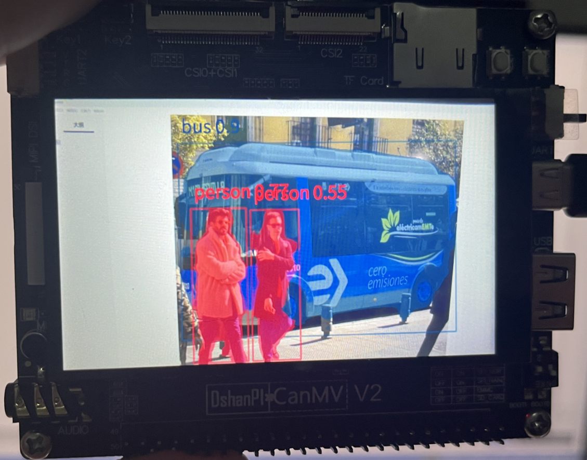

# YOLOV8目标分割

## 1.实验目的

学习摄像头画面进行yolov8目标分割。


## 2.实验原理

YOLOv8不仅在目标检测（Object Detection）任务中表现出色，还具备了目标分割（Instance Segmentation）功能。目标分割任务的目标是对图像中的每一个物体实例进行像素级的分割，这不仅要求模型识别物体的类别和位置（如目标检测），还要精确地标定物体的轮廓和区域（即分割）。

YOLOv8通过改进的网络架构和技术在目标分割任务中表现出了优异的性能。下面详细介绍YOLOv8目标分割的原理。

1. **网络架构改进**

YOLOv8的目标分割是在YOLO的基础上进行了增强，结合了目标检测与语义分割的特点。主要通过改进的神经网络结构和解码策略实现了目标分割。

- **主干网络（Backbone）：** 和YOLOv8一样，YOLOv8的目标分割部分也使用了高效的主干网络（如CSPDarknet）进行特征提取。这一部分提取图像中的各种特征，如边缘、纹理等。
- **颈部网络（Neck）：** YOLOv8的目标分割在颈部部分使用了FPN（Feature Pyramid Networks）和PAN（Path Aggregation Network）等技术进行多尺度特征融合，确保网络能够同时关注不同尺寸的目标。这对于分割精度尤其重要，尤其是在处理不同尺寸的物体时，能够更好地进行边界区域的检测和分割。

2. **分割头（Segmentation Head）**

YOLOv8在目标分割中引入了额外的分割头（Segmentation Head），与目标检测头并行工作，专门用于像素级的分割任务。具体来说，分割头的作用是通过卷积操作逐像素预测分割掩膜（mask），即对于每个检测到的物体实例，网络会输出一个二值化的掩膜图。

- **掩膜生成：** 分割头通过像素级的卷积操作对物体的每个像素进行分类，判断该像素是否属于当前检测到的物体。最终输出的结果是一个与输入图像相同大小的掩膜图，其中每个物体实例的区域会被标定为1，其他区域为0。

3. **多任务学习（Multi-task Learning）**

YOLOv8通过多任务学习同时进行目标检测和目标分割。对于每个检测到的物体，网络不仅输出边界框（bounding box）的位置、物体类别和置信度，还会生成一个像素级的分割掩膜。这种多任务学习能够增强网络的学习能力，使得网络能够在单一的训练过程中同时优化检测和分割的任务。

4. **边界框回归与分割掩膜相结合**

YOLOv8将边界框回归（bounding box regression）与目标分割掩膜相结合。当网络检测到一个物体实例时，它会预测该物体的边界框，并为每个物体实例生成一个分割掩膜。这个掩膜不仅仅是边界框内的一个二值图，它精确地标定了物体的轮廓区域。这样，YOLOv8不仅能够识别物体的位置，还能够精确分割出物体的形状。

- **边界框回归**：网络预测物体的边界框参数（中心点坐标、宽度和高度）。
- **分割掩膜预测**：网络通过掩膜回归生成每个物体实例的分割掩膜。

5. **非极大值抑制（NMS）**

在YOLOv8目标分割中，与目标检测任务一样，也采用了非极大值抑制（NMS）来去除冗余的检测结果。对于每个检测到的物体实例，NMS会根据预测的置信度值对重叠的框进行筛选，只保留置信度较高且不重叠的预测框。这样可以避免多个框重叠在同一个物体上，导致重复检测。

6. **训练与损失函数**

YOLOv8在训练过程中同时优化目标检测任务和目标分割任务。损失函数由两部分组成：

- **检测损失：** 这部分损失函数负责检测任务的回归（边界框）和分类（物体类别）。
- **分割损失：** 这部分损失函数则关注分割任务的像素级准确度，通常使用交叉熵损失或Dice损失（IoU损失）来优化分割结果的精度。

7. **后处理**

与目标检测任务类似，YOLOv8的目标分割也需要进行后处理。通过NMS去除冗余的预测框之后，针对每个检测框的分割掩膜也会进行适当的后处理，以确保掩膜的边界更加平滑和准确。可以通过细化算法（如CRF）对分割结果进行进一步优化。


## 3.核心流程

**YOLOv8 模型初始化**: 初始化 `SegmentationApp` 实例，加载模型和标签。

**预处理配置**: 调用 `config_preprocess()` 配置输入图像的预处理操作。

**循环推理与显示**: 使用 `while True` 循环来实时处理输入图像：

- 获取当前帧数据（`pl.get_frame()`）。
- 使用 `seg.run(img)` 推理当前帧图像，获得分割结果。
- 将结果绘制在图像上并通过 `pl.show_image()` 显示。

## 4.示例代码

```
'''
本程序遵循GPL V3协议, 请遵循协议
实验平台: DshanPI CanMV
开发板文档站点	: https://eai.100ask.net/
百问网学习平台   : https://www.100ask.net
百问网官方B站    : https://space.bilibili.com/275908810
百问网官方淘宝   : https://100ask.taobao.com
'''
from libs.PipeLine import PipeLine, ScopedTiming
from libs.AIBase import AIBase
from libs.AI2D import Ai2d
import os
import ujson
from media.media import *
from time import *
import nncase_runtime as nn
import ulab.numpy as np
import time
import utime
import image
import random
import gc
import sys
import aidemo

# 自定义YOLOv8分割类
class SegmentationApp(AIBase):
    def __init__(self,kmodel_path,labels,model_input_size,confidence_threshold=0.2,nms_threshold=0.5,mask_threshold=0.5,rgb888p_size=[224,224],display_size=[1920,1080],debug_mode=0):
        super().__init__(kmodel_path,model_input_size,rgb888p_size,debug_mode)
        # 模型路径
        self.kmodel_path=kmodel_path
        # 分割类别标签
        self.labels=labels
        # 模型输入分辨率
        self.model_input_size=model_input_size
        # 置信度阈值
        self.confidence_threshold=confidence_threshold
        # nms阈值
        self.nms_threshold=nms_threshold
        # mask阈值
        self.mask_threshold=mask_threshold
        # sensor给到AI的图像分辨率
        self.rgb888p_size=[ALIGN_UP(rgb888p_size[0],16),rgb888p_size[1]]
        # 显示分辨率
        self.display_size=[ALIGN_UP(display_size[0],16),display_size[1]]
        self.debug_mode=debug_mode
        # 检测框预置颜色值
        self.color_four=[(255, 220, 20, 60), (255, 119, 11, 32), (255, 0, 0, 142), (255, 0, 0, 230),
                         (255, 106, 0, 228), (255, 0, 60, 100), (255, 0, 80, 100), (255, 0, 0, 70),
                         (255, 0, 0, 192), (255, 250, 170, 30), (255, 100, 170, 30), (255, 220, 220, 0),
                         (255, 175, 116, 175), (255, 250, 0, 30), (255, 165, 42, 42), (255, 255, 77, 255),
                         (255, 0, 226, 252), (255, 182, 182, 255), (255, 0, 82, 0), (255, 120, 166, 157)]
        # 分割结果的numpy.array，用于给到aidemo后处理接口
        self.masks=np.zeros((1,self.display_size[1],self.display_size[0],4))
        # Ai2d实例，用于实现模型预处理
        self.ai2d=Ai2d(debug_mode)
        # 设置Ai2d的输入输出格式和类型
        self.ai2d.set_ai2d_dtype(nn.ai2d_format.NCHW_FMT,nn.ai2d_format.NCHW_FMT,np.uint8, np.uint8)

    # 配置预处理操作，这里使用了pad和resize，Ai2d支持crop/shift/pad/resize/affine，具体代码请打开/sdcard/app/libs/AI2D.py查看
    def config_preprocess(self,input_image_size=None):
        with ScopedTiming("set preprocess config",self.debug_mode > 0):
            # 初始化ai2d预处理配置，默认为sensor给到AI的尺寸，您可以通过设置input_image_size自行修改输入尺寸
            ai2d_input_size=input_image_size if input_image_size else self.rgb888p_size
            top,bottom,left,right=self.get_padding_param()
            self.ai2d.pad([0,0,0,0,top,bottom,left,right], 0, [114,114,114])
            self.ai2d.resize(nn.interp_method.tf_bilinear, nn.interp_mode.half_pixel)
            self.ai2d.build([1,3,ai2d_input_size[1],ai2d_input_size[0]],[1,3,self.model_input_size[1],self.model_input_size[0]])

    # 自定义当前任务的后处理
    def postprocess(self,results):
        with ScopedTiming("postprocess",self.debug_mode > 0):
            # 这里使用了aidemo的segment_postprocess接口
            seg_res = aidemo.segment_postprocess(results,[self.rgb888p_size[1],self.rgb888p_size[0]],self.model_input_size,[self.display_size[1],self.display_size[0]],self.confidence_threshold,self.nms_threshold,self.mask_threshold,self.masks)
            return seg_res

    # 绘制结果
    def draw_result(self,pl,seg_res):
        with ScopedTiming("display_draw",self.debug_mode >0):
            if seg_res[0]:
                pl.osd_img.clear()
                mask_img=image.Image(self.display_size[0], self.display_size[1], image.ARGB8888,alloc=image.ALLOC_REF,data=self.masks)
                pl.osd_img.copy_from(mask_img)
                dets,ids,scores = seg_res[0],seg_res[1],seg_res[2]
                for i, det in enumerate(dets):
                    x1, y1, w, h = map(lambda x: int(round(x, 0)), det)
                    pl.osd_img.draw_string_advanced(x1,y1-50,32, " " + self.labels[int(ids[i])] + " " + str(round(scores[i],2)) , color=self.get_color(int(ids[i])))
            else:
                pl.osd_img.clear()

    # 计算padding参数
    def get_padding_param(self):
        dst_w = self.model_input_size[0]
        dst_h = self.model_input_size[1]
        ratio_w = float(dst_w) / self.rgb888p_size[0]
        ratio_h = float(dst_h) / self.rgb888p_size[1]
        if ratio_w < ratio_h:
            ratio = ratio_w
        else:
            ratio = ratio_h
        new_w = (int)(ratio * self.rgb888p_size[0])
        new_h = (int)(ratio * self.rgb888p_size[1])
        dw = (dst_w - new_w) / 2
        dh = (dst_h - new_h) / 2
        top = (int)(round(dh - 0.1))
        bottom = (int)(round(dh + 0.1))
        left = (int)(round(dw - 0.1))
        right = (int)(round(dw + 0.1))
        return  top, bottom, left, right

    # 根据当前类别索引获取框的颜色
    def get_color(self, x):
        idx=x%len(self.color_four)
        return self.color_four[idx]


if __name__=="__main__":
    # 显示模式，默认"hdmi",可以选择"hdmi"和"lcd"，k230d受限于内存不支持
    display_mode="lcd"
    if display_mode=="hdmi":
        display_size=[1920,1080]
    else:
        display_size=[800,480]
    # 模型路径
    kmodel_path="/sdcard/examples/kmodel/yolov8n_seg_320.kmodel"
    labels = ["person", "bicycle", "car", "motorcycle", "airplane", "bus", "train", "truck", "boat", "traffic light", "fire hydrant", "stop sign", "parking meter", "bench", "bird", "cat", "dog", "horse", "sheep", "cow", "elephant", "bear", "zebra", "giraffe", "backpack", "umbrella", "handbag", "tie", "suitcase", "frisbee", "skis", "snowboard", "sports ball", "kite", "baseball bat", "baseball glove", "skateboard", "surfboard", "tennis racket", "bottle", "wine glass", "cup", "fork", "knife", "spoon", "bowl", "banana", "apple", "sandwich", "orange", "broccoli", "carrot", "hot dog", "pizza", "donut", "cake", "chair", "couch", "potted plant", "bed", "dining table", "toilet", "tv", "laptop", "mouse", "remote", "keyboard", "cell phone", "microwave", "oven", "toaster", "sink", "refrigerator", "book", "clock", "vase", "scissors", "teddy bear", "hair drier", "toothbrush"]
    #其它参数设置
    confidence_threshold = 0.2
    nms_threshold = 0.5
    mask_threshold=0.5
    rgb888p_size=[320,320]

    # 初始化PipeLine
    pl=PipeLine(rgb888p_size=rgb888p_size,display_size=display_size,display_mode=display_mode)
    pl.create()
    # 初始化自定义YOLOV8分割示例
    seg=SegmentationApp(kmodel_path,labels=labels,model_input_size=[320,320],confidence_threshold=confidence_threshold,nms_threshold=nms_threshold,mask_threshold=mask_threshold,rgb888p_size=rgb888p_size,display_size=display_size,debug_mode=0)
    seg.config_preprocess()
    try:
        while True:
            os.exitpoint()
            with ScopedTiming("total",1):
                # 获取当前帧数据
                img=pl.get_frame()
                # 推理当前帧
                seg_res=seg.run(img)
                # 绘制结果到PipeLine的osd图像
                seg.draw_result(pl,seg_res)
                # 显示当前的绘制结果
                pl.show_image()
                gc.collect()
    except Exception as e:
        sys.print_exception(e)
    finally:
        seg.deinit()
        pl.destroy()
```

## 5.实验结果


​	点击运行代码之后，可以在显示屏上看到目标分割的结果。


