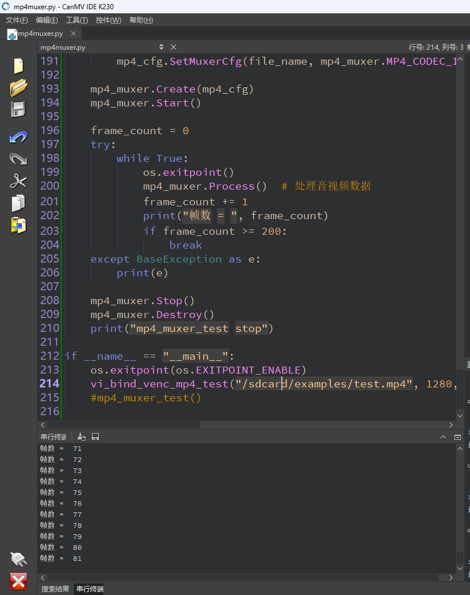
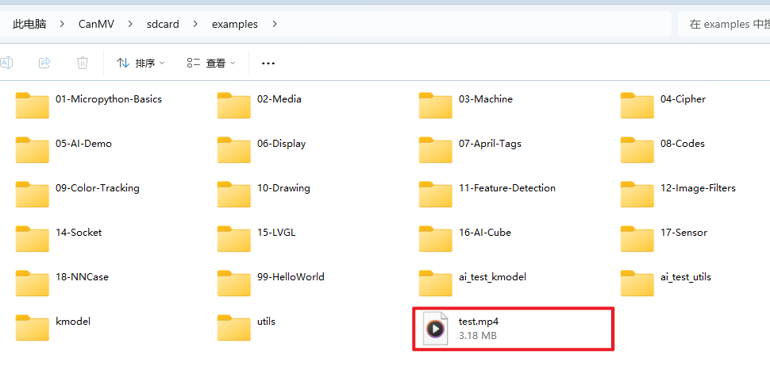

# 录制MP4视频

## 1.实验目的

通过摄像头录制视频并封装成MP4文件。


## 2.核心代码

### 初始化 MP4 封装器

```
mp4_handle = mp4_muxer_init(file_name, fmp4_flag)
```

**`file_name`** 是要保存的 MP4 文件名

`fmp4_flag` 是否保存为 Fragment MP4（流式分片格式）

返回 `mp4_handle`，用于后续添加轨道和写入数据

```
kd_mp4_create(handle, mp4_cfg)
```

> 实际调用底层 MP4 封装器创建函数。


### 创建视频轨道

```
mp4_video_track_handle = mp4_muxer_create_video_track(mp4_handle, width, height, video_payload_type)
```

配置视频宽、高和编码格式（H264 或 H265）

`video_payload_type` 是 `K_MP4_CODEC_ID_H264` 或 `K_MP4_CODEC_ID_H265`

返回轨道句柄 `mp4_video_track_handle`，用于写入视频帧

### 初始化 Sensor

```
sensor = Sensor()
sensor.set_framesize(width=width, height=height)
sensor.set_pixformat(Sensor.YUV420SP)
```

设置图像分辨率为 1280x720

设置像素格式为 YUV420 半平面（兼容编码器）

### 启动采集

```
sensor.run()
```

### 启动视频编码器

```
encoder = Encoder()
encoder.SetOutBufs(venc_chn, 8, width, height)
```

分配 8 个输出缓存池，用于编码后的视频帧

编码通道用的是 `VENC_CHN_ID_0`，即通道 0

```
encoder.Create(venc_chn, chnAttr)
encoder.Start(venc_chn)
```

创建并启动编码器，使用指定分辨率、格式

`chnAttr` 包含编码器的 payload 类型和 profile（如 H264_MAIN）

### 绑定采集和编码模块

```
link = MediaManager.link(sensor.bind_info()['src'], (VIDEO_ENCODE_MOD_ID, VENC_DEV_ID, venc_chn))
```

把 Sensor 输出绑定到 Encoder 输入。否则两者之间无法联动。

### 采集编码保存帧

```
encoder.GetStream(venc_chn, streamData)
```

从编码器中获取一帧编码后的视频流

`streamData` 结构体中包含数据指针、大小、PTS（时间戳）等

```
if not get_first_I_frame:
    if stream_type == encoder.STREAM_TYPE_I:
        # 合并 header + I帧，写入 MP4
```

第一帧必须是关键帧（IDR）

需要在 header 基础上附加此 I 帧，才能开始写 MP4

```
frame_data.codec_id = video_payload_type
frame_data.data = uctypes.addressof(save_idr)
frame_data.data_length = idr_index
frame_data.time_stamp = streamData.pts[0] - video_start_timestamp
kd_mp4_write_frame(...)
```

`frame_data` 是写入 MP4 的帧数据结构

写入时需要指定帧类型、时间戳、缓冲区地址和长度

```
frame_data.data = streamData.data[0]
frame_data.data_length = streamData.data_size[0]
frame_data.time_stamp = streamData.pts[0] - video_start_timestamp
kd_mp4_write_frame(...)
```

- 直接把编码后的视频流数据写入 MP4 视频轨道
- 时间戳要相对化，减去第一帧时间戳

### 释放资源

```
sensor.stop()
del link
encoder.Stop(venc_chn)
encoder.Destroy(venc_chn)
kd_mp4_destroy(mp4_handle)
```

关闭 Sensor、解绑链路、停止编码器

销毁 MP4 封装器


## 2.示例代码

```
'''
本程序遵循GPL V3协议, 请遵循协议
实验平台: DshanPI CanMV
开发板文档站点	: https://eai.100ask.net/
百问网学习平台   : https://www.100ask.net
百问网官方B站    : https://space.bilibili.com/275908810
百问网官方淘宝   : https://100ask.taobao.com
'''
from media.mp4format import *
from mpp.mp4_format import *
from mpp.mp4_format_struct import *
from media.vencoder import *
from media.sensor import *
from media.media import *
import uctypes
import time
import os

# 初始化 MP4 混合器（muxer）
def mp4_muxer_init(file_name,  fmp4_flag):
    mp4_cfg = k_mp4_config_s()
    mp4_cfg.config_type = K_MP4_CONFIG_MUXER
    mp4_cfg.muxer_config.file_name[:] = bytes(file_name, 'utf-8')
    mp4_cfg.muxer_config.fmp4_flag = fmp4_flag

    handle = k_u64_ptr()
    ret = kd_mp4_create(handle, mp4_cfg)
    if ret:
        raise OSError("kd_mp4_create failed.")
    return handle.value

# 创建视频轨道
def mp4_muxer_create_video_track(mp4_handle, width, height, video_payload_type):
    video_track_info = k_mp4_track_info_s()
    video_track_info.track_type = K_MP4_STREAM_VIDEO
    video_track_info.time_scale = 1000
    video_track_info.video_info.width = width
    video_track_info.video_info.height = height
    video_track_info.video_info.codec_id = video_payload_type
    video_track_handle = k_u64_ptr()
    ret = kd_mp4_create_track(mp4_handle, video_track_handle, video_track_info)
    if ret:
        raise OSError("kd_mp4_create_track failed.")
    return video_track_handle.value

# 创建音频轨道
def mp4_muxer_create_audio_track(mp4_handle,channel,sample_rate, bit_per_sample ,audio_payload_type):
    audio_track_info = k_mp4_track_info_s()
    audio_track_info.track_type = K_MP4_STREAM_AUDIO
    audio_track_info.time_scale = 1000
    audio_track_info.audio_info.channels = channel
    audio_track_info.audio_info.codec_id = audio_payload_type
    audio_track_info.audio_info.sample_rate = sample_rate
    audio_track_info.audio_info.bit_per_sample = bit_per_sample
    audio_track_handle = k_u64_ptr()
    ret = kd_mp4_create_track(mp4_handle, audio_track_handle, audio_track_info)
    if ret:
        raise OSError("kd_mp4_create_track failed.")
    return audio_track_handle.value

# 使用 sensor + VENC 编码器 + MP4 进行视频录制
def vi_bind_venc_mp4_test(file_name,width=1280, height=720,venc_payload_type = K_PT_H264,fmp4_flag = False):
    print("venc_test start")
    venc_chn = VENC_CHN_ID_0
    width = ALIGN_UP(width, 16)

    frame_data = k_mp4_frame_data_s()
    save_idr = bytearray(width * height * 3 // 4)
    idr_index = 0

    # 初始化 MP4 混合器
    mp4_handle = mp4_muxer_init(file_name, fmp4_flag)

    # 创建视频轨道
    if venc_payload_type == K_PT_H264:
        video_payload_type = K_MP4_CODEC_ID_H264
    elif venc_payload_type == K_PT_H265:
        video_payload_type = K_MP4_CODEC_ID_H265
    mp4_video_track_handle = mp4_muxer_create_video_track(mp4_handle, width, height, video_payload_type)

    # 初始化摄像头
    sensor = Sensor()
    sensor.reset()
    sensor.set_framesize(width = width, height = height, alignment=12)  # 设置输出尺寸
    sensor.set_pixformat(Sensor.YUV420SP)  # 设置像素格式

    # 创建编码器实例并设置输出缓存
    encoder = Encoder()
    encoder.SetOutBufs(venc_chn, 8, width, height)

    # 绑定 sensor 与编码器
    link = MediaManager.link(sensor.bind_info()['src'], (VIDEO_ENCODE_MOD_ID, VENC_DEV_ID, venc_chn))
    MediaManager.init()

    # 配置编码器属性
    if venc_payload_type == K_PT_H264:
        chnAttr = ChnAttrStr(encoder.PAYLOAD_TYPE_H264, encoder.H264_PROFILE_MAIN, width, height)
    elif venc_payload_type == K_PT_H265:
        chnAttr = ChnAttrStr(encoder.PAYLOAD_TYPE_H265, encoder.H265_PROFILE_MAIN, width, height)

    streamData = StreamData()
    encoder.Create(venc_chn, chnAttr)
    encoder.Start(venc_chn)
    sensor.run()

    frame_count = 0
    print("保存视频文件到: ", file_name)

    video_start_timestamp = 0
    get_first_I_frame = False

    try:
        while True:
            os.exitpoint()
            encoder.GetStream(venc_chn, streamData)  # 获取一帧码流
            stream_type = streamData.stream_type[0]

            # 检测第一个关键帧（IDR）并写入 MP4 文件
            if not get_first_I_frame:
                if stream_type == encoder.STREAM_TYPE_I:
                    get_first_I_frame = True
                    video_start_timestamp = streamData.pts[0]
                    save_idr[idr_index:idr_index+streamData.data_size[0]] = uctypes.bytearray_at(streamData.data[0], streamData.data_size[0])
                    idr_index += streamData.data_size[0]

                    frame_data.codec_id = video_payload_type
                    frame_data.data = uctypes.addressof(save_idr)
                    frame_data.data_length = idr_index
                    frame_data.time_stamp = streamData.pts[0] - video_start_timestamp

                    ret = kd_mp4_write_frame(mp4_handle, mp4_video_track_handle, frame_data)
                    if ret:
                        raise OSError("kd_mp4_write_frame failed.")
                    encoder.ReleaseStream(venc_chn, streamData)
                    continue

                elif stream_type == encoder.STREAM_TYPE_HEADER:
                    save_idr[idr_index:idr_index+streamData.data_size[0]] = uctypes.bytearray_at(streamData.data[0], streamData.data_size[0])
                    idr_index += streamData.data_size[0]
                    encoder.ReleaseStream(venc_chn, streamData)
                    continue
                else:
                    encoder.ReleaseStream(venc_chn, streamData)
                    continue

            # 写入普通视频帧到 MP4 文件
            frame_data.codec_id = video_payload_type
            frame_data.data = streamData.data[0]
            frame_data.data_length = streamData.data_size[0]
            frame_data.time_stamp = streamData.pts[0] - video_start_timestamp

            ret = kd_mp4_write_frame(mp4_handle, mp4_video_track_handle, frame_data)
            if ret:
                raise OSError("kd_mp4_write_frame failed.")

            encoder.ReleaseStream(venc_chn, streamData)

            frame_count += 1
            print("帧数 = ", frame_count)
            if frame_count >= 200:
                break
    except KeyboardInterrupt as e:
        print("用户终止录制: ", e)
    except BaseException as e:
        import sys
        sys.print_exception(e)

    # 停止 sensor 采集
    sensor.stop()
    # 解除绑定
    del link
    # 停止编码器
    encoder.Stop(venc_chn)
    encoder.Destroy(venc_chn)
    MediaManager.deinit()

    # 销毁 MP4 资源
    kd_mp4_destroy_tracks(mp4_handle)
    kd_mp4_destroy(mp4_handle)
    print("录制完成")

# 使用更高级封装方式录制 MP4

def mp4_muxer_test():
    print("mp4_muxer_test start")
    width = 1280
    height = 720
    mp4_muxer = Mp4Container()
    mp4_cfg = Mp4CfgStr(mp4_muxer.MP4_CONFIG_TYPE_MUXER)
    if mp4_cfg.type == mp4_muxer.MP4_CONFIG_TYPE_MUXER:
        file_name = "/sdcard/examples/test.mp4"
        mp4_cfg.SetMuxerCfg(file_name, mp4_muxer.MP4_CODEC_ID_H265, width, height, mp4_muxer.MP4_CODEC_ID_G711U)

    mp4_muxer.Create(mp4_cfg)
    mp4_muxer.Start()

    frame_count = 0
    try:
        while True:
            os.exitpoint()
            mp4_muxer.Process()  # 处理音视频数据
            frame_count += 1
            print("帧数 = ", frame_count)
            if frame_count >= 200:
                break
    except BaseException as e:
        print(e)

    mp4_muxer.Stop()
    mp4_muxer.Destroy()
    print("mp4_muxer_test stop")

if __name__ == "__main__":
    os.exitpoint(os.EXITPOINT_ENABLE)
    vi_bind_venc_mp4_test("/sdcard/examples/test.mp4", 1280, 720)
    #mp4_muxer_test()

```

## 3.实验结果

​	点击运行代码后，会在摄像头获取图像，使用芯片内置的编解码器编码，并封装成MP4文件，总共会封装200帧，程序结束后文件会保存在`/sdcard/examples/test.mp4`路径。



​	可以拷贝`test.mp4`至本地电脑查查看。

