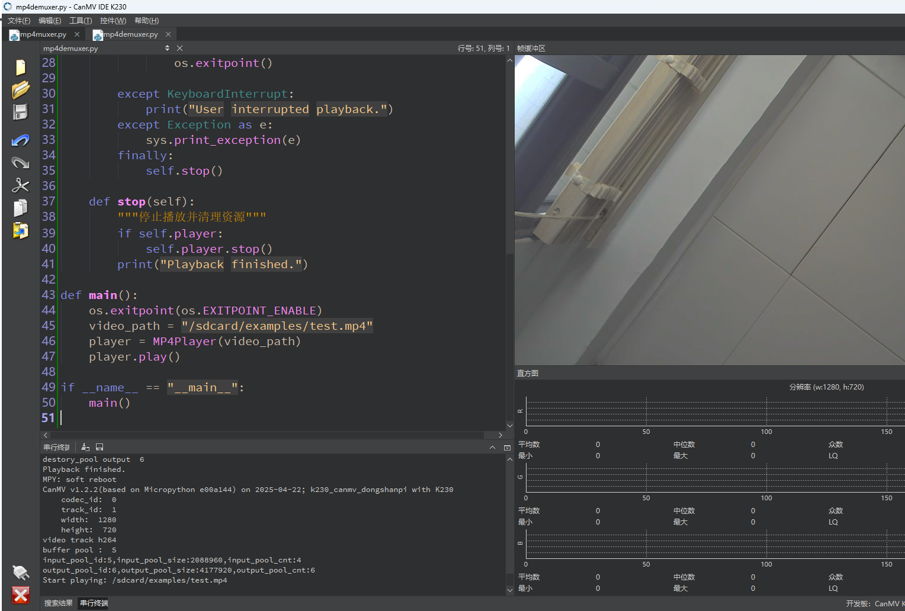

# 播放MP4视频

## 1.实验目的

学习MP4文件的播放。

## 2.示例代码

```
'''
本程序遵循GPL V3协议, 请遵循协议
实验平台： DshanPI CanMV
开发板文档站点	: https://eai.100ask.net/
百问网学习平台   : https://www.100ask.net
百问网官方B站    : https://space.bilibili.com/275908810
百问网官方淘宝   : https://100ask.taobao.com
'''
from media.player import Player, K_PLAYER_EVENT_EOF
import os
import time
import sys

class MP4Player:
    def __init__(self, filepath):
        self.filepath = filepath
        self._is_playing = False
        self.player = Player()

    def _event_callback(self, event, data):
        """播放器事件回调函数"""
        if event == K_PLAYER_EVENT_EOF:
            self._is_playing = False

    def play(self):
        """启动播放流程"""
        try:
            self.player.load(self.filepath)
            self.player.set_event_callback(self._event_callback)
            self.player.start()
            self._is_playing = True

            print(f"Start playing: {self.filepath}")
            while self._is_playing:
                time.sleep(0.1)
                os.exitpoint()

        except KeyboardInterrupt:
            print("User interrupted playback.")
        except Exception as e:
            sys.print_exception(e)
        finally:
            self.stop()

    def stop(self):
        """停止播放并清理资源"""
        if self.player:
            self.player.stop()
        print("Playback finished.")

def main():
    os.exitpoint(os.EXITPOINT_ENABLE)
    video_path = "/sdcard/examples/test.mp4"
    player = MP4Player(video_path)
    player.play()

if __name__ == "__main__":
    main()
```

## 3.实验结果

​	点击运行代码后，可以在IDE上看到MP4文件的画面。

