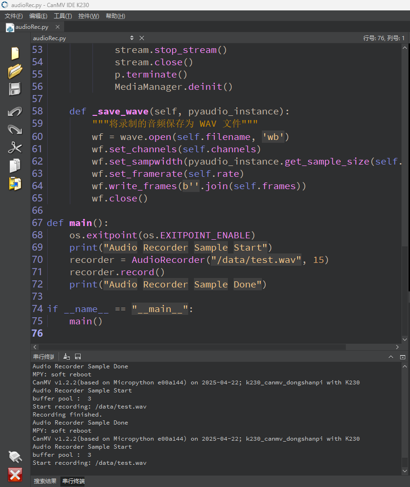
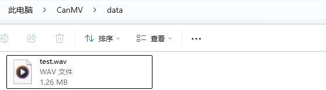

# 录制音频

## 1.实验目的

学习实验拾音器进行录音。

## 2.示例代码

```
import os
from media.media import *   #导入media模块，用于初始化vb buffer
from media.pyaudio import * #导入pyaudio模块，用于采集和播放音频
import media.wave as wave   #导入wav模块，用于保存和加载wav音频文件

def exit_check():
    try:
        os.exitpoint()
    except KeyboardInterrupt as e:
        print("user stop: ", e)
        return True
    return False

def record_audio(filename, duration):
    CHUNK = 44100//25  #设置音频chunk值
    FORMAT = paInt16       #设置采样精度,支持16bit(paInt16)/24bit(paInt24)/32bit(paInt32)
    CHANNELS = 2           #设置声道数,支持单声道(1)/立体声(2)
    RATE = 44100           #设置采样率

    try:
        p = PyAudio()
        MediaManager.init()    #vb buffer初始化

        #创建音频输入流
        stream = p.open(format=FORMAT,
                        channels=CHANNELS,
                        rate=RATE,
                        input=True,
                        frames_per_buffer=CHUNK)

        stream.volume(vol=55, channel=LEFT)
        print("volume :",stream.volume())

        #启用音频3A功能：自动噪声抑制(ANS)
        stream.enable_audio3a(AUDIO_3A_ENABLE_ANS)

        frames = []
        #采集音频数据并存入列表
        for i in range(0, int(RATE / CHUNK * duration)):
            data = stream.read()
            frames.append(data)
            if exit_check():
                break
        #将列表中的数据保存到wav文件中
        wf = wave.open(filename, 'wb') #创建wav 文件
        wf.set_channels(CHANNELS) #设置wav 声道数
        wf.set_sampwidth(p.get_sample_size(FORMAT))  #设置wav 采样精度
        wf.set_framerate(RATE)  #设置wav 采样率
        wf.write_frames(b''.join(frames)) #存储wav音频数据
        wf.close() #关闭wav文件
    except BaseException as e:
            print(f"Exception {e}")
    finally:
        stream.stop_stream() #停止采集音频数据
        stream.close()#关闭音频输入流
        p.terminate()#释放音频对象
        MediaManager.deinit() #释放vb buffer

if __name__ == "__main__":
    os.exitpoint(os.EXITPOINT_ENABLE)
    print("音频示例开始")
    record_audio('/data/test.wav', 5)  # 录制WAV文件
```


## 3.实验结果

​	点击运行后，会自动录制音频，录制完成后会保存在`/data/test.wav`目录。



可以在data目录下看到音频文件。

