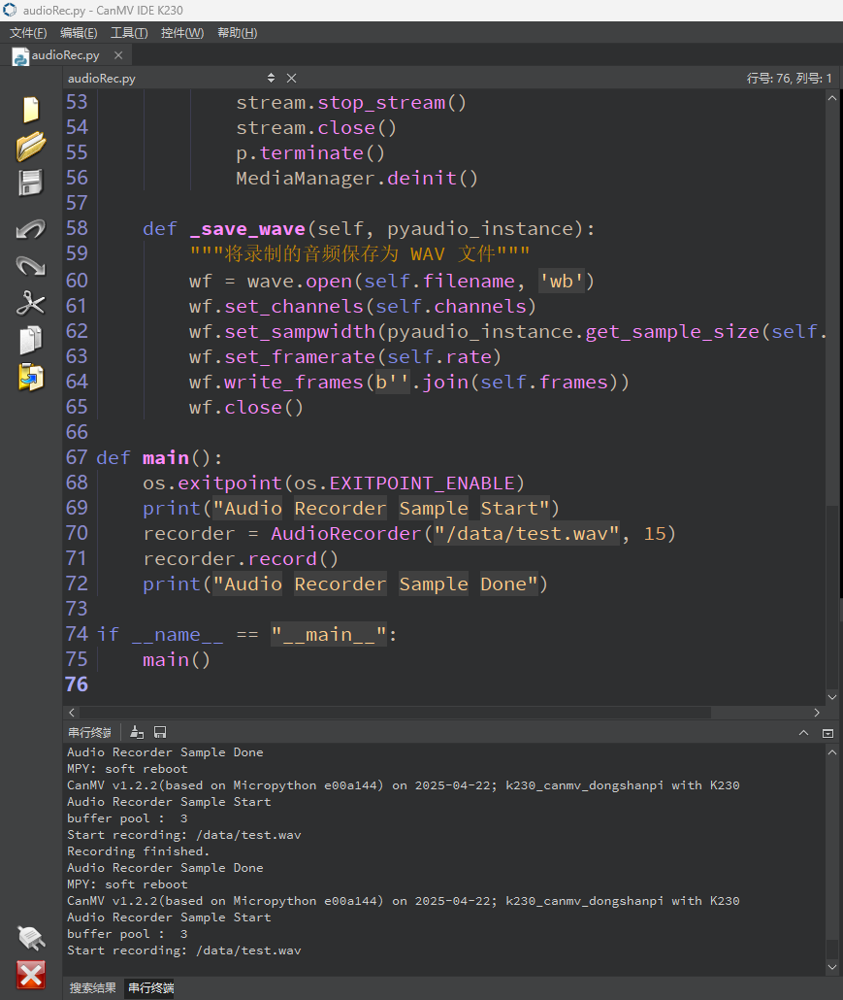
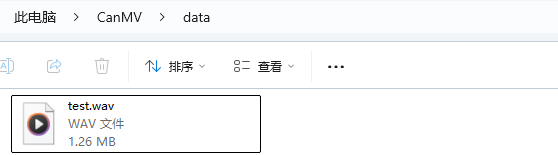

# 录制音频

## 1.实验目的

学习实验拾音器进行录音。

## 2.示例代码

```
'''
本程序遵循GPL V3协议, 请遵循协议
实验平台: DshanPI CanMV
开发板文档站点	: https://eai.100ask.net/
百问网学习平台   : https://www.100ask.net
百问网官方B站    : https://space.bilibili.com/275908810
百问网官方淘宝   : https://100ask.taobao.com
'''
import os
import time
import sys
from media.media import MediaManager
from media.pyaudio import PyAudio, paInt16
import media.wave as wave

def exit_check():
    """检测退出点或键盘中断"""
    try:
        os.exitpoint()
    except KeyboardInterrupt:
        print("User interrupted recording.")
        return True
    return False

class AudioRecorder:
    def __init__(self, filename, duration):
        self.filename = filename
        self.duration = duration
        self.chunk = int(44100 / 25)
        self.format = paInt16
        self.channels = 1
        self.rate = 44100
        self.frames = []

    def record(self):
        """执行音频录制主流程"""
        p = PyAudio()
        p.initialize(self.chunk)
        MediaManager.init()

        stream = p.open(format=self.format,
                        channels=self.channels,
                        rate=self.rate,
                        input=True,
                        frames_per_buffer=self.chunk)

        try:
            print(f"Start recording: {self.filename}")
            for _ in range(int(self.rate / self.chunk * self.duration)):
                data = stream.read()
                self.frames.append(data)
                if exit_check():
                    break

            self._save_wave(p)
            print("Recording finished.")
        except Exception as e:
            print(f"Exception during recording: {e}")
            sys.print_exception(e)
        finally:
            stream.stop_stream()
            stream.close()
            p.terminate()
            MediaManager.deinit()

    def _save_wave(self, pyaudio_instance):
        """将录制的音频保存为 WAV 文件"""
        wf = wave.open(self.filename, 'wb')
        wf.set_channels(self.channels)
        wf.set_sampwidth(pyaudio_instance.get_sample_size(self.format))
        wf.set_framerate(self.rate)
        wf.write_frames(b''.join(self.frames))
        wf.close()

def main():
    os.exitpoint(os.EXITPOINT_ENABLE)
    print("Audio Recorder Sample Start")
    recorder = AudioRecorder("/data/test.wav", 15)
    recorder.record()
    print("Audio Recorder Sample Done")

if __name__ == "__main__":
    main()
```


## 3.实验结果

​	点击运行后，会自动录制音频，录制完成后会保存在`/data/test.wav`目录。



可以在data目录下看到音频文件。

