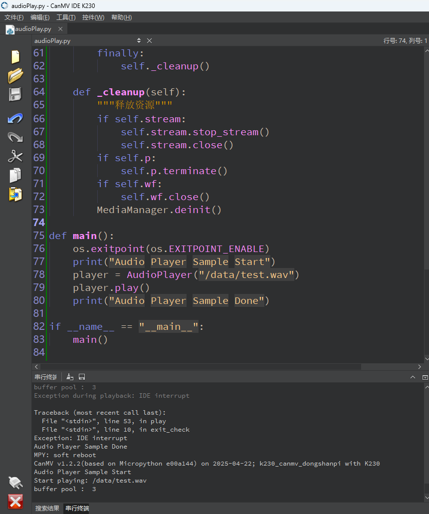

# 播放音频

## 1.实验目的

学习实验耳机接口进行声音播放。


## 2.示例源码

```
'''
本程序遵循GPL V3协议, 请遵循协议
实验平台: DshanPI CanMV
开发板文档站点	: https://eai.100ask.net/
百问网学习平台   : https://www.100ask.net
百问网官方B站    : https://space.bilibili.com/275908810
百问网官方淘宝   : https://100ask.taobao.com
'''
import os
import sys
from media.media import MediaManager
from media.pyaudio import PyAudio
import media.wave as wave

def exit_check():
    """检测是否收到退出信号"""
    try:
        os.exitpoint()
    except KeyboardInterrupt:
        print("User interrupted playback.")
        return True
    return False

class AudioPlayer:
    def __init__(self, filename):
        self.filename = filename
        self.chunk = None
        self.wf = None
        self.p = None
        self.stream = None

    def _init_wave(self):
        """打开 WAV 文件并读取参数"""
        self.wf = wave.open(self.filename, 'rb')
        self.chunk = int(self.wf.get_framerate() / 25)

    def _init_audio(self):
        """初始化音频系统并创建输出流"""
        self.p = PyAudio()
        self.p.initialize(self.chunk)
        MediaManager.init()

        self.stream = self.p.open(
            format=self.p.get_format_from_width(self.wf.get_sampwidth()),
            channels=self.wf.get_channels(),
            rate=self.wf.get_framerate(),
            output=True,
            frames_per_buffer=self.chunk
        )

    def play(self):
        """播放 WAV 文件"""
        try:
            print(f"Start playing: {self.filename}")
            self._init_wave()
            self._init_audio()

            data = self.wf.read_frames(self.chunk)
            while data:
                self.stream.write(data)
                if exit_check():
                    break
                data = self.wf.read_frames(self.chunk)

            print("Playback finished.")
        except Exception as e:
            print(f"Exception during playback: {e}")
            sys.print_exception(e)
        finally:
            self._cleanup()

    def _cleanup(self):
        """释放资源"""
        if self.stream:
            self.stream.stop_stream()
            self.stream.close()
        if self.p:
            self.p.terminate()
        if self.wf:
            self.wf.close()
        MediaManager.deinit()

def main():
    os.exitpoint(os.EXITPOINT_ENABLE)
    print("Audio Player Sample Start")
    player = AudioPlayer("/data/test.wav")
    player.play()
    print("Audio Player Sample Done")

if __name__ == "__main__":
    main()
```


## 3.实验结果

​	点击运行程序后，可以在耳机接口处输出音频。

