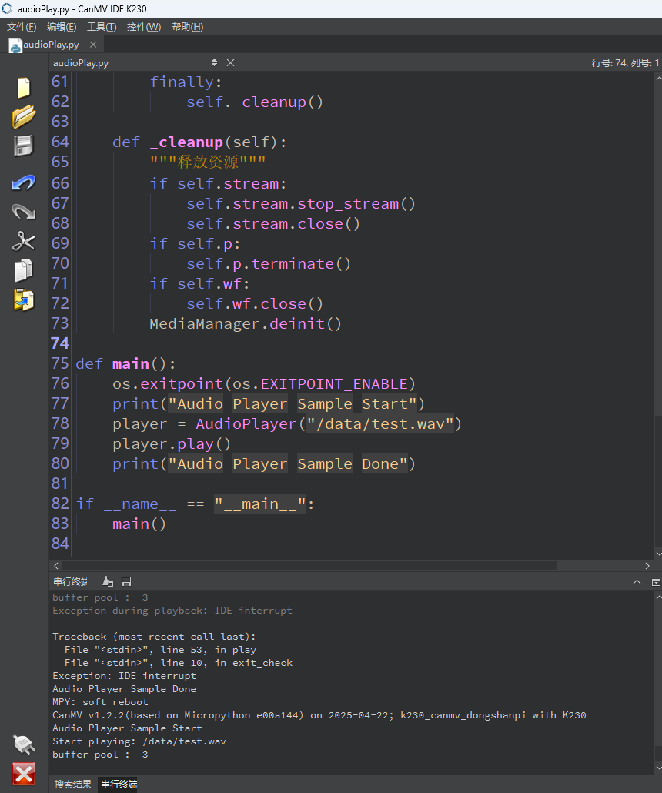

# 播放音频

## 1.实验目的

学习实验耳机接口进行声音播放。


## 2.示例源码

```
import os
from media.media import *   #导入media模块，用于初始化vb buffer
from media.pyaudio import * #导入pyaudio模块，用于采集和播放音频
import media.wave as wave   #导入wav模块，用于保存和加载wav音频文件

def exit_check():
    try:
        os.exitpoint()
    except KeyboardInterrupt as e:
        print("user stop: ", e)
        return True
    return False

def play_audio(filename):
    try:

        wf = wave.open(filename, 'rb')#打开wav文件
        CHUNK = int(wf.get_framerate()/25)#设置音频chunk值

        p = PyAudio()
        MediaManager.init()    #vb buffer初始化

        #创建音频输出流，设置的音频参数均为wave中获取到的参数
        stream = p.open(format=p.get_format_from_width(wf.get_sampwidth()),
                    channels=wf.get_channels(),
                    rate=wf.get_framerate(),
                    output=True,frames_per_buffer=CHUNK)

        #设置音频输出流的音量
        stream.volume(vol=70)

        data = wf.read_frames(CHUNK)#从wav文件中读取数一帧数据

        while data:
            stream.write(data)  #将帧数据写入到音频输出流中
            data = wf.read_frames(CHUNK) #从wav文件中读取数一帧数据
            if exit_check():
                break
    except BaseException as e:
            print(f"Exception {e}")
    finally:
        stream.stop_stream() #停止音频输出流
        stream.close()#关闭音频输出流
        p.terminate()#释放音频对象
        wf.close()#关闭wav文件

        MediaManager.deinit() #释放vb buffer

if __name__ == "__main__":
    os.exitpoint(os.EXITPOINT_ENABLE)
    print("音频示例开始")

    play_audio('/data/test.wav')  # 播放WAV文件
```


## 3.实验结果

​	点击运行程序后，可以在耳机接口处输出音频。

