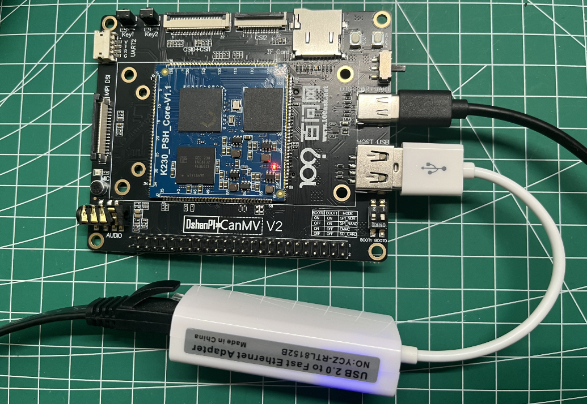

# 有线网络

硬件要求：

- USB转以太网模块（RTL8152B）
- DshanPI-CanMV开发板



> 请注意在上电前请提前连接好USB转以太网模块！！

## 1.实验目的

学习通过有线以太网访问网络。


## 2.网络模块

**`LAN` 类**

参考文档: [Micropython LAN](https://docs.micropython.org/en/latest/library/network.LAN.html)

此类为有线网络的配置接口。示例代码如下：

```
import network
nic = network.LAN()
print(nic.ifconfig())

# 配置完成后，即可像往常一样使用 socket
...
```

**构造函数**

- **class** `network.LAN()` [¶](https://docs.micropython.org/en/latest/library/network.LAN.html#network.LAN)

  创建一个有线以太网对象。

**方法**

- **LAN.active([state])** [¶](https://docs.micropython.org/en/latest/library/network.LAN.html#network.LAN.active)

  激活或停用网络接口。传递布尔参数 `True` 表示激活，`False` 表示停用。如果不传参数，则返回当前状态。

- **LAN.isconnected()** [¶](https://docs.micropython.org/en/latest/library/network.LAN.html#network.LAN.isconnected)

  返回 `True` 表示已连接到网络，返回 `False` 表示未连接。

- **LAN.ifconfig([(ip, subnet, gateway, dns)])** [¶](https://docs.micropython.org/en/latest/library/network.LAN.html#network.LAN.ifconfig)

  获取或设置 IP 级别的网络接口参数，包括 IP 地址、子网掩码、网关和 DNS 服务器。无参数调用时，返回一个包含上述信息的四元组；如需设置参数，传入包含 IP 地址、子网掩码、网关和 DNS 的四元组。例如：

  ```
  nic.ifconfig(('192.168.0.4', '255.255.255.0', '192.168.0.1', '8.8.8.8'))
  ```

- **LAN.config(\*config_parameters\*)** [¶](https://docs.micropython.org/en/latest/library/network.LAN.html#network.LAN.config)

  获取或设置网络接口参数。当前仅支持设置或获取 MAC 地址。例如：

  ```
  import network
  lan = network.LAN()
  # 设置 MAC 地址
  lan.config(mac="42:EA:D0:C2:0D:83")
  # 获取 MAC 地址
  print(lan.config("mac"))
  ```


## 3.示例代码

```
'''
本程序遵循GPL V3协议, 请遵循协议
实验平台: DshanPI CanMV
开发板文档站点	: https://eai.100ask.net/
百问网学习平台   : https://www.100ask.net
百问网官方B站    : https://space.bilibili.com/275908810
百问网官方淘宝   : https://100ask.taobao.com
'''
import network

def main():
    #获取lan接口
    a=network.LAN()
    #设置网口为dhcp模式
    a.ifconfig("dhcp")
    #查看网口 ip，掩码，网关，dns配置
    print(a.ifconfig())

main()

```

## 4.实验结果

​	点击运行代码之后会自动获取IP,并打印如下信息：

```
('192.168.0.101', '255.255.255.0', '192.168.0.1', '192.168.0.1')
```

