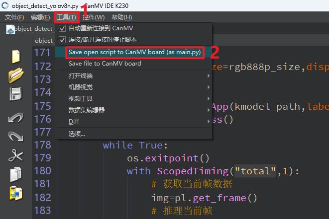
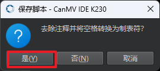
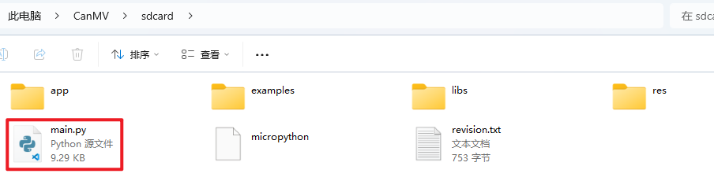

# 上电自动运行代码

## 1.MicroPython 启动机制

MicroPython 固件在开发板上电启动时，会按照以下顺序查找并执行脚本文件：

1. **`boot.py`**（可选）：
   - 是系统上电后 **最先执行** 的脚本。
   - 通常用于执行一些初始化设置，例如串口波特率、Wi-Fi 配置、系统时钟设置等。
   - 如果在 `boot.py` 中使用了 **`while True:` 阻塞代码**，会导致后续的 `main.py` **无法执行**。
2. **`main.py`**（推荐使用）：
   - 是 `boot.py` 执行完毕后自动运行的脚本。
   - 用于编写实际业务逻辑，例如图像识别、音频处理、传感器控制等功能。
   - **大多数应用只需要将主程序保存为 `main.py` 即可。**

## 2.保存代码为main.py

### 2.1 使用IDE保存

在 CanMV K230 IDE 中完成代码开发后，只需按以下步骤操作：

1.确保 IDE 已成功连接开发板。

2.点击 **工具** → **Save open scipt to CanMV board(as main.py)**，将当前脚本保存为 `main.py`。

3.弹出保存脚本时，点击`是`后等待保存完成。

保存完成后可以在sdcard目录下看到main.py。

4.重启开发板（或断电重上电），开发板将自动运行 `main.py` 中的代码。

### 2.2 手动保存

当 **CanMV K230 开发板** 通过 USB 连接到电脑时，会被识别为一个 **U盘设备**。我们可以像操作普通U盘一样，直接向其中复制文件。

要让开发板 **上电后自动运行你的程序**，只需执行以下操作：

1. **将你的 Python 脚本重命名为 `main.py`**。
    MicroPython 会在上电时自动查找并执行该文件。
2. **将 `main.py` 复制到开发板的 SD 卡根目录**。
    打开被识别出的U盘设备（通常名为 `SDCARD` 或类似），将 `main.py` 拖入该目录下即可。

