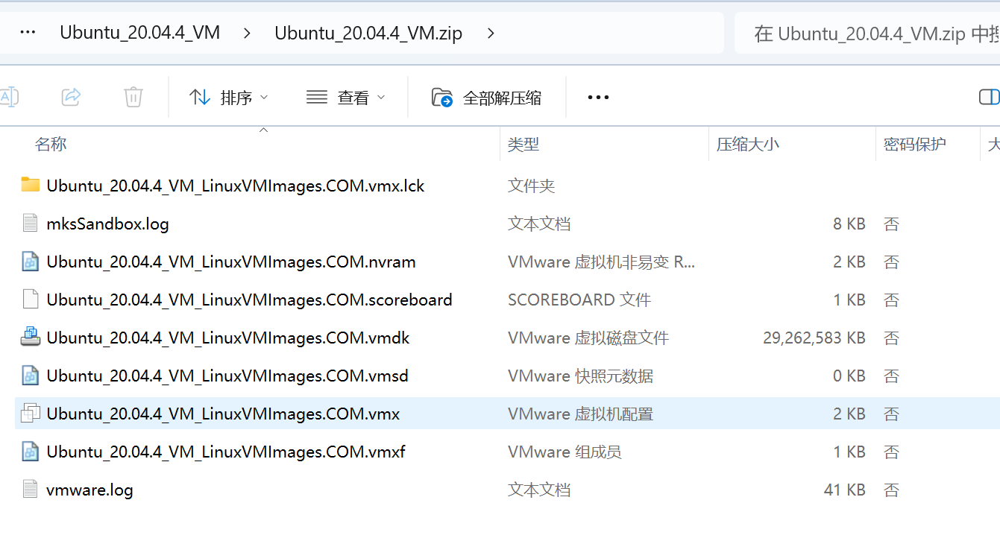
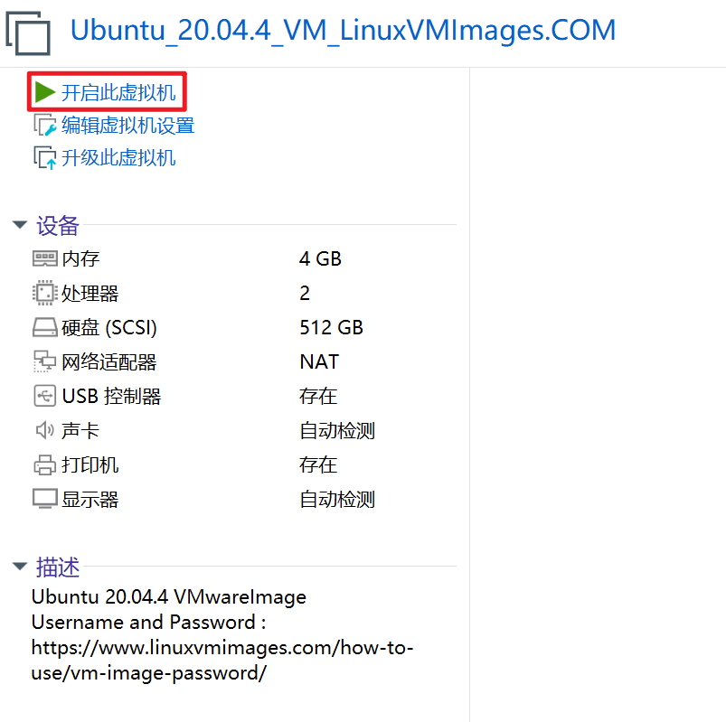
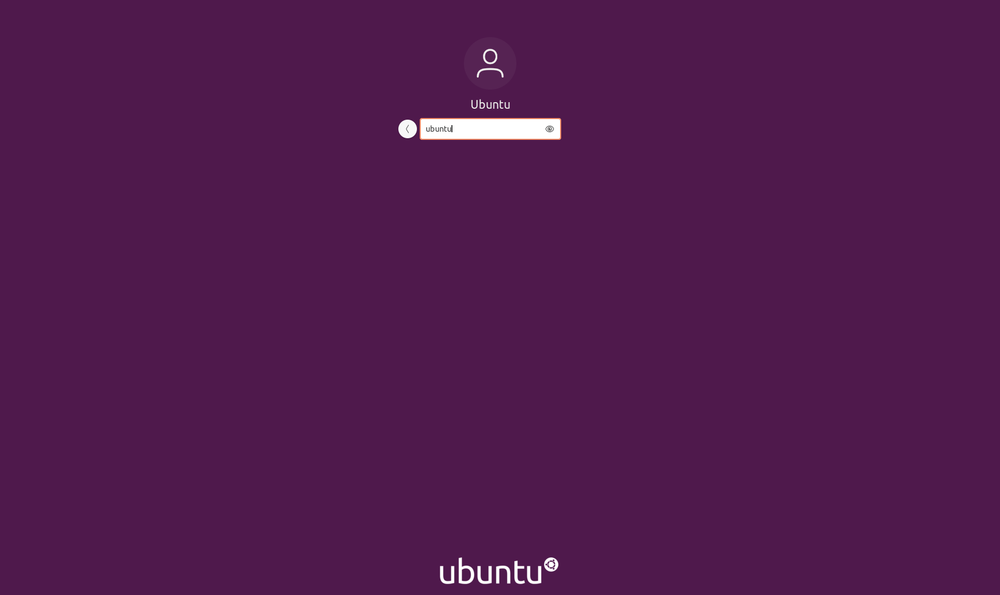
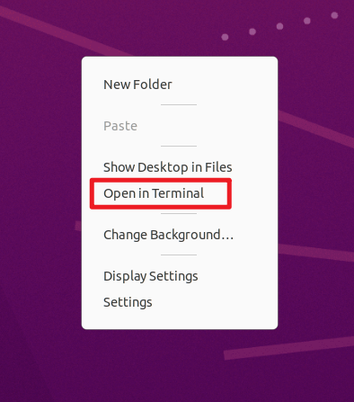
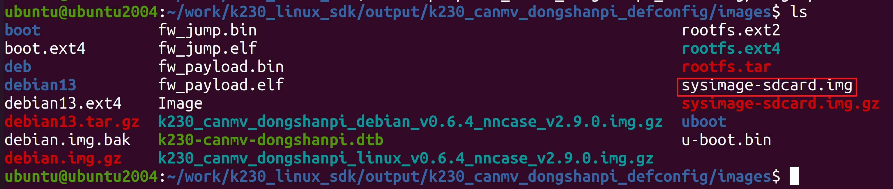
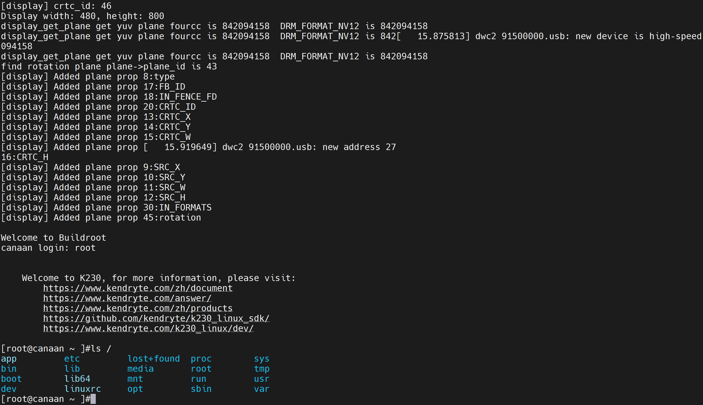
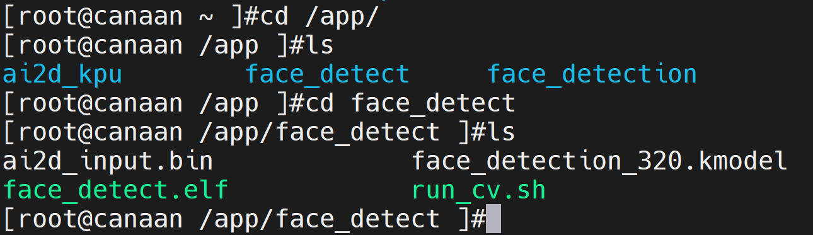
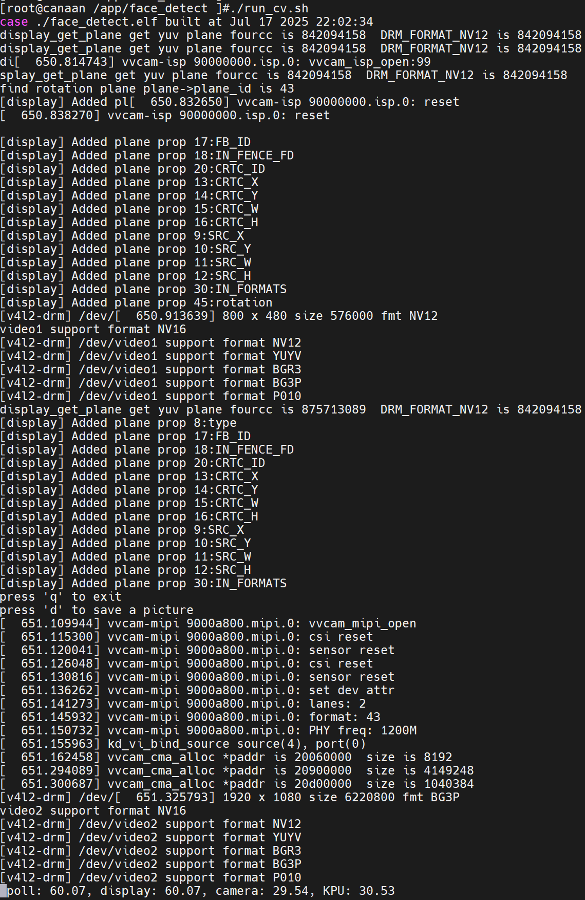

# Linux SDK编译指南

> 开始前请注意:
>
> - 如果您是小白，建议您直接使用 02_开发工具/【Vmware】搭建好Linux环境的Ubuntu20.04 目录下Ubuntu_20.04.4_VM.zip ，该压缩包为Vmware虚拟机镜像。
> - 如果您是企业工程师，该文档可作为参考，建议您直接获取芯片原厂SDK源码：
>   - git clone git@github.com:kendryte/k230_linux_sdk.git
>   - 使用k230_canmv_dongshanpi_defconfig配置文件，重新适配开发板。

​	本章节主要以我们提供的Linux SDK为例，由于芯片原厂SDK源码可能会更新，具体可查看源码的readme,本文主要以我们提供的SDK和环境为主，如果向自己搭建环境，请参考原厂SDK源码的readme。


## 1.编译源码

​	解压 02_开发工具/【Vmware】搭建好Linux环境的Ubuntu20.04 目录下Ubuntu_20.04.4_VM.zip压缩包。



使用Vmware软件选择`文件`打开`Ubuntu_20.04.4_VM_LinuxVMImages.COM.vmx`文件即可。

> Vmware软件可在 02_开发工具/【Windows】VMwareWorkstation安装包 目录下有对应的安装包！


打开后可看到如下画面，点击开启此虚拟机



开启后，会弹出选项框，选择`我已复制该虚拟机`。

等待虚拟机启动后，可进入Ubuntu登录界面，密码为`ubtunu`。



登录后可进入到Ubuntu界面，在桌面任意处右键选择`Open in Terminal`



进入work目录下，即可看到SDK源码和工具链文件。

```
ubuntu@ubuntu2004:~/Desktop$ cd 
ubuntu@ubuntu2004:~$ ls
Desktop  Documents  Downloads  Music  Pictures  Public  snap  Templates  Videos  work
ubuntu@ubuntu2004:~$ cd work
ubuntu@ubuntu2004:~/work$ ls
k230_linux_sdk-v0.6.4.tar.gz  Xuantie-900-gcc-linux-6.6.0-glibc-x86_64-V3.0.2-20250410.tar.gz
```


解压SDK源码：

```
tar -xzf k230_linux_sdk-v0.6.4.tar.gz
```

由于SDK文件较大，解压文件时间较长，请耐心等待解压完成。。。


解压完成后，可在work目录下看到`k230_linux_sdk`文件夹，进入该文件夹：

```
ubuntu@ubuntu2004:~/work$ cd k230_linux_sdk/
ubuntu@ubuntu2004:~/work/k230_linux_sdk$ ls
buildroot-overlay  dl  docs  LICENSE  Makefile  output  README.md  tools
```


编译SDK

```
make
```

> 注意：由于SDK压缩包是预编译的，所以make后会直接打包生成镜像。如果您获取的是原厂的SDK，可能需要等待1~2小时。

编译完成后可在SDK的`output/k230_canmv_dongshanpi_defconfig/images/`目录下看到下图所示的系统固件。



可将系统拷贝出来，参考《更新EMMC系统》将固件烧录至EMMC中。

> 注意：Linux系统的系统串口输出在Uart0！

## 2.系统启动

系统启动后，输入用户名`root`，按下回车即可进入系统根目录。




## 3.系统测试

进入`/app/face_detect`目录下



执行脚本`run_cv.sh`即可运行人脸检测程序：

