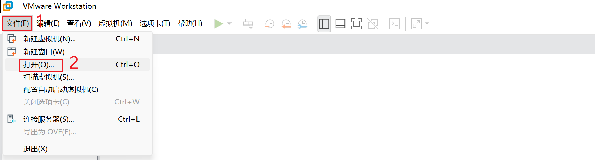
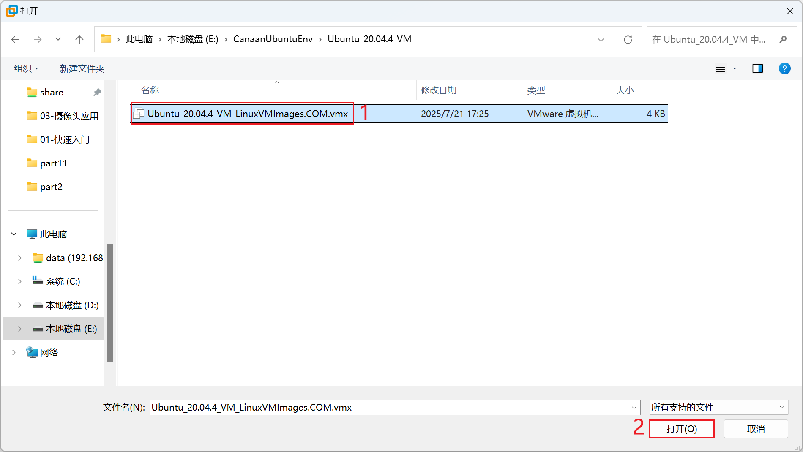
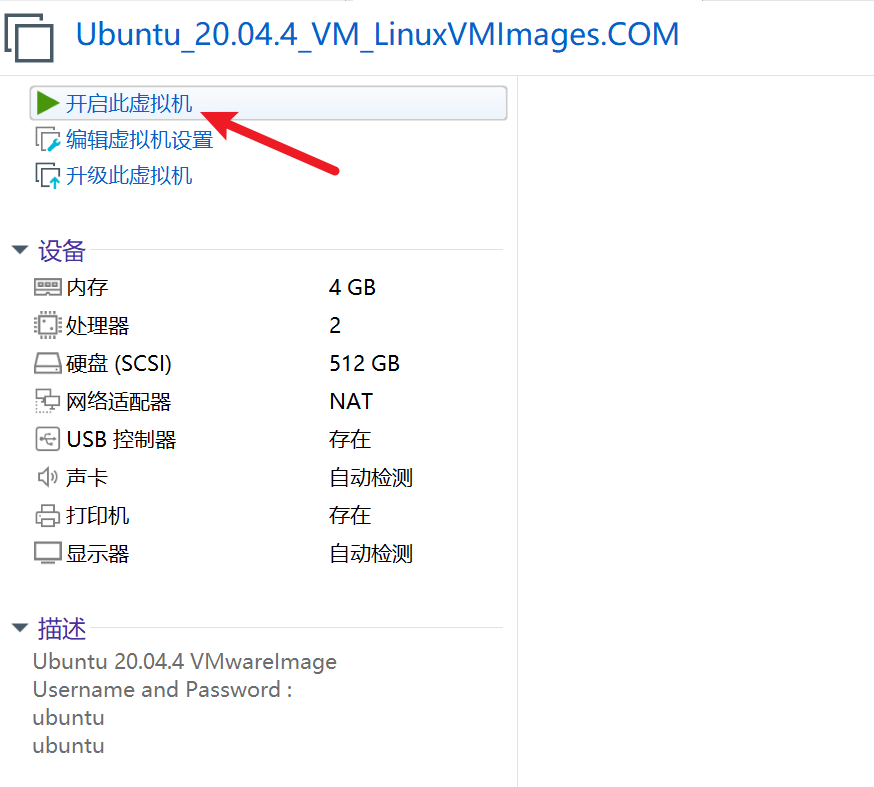
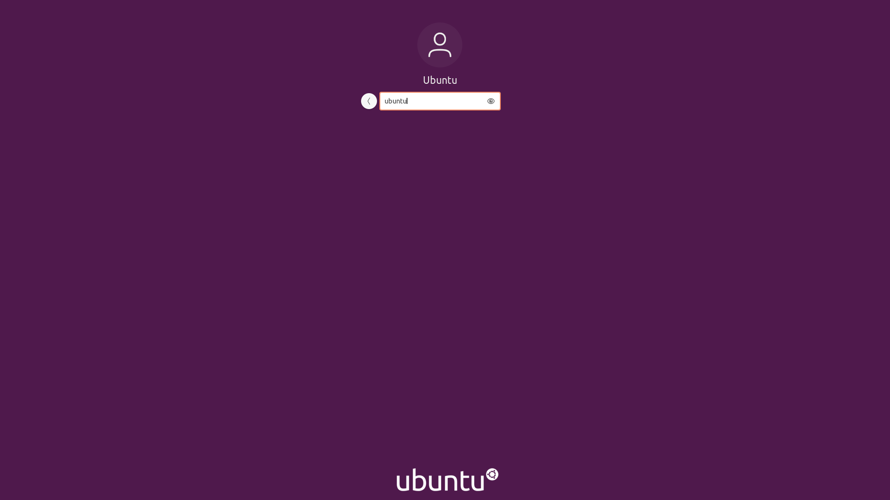
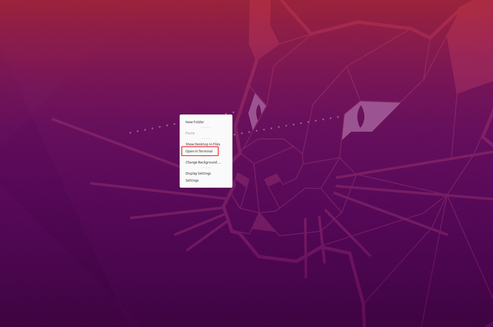

# K230 双系统SDK环境搭建

## 前提条件

- VMware虚拟机工具： 02_开发工具/【Windows】VMwareWorkstation安装包
- Ubuntu20.04 ：02_开发工具/【VMware】搭建好RT_Smart+Linux双系统环境的Ubuntu20.04

> 注意：
>
> - 如果您是小白，建议您直接使用 02_开发工具/【VMware】搭建好RT_Smart+Linux双系统环境的Ubuntu20.04 目录下Ubuntu_20.04.4_VM.zip ，该压缩包为Vmware虚拟机镜像。
> - 如果您是企业工程师，该文档可作为参考，建议您直接获取芯片原厂SDK源码：
>   - git clone https://github.com/kendryte/k230_sdk
>   - 使用k230_canmv_dongshanpi_defconfig配置文件，重新适配您自己的开发板。

## 1.配置SDK环境

​	请提前安装好VMware虚拟机工具，打开Ubuntu20.04 ：



选择Ubuntu20.04 的vmx文件。



打开虚拟机：



开启后如果遇到弹窗选择`我已复制该虚拟机`。


开启后等待虚拟机启动，启动完成后登录账号，虚拟机的账号密码均为: ubuntu




## 2.下载SDK

> 注意：`搭建好RT_Smart+Linux双系统环境的Ubuntu20.04`已经提前包含了SDK。
>
> 如果没有可以在资料的 09_RTSmart+Linux双系统资料/01_SDK源码目录下找到`k230_sdk.tar.gz`压缩包，可将该文件传输至VMware虚拟机中。

右键选择`Open in Terminal`，即可打开终端。



使用`cd`可进入home目录，该目录下存在K230_SDK。

```
ubuntu@ubuntu2004:~/Desktop$ cd 
ubuntu@ubuntu2004:~$ ls k230_sdk
board      Kconfig         Kconfig.storage    LICENSE   parse.mak       repo.mak   tools
configs    Kconfig.board   Kconfig.toolchain  Makefile  prepare_memory  src
defconfig  Kconfig.memory  Kconfig.wifi       README.md       toolchain

```


## 3.编译SDK

### 3.1 进入SDK根目录

```
cd k230_sdk
```


### 3.2 下载toolchain

```
make prepare_sourcecode
```


### 3.3 进入Docker环境

```
sudo docker run -u root -it -v $(pwd):$(pwd) -v $(pwd)/toolchain:/opt/toolchain -w $(pwd) ghcr.io/kendryte/k230_sdk /bin/bash
```


### 3.4 编译SDK

```
make CONF=k230_canmv_dongshanpi_defconfig
```

> 注意： sdk不支持多进程编译，不要增加类似-j32多进程编译参数。

编译完成后，在`output/xx_defconfig/images`目录下可以看到编译输出产物。

```
.
├── big
│   ├── mpp
│   └── rt-smart
├── common
│   ├── big-opensbi
│   ├── cdk
│   └── little-opensbi
├── images
│   ├── big-core
│   ├── k230_canmv_dongshanpi_sdcard_v1.6_nncase_v2.8.3.img.gz -> sysimage-sdcard.img.gz
│   ├── little-core
│   ├── sysimage-sdcard.img
│   └── sysimage-sdcard.img.gz
└── little
    ├── buildroot-ext
    ├── linux
    └── uboot
```

`images`目录下镜像文件说明如下：

`sysimage-sdcard.img` ————-是sd和emmc的非安全启动镜像；

`sysimage-sdcard.img.gz` ——–是SD和emmc的非安全启动镜像压缩包(sysimage-sdcard.img文件的gzip压缩包)，烧录时需要先解压缩。

`sysimage-sdcard_aes.img.gz`是SD和emmc的aes安全启动镜像压缩包，烧录时需要先解压缩。

`sysimage-sdcard_sm.img.gz`是SD和emmc的sm安全启动镜像压缩包，烧录时需要先解压缩。

安全镜像默认不会产生，如果需要安全镜像请参考4.3.4使能安全镜像。

大核系统的编译产物放在`images/big-core`目录下。

小核系统的编译产物放在`images/little-core`目录下。


> 如果想退出Docker环境，直接在命令行输入`exit`即可退出！
