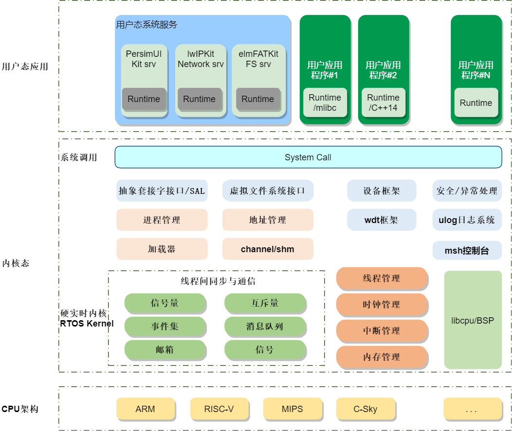

# K230_SDK开发指南

## 1.概述

K230 SDK 是面向K230 开发板的软件开发包，包含了基于Linux&RT-smart 双核异构系统开发需要用到的源代码，工具链和其他相关资源。本小节主要介绍SDK中的文件以及开发方式。

```
ubuntu@ubuntu2004:~/k230_sdk$ ls
board      Kconfig.board      Kconfig.wifi  output          repo.mak
configs    Kconfig.memory     LICENSE       parse.mak       src
defconfig  Kconfig.storage    Makefile      prepare_memory  toolchain
Kconfig    Kconfig.toolchain  Memory        README.md       tools
```

- board：描述生成板子镜像的规则
- configs：板级配置文件
- toolchain：RISC-V工具链
- tools：额外的工具（docker、ota等）
- src：（common公共的、大核rt-smart、小核Linux、AI等源码）

## 2.RT-smart大核开发

本文主要讲述多媒体部分的系统驱动与应用开发。大核源码目录如下所示：

```
ubuntu@ubuntu2004:~/k230_sdk/src/big$ ls
kmodel  mpp  nncase  rt-smart  unittest  utils
```

- kmodel：芯片端模型推理文件
- mpp：多媒体相关的驱动和应用程序
- nncase：芯片端模型推理框架
- rt-smart：大核系统源码
- unittest：单元测试框架（允许开发者使用统一的接口编写测试程序）
- utils：额外的库

在mpp目录中保存所有多媒体的驱动和应用示例，如果您需要进行多媒体的应用或驱动开发，可修改该目录下的文件。

在rt-smart目录中保存基于 RT-Thread 操作系统上的混合操作系统源码。



### 2.1 MPP系统开发

mpp目录下的文件如下所示：

```
ubuntu@ubuntu2004:~/k230_sdk/src/big/mpp$ ls
build_env.sh  include  kernel  middleware  README.md  userapps
```

- build_env.sh：编译脚本
- include：mpp相关头文件（包含驱动所用的多媒体类型）
- kernel：多媒体相关的驱动（摄像头、屏幕等驱动）
- userapps：用户态应用程序（包含k230端侧系统中的程序）


下面分别介绍mpp中每个目录下文件的内容以及作用。

**include目录介绍**

该目录包含有应用程序和驱动程序都可用到的头文件。

```
ubuntu@ubuntu2004:~/k230_sdk/src/big/mpp/include$ ls
comm  ioctl  k_errno.h  k_module.h  k_type.h
```

- comm：该目录下保存多媒体相关的驱动类型定义，应用程序可访问该头文件找到驱动类型定义，并使用对应驱动文件。

```
ubuntu@ubuntu2004:~/k230_sdk/src/big/mpp/include/comm$ ls
k_acodec_comm.h        k_cipher_comm.h     k_nonai_2d_comm.h  k_venc_comm.h
k_adec_comm.h          k_connector_comm.h  k_payload_comm.h   k_vicap_comm.h
k_aenc_comm.h          k_dewarp_comm.h     k_pm_comm.h        k_video_comm.h
k_ai_comm.h            k_dma_comm.h        k_sensor_comm.h    k_vo_comm.h
k_ao_comm.h            k_dpu_comm.h        k_sys_comm.h       k_vvi_comm.h
k_audio_comm.h         k_isp_comm.h        k_vb_comm.h        k_vvo_comm.h
k_autoconf_comm.h      k_log_comm.h        k_vdec_comm.h
k_board_config_comm.h  k_mmz_comm.h        k_vdss_comm.h
```

> 如果想新增驱动，请修改对应驱动的头文件，新增驱动描述和编号等。

- ioctl：该目录下保存所有多媒体驱动使用到ioctl命令的枚举。

```
ubuntu@ubuntu2004:~/k230_sdk/src/big/mpp/include/ioctl$ ls
k_connector_ioctl.h  k_fft_ioctl.h  k_ioctl.h  k_pm_ioctl.h  k_sensor_ioctl.h
```

- k_errno.h：多媒体相关错误码定义。
- k_module.h：多媒体相关的数据类型定义。
- k_type.h：系统数据类型定义。


**kernel目录介绍**

该目录包含多媒体相关的驱动文件。

> 注意：在kernel中的所有实现的驱动都会在生成k230芯片端系统实现注册。

```
ubuntu@ubuntu2004:~/k230_sdk/src/big/mpp/kernel$ ls
connector  fft  include  lib  Makefile  mediafreq  mpp.mk  pm  rt-smart.mk  sensor
```

- connector：包含多媒体驱动中显示屏相关的驱动，如果想新增显示驱动可在此目录下新增驱动文件。

```
ubuntu@ubuntu2004:~/k230_sdk/src/big/mpp/kernel/connector/src$ ls
connector_comm.c  connector_dev.h  ili9806.c  st7701.c
connector_dev.c   hx8399.c         lt9611.c   virtdev.c.c
```

- fft：包含fft相关的驱动。

```
ubuntu@ubuntu2004:~/k230_sdk/src/big/mpp/kernel/fft/src$ ls
fft_dev.c
```

- include：GCC中RT线程的编译器配置文件，一般不需要修改。

```
ubuntu@ubuntu2004:~/k230_sdk/src/big/mpp/kernel/include$ ls
cconfig.h
```

- lib：多媒体相关的驱动依赖文件。

```
ubuntu@ubuntu2004:~/k230_sdk/src/big/mpp/kernel/lib$ ls
libaudio.a      libdma.a  liblog.a        libpm.a      libvb.a     libvo.a   libvvo.a
libcmpi.a       libdpu.a  libmediafreq.a  libsensor.a  libvdss.a   libvpu.a
libconnector.a  libfft.a  libmmz.a        libsys.a     libvicap.a  libvvi.a
```

- mediafreq：多媒体定时器服务，一个高精度定时器，应用程序可以指定间隔请求和接受计时器信息来获取时间相关参数。

```
ubuntu@ubuntu2004:~/k230_sdk/src/big/mpp/kernel/mediafreq/src$ tree
.
├── media_freq_mod.c
└── sysctl
    └── sysctl_media_clock
        ├── sysctl_media_clk.c
        └── sysctl_media_clk.h

2 directories, 3 files
```

- pm：k230 SOC电源域驱动程序。

```
ubuntu@ubuntu2004:~/k230_sdk/src/big/mpp/kernel/pm/src$ ls
pm_core.c    pm_domain_cpu.c   pm_domain_dpu.c  pm_domain_kpu.c
pm_domain.c  pm_domain_disp.c  pm_domain.h      pm_domain_vpu.c
```

- sensor：包含多媒体驱动中的摄像头相关驱动，如果想新增摄像头驱动可在此目录下新增驱动文件。

```
buntu@ubuntu2004:~/k230_sdk/src/big/mpp/kernel/sensor/src$ ls
gc2053.c           ov5647_drv.c    sensor_comm.c      xs9950_csi1_drv.c
gc2093.c           ov9286_drv.c    sensor_dev.c       xs9950_csi2_drv.c
imx335_drv.c       ov9732_drv.c    sensor_dev.h
ov5647_csi1_drv.c  sc035hgs_drv.c  xs9922b_drv.c
ov5647_csi2_drv.c  sc201cs_drv.c   xs9950_csi0_drv.c
```


**middleware目录介绍**

该目录下包含多媒体中间件相关内容，例如解封装、rtsp、ffmpeg等移植好的库或协议。

```
ubuntu@ubuntu2004:~/k230_sdk/src/big/mpp/middleware$ tree -L 2
.
├── Makefile
├── mpp.mk
├── rt-smart.mk
├── sample
│   ├── Makefile
│   ├── sample_demuxer
│   ├── sample_muxer
│   ├── sample_player
│   ├── sample_rtspclient
│   ├── sample_rtsppusher
│   └── sample_rtspserver
└── src
    ├── ffmpeg
    ├── kdmedia
    ├── live555
    ├── Makefile
    ├── mp4_format
    ├── mp4_player
    ├── rtsp_client
    ├── rtsp_pusher
    ├── rtsp_server
    └── x264

17 directories, 5 files
```


**userapps目录介绍**

该目录下包含用户态所用的API、依赖和应用程序。

```
ubuntu@ubuntu2004:~/k230_sdk/src/big/mpp/userapps$ ls
api  lib  sample  src
```

- api：包含应用程序所有可用的api头文件，可参考多媒体相关的API参考手册。

```
ubuntu@ubuntu2004:~/k230_sdk/src/big/mpp/userapps/api$ ls
mpi_adec_api.h    mpi_connector_api.h  mpi_isp_api.h       mpi_vb_api.h     mpi_vo_api.h
mpi_aenc_api.h    mpi_dewarp_api.h     mpi_nonai_2d_api.h  mpi_vdec_api.h   mpi_vvi_api.h
mpi_ai_api.h      mpi_dma_api.h        mpi_pm_api.h        mpi_vdss_api.h
mpi_ao_api.h      mpi_dpu_api.h        mpi_sensor_api.h    mpi_venc_api.h
mpi_cipher_api.h  mpi_fft_api.h        mpi_sys_api.h       mpi_vicap_api.h
```

- lib：包含应用程序所有需要用到的依赖文件。

```
ubuntu@ubuntu2004:~/k230_sdk/src/big/mpp/userapps/lib$ ls
lib3a.a                 libcam_device.a       libdpu.a      libsensor.a        libvdec.a
libadec.a               libcam_engine.a       libebase.a    libstart_engine.a  libvdss.a
libaenc.a               libcameric_drv.a      libfft.a      libswitch.a        libvenc.a
libai.a                 libcameric_reg_drv.a  libfpga.a     libsys.a           libvicap.a
libao.a                 libcipher.a           libhal.a      libt_common_c.a    libvideo_in.a
libauto_ctrol.a         libcmd_buffer.a       libisi.a      libt_database_c.a  libvirtual_hal.a
libbinder.a             libcommon.a           libisp_drv.a  libt_json_c.a      libvo.a
libbuffer_management.a  libconnector.a        liboslayer.a  libt_mxml_c.a      libvvi.a
libcam_caldb.a          libdma.a              libpm.a       libvb.a
```

- sample：包含k230支持的所有示例程序。

```
ubuntu@ubuntu2004:~/k230_sdk/src/big/mpp/userapps/sample$ ls
elf                    sample_canaan_uart_tx  sample_gpio                      sample_vdd_r
fastboot_app           sample_cipher          sample_log                       sample_vdec
fastboot_elf           sample_csc             sample_mcm                       sample_vdss
linker_scripts         sample_dma             sample_mmz                       sample_vdv
Makefile               sample_dma_bind        sample_nonai_2d                  sample_venc
mpp.mk                 sample_dpu             sample_otp                       sample_vicap
opencv_camera_test     sample_dpu_vicap       sample_pm                        sample_vicap_100ask
rt-smart.mk            sample_dpu_vo          sample_pwm                       sample_virtual_vio
sample_adc             sample_dw200           sample_sensor_otp                sample_vo
sample_audio           sample_face_ae         sample_triple_camera_facedetect  sample_wdt
sample_av              sample_face_detect     sample_ts
sample_canaan_uart_rx  sample_fft             sample_vb
```

- src：该目录中保存所有多媒体应用程序所用的外设配置文件。

```
ubuntu@ubuntu2004:~/k230_sdk/src/big/mpp/userapps/src$ tree -L 2
.
├── cipher
│   ├── Makefile
│   └── mpi_cipher.c
├── connector
│   ├── Makefile
│   └── mpi_connector.c
├── fft
│   ├── Makefile
│   └── mpi_fft.c
├── Makefile
├── mpp.mk
├── pm
│   ├── Makefile
│   └── mpi_pm.c
├── rt-smart.mk
└── sensor
    ├── config
    ├── dewarp
    ├── Makefile
    ├── mpi_sensor.c
    └── mpi_sensor_type_to_mirror.c

7 directories, 14 files
```

### 2.2 Rt-smart系统开发

```
ubuntu@ubuntu2004:~/k230_sdk/src/big/rt-smart$ ls
init.sh  kernel  maix3_toolchain.sh  README.md  smart-env.sh  tools  userapps
```

- **init.sh**：初始化脚本，通常用于设置环境变量或执行一些启动时需要的命令。
- **kernel**：内核相关文件夹，包含操作系统内核的源代码和配置文件。
- **maix3_toolchain.sh**：工具链脚本，可能用于配置和安装编译工具链，特别是针对Maix3平台的开发。
- **README.md**：项目的说明文件，提供关于项目的基本信息、安装步骤、使用方法等。
- **smart-env.sh**：环境配置脚本，用于设置开发环境所需的变量和路径。
- **tools**：工具文件夹，包含各种开发和调试工具。
- **userapps**：用户应用程序文件夹，存放用户开发的应用程序代码。

## 3.Linux小核开发

在小核目录下的文件包括buildroot、linux内核、uboot这三个文件夹组成。

```
ubuntu@ubuntu2004:~/k230_sdk/src/little$ ls
buildroot-ext  linux  uboot  utils
```

如果您需要新增buildroot包或者修改buildroot的程序，可修改buildroot-ext目录下的文件。

如果您需要新增linux小核驱动或者修改linux的内容，可修改linux目录下的文件。

如果您需要uboot小核驱动或者修改uboot的内容，可修改uboot目录下的文件。

> 注意：uboot需要用来引导大核rt-smart启动!


buildroot-ext目录如下所示：

```
board：包含特定开发板的配置文件和支持文件，用于定义不同硬件平台的构建选项。
configs：存放各种预定义的配置文件，这些文件可以用来快速生成特定的构建环境。
dl：下载目录，存放构建过程中下载的源代码和其他资源文件。
package：包含所有软件包的定义和构建脚本，每个软件包都有自己的子目录。
patches：存放需要应用到源代码的补丁文件，用于修正或增强功能。
buildroot-9d1d4818c39d97ad7a1cdf6e075b9acae6dfff71：这是一个特定版本的Buildroot源代码目录，包含该版本的所有文件和代码。
```

> 注意：linux小核中运行的示例程序，如lvgl、i2c-tool等都是通过buildroot去管理的。


linux目录为标准的linux,下面就简单介绍设备树、配置文件等信息。

K230的Linux设备树目录为：

```
k230_sdk/src/little/linux/arch/riscv/boot/dts/kendryte
```

该目录下保存着K230所支持所有设备树文件。


K230的内核配置文件目录为：

```
k230_sdk/src/little/linux/arch/riscv/configs
```

该目录下保存着K230的配置文件。


> 如果您想在Linux小核中新增驱动，可按照标准的linux驱动进行新增，目前Linux小核中所用到的驱动包括：
>
> - 网络驱动（以太网、WiFi）
> - TF卡驱动
> - USB驱动
> - 显示屏驱动


uboot目录为标准的uboot，它的作用主要是用来引导rt-smart核linux内核的启动。下面就简单介绍设备树、配置文件等信息。

K230的uboot设备树目录为：

```
k230_sdk/src/little/uboot/arch/riscv/dts
```

该目录下保存着uboot设备树文件，对于K230所支持的配置文件都是以k230开头的文件。


K230的内核配置文件目录为：

```
k230_sdk/src/little/uboot/configs
```

该目录下保存着uboot的配置文件，对于K230所支持的配置文件都是以k230开头的文件。


## 4.AI应用开发

如果您想进行AI应用开发，可学习该目录下的示例程序。

```
ubuntu@ubuntu2004:~/k230_sdk/src/reference$ ls
ai_poc  business_poc  fancy_poc
```

- ai_poc：AI基础demo程序
- business_poc：智能门锁示例程序
- fancy_poc：多场景应用验证程序。


**ai_poc**:包含人脸、人体、手部、车牌、单词续写、语音、dms等模块，包含了分类、检测、分割、识别、跟踪、单目测距等多种功能。具体的编译使用请查看《K230 AI Demo介绍》。

```
ubuntu@ubuntu2004:~/k230_sdk/src/reference/ai_poc$ ls
anomaly_det           face_detection     head_detection         pose_detect         sq_handkp_ocr
build_app.sh          face_emotion       helmet_detect          pose_det_rtsp_plug  sq_handreco
bytetrack             face_gender        k230_bin               pphumanseg          traffic_light_detect
cmake                 face_glasses       kws                    puzzle_game         translate_en_ch
CMakeLists.txt        face_landmark      licence_det            segment_yolov8n     tts_zh
crosswalk_detect      face_mask          licence_det_rec        self_learning       vehicle_attr
dec_ai_enc            face_mesh          llamac                 shell               version
demo_mix              face_parse         nanotracker            smoke_detect        virtual_keyboard
distraction_reminder  face_pose          object_detect_yolov8n  space_resize        vi_vo
dms_system            face_verification  ocr                    sq_hand_det         yolop_lane_seg
dynamic_gesture       falldown_detect    person_attr            sq_handkp_class
eye_gaze              finger_guessing    person_detect          sq_handkp_det
face_alignment        fitness            person_distance        sq_handkp_flower
```


**fancy_poc**：包括multimodal_chat_robot(多模态聊天机器人)、meta_human(数字人)、meta_hand(手势渲染)和finger_reader(指读)等项目。具体编译使用请查看《K230 Fancy POC介绍》。

```
ubuntu@ubuntu2004:~/k230_sdk/src/reference/fancy_poc$ ls
ai_scale      cmake           face_recognition  housekeeper  meta_human             version
build_app.sh  CMakeLists.txt  finger_reader     meta_hand    multimodal_chat_robot  vi_vo
```


**business_poc**：智能门锁综合项目演示，此工程集成UI、人脸检测、人脸识别、人脸注册功能的程序，具体编译使用请查看《K230 场景实战-智能门锁POC》。

```
ubuntu@ubuntu2004:~/k230_sdk/src/reference/business_poc$ ls
dictionary_pen_poc  doorlock  doorlock_ov9286  peephole
```

