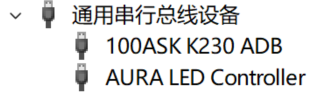
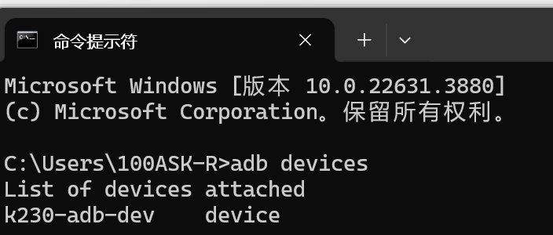
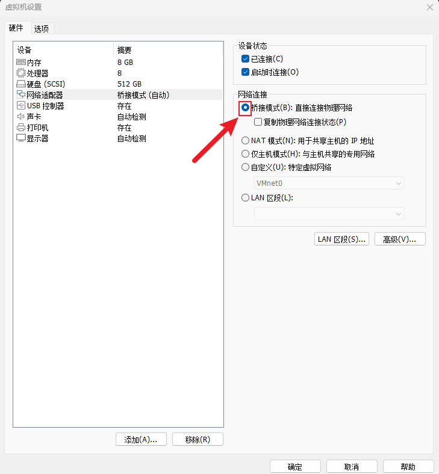
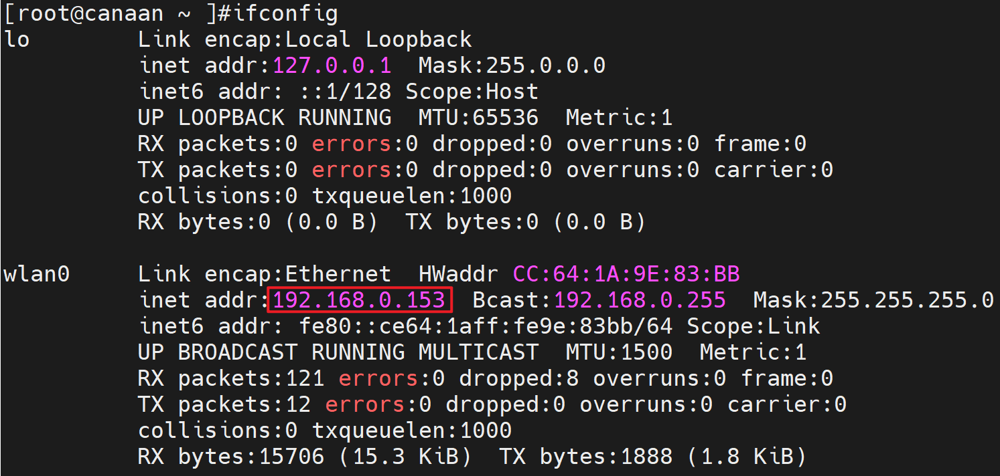
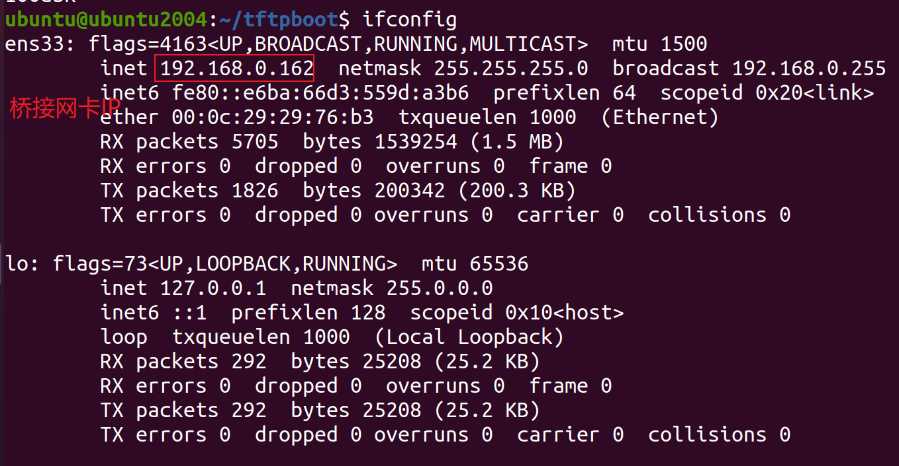

# 开发板文件传输

软件要求：

- Ubuntu20.04

硬件要求：

- DshanPI-CanMV开发板
- 天线 x1
- Type-C数据线 x2

我们提供3种方法进行文件传输：

- ADB
- SCP
- TFTP

您可以选择其中一种进行文件传输！！建议**ADB**进行文件传输！！

## 1.使用ADB进行文件传输

在使用ADB进行文件传输前，请确保上电前使用Type-C数据线将开发板的OTG口与电脑相连！连接后请连接debug&5V进行上电。上电后等待小核Linux启动后可以在电脑端找到ADB设备，如下所示：



> 建议选择其中一种方式进行文件传输！！

### 1.1 Windows进行文件传输

> 注意：如果您开启了虚拟机，新连接的设备可能会被Vmware拦截！！请选择ADB设备连接至Windos主机

打开Windos电脑中的命令提示符（您可以通过搜索或者按下`win+r`输入`cmd`打开），打开后在终端输入`adb devices`，如下所示：



可以看到有`k230-adb-dev`设备，此时我们就可以使用adb进行文件传输。

假设你需要将Windos下的1.txt文件传输至开发板端的根目录下，可以输入`adb push <文件路径> <开发板的路径>`，例如：

```
C:\Users\100ASK-R>adb push 1.txt /
1.txt: 1 file pushed. 0.0 MB/s (14 bytes in 0.002s)
```

那么如何从开发板拉取对应的文件?

假设我需要将开发板的根目录下的2.txt拉取当Windows当前目录可以输入`adb pull <开发板文件路径> <windows保存路径>`，例如：

```
C:\Users\100ASK-R>adb pull /2.txt ./
/2.txt: 1 file pulled. 0.0 MB/s (12 bytes in 0.001s)
```


如果您想使用adb 登录开发板终端，可以输入`adb shell`：

```
C:\Users\100ASK-R>adb shell
/sys/kernel/config/usb_gadget/demo #
```

默认会进入adb的工作目录，可以通过命令`cd /`切换至根目录或者查看文件等

```
/sys/kernel/config/usb_gadget/demo # cd /
/ # ls
1.txt        dev          lib64        media        root         sys
2.txt        etc          lib64xthead  mnt          run          tmp
app          init         linuxrc      opt          sbin         usr
bin          lib          lost+found   proc         sharefs      var
```


### 1.2 Ubuntu进行文件传输

> 注意：如果您开启了虚拟机，新连接的设备可能会被Vmware拦截！！请选择ADB设备连接至Ubuntu虚拟机

如果您是第一次使用或者Ubuntu中没有安装adb，需要先安装adb才能正常使用，在终端执行：

```
sudo apt install adb -y
```


打开Ubuntu的终端，打开后输入`adb device`,可能会由于系统的安全模式被禁用，如下所示：

```
ubuntu@ubuntu2004:~$ adb devices
List of devices attached
k230-adb-dev	no permissions (user in plugdev group; are your udev rules wrong?); see [http://developer.android.com/tools/device.html]
```

**解决办法：**

1.查看adb目录

```
ubuntu@ubuntu2004:~$ which adb
/usr/bin/adb
```

2.切换至adb目录下

```
ubuntu@ubuntu2004:~$ cd /usr/bin/
ubuntu@ubuntu2004:/usr/bin$
```

3.修改所属用户和用户组

```
ubuntu@ubuntu2004:/usr/bin$ sudo chown root:root ./adb
```

4.修改权限

```
ubuntu@ubuntu2004:/usr/bin$ sudo chmod 4777 ./adb
```

5.重启Ubuntu

```
ubuntu@ubuntu2004:/usr/bin$ reboot
```


重启Ubuntu后，请重新启动开发板连接ADB,此时将Ubuntu可以正常使用ADB功能，在终端输入`adb device`:

```
ubuntu@ubuntu2004:~$ adb devices
List of devices attached
* daemon not running; starting now at tcp:5037
* daemon started successfully
k230-adb-dev	device
```

后续我们就可以正常使用ADB进行文件传输了。

假设你需要将Ubuntu下的1.txt文件传输至开发板端的根目录下，可以输入`adb push <文件路径> <开发板的路径>`，例如：

```
ubuntu@ubuntu2004:~$ adb push 1.txt /
1.txt: 1 file pushed. 0.0 MB/s (15 bytes in 0.008s)
```

那么如何从开发板拉取对应的文件?

假设我需要将开发板的根目录下的2.txt拉取当Ubuntu当前目录可以输入`adb pull <开发板文件路径> <windows保存路径>`，例如：

```
C:\Users\100ASK-R>adb pull /2.txt ./
/2.txt: 1 file pulled. 0.0 MB/s (12 bytes in 0.001s)
```


如果您想使用adb 登录开发板终端，可以输入`adb shell`：

```
ubuntu@ubuntu2004:~$ adb shell
/sys/kernel/config/usb_gadget/demo # 
```

默认会进入adb的工作目录，可以通过命令`cd /`切换至根目录或者查看文件等

```
/sys/kernel/config/usb_gadget/demo # cd /
/ # ls
1.txt        dev          lib64        media        root         sys
2.txt        etc          lib64xthead  mnt          run          tmp
app          init         linuxrc      opt          sbin         usr
bin          lib          lost+found   proc         sharefs      var
/ # 
```

### 1.3 FAQ

> 注意：请不要手动切换ADB连接主机/虚拟机

1.如果手动切换ADB连接平台，导致电脑识别不到设备。

解决办法：

1. 重新启动开发板。
2. 重新选择连接平台

> 建议保存连接规则，如果需要切换连接平台，可点击Vmware软件中`虚拟机`->`可移动设备`->`100ASK K230 ADB`->`忘记连接规则`。选择后再次重新启动开发板，选择需要切换的平台！

## 2.设置Ubuntu虚拟机为桥接模式

在开始前请确保您的CanMV开发板已经成功连接至互联网。使用SCP和TFTP方式进行文件传输需要先修改Ubuntu虚拟机的网络连接模式！！



### 2.1.使用SCP进行文件传输

在Ubuntu中，SCP（Secure Copy Protocol）是一种用于在本地和远程计算机之间安全复制文件的命令行工具。它基于SSH（Secure Shell）协议进行加密传输，确保数据在传输过程中不会被窃取或篡改。

#### 2.1.1 确认开发板IP地址



这里我确认我的开发板的IP地址为：192.168.0.153，您需要在开发板端自行查看自己的开发板IP地址。

#### 2.1.2 开发板通过SCP传输文件

> 注意：以下命令都需要在Ubuntu端执行！！

Ubuntu上传文件到开发板：

```
scp local_filename root@remote_ip:remote_folder
```

`remote_ip`填写开发板ip地址，`remote_ip`填写开发板的目录，例如根目录/home

Ubuntu从开发板下载文件：

```
scp root@remote_ip:remote_file_path local_path
```

`remote_ip`填写开发板ip地址，`remote_file_path`填写所要下载的文件的路径，`local_path`填写Linux本地路径


例如我需要将Ubuntu的home目录下的1.txt传输到开发板端的sharefs目录中：

```
ubuntu@ubuntu2004:~$ ls /home/ubuntu/
1.txt
buntu@ubuntu2004:~$ scp 1.txt root@192.168.0.153:/sharefs/
The authenticity of host '192.168.0.153 (192.168.0.153)' can't be established.
ECDSA key fingerprint is SHA256:iPcPuMuciiH7ckU+HvpWGIxmxGxLYE1wBgIrC+J2btI.
Are you sure you want to continue connecting (yes/no/[fingerprint])? yes
Warning: Permanently added '192.168.0.153' (ECDSA) to the list of known hosts.
1.txt                                                                   100%   15     0.5KB/s   00:00
```

> 注意：第一次传输时请输入yes，表示同意连接！！

如何从开发板下载文件到Ubuntu？比如我们现在开发板共享文件目录下有2.txt 的文本文件，传输命令为：

```
ubuntu@ubuntu2004:~$ scp root@192.168.0.153:/sharefs/2.txt ./
2.txt                                                                   100%   14     2.4KB/s   00:00 
ubuntu@ubuntu2004:~$ cat 2.txt 
100ask canaan
```


#### 2.1.3 FAQ

1.主机密钥验证问题，报错信息为：

```
Please contact your system administrator.
Add correct host key in /home/ubuntu/.ssh/known_hosts to get rid of this message.
Offending ECDSA key in /home/ubuntu/.ssh/known_hosts:1
  remove with:
  ssh-keygen -f "/home/ubuntu/.ssh/known_hosts" -R "192.168.0.153"
ECDSA host key for 192.168.0.153 has changed and you have requested strict checking.
Host key verification failed.
lost connectio
```

解决办法：

```
ssh-keygen -f "/home/ubuntu/.ssh/known_hosts" -R "192.168.0.153"
```


### 2.2 使用TFTP进行文件传输

#### 2.2.1 在Ubuntu下安装TFTP

在Ubuntu中执行以下命令安装TFTP服务：

```
sudo apt-get install tftp-hpa tftpd-hpa
```

然后，创建TFTP服务工作目录，并打开TFTP服务配置文件，如下:

```
mkdir -p /home/ubuntu/tftpboot
chmod 777 /home/ubuntu/tftpboot
sudo gedit /etc/default/tftpd-hpa
```

在配置文件/etc/default/tftpd-hpa中，将原来的内容删除，修改为：

```
TFTP_USERNAME="tftp"
TFTP_ADDRESS=":69"
TFTP_DIRECTORY="/home/ubuntu/tftpboot"
TFTP_OPTIONS="-l -c -s"
```

最后，重启TFTP服务

```
sudo service tftpd-hpa restart
```

查看tftp服务是否在运行,运行如下命令，即可查看是否在后台运行。

```
ubuntu@ubuntu2004:~/Desktop$ ps -aux | grep “tftp”
ubuntu 4555 0.0 0.0 9040 652 pts/0 S+ 02:33 0:00 grep --color=auto “tftp”
```


#### 2.2.2 开发板通过tftp传输文件

首先确保Ubuntu或Windows的tftp服务目录内，有需要下载到板子上的文件，比如：

```
ubuntu@ubuntu2004:~$ ls /home/ubuntu/tftpboot/
1.txt
```

确认Ubuntu的网络IP，例如



比如下载Ubuntu服务器下的1.txt 文件，则在开发板上执行如下命令(Ubuntu的桥接网卡IP是 192.168.0.162)：

```
[root@canaan ~ ]$ tftp -g -r 1.txt 192.168.0.162
```


如何从开发板上传文件到Ubuntu？比如我们现在开发板家目录下创建一个2.txt 的文本文件，传输命令为：

```
tftp -p -l 2.txt 192.168.0.162
```

> 注意：TFTP中的上传/下载命令都需要在开发板中执行
