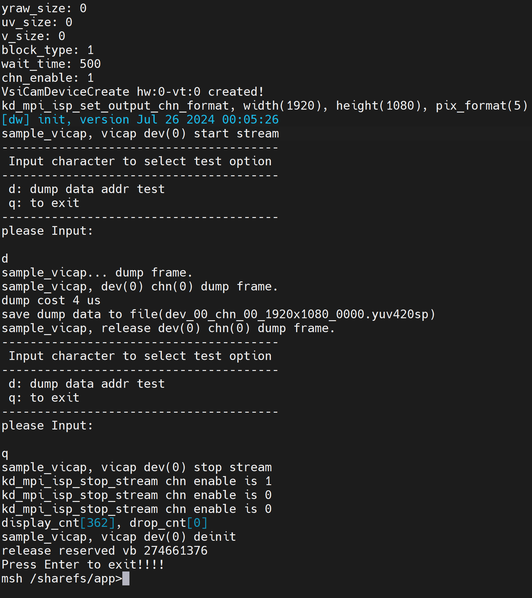

# 摄像头实验-捕获不同分辨率图像

硬件要求：

- DshanPI-CanMV开发板
- GC2093摄像头
- Type-C数据线 

开发环境：

- Ubuntu20.04

资料具体位置： `09_RTSmart+Linux双系统资料\02_多媒体应用示例源码\02_sample_vicap_100ask` 


## 1.修改源码

```
    k_u16 out_width = 640;
    out_width = VICAP_ALIGN_UP(out_width, 16);
    device_obj[cur_dev].out_win[cur_chn ].width = out_width;


    k_u16 out_height = 640;
    // out_height = VICAP_ALIGN_UP(out_height, 16);
    device_obj[cur_dev].out_win[cur_chn].height = out_height;
```

指定输出分辨率，指定后将会保存对应分辨率图像。


## 2.运行效果

运行后输入`d`，可获取指定分辨率的图像。



