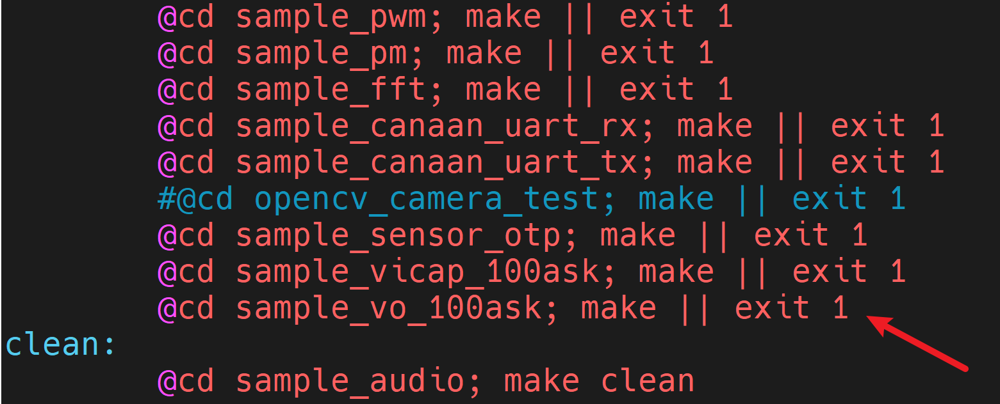
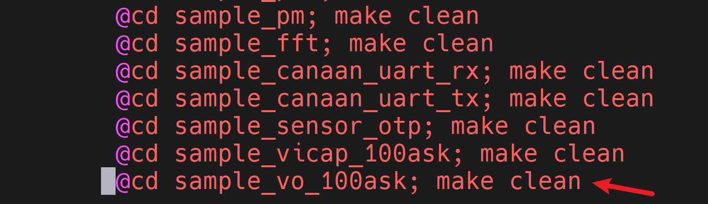
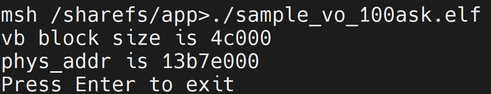

# 显示屏实验-显示一张图像

硬件要求：

- DshanPI-CanMV开发板
- Type-C数据线 x2
- MIPI显示屏/HDMI显示屏

开发环境：

- Ubuntu20.04

资料具体位置： `09_RTSmart+Linux双系统资料\02_多媒体应用示例源码\03_sample_vo*` 

## 1.视频输出

VO（Video Output，视频输出）模块主动从内存相应位置读取视频和图形数据，并通过相应的显示设备输出视频和图形。芯片支持的显示/回写设备、视频层和图形层情况。

LAYER层支持：

|            | LAYER0             | LAYER1             | LAYER2                    |
| ---------- | ------------------ | ------------------ | ------------------------- |
| 输入格式   | YUV420 NV12        | YUV420 NV12        | YUV420 NV12 YUV422 NV16 ? |
| 最大分辨率 | 1920x1080          | 1920x1080          | 1920x1080                 |
| 叠加显示   | 支持可配置叠加顺序 | 支持可配置叠加顺序 | 支持可配置叠加顺序        |
| Rotation   | √                  | √                  | -                         |
| Scaler     | √                  | -                  | -                         |
| Mirror     | √                  | √                  | -                         |
| Gray       | √                  | √                  | -                         |
| 独立开关   | √                  | √                  | √                         |

OSD 层支持

|                    | OSD0                                                    | OSD1                                                    | OSD2                                                    | OSD3                                                    |
| ------------------ | ------------------------------------------------------- | ------------------------------------------------------- | ------------------------------------------------------- | ------------------------------------------------------- |
| 输入格式           | RGB888 RGB565 ARGB8888 Monochrome-8-bit RGB4444 RGB1555 | RGB888 RGB565 ARGB8888 Monochrome-8-bit RGB4444 RGB1555 | RGB888 RGB565 ARGB8888 Monochrome-8-bit RGB4444 RGB1555 | RGB888 RGB565 ARGB8888 Monochrome-8-bit RGB4444 RGB1555 |
| 最大分辨率         | 1920x1080                                               | 1920x1080                                               | 1920x1080                                               | 1920x1080                                               |
| 叠加显示           | 支持可配置叠加顺序                                      | 支持可配置叠加顺序                                      | 支持可配置叠加顺序                                      | 支持可配置叠加顺序                                      |
| ARGB 265 等级ALPHA | √                                                       | √                                                       | √                                                       | √                                                       |
| 独立开关           | √                                                       | √                                                       | √                                                       | √                                                       |


## 2.应用程序编译

### 2.1 新增程序

#### 2.1.1 新建工程文件夹

在k230_sdk/src/big/mpp/userapps/sample目录下新建工程

```
mkdir sample_vo_100ask
```

#### 2.1.2 修改Makefile

修改k230_sdk/src/big/mpp/userapps/sample目录下的Makefile文件，新增sample_vicap_100ask工程的编译规则

```
@cd sample_vo_100ask; make || exit 1
```



```
@cd sample_vo_100ask; make clean
```



#### 2.1.3 进入工程目录

```
cd sample_vicap_100ask/
```


#### 2.1.4 新建源码文件

```
vi sample_vo_100ask.c
```

填入源码。

2.1.5 新建源码头文件

```
vi vo_test_case.h
```

#### 2.1.5 新建Makefile文件

```
vi Makefiel
```

填入一下内容：

```
include $(MPP_SRC_DIR)/userapps/sample/mpp.mk
include $(MPP_SRC_DIR)/userapps/sample/rt-smart.mk

CURRECT_DIR_NAME=$(shell basename `pwd`)
LOCAL_SRC_DIR = $(shell pwd)
BIN = $(MPP_SRC_DIR)/userapps/sample/elf/$(CURRECT_DIR_NAME).elf
LIBPATH = $(MPP_LIB_PATH)
LIBS = $(MPP_LIBS)

LOCAL_CFLAGS = -I$(LOCAL_SRC_DIR)

SRCS = $(wildcard $(LOCAL_SRC_DIR)/*.c)

OBJS = $(patsubst %.c,%.o,$(SRCS))

all: $(BIN)
	@-rm -f $(OBJS)
	echo "${PWD}/Makefile all"

$(OBJS): %.o : %.c
	@$(CC) $(CC_CFLAGS) $(LOCAL_CFLAGS) $(BSP_CFLGAS) $(RTSMART_CFLAGS) $(MPP_USER_CFLGAS) -c $< -o $@

$(BIN): $(OBJS)
	$(CC) -o $(BIN) $(LINKFLAG) -Wl,--whole-archive -Wl,--no-whole-archive -n --static $(OBJS) -L$(LIBPATH) -Wl,--start-group $(LIBS) -Wl,--end-group

clean:
	echo "${PWD}/Makefile clean"
	-rm -rf $(BIN)
	-rm -f $(OBJS)

.PHONY: all clean
```

### 2.2 程序编译

1.进入K230SDK目录

```
cd ~/k230_sdk
```

2.进入Docker环境

```
sudo docker run -u root -it -v $(pwd):$(pwd) -v $(pwd)/toolchain:/opt/toolchain -w $(pwd) ghcr.io/kendryte/k230_sdk /bin/bash
```

3.配置板级型号

```
make CONF=k230_canmv_dongshanpi_defconfig prepare_memory	
```

4.编译程序

```
make mpp-apps
```

等待编译完成，编译完成后，可执行程序`sample_vo_100ask.elf`会生成在`k230_sdk/src/big/mpp/userapps/sample/elf`目录下。

使用ADB将可执行程序传输至开发板中

```
adb push src/big/mpp/userapps/sample/elf/sample_vo_100ask.elf /sharefs/app
```

### 2.2 程序运行

使用串口软件访问开发板的大核串口终端。

> 如果没有关闭开机自启程序，可按下q+回车键可退出开机自启程序。

1.进入可执行文件目录

```
cd /sharefs/app
```

2.运行程序

```
./sample_vo_100ask.elf
```

执行完成后效果如下所示：



按下回车后，即可退出程序。


## 3.程序解析


### 3.1 重置显示设备

```
    // rst display subsystem
    kd_display_reset();
    // set hardware reset;
    kd_display_set_backlight();
```


### 3.2 显示图像

```
    sample_connector_osd_install_frame(ILI9806_MIPI_2LAN_480X800_30FPS);
```


#### 3.3.1 设置叠加显示尺寸

```
    osd.act_size.width = 320 ;
    osd.act_size.height = 240;
    osd.offset.x = 80;
    osd.offset.y = 280;
    osd.global_alptha = 0xff;
    osd.format = PIXEL_FORMAT_ARGB_8888;
```


#### 3.3.2 显示屏初始化

```
sample_connector_init(type);//LCD INIT
```


1.获取连接器信息

```
    ret = kd_mpi_get_connector_info(connector_type, &connector_info);
    if (ret) {
        printf("sample_vicap, the sensor type not supported!\n");
        return ret;
    }
```

2.获取连接器设备节点

```
    connector_fd = kd_mpi_connector_open(connector_info.connector_name);
    if (connector_fd < 0) {
        printf("%s, connector open failed.\n", __func__);
        return K_ERR_VO_NOTREADY;
    }
```

3.设置连接器电源

```
    kd_mpi_connector_power_set(connector_fd, 1);
```


4.初始化连接器

```
    kd_mpi_connector_init(connector_fd, connector_info);
```


#### 3.3.3 创建缓冲池

```
vo_creat_private_poll();//creat Memery Poll
```

1.设置缓冲区配置

```
	config.max_pool_cnt = 10;//Number of cache pools that can be accommodated in the whole system.
    config.comm_pool[0].blk_cnt = 20;
    config.comm_pool[0].blk_size = PRIVATE_POLL_SZE;          // osd0 - 3 argb 320 x 240
    printf("PRIVATE_POLL_SZE = %d\n",PRIVATE_POLL_SZE);
    config.comm_pool[0].mode = VB_REMAP_MODE_NOCACHE;//VB_REMAP_MODE_NOCACHE; 

    ret = kd_mpi_vb_set_config(&config);//Set MPP video cache pool properties
```

2.初始化缓冲区

```
ret = kd_mpi_vb_init();//Initialize MPP video cache pool
```

3.创建视频缓冲池

```
	memset(&pool_config, 0, sizeof(pool_config));
    pool_config.blk_cnt = PRIVATE_POLL_NUM;
    pool_config.blk_size = PRIVATE_POLL_SZE;
    pool_config.mode = VB_REMAP_MODE_NONE;
    //Create a video cache pool and return a valid cache pool ID number.
    pool_id = kd_mpi_vb_create_pool(&pool_config);      // osd0 - 3 argb 320 x 240
```

4.记录缓冲池ID

```
    g_pool_id = pool_id;
```


#### 3.3.4 根据格式计算显示大小

```
vo_creat_osd_test(osd_id, &osd);
```

1.设置透明度

```
attr.global_alptha = info->global_alptha;
```

2.根据格式设置大小和步幅

```
    if (info->format == PIXEL_FORMAT_ABGR_8888 || info->format == PIXEL_FORMAT_ARGB_8888)
    {
        info->size = info->act_size.width  * info->act_size.height * 4;
        info->stride  = info->act_size.width * 4 / 8;
    }
```

3.设置叠加显示的属性

```
    attr.stride = info->stride;
    attr.pixel_format = info->format;
    attr.display_rect = info->offset;
    attr.img_size = info->act_size;
    kd_mpi_vo_set_video_osd_attr(osd, &attr);//Set osd layer properties
```

4.开启OSD层

```
kd_mpi_vo_osd_enable(osd);//open osd layer
```


#### 3.3.4 设置插入帧

```
 	memset(&vf_info, 0, sizeof(vf_info));
    vf_info.v_frame.width = osd.act_size.width;
    vf_info.v_frame.height = osd.act_size.height;
    vf_info.v_frame.stride[0] = osd.act_size.width;
    vf_info.v_frame.pixel_format = osd.format;
    block = vo_insert_frame(&vf_info, &pic_vaddr);//将申请的缓冲区地址给pic_vaddr
```

1.设置帧大小

```
if (vf_info->v_frame.pixel_format == PIXEL_FORMAT_ABGR_8888 || vf_info->v_frame.pixel_format == PIXEL_FORMAT_ARGB_8888)
        size = vf_info->v_frame.height * vf_info->v_frame.width * 4;
        
size = size + 4096;         // 强制4K对齐
```

2.根据缓冲池ID获取缓冲区

```
 handle = kd_mpi_vb_get_block(g_pool_id, size, NULL);//Get a cache block in user mode
    if (handle == VB_INVALID_HANDLE)
    {
        printf("%s get vb block error\n", __func__);
        return K_FAILED;
    }
```

3.获取缓冲区的物理地址

```
    phys_addr = kd_mpi_vb_handle_to_phyaddr(handle);//Get block phy Addr
    if (phys_addr == 0)
    {
        printf("%s get phys addr error\n", __func__);
        return K_FAILED;
    }
```

4.获取缓冲区的虚拟地址

```
virt_addr = (k_u32 *)kd_mpi_sys_mmap(phys_addr, size);//phy addr mmap to vir addr
```

5.将获取的信息传出

```
	vf_info->mod_id = K_ID_VO; //video output device
    vf_info->pool_id = g_pool_id; 
    vf_info->v_frame.phys_addr[0] = phys_addr;
    if (vf_info->v_frame.pixel_format == PIXEL_FORMAT_YVU_PLANAR_420)
        vf_info->v_frame.phys_addr[1] = phys_addr + (vf_info->v_frame.height * vf_info->v_frame.stride[0]);
    *pic_vaddr = virt_addr;
```

#### 3.3.5 填充显示帧

```
vo_osd_filling_color(&osd, pic_vaddr);
```

1.获取虚拟地址

```
k_u32 *temp_addr = (k_u32 *)pic_vaddr;
```

2.填充虚拟地址的值

```
 else if (osd->format == PIXEL_FORMAT_ARGB_8888)
    {
        for (i = 0; i < osd->size / sizeof(k_u32) ; i++)
        {
            //temp_addr[i] = 0x00FF00ff;//COLOR_BGRA_GREEN;
            temp_addr[i] = 0x0000FFFF;//COLOR_BGRA_RED;
            //temp_addr[i] = 0x0000FFFF;//COLOR_BGRA_BLUE;
        }
    }
```

#### 3.3.6 视频帧插入VO通道

```
kd_mpi_vo_chn_insert_frame(osd_id + 3, &vf_info);
```

#### 3.3.7 退出与清理操作

```
    kd_mpi_vo_osd_disable(osd_id);//close osd layer
    kd_mpi_vb_release_block(block);//release user block
    kd_mpi_vb_destory_pool(g_pool_id);//destory video Memery pool
    kd_mpi_vb_exit();
```

