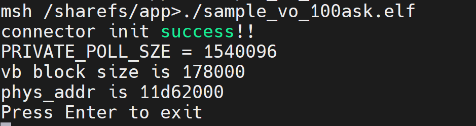

# 显示屏实验-显示不同分辨率图像

硬件要求：

- DshanPI-CanMV开发板
- Type-C数据线 x2
- MIPI显示屏/HDMI显示屏

开发环境：

- Ubuntu20.04


资料具体位置： `09_RTSmart+Linux双系统资料\02_多媒体应用示例源码\04_sample_vo*` 

## 1.修改源码

### 1.1 修改申请内存大小

```
#define PRIVATE_POLL_SZE                        (480 * 800 * 4) + (1024 * 4)
#define PRIVATE_POLL_NUM                        (4)
```


### 1.2 修改图像路径

```
#define CONNECTOR_OSD_TEST_PICTURE        "disney_480x800_argb8888.yuv"
```


### 1.3 修改叠加的位置和大小

```
    osd.act_size.width = 480;
    osd.act_size.height = 800;
    osd.offset.x = 0;
    osd.offset.y = 0;
```


### 1.4 读取图像文件

```
    void *read_addr = NULL;
    FILE *fd;
    int ret = 0;
    k_u32 read_size = osd.size;

    read_addr = malloc(read_size);
    if (!read_addr)
    {
        printf("alloc read addr failed\n");
    }
    // add picture
    fd = fopen(CONNECTOR_OSD_TEST_PICTURE, "rb");
    // get output image
    ret = fread(read_addr, read_size, 1, fd);
    if (ret <= 0)
    {
        printf("fread  picture_addr is failed ret is %d \n", ret);
    }
    memcpy(pic_vaddr, read_addr, read_size);
```


## 2.运行及效果

将显示的图像传输至开发板

```
adb push disney_480x800_argb8888.yuv /sharefs/app
```

传输完成后运行对应示例：


