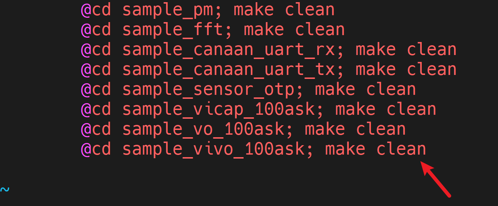

# 实现摄像头的显示屏实时预览

硬件要求：

- DshanPI-CanMV开发板
- GC2093摄像头
- Type-C数据线 x2
- MIPI显示屏/HDMI显示屏

开发环境：

- Ubuntu20.04


资料具体位置： `09_RTSmart+Linux双系统资料\02_多媒体应用示例源码\05_sample_vivo*` 

## 1.数据流框图


摄像头采集数据后，送至显示屏设备对应的图层中显示。


## 2.应用程序编译

### 2.1 新增程序

#### 2.1.1 新建工程文件夹

在k230_sdk/src/big/mpp/userapps/sample目录下新建工程

```
mkdir sample_vivo_100ask
```

#### 2.1.2 修改Makefile

修改k230_sdk/src/big/mpp/userapps/sample目录下的Makefile文件，新增sample_vivo_100ask工程的编译规则

```
@cd sample_vivo_100ask; make || exit 1
```


新增sample_vivo_100ask工程的清理规则：

```
@cd sample_vivo_100ask; make clean
```



#### 2.1.3 进入工程目录

```
cd sample_vivo_100ask
```


#### 2.1.4 新建源码文件

```
vi sample_vivo_100ask.c
```

填入源码。

#### 2.1.5 新建Makefile文件

```
vi Makefiel
```

填入以下内容：

```
include $(MPP_SRC_DIR)/userapps/sample/mpp.mk
include $(MPP_SRC_DIR)/userapps/sample/rt-smart.mk

CURRECT_DIR_NAME=$(shell basename `pwd`)
LOCAL_SRC_DIR = $(shell pwd)
BIN = $(MPP_SRC_DIR)/userapps/sample/elf/$(CURRECT_DIR_NAME).elf
LIBPATH = $(MPP_LIB_PATH)
LIBS = $(MPP_LIBS)

LOCAL_CFLAGS = -I$(LOCAL_SRC_DIR) \

SRCS = $(wildcard $(LOCAL_SRC_DIR)/*.c)\


OBJS = $(patsubst %.c,%.o,$(SRCS))

all: $(BIN)
	@-rm -f $(OBJS)
	@echo "${PWD}/Makefile all"

$(OBJS): %.o : %.c
	@echo CC $@
	@$(CC) $(CC_CFLAGS) $(LOCAL_CFLAGS) $(BSP_CFLGAS) $(RTSMART_CFLAGS) $(MPP_USER_CFLGAS) -c $< -o $@

$(BIN): $(OBJS)
	@echo LD $@
	@$(CC) -o $(BIN) $(LINKFLAG) -Wl,--whole-archive -Wl,--no-whole-archive -n --static $(OBJS) -L$(LIBPATH) -Wl,--start-group $(LIBS) -Wl,--end-group

clean:
	echo "${PWD}/Makefile clean"
	-rm -rf $(BIN)
	-rm -f $(OBJS)

.PHONY: all clean
```

### 2.2 程序编译

1.进入K230SDK目录

```
cd ~/k230_sdk
```

2.进入Docker环境

```
sudo docker run -u root -it -v $(pwd):$(pwd) -v $(pwd)/toolchain:/opt/toolchain -w $(pwd) ghcr.io/kendryte/k230_sdk /bin/bash
```

3.配置板级型号

```
make CONF=k230_canmv_dongshanpi_defconfig prepare_memory	
```

4.编译程序

```
make mpp-apps
```

等待编译完成，编译完成后，可执行程序`sample_vivo_100ask.elf`会生成在`k230_sdk/src/big/mpp/userapps/sample/elf`目录下。

使用ADB将可执行程序传输至开发板中

```
adb push src/big/mpp/userapps/sample/elf/sample_vivo_100ask.elf /sharefs/app
```


### 2.2 程序运行

使用串口软件访问开发板的大核串口终端。

> 如果没有关闭开机自启程序，可按下q+回车键可退出开机自启程序。

1.进入可执行文件目录

```
cd /sharefs/app
```

2.运行程序

```
./sample_vivo_100ask.elf -dev 0
```

执行完成后效果如下所示:


此时可以看到显示屏实时显示摄像头捕获数据。

## 3.程序解析

### 3.1 设置摄像头属性

```
        chn_count = 0;
        cur_dev =  atoi(argv[2]);;
        printf("cur_dev(%d), dev_count(%d)\n", cur_dev, dev_count);
        
        device_obj[cur_dev].dev_num = cur_dev; //sensor设备号
        device_obj[cur_dev].dev_enable = K_TRUE; //是否启用设备
        device_obj[cur_dev].ae_enable = K_TRUE;//default enable ae 自动曝光
        device_obj[cur_dev].awb_enable = K_TRUE;//default enable awb 自动白平衡
        device_obj[cur_dev].dnr3_enable = K_FALSE;//default disable 3ndr 3D降噪
        device_obj[cur_dev].hdr_enable = K_FALSE;//default disable hdr 高动态范围
        device_obj[cur_dev].dw_enable = K_FALSE;//default disable dw 宽动态模式
        
        //parse dev paramters
        printf("cur_chn(%d), chn_count(%d)\n", cur_chn ,chn_count); 
        device_obj[cur_dev].chn_num[cur_chn] = cur_chn; //VI通道的编号
        device_obj[cur_dev].chn_enable[cur_chn] = K_TRUE; //是否启动通道
        device_obj[cur_dev].preview[cur_chn] = K_TRUE;//default enable preview 通道的预览功能
        device_obj[cur_dev].sensor_type =  GC2093_MIPI_CSI2_1920X1080_30FPS_10BIT_LINEAR;//传感器类型
```


### 3.2 复位并设置显示设备

```
    // rst display subsystem
    kd_display_reset();

    connector_type = ILI9806_MIPI_2LAN_480X800_30FPS;
    printf("connector_type = ILI9806_MIPI_2LAN_480X800_30FPS;");
```


### 3.3 设置摄像头输出格式

```
    k_u16 out_width = 800;
    out_width = VICAP_ALIGN_UP(out_width, 16);
    device_obj[cur_dev].out_win[cur_chn ].width = out_width;
    k_u16 out_height = 480;
    // out_height = VICAP_ALIGN_UP(out_height, 16);
    device_obj[cur_dev].out_win[cur_chn].height = out_height;
    
    int dev_num = 0;
    dev_attr.input_type = VICAP_INPUT_TYPE_SENSOR;//输入类型为sensor数据 
```


### 3.4 根据sensor配置获取sensor信息

```
    ret = kd_mpi_vicap_get_sensor_info(device_obj[dev_num].sensor_type, &device_obj[dev_num].sensor_info);
    if (ret) {
        printf("sample_vicap, the sensor type not supported!\n");
        return ret;
    }
    memcpy(&dev_attr.sensor_info, &device_obj[dev_num].sensor_info, sizeof(k_vicap_sensor_info));
```


### 3.5 获取摄像头输入宽高

```
 device_obj[dev_num].in_width = device_obj[dev_num].sensor_info.width; //1920
    device_obj[dev_num].in_height = device_obj[dev_num].sensor_info.height; //1080

    printf("sample_vicap, dev[%d] in size[%dx%d]\n", \
        dev_num, device_obj[dev_num].in_width, device_obj[dev_num].in_height);
```


### 3.6 设置VI设备属性

```
    //vicap device attr set 设置VI设备属性
    dev_attr.acq_win.h_start = 0; //采集窗口的水平起始位置
    dev_attr.acq_win.v_start = 0; //采集窗口的垂直起始位置
    dev_attr.acq_win.width = device_obj[dev_num].in_width; //采集窗口的宽度
    dev_attr.acq_win.height = device_obj[dev_num].in_height; //采集窗口的高度
    dev_attr.mode = VICAP_WORK_ONLINE_MODE; //设备工作模式为在线模式

    dev_attr.pipe_ctrl.data = pipe_ctrl; //设置ISP相关控制数据
    dev_attr.pipe_ctrl.bits.af_enable = 0; //禁用自动对焦
    dev_attr.pipe_ctrl.bits.ae_enable = device_obj[dev_num].ae_enable;
    dev_attr.pipe_ctrl.bits.awb_enable = device_obj[dev_num].awb_enable;
    dev_attr.pipe_ctrl.bits.dnr3_enable = device_obj[dev_num].dnr3_enable;
    dev_attr.pipe_ctrl.bits.ahdr_enable = device_obj[dev_num].hdr_enable;

    dev_attr.cpature_frame = 0; //捕获帧数
    dev_attr.dw_enable = device_obj[dev_num].dw_enable;

    dev_attr.mirror = device_obj[cur_dev].sensor_mirror; //设置镜像模式为设备对象中的传感器镜像模式

    ret = kd_mpi_vicap_set_dev_attr(dev_num, dev_attr);//设置VICAP设备属性
    if (ret) {
        printf("sample_vicap, kd_mpi_vicap_set_dev_attr failed.\n");
        return ret;
    }
```


### 3.7设置VI默认输出属性

```
    int chn_num = 0;
    //set default value 设置默认值
    if (!device_obj[dev_num].out_format[chn_num]) {
        device_obj[dev_num].out_format[chn_num] = PIXEL_FORMAT_YUV_SEMIPLANAR_420; //捕获图像格式为YUV420
    }

    
    if (!device_obj[dev_num].out_win[chn_num].width) {
        device_obj[dev_num].out_win[chn_num].width = device_obj[dev_num].in_width; //捕获图像宽度
    }

    if (!device_obj[dev_num].out_win[chn_num].height) {
        device_obj[dev_num].out_win[chn_num].height = device_obj[dev_num].in_height; //捕获图像高度
    }
    
    if ( device_obj[dev_num].out_win[chn_num].h_start || device_obj[dev_num].out_win[chn_num].v_start) {
        device_obj[dev_num].crop_enable[chn_num] = K_TRUE;
    }

    printf("sample_vicap, dev_num(%d), chn_num(%d), in_size[%dx%d], out_offset[%d:%d], out_size[%dx%d]\n", \
        dev_num, chn_num, device_obj[dev_num].in_width, device_obj[dev_num].in_height, \
        device_obj[dev_num].out_win[chn_num].h_start, device_obj[dev_num].out_win[chn_num].v_start, \
        device_obj[dev_num].out_win[chn_num].width, device_obj[dev_num].out_win[chn_num].height);
```


### 3.8 VO设备初始化

```
    ret = sample_vicap_vo_init(connector_type);
    if (ret) {
        printf("sample_vicap_vo_init failed\n");
        return -1;
    }
```

#### 3.8.1 获取连接器属性

```
    ret = kd_mpi_get_connector_info(connector_type, &connector_info);
    if (ret) {
        printf("sample_vicap, the sensor type not supported!\n");
        return ret;
    }
```

#### 3.8.2 获取连接器设备节点

```
    connector_fd = kd_mpi_connector_open(connector_info.connector_name);
    if (connector_fd < 0) {
        printf("%s, connector open failed.\n", __func__);
        return K_ERR_VO_NOTREADY;
    }
```

#### 3.8.3 打开connector 的电源

```
    kd_mpi_connector_power_set(connector_fd, 1);
```

#### 3.8.4 初始化连接器设备

```
    kd_mpi_connector_init(connector_fd, connector_info);
```


### 3.9 配置缓冲区

```
 ret = sample_vicap_vb_init(device_obj);//配置缓冲区
    if (ret) {
        printf("sample_vicap_vb_init failed\n");
        return -1;
    }
```

#### 3.9.1 设置视频缓冲池属性

```
    config.comm_pool[k].blk_cnt = VICAP_OUTPUT_BUF_NUM; //缓冲区数量
    config.comm_pool[k].mode = VB_REMAP_MODE_NOCACHE; //无缓存重映射

    k_u16 out_width = dev_obj[i].out_win[j].width; //输出宽度
    k_u16 out_height = dev_obj[i].out_win[j].height; //输出高度


    config.comm_pool[k].blk_size = VICAP_ALIGN_UP((out_width * out_height * 3 / 2) + 4096, VICAP_ALIGN_1K);//计算每个缓冲区的大小，并且进行对齐

    dev_obj[i].buf_size[j] = config.comm_pool[k].blk_size;//每个缓冲区大小
    printf("%s, dev(%d) chn(%d) pool(%d) buf_size(%d) blk_cnt(%d)\n", __func__, i, j, k ,dev_obj[i].buf_size[j], config.comm_pool[k].blk_cnt);
    
    ret = kd_mpi_vb_set_config(&config); //设置MPP视频缓存池属性
```


#### 3.9.2 设置缓冲池附加信息

```
    memset(&supplement_config, 0, sizeof(supplement_config));
    supplement_config.supplement_config |= VB_SUPPLEMENT_JPEG_MASK;

    ret = kd_mpi_vb_set_supplement_config(&supplement_config);
    if (ret) {
        printf("vb_set_supplement_config failed ret:%d\n", ret);
        return ret;
    }
```


#### 3.9.3 初始化视频缓冲池

```
    ret = kd_mpi_vb_init();//初始化 MPP 视频缓存池
    if (ret) {
        printf("vb_init failed ret:%d\n", ret);
        return ret;
    }
```


### 3.10 允许VI通道dump

```
    kd_mpi_vicap_set_dump_reserved(dev_num, chn_num, K_TRUE);//设置是否开启快速dump 模式
```


### 3.11 设置VI通道属性

```
    memset(&chn_attr, 0, sizeof(k_vicap_chn_attr));

    chn_attr.out_win.width = device_obj[dev_num].out_win[chn_num].width; //设置输出图像宽度
    chn_attr.out_win.height = device_obj[dev_num].out_win[chn_num].height; //设置输出图像高度

    if (device_obj[dev_num].crop_enable[chn_num]) { //如果设置裁剪参数
        chn_attr.crop_win.width = device_obj[dev_num].crop_win[chn_num].width;  //chn_attr.out_win;1166;// 
        chn_attr.crop_win.height = device_obj[dev_num].crop_win[chn_num].height; //1944;//
        chn_attr.crop_win.h_start =device_obj[dev_num].out_win[chn_num].h_start;  //713;
        chn_attr.crop_win.v_start =device_obj[dev_num].out_win[chn_num].v_start;  //0;//
    } else {
        chn_attr.crop_win.width = device_obj[dev_num].in_width;
        chn_attr.crop_win.height = device_obj[dev_num].in_height;
    }

    chn_attr.scale_win = chn_attr.out_win;
    chn_attr.crop_enable = device_obj[dev_num].crop_enable[chn_num];
    chn_attr.scale_enable = K_FALSE; //缩放关闭
    chn_attr.chn_enable = K_TRUE; //通道使能

    chn_attr.pix_format = device_obj[dev_num].out_format[chn_num];//图像格式
    chn_attr.buffer_num = VICAP_OUTPUT_BUF_NUM;//缓冲区数量
    chn_attr.buffer_size = device_obj[dev_num].buf_size[chn_num];//缓冲区大小

    printf("sample_vicap, set dev(%d) chn(%d) attr, buffer_size(%d), out size[%dx%d]\n", \
        dev_num, chn_num, chn_attr.buffer_size, chn_attr.out_win.width, chn_attr.out_win.height);

    printf("sample_vicap out_win h_start is %d ,v_start is %d \n", chn_attr.out_win.h_start, chn_attr.out_win.v_start);

    ret = kd_mpi_vicap_set_chn_attr(dev_num, chn_num, chn_attr);//设置VICAP设备通道属性
```


### 3.12 获取连接器信息

```
    ret = kd_mpi_get_connector_info(connector_type, &connector_info);
    if (ret) {
        printf("sample_vicap, the sensor type not supported!\n");
        return ret;
    }
    display_width = connector_info.resolution.hdisplay;
    display_height = connector_info.resolution.vdisplay;
    display_width = VICAP_ALIGN_UP(display_width, 16);
```


### 3.13 绑定VI和VO通道

```
    k_s32 vo_chn = K_VO_DISPLAY_CHN_ID1;
    k_vo_layer layer = K_VO_LAYER1;
    k_u16 rotation = device_obj[dev_num].rotation[chn_num];
    printf("sample_vicap, vo_count(%d), dev(%d) chn(%d) bind vo chn(%d) layer(%d) rotation(%d)\n", vo_count, dev_num, chn_num, vo_chn, layer, rotation);
    sample_vicap_bind_vo(dev_num, chn_num, vo_chn);
```


### 3.14 设置图层信息

```
    layer_conf.enable[vo_count] = K_TRUE;
    layer_conf.width[vo_count] = chn_attr.out_win.width;
    layer_conf.height[vo_count] = chn_attr.out_win.height;
    layer_conf.rotation[vo_count] = 1;
    layer_conf.layer[vo_count] = layer;
```


### 3.15 图层初始化

```
    ret = sample_vicap_vo_layer_init(&layer_conf, display_width, display_height);
    if (ret) {
        printf("sample_vicap, vo layer init failed.\n");
        goto app_exit;
    }
```


#### 3.15.1 设置旋转属性

```
    for (int i = 0; i < MAX_VO_LAYER_NUM; i++) {
        if (layer_conf->enable[i]) {
            rotation = layer_conf->rotation[i];
            switch (rotation) {
            case 0:
                info[i].act_size.width = layer_conf->width[i];
                info[i].act_size.height = layer_conf->height[i];
                info[i].func = K_ROTATION_0;
                break;
            case 1:
                info[i].act_size.width = layer_conf->height[i];
                info[i].act_size.height = layer_conf->width[i];
                info[i].func = K_ROTATION_90;
                break;
            case 2:
                info[i].act_size.width = layer_conf->width[i];
                info[i].act_size.height = layer_conf->height[i];
                info[i].func = K_ROTATION_180;
                break;
            case 3:
                info[i].act_size.width = layer_conf->height[i];
                info[i].act_size.height = layer_conf->width[i];
                info[i].func = K_ROTATION_270;
                break;
            case 4:
                info[i].act_size.width = layer_conf->width[i];
                info[i].act_size.height = layer_conf->height[i];
                info[i].func = 0;
                break;
            default:
                printf("invalid roation paramters.\n");
                return -1;
            }
            total_height += info[i].act_size.height;
            margin = ((display_height - total_height) / (i+2));
	    if ((total_height > display_height) || (info[i].act_size.width > display_width)) {
                printf("%s, the preview window size[%dx%d] exceeds the display window size[%dx%d].\n", \
                    __func__, info[i].act_size.width, total_height, display_width, display_height);
                return -1;
            }
            printf("%s, width(%d), height(%d), margin(%d), total_height(%d)\n", \
                __func__, info[i].act_size.width, info[i].act_size.height, margin, total_height);
        }
    }
```

#### 3.15.2 设置图层属性

```
    for (int i = 0; i < MAX_VO_LAYER_NUM - 1; i++) {
        if (layer_conf->enable[i]) {
            info[i].offset.x = (display_width - info[i].act_size.width)/2;
            info[i].offset.y = margin + relative_height;
            printf("%s, layer(%d), offset.x(%d), offset.y(%d), relative_height(%d)\n", __func__, layer_conf->layer[i], info[i].offset.x, info[i].offset.y, relative_height);
            relative_height += info[i].act_size.height + margin;

            info[i].format = PIXEL_FORMAT_YVU_PLANAR_420;
            info[i].global_alptha = 0xff;

            vo_creat_layer_test(layer_conf->layer[i], &info[i]);
        }
    }
```

1.检查图层序号

```
    if ((chn_id >= K_MAX_VO_LAYER_NUM) || ((info->func & K_VO_SCALER_ENABLE) && (chn_id != K_VO_LAYER0))
            || ((info->func != 0) && (chn_id == K_VO_LAYER2)))
    {
        printf("input layer num failed \n");
        return -1 ;
    }

```

2.设置属性信息

```
// set offset
    attr.display_rect = info->offset;
    // set act
    attr.img_size = info->act_size;
    // sget size
    info->size = info->act_size.height * info->act_size.width * 3 / 2;
    //set pixel format
    attr.pixel_format = info->format;
    if (info->format != PIXEL_FORMAT_YVU_PLANAR_420)
    {
        printf("input pix format failed \n");
        return -1;
    }
    // set stride
    attr.stride = (info->act_size.width / 8 - 1) + ((info->act_size.height - 1) << 16);
    // set function
    attr.func = info->func;
    // set scaler attr
    attr.scaler_attr = info->attr;
```

3.设置属性至对应图层

```
    kd_mpi_vo_set_video_layer_attr(chn_id, &attr);
```

4.使能对应图层

```
    kd_mpi_vo_enable_video_layer(chn_id);
```


### 3.16 VI设备初始化

```
ret = kd_mpi_vicap_init(dev_num);//VICAP设备初始化
    if (ret) {
        printf("sample_vicap, vicap dev(%d) init failed.\n", dev_num);
        goto app_exit;
    }
```


### 3.17 启动VI设备

```
    ret = kd_mpi_vicap_start_stream(dev_num);//启动VICAP设备输出数据流
    if (ret) {
        printf("sample_vicap, vicap dev(%d) start stream failed.\n", dev_num);
        goto app_exit;
    }
```

