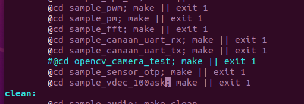
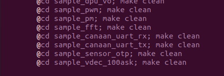
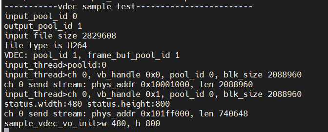
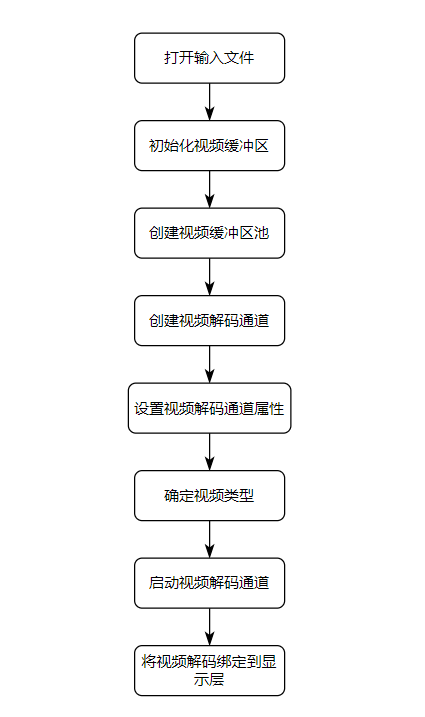

# 显示屏实验-解码显示

硬件要求：

- DshanPI-CanMV开发板
- Type-C数据线 x2
- MIPI屏/HDMI屏

开发环境：

- Ubuntu20.04


资料具体位置： `09_RTSmart+Linux双系统资料\02_多媒体应用示例源码\07_sample_vdec*` 

## 1.视频解码

|          | H264                                                         | HEVC                     | JPEG                      |
| :------- | :----------------------------------------------------------- | :----------------------- | :------------------------ |
| 输入格式 | H.264 Baseline;H.264 Main;H.264 High;H.264 High10;支持interlaced stream | HEVC (H.265) Main/Main10 | JPEG, baseline sequential |
| 输出格式 | YUV420 NV12                                                  | YUV420 NV12              | YUV422 UYVY, YUV420 NV12  |
| 解码通道 | 4路                                                          | 4路                      | 4路                       |

注意：H264/HEVC/JPEG共用4路。

VDEC支持流式发送：

- 流式发送（ K_VDEC_SEND_MODE_STREAM）：用户每次可发送任意长度码流到解码器，由解码器内部完成一帧码流的识别过程。须注意，对H.264/H.265而言，在收到下一帧码流才能识别当前帧码流的结束，所以在该发送模式下，输入一帧H.264/H.265码流，不能希望马上开始解码图像。

### 1.1 解码典型应用举例


## 2.应用层程序编译与解析

### 2.1 新增程序

#### 2.1.1 新建工程文件夹

在k230_sdk/src/big/mpp/userapps/sample目录下新建工程

```
mkdir sample_vdec_100ask
```


#### 2.1.2 修改Makefile

修改k230_sdk/src/big/mpp/userapps/sample目录下的Makefile文件，新增sample_vdec_100ask工程的编译规则

```
@cd sample_vdec_100ask; make || exit 1
```



```
@cd sample_vdec_100ask; make clean
```




#### 2.1.3 进入工程目录

```
cd sample_vdec_100ask/
```


#### 2.1.4 新建源码文件

```
vi sample_vdec_100ask.c
```

填入源码。


#### 2.1.5 新建Makefile文件

```
vi Makefile
```

填入一下内容：

```
include $(MPP_SRC_DIR)/userapps/sample/mpp.mk
include $(MPP_SRC_DIR)/userapps/sample/rt-smart.mk

CURRECT_DIR_NAME=$(shell basename `pwd`)
LOCAL_SRC_DIR = $(shell pwd)
BIN = $(MPP_SRC_DIR)/userapps/sample/elf/$(CURRECT_DIR_NAME).elf
LIBPATH = $(MPP_LIB_PATH)
LIBS = $(MPP_LIBS)

LOCAL_CFLAGS = -I$(LOCAL_SRC_DIR) \
                           -I$(LOCAL_SRC_DIR)/../sample_vo

SRCS = $(wildcard $(LOCAL_SRC_DIR)/*.c) \
           $(LOCAL_SRC_DIR)/../sample_vo/vo_test_case.c \
          $(LOCAL_SRC_DIR)/../sample_vo/vo_bind_test.c

OBJS = $(patsubst %.c,%.o,$(SRCS))

all: $(BIN)
        @-rm -f $(OBJS)
        echo "${PWD}/Makefile all"

$(OBJS): %.o : %.c
        @$(CC) $(CC_CFLAGS) $(LOCAL_CFLAGS) $(BSP_CFLGAS) $(RTSMART_CFLAGS) $(MPP_USER_CFLGAS) -c $< -o $@

$(BIN): $(OBJS)
        $(CC) -o $(BIN) $(LINKFLAG) -Wl,--whole-archive -Wl,--no-whole-archive -n --static $(OBJS) -L$(LIBPATH) -Wl,--start-group $(LIBS) -Wl,--end-group

clean:
        echo "${PWD}/Makefile clean"
        -rm -rf $(BIN)
        -rm -f $(OBJS)

.PHONY: all clean

```


### 2.2 程序编译

1.进入K230SDK目录

```
cd ~/k230_sdk
```

2.进入Docker环境

```
sudo docker run -u root -it -v $(pwd):$(pwd) -v $(pwd)/toolchain:/opt/toolchain -w $(pwd) ghcr.io/kendryte/k230_sdk /bin/bash
```

3.配置板级型号

```
make CONF=k230_canmv_dongshanpi_defconfig prepare_memory	
```

4.编译程序

```
make mpp-apps
```

等待编译完成，编译完成后，可执行程序`sample_vdec_100ask.elf`会生成在`k230_sdk/src/big/mpp/userapps/sample/elf`目录下。

使用ADB将可执行程序传输至开发板中

```
adb push src/big/mpp/userapps/sample/elf/sample_vdec_100ask.elf /sharefs/app
```


### 2.2 程序运行

使用串口软件访问开发板的大核串口终端。

> 如果没有关闭开机自启程序，可按下q+回车键可退出开机自启程序。

1.进入可执行文件目录

```
cd /sharefs/app
```

2.运行程序

```
./sample_vdec_100ask.elf -i output-480-800.h264 // output-480-800.h265 output-480-800.jpeg
```

执行过程效果如下所示：

2.1 对输入文件进行解码播放：




2.2 播放结束后销毁


### 2.3 程序解析

代码流程图如下所示：



#### 2.3.1 打开输入文件

```
FILE *input_file = fopen(argv[2], "rb");
```

#### 2.3.2 初始化视频缓冲区

```
memset(&config, 0, sizeof(config));
config.max_pool_cnt = 2;
// 设置视频缓冲区配置
ret = kd_mpi_vb_set_config(&config);
```

#### 2.3.3 创建视频缓冲区池

```
k_vb_pool_config pool_config;
memset(&pool_config, 0, sizeof(pool_config));
pool_config.blk_cnt = INPUT_BUF_CNT;   // 设置输入缓冲区池的块数量
pool_config.blk_size = STREAM_BUF_SIZE;  // 设置输入缓冲区池的块大小
pool_config.mode = VB_REMAP_MODE_NOCACHE;  // 设置输入缓冲区池的映射模式
g_vdec_conf[ch].input_pool_id = kd_mpi_vb_create_pool(&pool_config); // 创建输入缓冲区池
vdec_debug("input_pool_id %d\n", g_vdec_conf[ch].input_pool_id);

memset(&pool_config, 0, sizeof(pool_config));
pool_config.blk_cnt = OUTPUT_BUF_CNT;  // 设置输出缓冲区池的块数量
pool_config.blk_size = FRAME_BUF_SIZE;  // 设置输出缓冲区池的块大小
pool_config.mode = VB_REMAP_MODE_NOCACHE;  // 设置输出缓冲区池的映射模式
g_vdec_conf[ch].output_pool_id = kd_mpi_vb_create_pool(&pool_config); // 创建输出缓冲区池
```

#### 2.3.4 创建视频解码通道

```
ret = kd_mpi_vdec_create_chn(ch, &attr);
```

#### 2.3.5 设置视频解码通道属性

```
attr.pic_width = MAX_WIDTH; // 设置图片最大宽度
attr.pic_height = MAX_HEIGHT; // 设置图片最大高度
attr.frame_buf_cnt = OUTPUT_BUF_CNT; // 设置帧缓冲区数量
attr.frame_buf_size = FRAME_BUF_SIZE; // 设置帧缓冲区大小
attr.stream_buf_size = STREAM_BUF_SIZE; // 设置流缓冲区大小
```

#### 2.3.6 根据文件扩展名确定视频类型

```
    char *ptr = strrchr(argv[2], '.');
    if (ptr!= NULL) {
        if (strcmp(ptr, ".h264") == 0 || strcmp(ptr, ".264") == 0) {
            type = K_PT_H264;
            vdec_debug("file type is H264\n");
        } else if (strcmp(ptr, ".jpeg") == 0 || strcmp(ptr, ".mjpeg") == 0 || strcmp(ptr, ".jpg") == 0) {
            type = K_PT_JPEG;
            vdec_debug("file type is JPEG\n");
        } else if (strcmp(ptr, ".h265") == 0 || strcmp(ptr, ".hevc") == 0 || strcmp(ptr, ".265") == 0) {
            type = K_PT_H265;
            vdec_debug("file type is H265\n");
        } else {
            vdec_debug("Error input type\n");
            return -1;
        }
    }
```

#### 2.3.7 启动视频解码通道

```
ret = kd_mpi_vdec_start_chn(ch);
```

#### 2.3.8 将视频解码绑定到显示层

```
sample_vdec_bind_vo(BIND_VO_LAYER);
```


