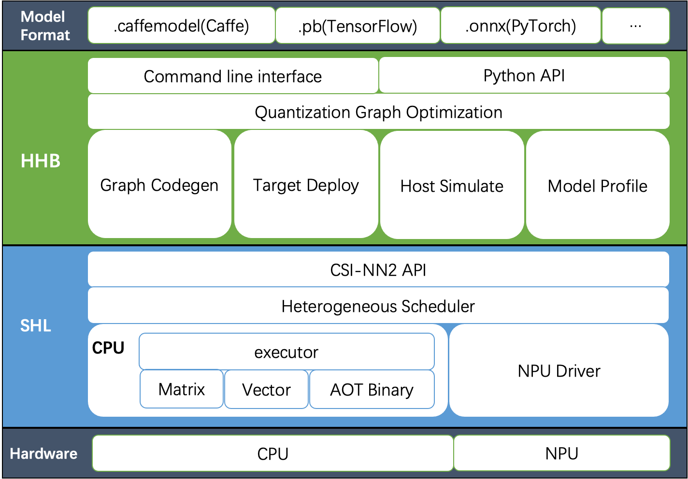

# K230 AI实战 - HHB神经网络模型部署工具

## 1.概述

HHB程序在k230 rtt上部署运行， 需要如下步骤

- 基于HHB开发环境， 编译模型生成c代码
- 使用k230 rtt交叉编译工具链编译c代码
- 上板运行可执行程序

### 1.1 HHB

HHB （Heterogeneous Honey Badger） 是 T-Head 提供的一套针对玄铁芯片平台的神经网络模型部署工具集。包括了编译优化，性能分析，过程调试，结果模拟等一系列部署时所需的工具。

HHB 的功能与特性：

- 支持 caffe，tensorflow，onnx 和 tflite 对应格式的模型
- 支持 8/16 位定点和 16/32 位浮点等数据类型
- 支持对称和非对称定点量化，支持通道量化
- 可在部署前优化模型的网络结构
- 编译生成可在无剑 SoC 平台上执行的二进制
- 支持在主机上做行为模拟
- 多组件形式的工具集方便二次开发
- 同时提供传统习惯的 Unix 命令行和 Python 接口

HHB 已支持语音和视觉的多种不同业务算法，可导入 PyTorch 和 TensorFlow 等不同训练框架的模型。

HHB 以开源项目 [TVM](https://github.com/apache/tvm) 为基础架构，添加了丰富的命令行选项提供命令模式；预置了多类量化算法适配不同平台可支持的数据类型；根据不同平台特点，输出调用 SHL 的 C 代码，或者直接输出可执行的二进制。



详细使用方法可参考[HHB用户手册](https://www.yuque.com/za4k4z/oxlbxl)

### 1.2 SHL

SHL 是 T-HEAD 提供的一组针对玄铁 CPU 平台的神经网络库 API。抽象了各种常用的网络层的接口，并且提供一系列已优化的二进制库。

SHL 的特性：

- C 代码版本的参考实现。
- 提供玄铁系列 CPU 的汇编优化实现。
- 支持对称量化和非对称量化。
- 支持8位定点，16位定点和16位浮点等数据类型。
- 兼容 NCHW 和 NHWC 格式。
- 搭配 [HHB](https://www.yuque.com/za4k4z/oxlbxl) 实现代码自动调用。
- 覆盖 CPU，NPU 等不同体系结构。
- 附加异构参考实现。

SHL 提供了完成的接口声明和接口的参考实现，各个设备提供商可以依此针对性的完成各个接口的优化工作。

详细使用方法可参考[SHL用户手册](https://www.yuque.com/za4k4z/isgz8o/ayilv9)

## 2. HHB编译模型

### 2.1 环境搭建

> 前置条件: 本地PC已安装docker

- 去[HHB](https://xuantie.t-head.cn/community/download?id=4212696449735004160)下载hhb-2.2.35 docker image

- 解压/加载/启动docker image

  ```shell
  tar xzf hhb-2.2.35.docker.tar.gz
  cd hhb-2.2.35.docker/
  docker load < hhb.2.2.35.img.tar
  ./start_hhb.sh
  ```

### 2.2 编译模型

目前这个版本docker image没有集成c908模型编译， 这里拷贝c906并修改相关配置。

```shell
root@02297217e66d:~# cd /home/example/
root@02297217e66d:/home/example# cp -a c906 c908
root@02297217e66d:/home/example# cd c908/onnx_mobilenetv2/
```

run.sh相关修改

- 修改--board参数的值（c906改为c908）
- 添加校正集参数( -cd )
- 添加量化参数(--quantization-scheme)

最后修改后run.sh内容如下

```shell
#!/bin/bash -x

hhb -S --model-file mobilenetv2-12.onnx  --data-scale 0.017 --data-mean "124 117 104" --board c908 --input-name "input" --output-name "output" --input-shape "1 3 224 224" --postprocess save_and_top5 --simulate-data persian_cat.jpg -cd persian_cat.jpg   --quantization-scheme "int8_asym_w_sym" --fuse-conv-relu
```

> 注: 不同的模型， 编译参数有可能不同，会造成性能数据差异。用户需要基于自己的模型， 深入了解hhb各参数含义(hhb -h)或者咨询平头哥等。

执行run.sh开始编译

```shell
root@02297217e66d:/home/example/c908/onnx_mobilenetv2# ./run.sh
+ hhb -S --model-file mobilenetv2-12.onnx --data-scale 0.017 --data-mean '124 117 104' --board c908 --input-name input --output-name output --input-shape '1 3 224 224' --postprocess save_and_top5 --simulate-data persian_cat.jpg -cd persian_cat.jpg --quantization-scheme int8_asym_w_sym --fuse-conv-relu
[2023-06-21 09:02:53] (HHB LOG): Start import model.
[2023-06-21 09:02:55] (HHB LOG): Model import completed!
[2023-06-21 09:02:55] (HHB LOG): Start quantization.
[2023-06-21 09:02:55] (HHB LOG): get calibrate dataset from persian_cat.jpg
[2023-06-21 09:02:55] (HHB LOG): Start optimization.
[2023-06-21 09:02:55] (HHB LOG): Optimization completed!
Calibrating: 100%|###############################################################################################################################################################################################################################| 153/153 [00:14<00:00, 10.66it/s]
[2023-06-21 09:03:10] (HHB LOG): Start conversion to csinn.
[2023-06-21 09:03:10] (HHB LOG): Conversion completed!
[2023-06-21 09:03:10] (HHB LOG): Start operator fusion.
[2023-06-21 09:03:10] (HHB LOG): Operator fusion completed!
[2023-06-21 09:03:10] (HHB LOG): Start operator split.
[2023-06-21 09:03:10] (HHB LOG): Operator split completed!
[2023-06-21 09:03:10] (HHB LOG): Start layout convert.
[2023-06-21 09:03:10] (HHB LOG): Layout convert completed!
[2023-06-21 09:03:10] (HHB LOG): Quantization completed!
[2023-06-21 09:03:14] (HHB LOG): cd hhb_out; qemu-riscv64 -cpu c908v hhb_runtime ./hhb.bm persian_cat.jpg.0.bin
Run graph execution time: 1675.78113ms, FPS=0.60

=== tensor info ===
shape: 1 3 224 224
data pointer: 0x2e0b40

=== tensor info ===
shape: 1 1000
data pointer: 0x325530
The max_value of output: 16.053827
The min_value of output: -8.026914
The mean_value of output: 0.002078
The std_value of output: 11.213154
 ============ top5: ===========
283: 16.053827
281: 14.920615
282: 12.559759
285: 12.182022
287: 11.520982
```

最后生成hhb_out目录，如下

```shell
root@02297217e66d:/home/example/c908/onnx_mobilenetv2# ll hhb_out
total 17940
drwxr-xr-x 2 root root    4096 Jun 21 09:03 ./
drwxr-xr-x 5 root root    4096 Jun 21 09:02 ../
-rw-r--r-- 1 root root 3554304 Jun 21 09:03 hhb.bm
-rwxr-xr-x 1 root root 6140744 Jun 21 09:03 hhb_runtime*
-rw-r--r-- 1 root root  602112 Jun 21 09:03 input.0.bin
-rw-r--r-- 1 root root 2860548 Jun 21 09:03 input.0.tensor
-rw-r--r-- 1 root root    4946 Jun 21 09:03 io.c
-rw-r--r-- 1 root root    1539 Jun 21 09:03 io.h
-rw-r--r-- 1 root root    7410 Jun 21 09:03 main.c
-rw-r--r-- 1 root root   81352 Jun 21 09:03 main.o
-rw-r--r-- 1 root root  112618 Jun 21 09:03 model.c
-rw-r--r-- 1 root root  791576 Jun 21 09:03 model.o
-rw-r--r-- 1 root root 3546112 Jun 21 09:03 model.params
-rw-r--r-- 1 root root  602112 Jun 21 09:03 persian_cat.jpg.0.bin
-rw-r--r-- 1 root root    9534 Jun 21 09:03 persian_cat.jpg.0.bin_output0_1_1000.txt
-rw-r--r-- 1 root root   20086 Jun 21 09:03 process.c
-rw-r--r-- 1 root root    2040 Jun 21 09:03 process.h
```

将hhb_out目录拷贝到/mnt，导出到PC， 后续需要使用k230 rtt工具链重新交叉编译。

```shell
root@02297217e66d:/home/example/c908/onnx_mobilenetv2# cp -a hhb_out/ /mnt/
```

## 3. Demo

### 3.1 环境搭建

> 前置条件: 用户已按照 k230_sdk文档编译了docker image

启动k230 docker image

```shell
cd /path/to/k230_sdk
docker run -u root -it -v $(pwd):$(pwd) -v $(pwd)/toolchain:/opt/toolchain -w $(pwd) k230_docker /bin/bash
```

### 3.2 编译demo

我们在k230_sdk中提供了HHB的demo, 用户只需将HHB编译的c代码拷贝过来即可编译出上板运行的可执行程序。

相关目录说明

| 目录                                                         | 备注                                                         |
| ------------------------------------------------------------ | ------------------------------------------------------------ |
| /path/to/k230_sdk/src/big/utils/examples/hhb                 | 用户可修改CMakeLists.txt追加demo                             |
| /path/to/k230_sdk/src/big/utils/lib目录下的csi-nn2和hhb-prebuilt-decode | c代码依赖的预编译库(csi-nn2/jpeg/png/zlib等, 使用musl交叉编译工具链编译) |

准备用例

mbv2_onnx_int8目录就是前面HHB生成的c代码， 用户修改了模型编译参数后， 需要同步更新过来.

用户也可以根据自己的模型，新增demo， 修改CMakeLists.txt即可。

开始编译

```shell
root@9d2a450436a7:/home/zhangyang/workspace/k230_sdk# cd src/big/utils/examples/hhb/
root@9d2a450436a7:/home/zhangyang/workspace/k230_sdk/src/big/utils/examples/hhb# ./build_app.sh
```

最后生成的可执行程序为out/bin/mbv2_onnx_int8.elf

```shell
root@9d2a450436a7:/home/zhangyang/workspace/k230_sdk/src/big/utils/examples/hhb# ll out/bin/mbv2_onnx_int8.elf 
-rwxr-xr-x 1 root root 1172680 Jun 25 14:37 out/bin/mbv2_onnx_int8.elf*
```

将mbv2_onnx_int8运行的相关文件传送到小核linux的/sharefs目录

```shell
[root@canaan /sharefs/k230/mbv2_onnx_int8 ]#ls -l
total 5560
-rw-r--r--    1 sshd     sshd       3554304 Jun 25  2023 hhb.bm
-rwxr-xr-x    1 sshd     sshd       1172680 Jun 25  2023 mbv2_onnx_int8.elf
-rw-r--r--    1 sshd     sshd        359355 Jun 25  2023 persian_cat.jpg
-rw-r--r--    1 sshd     sshd        602112 Jun 25  2023 persian_cat.jpg.0.bin
```

### 3.3 运行demo

- 启动k230,  在大核rtt串口下， 执行如下命令

```shell
msh />cd /sharefs/k230/mbv2_onnx_int8/

msh /sharefs/k230/mbv2_onnx_int8>./mbv2_onnx_int8.elf hhb.bm persian_cat.jpg.0.bin
Run graph execution time: 64.71648ms, FPS=15.45

=== tensor info ===
shape: 1 3 224 224 
data pointer: 0x300170060

=== tensor info ===
shape: 1 1000 
data pointer: 0x300194c80
The max_value of output: 15.581656
The min_value of output: -8.026914
The mean_value of output: 0.008405
The std_value of output: 11.703238
 ============ top5: ===========
283: 15.581656
281: 14.731747
282: 12.559759
285: 11.709850
287: 11.143245

msh /sharefs/k230/mbv2_onnx_int8>./mbv2_onnx_int8.elf hhb.bm persian_cat.jpg      
Run graph execution time: 64.67589ms, FPS=15.46

=== tensor info ===
shape: 1 3 224 224 
data pointer: 0x300170060

=== tensor info ===
shape: 1 1000 
data pointer: 0x300194c80
The max_value of output: 16.053827
The min_value of output: -8.026914
The mean_value of output: 0.009821
The std_value of output: 12.815542
 ============ top5: ===========
283: 16.053827
281: 15.109484
282: 13.220798
287: 12.087587
285: 11.804284
```
