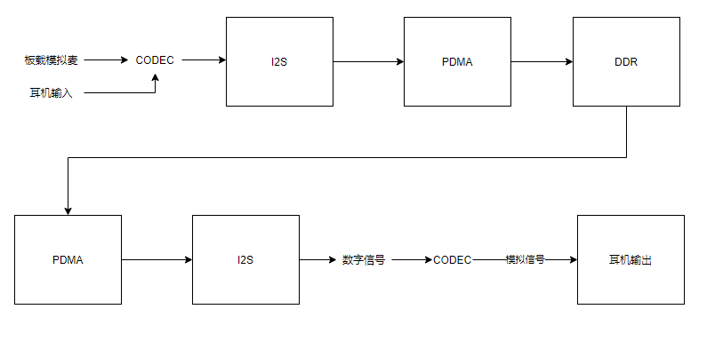
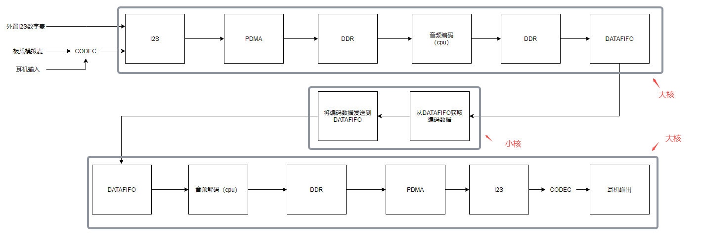

# K230 音频实战 - 音频采集、播放和编解码

## 1. 概述

本文讲解如何使用音频demo在大核rt-smart或小核linux上实现音频采集、播放、编码、解码等功能。

## 2. 环境准备

### 2.1 硬件环境

- K230-UNSIP-LP3-EVB-V1.0/K230-UNSIP-LP3-EVB-V1.1

- Ubuntu PC 20.04

- Typec USB线 * 2。
  - 一根连接到UART0/3，用于串口收发，UART0对应小核，UART3对应大核。
  - 一根链接到DC:5V接口，用于供电。

- USB TypeC转以太网，连接到USB0。

- 网线一根

- SD卡(如果使用SD卡启动，或软件需要访问SD卡)

- 音频子板（使用外置音频通路时需要）,如下图所示，注意安装位置及跳线帽接法。当使用pdm音频传输接口及外置i2s音频传输接口时需要使用音频子板；仅使用内置i2s音频传输接口不需要音频子板。

  

### 2.2 编译程序

#### 2.2.1 编译方法

在`k230_sdk`目录下执行`make rt-smart`，在`k230_sdk/src/big/mpp/userapps/sample/elf`目录下生成`sample_audio.elf`，为大核rt-smart下的音频demo。
在`k230_sdk`目录下执行`make cdk-user`，在`k230_sdk/src/common/cdk/user/out/little/`目录下生成`sample_audio`，为小核linux下执行的音频demo。
默认情况下，板子启动后大核rt-smart系统下sample_audio.elf在/sharefs下，小核audio demo sample_audio在/mnt下。

#### 2.2.2 代码位置

程序源码目录:
大核音频demo源码位置:`k230_sdk/src/big/mpp/userapps/sample/sample_audio`
小核音频demo源码位置:`k230_sdk/src/common/cdk/user/mapi/sample/sample_audio`

## 3. 大核音频实战

大核demo文件为sample_audio.elf,支持音频采集(ai)，音频播放(ao)，音频编码(aenc)，音频解码(adec)等功能。

### 3.1 参数说明

| 参数名 | 描述 | 默认值 |
|:--|:--|:--|
| help | 打印命令行参数信息 | - |
| samplerate | 设置音频采样率，有效值`[8000,12000,16000,24000,32000,44100,48000,96000,192000]` | 44100 |
| enablecodec | i2s使用内置(1)或外置(0)链路，有效值：0、1 | 0 |
| bitwidth | 采样精度，有效值:16、24、32 | 16 |
| channels | 声道数，有效值:1、2 | 2 |
| filename | 输入或输出的文件名称 | - |
| type | 功能类型，有效值:[0,12]，具体值参考下表 | 0 |

| type值 | 功能描述                                                     |
| :----- | :----------------------------------------------------------- |
| 0      | i2s 音频采集功能                                             |
| 1      | pdm音频采集功能                                              |
| 2      | i2s音频播放功能                                              |
| 3      | ai->ao回环功能:使用api接口实现。ai为i2s接口，ao为i2s接口。   |
| 4      | ai->ao回环功能:使用模块绑定(ai绑定ao)实现。ai为i2s接口，ao为i2s接口。 |
| 5      | ai->ao回环功能:使用api接口实现。ai为pdm接口，ao为i2s接口。   |
| 6      | ai->ao回环功能:使用模块绑定(ai绑定ao)实现。ai为pdm接口，ao为i2s接口。 |
| 7      | 音频编码功能:ai->aenc，使用模块绑定(ai绑定aenc)实现，ai为i2s接口,aenc为g711a编码格式。 |
| 8      | 音频解码功能:adec->ao，使用模块绑定(adec绑定ao)实现，ao为i2s接口,adec为g711a解码格式。 |
| 9      | 音频编码功能:ai->aenc，使用api接口实现，ai为i2s接口,aenc为g711a编码格式。 |
| 10     | 音频解码功能:adec->ao，使用api接口实现，ao为i2s接口,adec为g711a解码格式。 |
| 12     | ai->aenc、adec->ao回环功能:使用模块绑定(ai绑定aenc,adec绑定ao)实现。ai为i2s接口，ao为i2s接口。 |

### 3.2 音频采集

音频采集支持i2s和pdm两种音频传输接口。i2s音频采集共支持两组，可同时工作；pdm音频采集共支持四组，可同时工作。

i2s音频采集:共支持两组，其中第一组可选择为内置或外置通路，第二组固定为外置通路。当第一组作为内置通路使用时，左声道声音为耳机线性模拟输入，右声道声音为板载模拟麦输入，且当设置为单声道工作模式时，声音固定为板载模拟麦输入。当作为外置通路使用时，左右声道声音均为子板上数字麦输入。


pdm音频采集:需接外置子板,共支持四组,且可同时工作。每组均支持单/双声道采集，且各声道声音均为子板上数字麦输入。


### 3.2.1 i2s音频采集

开发板启动后，在大核上运行如下测试程序:`/sharefs/sample_audio.elf -type 0 -enablecodec 1 -samplerate 48000 -bitwidth 24 -channels 2 -filename /sharefs/test.wav`
demo使用采样率48000，使用内置codec通路，采样精度24bit，双声道，采集数据以wav格式保存到/sharefs/test.wav文件中，采集15s数据后退出。

``` shell
/sharefs/sample_audio.elf -type 0 -enablecodec 1 -samplerate 48000 -bitwidth 24 -channels 2 -filename /sharefs/test.wav
audio type:0,sample rate:48000,bit width:24,channels:2,enablecodec:1
mmz blk total size:8.12 MB
vb_set_config ok
sample ai i2s module
audio i2s set clk freq is 3072000(3072000),ret:1
audio codec adc clk freq is 12288000(12288000)
audio_save_init get vb block size:4320044
======kd_mpi_sys_mmap total size:4320044
[0s] timestamp 0 us,curpts:3232823
[1s] timestamp 1000000 us,curpts:4232823
[2s] timestamp 2000000 us,curpts:5232823
[3s] timestamp 3000000 us,curpts:6232823
[4s] timestamp 4000000 us,curpts:7232823
[5s] timestamp 5000000 us,curpts:8232823
[6s] timestamp 6000000 us,curpts:9232823
[7s] timestamp 7000000 us,curpts:10232823
[8s] timestamp 8000000 us,curpts:11232823
[9s] timestamp 9000000 us,curpts:12232823
[10s] timestamp 10000000 us,curpts:13232823
[11s] timestamp 11000000 us,curpts:14232823
[12s] timestamp 12000000 us,curpts:15232823
[13s] timestamp 13000000 us,curpts:16232823
dump binary memory test1.wav 0x18242000 0x18660b2c
[14s] timestamp 14000000 us,curpts:17232823
destroy vb block
sample done
```

### 3.2.2 pdm音频采集

开发板启动后，在大核上运行如下测试程序:`/sharefs/sample_audio.elf -type 1 -samplerate 16000 -bitwidth 16 -channels 2 -filename /sharefs/test.wav`
demo采样率16000，外置音频通路（需要接音频子板），采样精度16bit，双声道，采集数据以wav格式保存到/sharefs/test.wav文件中，采集15s数据后退出。

``` shell
/sharefs/sample_audio.elf -type 1 -samplerate 16000 -bitwidth 16 -channels 2 -filename /sharefs/test.wav
audio type:1,sample rate:16000,bit width:16,channels:2,enablecodec:0
mmz blk total size:2.71 MB
vb_set_config ok
sample ai pdm module
audio_sample_get_ai_pdm_data channel_total:1,rec_channel:0,oversample:0
pdm in init clk freq is 1536000
pdm in set clk freq is 512000(512000)
audio_save_init get vb block size:960044
======kd_mpi_sys_mmap total size:960044
[0s] timestamp 0 us,curpts:1006669
[1s] timestamp 1000000 us,curpts:2006669
[2s] timestamp 2000000 us,curpts:3006669
[3s] timestamp 3000000 us,curpts:4006669
[4s] timestamp 4000000 us,curpts:5006669
[5s] timestamp 5000000 us,curpts:6006669
[6s] timestamp 6000000 us,curpts:7006669
[7s] timestamp 7000000 us,curpts:8006669
[8s] timestamp 8000000 us,curpts:9006669
[9s] timestamp 9000000 us,curpts:10006669
[10s] timestamp 10000000 us,curpts:11006669
[11s] timestamp 11000000 us,curpts:12006669
[12s] timestamp 12000000 us,curpts:13006669
[13s] timestamp 13000000 us,curpts:14006669
dump binary memory test1.wav 0x180c1000 0x181ab62c
[14s] timestamp 14000000 us,curpts:15006669
destroy vb block
sample done
```

### 3.3 音频播放

音频播放支持i2s音频传输接口。i2s音频采集共支持两组，可同时工作。其中第一组可选择为内置或外置通路，第二组固定为外置通路。当第一组作为内置通路使用时，声音输出为板载耳机输出口；当使用外置通路时，声音输出为子板耳机输出口。


#### 3.3.1 i2s音频播放

开发板启动后，在大核上运行如下测试程序:`./sample_audio.elf -type 2 -filename test.wav -enablecodec 1`
demo根据wav文件格式自动设置音频属性，循环播放wav文件，使用耳机插入板载耳机插口，即可听到声音。按任意键退出demo。

``` shell
./sample_audio.elf -type 2 -filename test.wav -enablecodec 1
audio type:2,sample rate:44100,bit width:16,channels:2,enablecodec:1
mmz blk total size:7.46 MB
vb_set_config ok
enter any key to exit
sample ao i2s module
========read_wav_header:headerlen:44,channel:2,samplerate:16000,bitpersample:16
open file:test.wav ok,file size:960044,data size:960000,wav header size:44
=======_get_audio_frame virt_addr:0x10010e000
audio i2s set clk freq is 1024000(1024000),ret:1
audio init codec dac clk freq is 11289600
audio set codec dac clk freq is 4096000(4096000)
read file again
q
diable ao audio
destroy vb block
sample done
```

### 3.4 音频编解码

内置g711a/u编解码模块，如需支持其他编解码格式，可通过注册外部编解码器来实现。所有编解码模块均使用CPU软件编解码且只支持16bit采样精度。

音频编码存储流程如下，数据流向为ai->aenc。


音频解码播放流程如下，数据流向为adec->ao。


#### 3.4.1 音频编码

开发板启动后，在大核上运行如下测试程序:`./sample_audio.elf -type 7 -filename /sharefs/test.g711a -channels 2 -samplerate 8000 -bitwidth 16 -enablecodec 1`
将ai采集到的数据（双声道，采样率8000，内置codec链路，采样精度16）编码成g711a格式后存到文件中，按任意键退出demo。

``` shell
./sample_audio.elf -type 7 -filename /sharefs/test.g711a -channels 2 -samplerate 8000 -bitwidth 16 -enablecodec 1
audio type:7,sample rate:8000,bit width:16,channels:1,enablecodec:1
mmz blk total size:1.35 MB
vb_set_config ok
enter any key to exit
sample aenc module (sysbind)
audio i2s set clk freq is 512000(512000),ret:1
audio codec adc clk freq is 2048000(2048000)
q
destroy vb block
sample done
```

#### 3.4.2 音频解码

开发板启动后，在大核上运行如下测试程序:`./sample_audio.elf -type 8 -filename /sharefs/test.g711a -channels 2 -samplerate 8000 -bitwidth 16 -enablecodec 1`
将g711a格式（采样率8000，声道数2,采样精度16）文件解码后通过ao(内置codec通路)播放输出，按任意键退出demo。

``` shell
./sample_audio.elf -type 8 -filename /sharefs/test.g711a -channels 2 -samplerate 8000 -bitwidth 16 -enablecodec 1
audio type:8,sample rate:8000,bit width:16,channels:2,enablecodec:1
mmz blk total size:1.35 MB
vb_set_config ok
enter any key to exit
sample adec module (sysbind)
audio i2s set clk freq is 512000(512000),ret:1
audio init codec dac clk freq is 4096000
audio set codec dac clk freq is 2048000(2048000)
adec_bind_call_back dev_id:0 chn_id:0
read file again
q
adec_bind_call_back dev_id:0 chn_id:0
destroy vb block
sample done
```

### 3.5 回环测试

### 3.5.1 i2s采集播放回环

开发板启动后，在大核上运行如下测试程序:`./sample_audio.elf -type 4 -enablecodec 1 -bitwidth 16 -samplerate 48000 -channels 2`
同时运行ai和ao模块，将ai(采样精度16，采样率48000，双声道)采集到的声音数据实时输出到ao(采样精度16，采样率48000，双声道)播放，使用内置codec通路，按任意键退出demo。具体流程图如下。



``` shell
./sample_audio.elf -type 4 -enablecodec 1 -bitwidth 16 -samplerate 48000 -channels 2
audio type:4,sample rate:48000,bit width:16,channels:2,enablecodec:1
mmz blk total size:8.12 MB
vb_set_config ok
enter any key to exit
sample ai(i2s) bind ao module
audio i2s set clk freq is 3072000(3072000),ret:1
audio codec adc clk freq is 12288000(12288000)
audio i2s set clk freq is 3072000(3072000),ret:1
audio init codec dac clk freq is 2048000
audio set codec dac clk freq is 12288000(12288000)
q
diable ao module
diable ai module
release vb block
destroy vb block
sample done
```

### 3.5.2 pdm采集播放回环

开发板启动后，在大核上运行如下测试程序:`./sample_audio.elf -type 6 -bitwidth 32 -samplerate 48000 -channels 2 -enablecodec 0`
同时运行ai和ao模块，将ai(采样精度32，采样率48000，双声道)采集到的声音数据实时输出到ao(采样精度32，采样率48000，双声道)播放，使用外置子板通路，按任意键退出demo。具体流程图如下。


``` shell
./sample_audio.elf -type 6 -bitwidth 32 -samplerate 48000 -channels 2 -enablecodec 0
audio type:6,sample rate:48000,bit width:32,channels:2,enablecodec:0
mmz blk total size:8.12 MB
vb_set_config ok
enter any key to exit
sample ai(pdm) bind ao module
pdm in init clk freq is 3072000
pdm in set clk freq is 3072000(3072000)
audio i2s set clk freq is 3072000(3072000),ret:1
q
diable ao module
diable ai module
release vb block
destroy vb block
sample done
```

### 3.5.3 编解码回环

开发板启动后，在大核上运行如下测试程序:`./sample_audio.elf -type 12 -samplerate 44100`
同时运行ai、adec、aenc、ao模块，将ai绑定aenc，adec绑定ao，从aenc获取到的数据发送到adec，进而实现回环效果。音频采样精度固定为16bit，固定使用内置codec通路，按任意键退出demo。数据流如下图:


``` shell
./sample_audio.elf -type 12 -samplerate 44100
audio type:12,sample rate:44100,bit width:16,channels:2,enablecodec:0
mmz blk total size:7.46 MB
vb_set_config ok
enter any key to exit
sample ai->aenc  adec->ao module (loopback)
Force the sampling accuracy to be set to 16,use inner cocdec
audio i2s set clk freq is 2822400(2822400),ret:1
audio codec adc clk freq is 11289600(11289600)
audio i2s set clk freq is 2822400(2822400),ret:1
audio init codec dac clk freq is 12288000
audio set codec dac clk freq is 11289600(11289600)
adec_bind_call_back dev_id:0 chn_id:0
[0s] g711 stream timestamp 0 us,curpts:1059296
[1s] g711 stream timestamp 1000000 us,curpts:2059296
[2s] g711 stream timestamp 2000000 us,curpts:3059296
[3s] g711 stream timestamp 3000000 us,curpts:4059296
[4s] g711 stream timestamp 4000000 us,curpts:5059296
[5s] g711 stream timestamp 5000000 us,curpts:6059296
[6s] g711 stream timestamp 6000000 us,curpts:7059296
[7s] g711 stream timestamp 7000000 us,curpts:8059296
[8s] g711 stream timestamp 8000000 us,curpts:9059296
q
adec_bind_call_back dev_id:0 chn_id:0
destroy vb block
sample done
```

## 4. 小核音频实战

小核demo文件为sample_audio,支持音频采集(ai)，音频播放(ao)，音频编码(aenc)，音频解码(adec)等功能。

### 4.1 参数说明

| 参数名 | 描述 | 默认值 |
|:--|:--|:--|
| help | 打印命令行参数信息 | - |
| samplerate | 设置音频采样率，有效值`[8000,12000,16000,24000,32000,44100,48000,96000,192000]` | 44100 |
| enablecodec | i2s使用内置(1)或外置(0)链路，有效值：0、1 | 0 |
| channels | 声道数，有效值:1、2 | 2 |
| filename | 输入或输出的文件名称 | - |
| type | 功能类型，有效值:[0,2]，具体值参考下表 | 0 |

| type值 | 功能描述                                                     |
| :----- | :----------------------------------------------------------- |
| 0      | 音频采集编码功能:ai->aenc，使用模块绑定(ai绑定aenc)实现，ai为i2s接口,aenc为g711a编码格式，采样精度固定16bit。 |
| 1      | 音频解码播放功能:adec->ao，使用模块绑定(adec绑定ao)实现，ao为i2s接口,adec为g711a解码格式，采样精度固定16bit。 |
| 2      | ai->aenc、adec->ao回环功能:使用模块绑定(ai绑定aenc,adec绑定ao)实现。ai为i2s接口，aenc为g711a格式,adec为g711a格式,ao为i2s接口，采样精度固定16bit。 |

### 4.2 音频采集编码

开发板启动后，在大核上运行程序：/sharefs/sample_sys_init.elf &
在小核上运行如下程序:`./sample_audio -type 0 -samplerate 8000 -enablecodec 1 -channels 1 -filename test.g711a`
将ai采集到的数据（单声道，采样率8000，内置codec链路，采样精度16）编码成g711a格式后存到文件中，按q键退出demo。数据流程图如下:


``` shell
./sample_audio -type 0 -samplerate 8000 -enablecodec 1 -channels 1 -filename test.g711a
audio type:0,sample rate:8000,channels:1,enablecodec:1,filename:test.g711a
mmz blk total size:0.38 MB
[AENC_S] [Func]:_init_datafifo [Line]:174 [Info]:_aenc_datafifo_init_slave ok,datafifo_phyaddr:0x18061000,data_hdl:0x18061000
enter 'q' key to exit
_aenc_dataproc chn_num:0,stream data:0x18003c00,data len:320,seq:0,timestamp:99306
_aenc_dataproc chn_num:0,stream data:0x18005a00,data len:320,seq:1,timestamp:139306
_aenc_dataproc chn_num:0,stream data:0x18007800,data len:320,seq:2,timestamp:179306
_aenc_dataproc chn_num:0,stream data:0x18009600,data len:320,seq:3,timestamp:219306
_aenc_dataproc chn_num:0,stream data:0x1800b400,data len:320,seq:4,timestamp:259306
_aenc_dataproc chn_num:0,stream data:0x1800d200,data len:320,seq:5,timestamp:299306
_aenc_dataproc chn_num:0,stream data:0x1800f000,data len:320,seq:6,timestamp:339306
_aenc_dataproc chn_num:0,stream data:0x18010e00,data len:320,seq:7,timestamp:379306
_aenc_dataproc chn_num:0,stream data:0x18012c00,data len:320,seq:8,timestamp:419306
_aenc_dataproc chn_num:0,stream data:0x18014a00,data len:320,seq:9,timestamp:459306
_aenc_dataproc chn_num:0,stream data:0x18016800,data len:320,seq:10,timestamp:499306
_aenc_dataproc chn_num:0,stream data:0x18018600,data len:320,seq:11,timestamp:539306
_aenc_dataproc chn_num:0,stream data:0x1801a400,data len:320,seq:12,timestamp:579306
_aenc_dataproc chn_num:0,stream data:0x1801c200,data len:320,seq:13,timestamp:619306
_aenc_dataproc chn_num:0,stream data:0x1801e000,data len:320,seq:14,timestamp:659306
_aenc_dataproc chn_num:0,stream data:0x1801fe00,data len:320,seq:15,timestamp:699306
_aenc_dataproc chn_num:0,stream data:0x18021c00,data len:320,seq:16,timestamp:739306
_aenc_dataproc chn_num:0,stream data:0x18023a00,data len:320,seq:17,timestamp:779306
_aenc_dataproc chn_num:0,stream data:0x18025800,data len:320,seq:18,timestamp:819306
_aenc_dataproc chn_num:0,stream data:0x18027600,data len:320,seq:19,timestamp:859306
_aenc_dataproc chn_num:0,stream data:0x18029400,data len:320,seq:20,timestamp:899306
_aenc_dataproc chn_num:0,stream data:0x1802b200,data len:320,seq:21,timestamp:939306
_aenc_dataproc chn_num:0,stream data:0x1802d000,data len:320,seq:22,timestamp:979306
_aenc_dataproc chn_num:0,stream data:0x1802ee00,data len:320,seq:23,timestamp:1019306
_aenc_dataproc chn_num:0,stream data:0x18030c00,data len:320,seq:24,timestamp:1059306
_aenc_dataproc chn_num:0,stream data:0x18032000,data len:320,seq:25,timestamp:1099306
_aenc_dataproc chn_num:0,stream data:0x18033400,data len:320,seq:26,timestamp:1139306
_aenc_dataproc chn_num:0,stream data:0x18034800,data len:320,seq:27,timestamp:1179306
_aenc_dataproc chn_num:0,stream data:0x18035c00,data len:320,seq:28,timestamp:1219306
_aenc_dataproc chn_num:0,stream data:0x18037000,data len:320,seq:29,timestamp:1259306
q
sample done
```

### 4.3 音频解码播放

开发板启动后，在大核上运行程序：/sharefs/sample_sys_init.elf &
在小核上运行如下测试程序:`./sample_audio -type 1 -samplerate 8000 -enablecodec 1 -channels 1 -filename test.g711a`
将g711a格式（采样率8000，声道数1,采样精度16）文件解码后通过ao(内置codec通路)输出，按q键退出demo。


``` shell
./sample_audio -type 1 -samplerate 8000 -enablecodec 1 -channels 1 -filename test.g711a
audio type:1,sample rate:8000,channels:1,enablecodec:1,filename:test.g711a
mmz blk total size:0.38 MB
[ADEC_S] [Func]:_init_datafifo [Line]:189 [Info]:_adec_datafifo_init_slave ok,datafifo_phyaddr:0x18061000,data_hdl:0x18061000
enter 'q' key to exit
[ADEC_S] [Func]:_datafifo_release_func [Line]:157 [Info]:_datafifo_release_func,adec_hdl:0
read file again
read file again
read file again
q
sample done
```

### 4.4 编解码回环

开发板启动后，在大核上运行程序：`/sharefs/sample_sys_init.elf &`
在小核上运行如下测试程序:`./sample_audio -type 2 -samplerate 48000 -enablecodec 1 -channels 2`
同时运行ai、adec、aenc、ao模块，将ai(采样率48000，声道数2,采样精度16)绑定aenc(g711a)，adec(g711a)绑定ao(采样率48000，声道数2,采样精度16)，从aenc获取到的数据发送到adec，进而实现回环效果。



``` shell
./sample_audio -type 2 -samplerate 48000 -enablecodec 1 -channels 2
audio type:2,sample rate:48000,channels:2,enablecodec:1,filename:
mmz blk total size:2.26 MB
[AENC_S] [Func]:_init_datafifo [Line]:174 [Info]:_aenc_datafifo_init_slave ok,datafifo_phyaddr:0x18242000,data_hdl:0x18242000
[ADEC_S] [Func]:_init_datafifo [Line]:189 [Info]:_adec_datafifo_init_slave ok,datafifo_phyaddr:0x18243000,data_hdl:0x18243000
enter 'q' key to exit
[ADEC_S] [Func]:_datafifo_release_func [Line]:157 [Info]:_datafifo_release_func,adec_hdl:0
q
sample done
```
